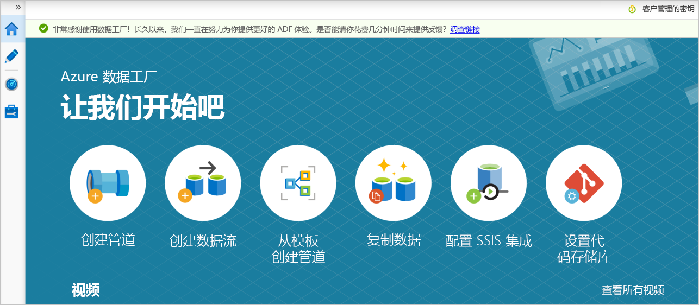

# <a name="copy-data-from-a-sql-server-database-to-azure-blob-storage"></a>将数据从 SQL Server 数据库复制到 Azure Blob 存储

[!INCLUDE[appliesto-adf-xxx-md](includes/appliesto-adf-xxx-md.md)]

本教程使用 Azure 数据工厂用户界面 (UI) 创建一个数据工厂管道，用于将数据从 SQL Server 数据库复制到 Azure Blob 存储。 同时创建一个自承载 Integration Runtime，用其在本地数据存储和云数据存储之间移动数据。

> [!NOTE]
> 本文不提供数据工厂的详细介绍。 有关详细信息，请参阅[数据工厂简介](introduction.md)。

将在本教程中执行以下步骤：

> [!div class="checklist"]
> * 创建数据工厂。
> * 创建自我托管的集成运行时。
> * 创建 SQL Server 和 Azure 存储链接服务。
> * 创建 SQL Server 和 Azure Blob 数据集。
> * 创建包含复制活动的管道，用于移动数据。
> * 启动管道运行。
> * 监视管道运行。

## <a name="prerequisites"></a>先决条件
### <a name="azure-subscription"></a>Azure 订阅
如果还没有 Azure 订阅，请在开始前[创建一个免费帐户](https://azure.microsoft.com/free/)。

### <a name="azure-roles"></a>Azure 角色
若要创建数据工厂实例，用于登录到 Azure 的用户帐户必须分配有“参与者”或“所有者”角色，或者必须是 Azure 订阅的管理员。

若要查看自己在订阅中的权限，请转到 Azure 门户。 在右上角选择自己的用户名，然后选择“权限”。 如果可以访问多个订阅，请选择相应的订阅。 有关如何将用户添加到角色的示例说明，请参阅[使用 RBAC 和 Azure 门户管理访问权限](../role-based-access-control/role-assignments-portal.md)。

### <a name="sql-server-2014-2016-and-2017"></a>SQL Server 2014、2016 和 2017
在本教程中，需将 SQL Server 数据库用作源数据存储。 在本教程中创建的数据工厂中的管道将数据从这个 SQL Server 数据库（源）复制到 Blob 存储（接收器）。 然后，你可以在 SQL Server 数据库中创建名为 **emp** 的表，并向表中插入几个示例条目。

1. 启动 SQL Server Management Studio。 如果此软件尚未安装在计算机上，请访问[下载 SQL Server Management Studio](https://docs.microsoft.com/sql/ssms/download-sql-server-management-studio-ssms)。

1. 使用凭据连接到 SQL Server 实例。

1. 创建示例数据库。 在树状视图中右键单击“数据库”，然后选择“新建数据库”。 
1. 在“新建数据库”窗口中输入数据库的名称，然后选择“确定”。

1. 若要创建 **emp** 表并将一些示例数据插入到其中，请对数据库运行以下查询脚本。 在树状视图中右键单击所创建的数据库，然后选择“新建查询”。

   ```
    CREATE TABLE dbo.emp
    (
        ID int IDENTITY(1,1) NOT NULL,
        FirstName varchar(50),
        LastName varchar(50)
    )
    GO

    INSERT INTO emp (FirstName, LastName) VALUES ('John', 'Doe')
    INSERT INTO emp (FirstName, LastName) VALUES ('Jane', 'Doe')
    GO
   ```

### <a name="azure-storage-account"></a>Azure 存储帐户
在本教程中，请使用常规用途的 Azure 存储帐户（具体说来就是 Blob 存储）作为目标/接收器数据存储。 如果没有常规用途的 Azure 存储帐户，请参阅[创建存储帐户](../storage/common/storage-account-create.md)。 在本教程中创建的数据工厂中的管道将数据从 SQL Server 数据库（源）复制到 Blob 存储（接收器）。 

#### <a name="get-the-storage-account-name-and-account-key"></a>获取存储帐户名称和帐户密钥
在本教程中，请使用存储帐户的名称和密钥。 若要获取存储帐户的名称和密钥，请执行以下步骤：

1. 使用 Azure 用户名和密码登录到 [Azure 门户](https://portal.azure.com)。

1. 在左窗格中，选择“所有服务”。 使用“存储”关键字进行筛选，然后选择“存储帐户”。 

    

1. 在存储帐户列表中，根据需要通过筛选找出你的存储帐户， 然后选择存储帐户。

1. 在“存储帐户”窗口中选择“访问密钥” 。

1. 复制“存储帐户名称”和“key1”框中的值，然后将其粘贴到记事本或其他编辑器中，在教程的后面部分使用。 

#### <a name="create-the-adftutorial-container"></a>创建 adftutorial 容器
此部分在 Blob 存储中创建名为 **adftutorial** 的 Blob 容器。

1. 在“存储帐户”窗口中，转到“概览”，然后选择“容器”。

    

1. 在“容器”窗口中，选择“+ 容器”来新建容器。

1. 在“新建容器”窗口的“名称”下，输入 **adftutorial**。  然后选择“创建”。

1. 在容器列表中，选择你刚才创建的 **adftutorial**。

1. 让 **adftutorial** 的“容器”窗口保持打开状态。 在教程结束时使用它来验证输出。 数据工厂自动在该容器中创建输出文件夹，因此不需要你来创建。

## <a name="create-a-data-factory"></a>创建数据工厂
在此步骤中，请先创建数据工厂，然后启动数据工厂 UI，在该数据工厂中创建一个管道。

1. 打开 **Microsoft Edge** 或 **Google Chrome** Web 浏览器。 目前，仅 Microsoft Edge 和 Google Chrome Web 浏览器支持数据工厂 UI。
1. 在左侧菜单中，选择“创建资源” > “分析” > “数据工厂”：  

   

1. 在“新建数据工厂”页的“名称”下输入 **ADFTutorialDataFactory** 。

   数据工厂的名称必须全局唯一。 如果看到名称字段的以下错误消息，请更改数据工厂的名称（例如，改为 yournameADFTutorialDataFactory）。 有关数据工厂项目的命名规则，请参阅[数据工厂命名规则](naming-rules.md)。

   

1. 选择要在其中创建数据工厂的 Azure **订阅**。
1. 对于“资源组”，请执行以下步骤之一：

   - 选择“使用现有资源组”，并从下拉列表选择现有的资源组。

   - 选择“新建”，并输入资源组的名称。
        
     若要了解资源组，请参阅[使用资源组管理 Azure 资源](../azure-resource-manager/management/overview.md)。
1. 在“版本”下选择“V2”。 
1. 在“位置”下选择数据工厂的位置。 下拉列表中仅显示支持的位置。 数据工厂使用的数据存储（例如，Azure 存储和 SQL 数据库）和计算资源（例如，Azure HDInsight）可以位于其他区域。
1. 选择“创建”。

1. 创建完以后，会看到图中所示的“数据工厂”页：

    
1. 选择“创作和监视”磁贴，在单独的选项卡中启动数据工厂 UI。


## <a name="create-a-pipeline"></a>创建管道

1. 在“开始使用”页中，选择“创建管道”。  系统会自动创建一个管道。 可以在树状视图中看到该管道，并且其编辑器已打开。

   

1. 在“常规”面板的“属性”中，将“名称”指定为 SQLServerToBlobPipeline  。 然后通过单击右上角的“属性”图标来折叠面板。

1. 在“活动”工具箱中，展开“移动和转换”。 将“复制”活动拖放到管道设计图面。 将活动的名称设置为 **CopySqlServerToAzureBlobActivity**。

1. 在“属性”窗口中转到“源”选项卡，然后选择“+ 新建”。  

1. 在“新建数据集”对话框中搜索“SQL Server”。  选择“SQL Server”，然后选择“继续”。
    

1. 在“设置属性”对话框中的“名称”下，输入 **SqlServerDataset**。 在“链接服务”下，选择“+新建”。 执行此步骤来与源数据存储（SQL Server 数据库）建立连接。

1. 在“新建链接服务”对话框中，添加 **SqlServerLinkedService** 作为**名称**。 在“通过集成运行时连接”下选择“+新建”。   在本部分，请创建一个自承载 Integration Runtime，然后将其与安装了 SQL Server 数据库的本地计算机相关联。 自承载 Integration Runtime 是一个组件，用于将数据从计算机上的 SQL Server 数据库复制到 Blob 存储。

1. 在“集成运行时安装”对话框中选择“自承载”，然后选择“继续”。 

1. 在“名称”下，输入 **TutorialIntegrationRuntime**。 然后选择“创建”。

1. 对于“设置”，选择“单击此处对此计算机启动快速安装”。 此操作在计算机上安装集成运行时，并将其注册到数据工厂。 或者，可以使用手动安装选项来下载安装文件、运行该文件，并使用密钥来注册集成运行时。
    

1. 在过程完成时，在“Integration Runtime (自承载)快速安装”窗口中，选择“关闭”。 

    

1. 在“新建链接服务(SQL Server)”对话框中，确认在“通过集成运行时连接”下选择了 **TutorialIntegrationRuntime**。 然后执行以下步骤：

    a. 在“名称”下输入 **SqlServerLinkedService**。

    b. 在“服务器名称”下，输入 SQL Server 实例的名称。

    c. 在“数据库名称”下，输入包含 **emp** 表的数据库的名称。

    d. 在“身份验证类型”下，选择数据工厂在连接到 SQL Server 数据库时会使用的相应身份验证类型。

    e. 在“用户名”和“密码”下，输入用户名和密码。  如需在用户帐户或服务器名称中使用反斜杠 (\\)，请在其前面加上转义字符 (\\)。 例如，使用 *mydomain\\\\myuser*。

    f. 选择“测试连接”。 执行此步骤是为了确认数据工厂是否可以使用已创建的自承载集成运行时连接到 SQL Server 数据库。

    g. 若要保存链接服务，请选择“创建”。
 
    

1. 创建链接服务后，将会返回到 SqlServerDataset 的“设置属性”页。 执行以下步骤：

    a. 在“链接服务”中，确认显示了“SqlServerLinkedService”。 

    b. 在“表名称”下，选择 **[dbo].[emp]** 。
    
    c. 选择“确定”。

1. 转到包含 SQLServerToBlobPipeline 的选项卡，或在树状视图中选择“SQLServerToBlobPipeline”。 

1. 转到“属性”窗口底部的“接收器”选项卡，选择“+ 新建”。  

1. 在“新建数据集”对话框中，选择“Azure Blob 存储”，  然后选择“继续”。

1. 在“选择格式”对话框中，选择数据的格式类型。 然后选择“继续”。

    

1. 在“设置属性”对话框中，输入 **AzureBlobDataset** 作为名称。 在“链接服务”文本框旁边，选择“+ 新建”。 

1. 在“新建链接服务(Azure Blob 存储)”对话框中，输入 **AzureStorageLinkedService** 作为名称，从“存储帐户名称”列表中选择你的存储帐户。  测试连接，然后选择“创建”以部署该链接服务。

1. 创建链接服务后，将返回到“设置属性”页。 选择“确定”。

1. 打开接收器数据集。 在“连接”选项卡中执行以下步骤：

    a. 在“链接服务”中，确认选择了“AzureStorageLinkedService”。 

    b. 在**文件路径**中，输入 **adfTutorial/fromonprem** 作为“容器/目录”部分。 如果 adftutorial 容器中不包含 output 文件夹，数据工厂会自动创建 output 文件夹。

    c. 对于“文件”部分，选择“添加动态内容”。
    

    d. 添加 `@CONCAT(pipeline().RunId, '.txt')`，然后选择“完成”。 此操作会将文件重命名为 PipelineRunID.txt。

1. 转到已打开该管道的选项卡，或者在树状视图中选择该管道。 在“接收器数据集”中，确认选择了“AzureBlobDataset”。 

1. 若要验证管道设置，请在工具栏中选择该管道对应的“验证”。 若要关闭管道验证输出，请选择 **>>** 图标。
    
    

1. 若要将创建的实体发布到数据工厂，请选择“全部发布”。

1. 等到“发布完成”弹出消息出现。 若要检查发布状态，请选择窗口顶部的“显示通知”链接。 若要关闭通知窗口，请选择“关闭”。


## <a name="trigger-a-pipeline-run"></a>触发管道运行
在管道的工具栏上选择“添加触发器”，然后选择“立即触发”。

## <a name="monitor-the-pipeline-run"></a>监视管道运行

1. 转到“监视”选项卡。此时会看到在上一步手动触发的管道。

1. 若要查看与管道运行关联的活动运行，请选择“管道名称”下的“SQLServerToBlobPipeline”链接。 
    

1. 在“活动运行”页面上，选择“详细信息”（眼镜图像）链接来查看有关复制操作的详细信息。 若要回到“管道运行”视图，请选择顶部的“所有管道运行”。

## <a name="verify-the-output"></a>验证输出
该管道自动在 `adftutorial` Blob 容器中创建名为 *fromonprem* 的输出文件夹。 确认在输出文件夹中看到了 *[pipeline().RunId].txt* 文件。


## <a name="next-steps"></a>后续步骤
此示例中的管道将数据从 Blob 存储中的一个位置复制到另一个位置。 你已了解如何执行以下操作：

> [!div class="checklist"]
> * 创建数据工厂。
> * 创建自我托管的集成运行时。
> * 创建 SQL Server 和存储链接服务。
> * 创建 SQL Server 和 Blob 存储数据集。
> * 创建包含复制活动的管道，用于移动数据。
> * 启动管道运行。
> * 监视管道运行。

有关数据工厂支持的数据存储的列表，请参阅[支持的数据存储](copy-activity-overview.md#supported-data-stores-and-formats)。

若要了解如何将数据从源批量复制到目标，请继续学习以下教程：

> [!div class="nextstepaction"]
>[批量复制数据](tutorial-bulk-copy-portal.md)
