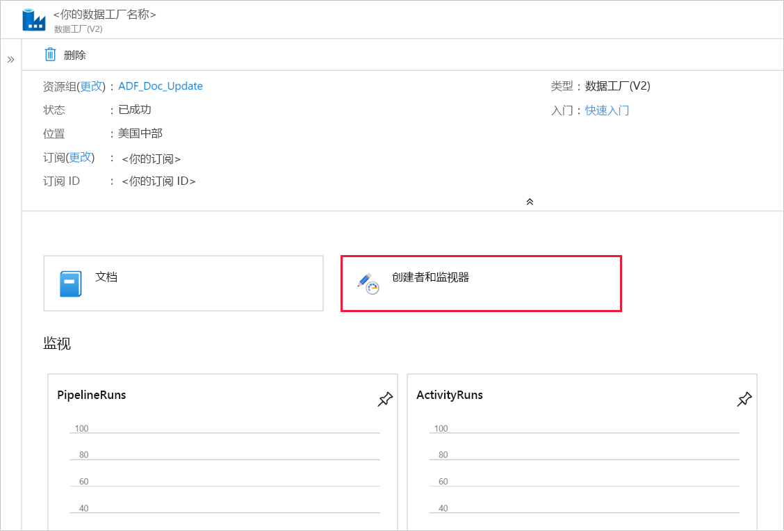

# Incrementally copy new files based on time partitioned file name by using the Copy Data tool

在本教程中，我们将使用 Azure 门户创建数据工厂。 Then, you use the Copy Data tool to create a pipeline that incrementally copies new files based on time partitioned file name from Azure Blob storage to Azure Blob storage. 

> [!NOTE]
> 如果对 Azure 数据工厂不熟悉，请参阅 [Azure 数据工厂简介](introduction.md)。

将在本教程中执行以下步骤：

> [!div class="checklist"]
> * 创建数据工厂。
> * 使用“复制数据”工具创建管道。
> * 监视管道和活动运行。

## 必备组件

* **Azure 订阅**：如果还没有 Azure 订阅，可以在开始前创建一个[免费帐户](https://azure.microsoft.com/free/)。
* **Azure storage account**: Use Blob storage as the _source_  and _sink_ data store. 如果没有 Azure 存储帐户，请参阅[创建存储帐户](../storage/common/storage-quickstart-create-account.md)中的说明。

### Create two containers in Blob storage

Prepare your Blob storage for the tutorial by performing these steps.

1. Create a container named **source**.  Create a folder path as **2019/02/26/14** in your container. Create an empty text file, and name it as **file1.txt**. Upload the file1.txt to the folder path **source/2019/02/26/14** in your storage account.  可以使用各种工具（例如 [Azure 存储资源管理器](https://storageexplorer.com/)）来执行这些任务。
    
    
    
    > [!NOTE]
    > Please adjust the folder name with your UTC time.  For example, if the current UTC time is 2:03 PM on Feb 26th, 2019, you can create the folder path as **source/2019/02/26/14/** by the rule of **source/{Year}/{Month}/{Day}/{Hour}/** .

2. Create a container named **destination**. 可以使用各种工具（例如 [Azure 存储资源管理器](https://storageexplorer.com/)）来执行这些任务。

## 创建数据工厂

1. 在左侧菜单中，选择“创建资源” > “数据 + 分析” > “数据工厂”： 
   
   

2. 在“新建数据工厂”页的“名称”下输入 **ADFTutorialDataFactory**。 
    
    数据工厂的名称必须全局唯一。 可能会收到以下错误消息：
   
   
   
   如果收到有关名称值的错误消息，请为数据工厂输入另一名称。 例如，使用名称 _**yourname**_ **ADFTutorialDataFactory**。 有关数据工厂项目的命名规则，请参阅[数据工厂命名规则](naming-rules.md)。
3. 选择要在其中创建新数据工厂的 Azure **订阅**。 
4. 对于“资源组”，请执行以下步骤之一：
     
    a.在“解决方案资源管理器”中，右键单击项目文件夹下的“引用”文件夹，并单击“添加引用”。 选择“使用现有资源组”，并从下拉列表选择现有的资源组。

    b. 选择“新建”，并输入资源组的名称。 
         
    若要了解资源组，请参阅[使用资源组管理 Azure 资源](../azure-resource-manager/resource-group-overview.md)。

5. 在“版本”下选择“V2”作为版本。
6. 在“位置”下选择数据工厂的位置。 下拉列表中仅显示支持的位置。 数据工厂使用的数据存储（例如，Azure 存储和 SQL 数据库）和计算资源（例如，Azure HDInsight）可以位于其他位置和区域。
7. 选择“固定到仪表板”。 
8. 选择**创建**。
9. 在仪表板中，“部署数据工厂”磁贴显示进程状态。

    
10. 创建完以后，会显示“数据工厂”主页。
   
    
11. 若要在单独的选项卡中启动 Azure 数据工厂用户界面 (UI)，请选择“创作和监视”磁贴。 

## 使用“复制数据”工具创建管道

1. On the **Let's get started** page, select the **Copy Data** title to launch the Copy Data tool. 

   
   
2. On the **Properties** page, take the following steps:

    a.在“解决方案资源管理器”中，右键单击项目文件夹下的“引用”文件夹，并单击“添加引用”。 Under **Task name**, enter **DeltaCopyFromBlobPipeline**.

    b. Under **Task cadence or Task schedule**, select **Run regularly on schedule**.

    c. Under **Trigger type**, select **Tumbling Window**.
    
    d.单击“下一步”。 Under **Recurrence**, enter **1 Hour(s)** . 
    
    e. 选择“**下一步**”。 
    
    数据工厂 UI 将使用指定的任务名称创建一个管道。 

    
3. 在“源数据存储”页上，完成以下步骤：

    a.在“解决方案资源管理器”中，右键单击项目文件夹下的“引用”文件夹，并单击“添加引用”。 Click  **+ Create new connection**, to add a connection.

    
    
    b. Select **Azure Blob Storage** from the gallery, and then click **Continue**.

    
    
    c. On the **New Linked Service** page, select your storage account from the **Storage account name** list, and then click **Finish**.
    
    
    
    d.单击“下一步”。 Select the newly created linked service, then click **Next**. 
    
   
4. 在“选择输入文件或文件夹”页中执行以下步骤：
    
    a.在“解决方案资源管理器”中，右键单击项目文件夹下的“引用”文件夹，并单击“添加引用”。 Browse and select the **source** container, then select **Choose**.
    
    
    
    b. Under **File loading behavior**, select **Incremental load: time-partitioned folder/file names**.
    
    
    
    c. Write the dynamic folder path as **source/{year}/{month}/{day}/{hour}/** , and change the format as followings:
    
    
    
    d.单击“下一步”。 Check **Binary copy** and click **Next**.
    
         
5. On the **Destination data store** page, select the **AzureBlobStorage**, which is the same storage account as data source store, and then click **Next**.

     
6. On the **Choose the output file or folder** page, do the following steps:
    
    a.在“解决方案资源管理器”中，右键单击项目文件夹下的“引用”文件夹，并单击“添加引用”。 Browse and select the **destination** folder, then click **Choose**.
    
       
    
    b. Write the dynamic folder path as **source/{year}/{month}/{day}/{hour}/** , and change the format as followings:
    
        
    
    c. 单击“下一步”。
    
      
7. 在“设置”页中，选择“下一步”。 

      
8. 在“摘要”页中检查设置，然后选择“下一步”。

    
    
9. 在“部署”页中，选择“监视”可以监视管道（任务）。
    
    
10. 请注意，界面中已自动选择左侧的“监视”选项卡。  You need wait for the pipeline run when it is triggered automatically (about after one hour).  When it runs, the **Actions** column includes links to view activity run details and to rerun the pipeline. Select **Refresh** to refresh the list, and select the **View Activity Runs** link in the **Actions** column. 

    
11. 该管道只包含一个活动（复制活动），因此只显示了一个条目。 You can see the source file (file1.txt) has been copied from  **source/2019/02/26/14/**  to **destination/2019/02/26/14/** with the same file name.  

    
    
    You can also verify the same by using Azure Storage Explorer (https://storageexplorer.com/) to scan the files.
    
    
12. Create another empty text file with the new name as **file2.txt**. Upload the file2.txt file to the folder path **source/2019/02/26/15** in your storage account.   可以使用各种工具（例如 [Azure 存储资源管理器](https://storageexplorer.com/)）来执行这些任务。   
    
    
    
    > [!NOTE]
    > You might be aware that a new folder path is required to be created. Please adjust the folder name with your UTC time.  For example, if the current UTC time is 3:20 PM on Feb 26th, 2019, you can create the folder path as **source/2019/02/26/15/** by the rule of **{Year}/{Month}/{Day}/{Hour}/** .
    
13. To go back to the **Pipeline Runs** view, select **All Pipelines Runs**, and wait for the same pipeline being triggered again automatically after another one hour.  

    

14. Select **View Activity Run** for the second pipeline run when it comes, and do the same to review details.  

    
    
    You can see the source file (file2.txt) has been copied from  **source/2019/02/26/15/**  to **destination/2019/02/26/15/** with the same file name.
    
     
    
    You can also verify the same by using Azure Storage Explorer (https://storageexplorer.com/) to scan the files in **destination** container
    
    

    
## 后续步骤
请转到下一篇教程，了解如何在 Azure 上使用 Spark 群集转换数据：

> [!div class="nextstepaction"]
>[在云中使用 Spark 群集转换数据](tutorial-transform-data-spark-portal.md)