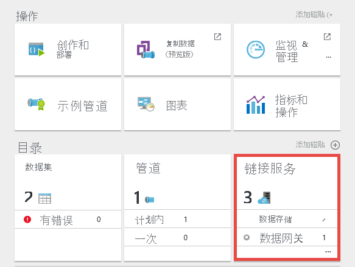
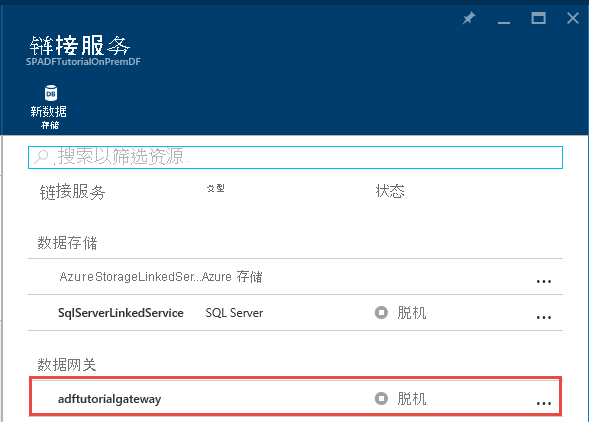
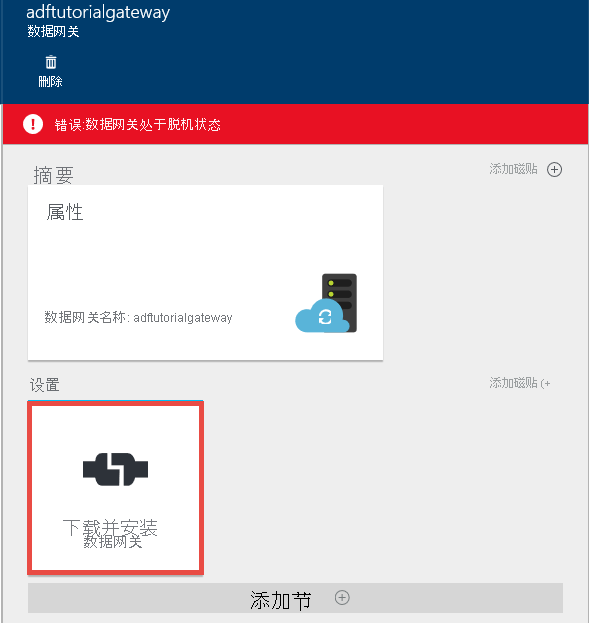
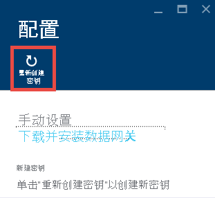
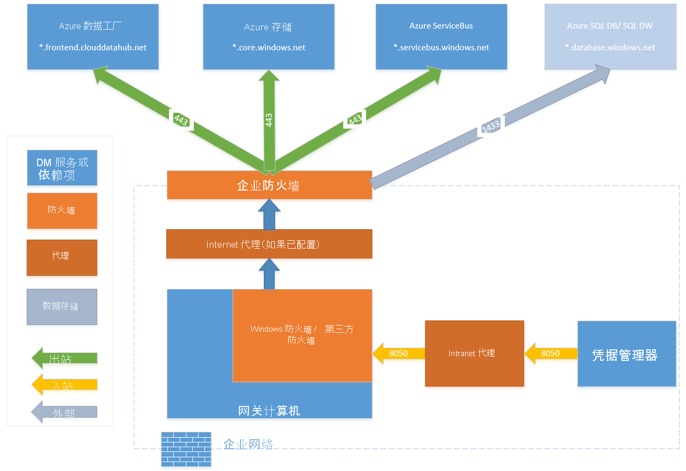
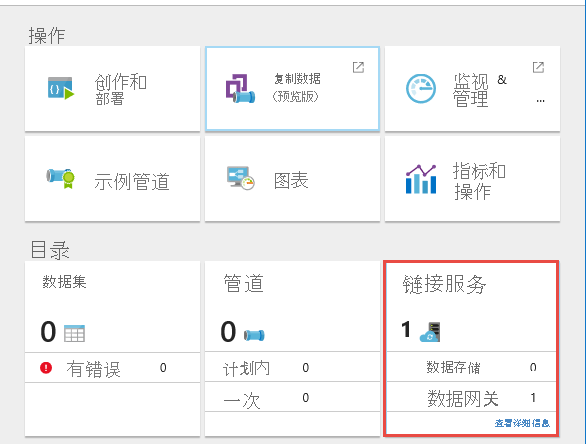
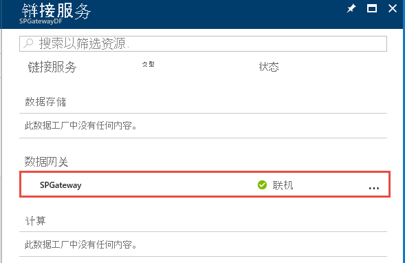
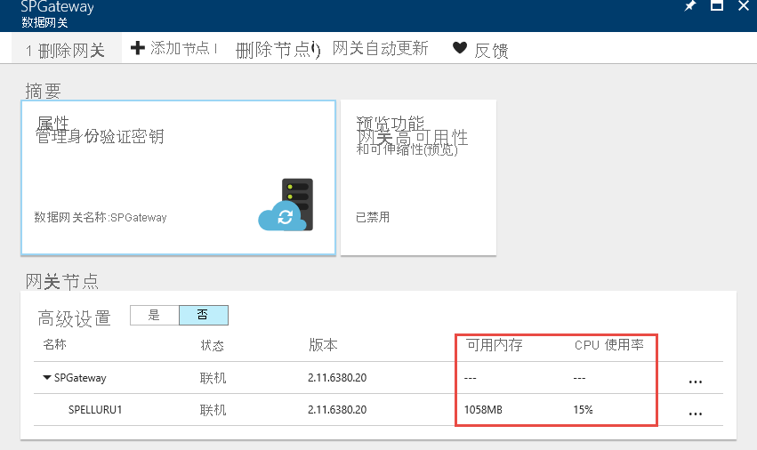
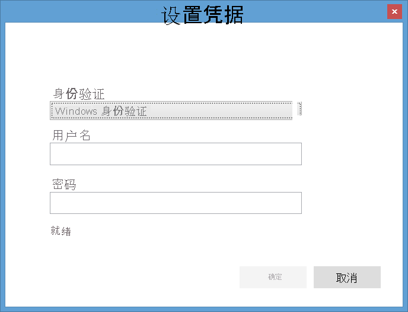

# <a name="data-management-gateway"></a>数据管理网关
> [!NOTE]
> 本文适用于数据工厂版本 1（正式版 (GA)）。 如果使用数据工厂服务版本 2（即预览版），请参阅[版本 2 中的自托管集成运行时](../create-self-hosted-integration-runtime.md)。 

> [!NOTE]
> 数据管理网关的产品名称现在已更改为自承载 Integration Runtime。  

数据管理网关是必须安装到本地环境中的客户端代理，用于在云和本地数据存储之间复制数据。 [支持的数据源](data-factory-data-movement-activities.md#supported-data-stores-and-formats)部分列出了数据工厂支持的本地数据存储。

本文补充了[在本地和云数据存储之间移动数据](data-factory-move-data-between-onprem-and-cloud.md)一文中的演练。 在本演练中，将创建一个管道，该管道使用网关将数据从本地 SQL Server 数据库移至 Azure Blob。 本文深入说明了数据管理网关。 

可通过将多个本地计算机与网关相关联来向外扩展数据管理网关。 可通过增加可以同时在一个节点上运行的数据移动作业数来进行扩展。 此功能也适用于包含一个节点的逻辑网关。 有关详细信息，请参阅[在 Azure 数据工厂中缩放数据管理网关](data-factory-data-management-gateway-high-availability-scalability.md)一文。

> [!NOTE]
> 目前，网关仅支持数据工厂中的复制活动和存储的过程活动。 不能使用自定义活动中的网关访问本地数据源。      

## <a name="overview"></a>概述
### <a name="capabilities-of-data-management-gateway"></a>数据管理网关的功能
数据管理网关提供以下功能：

* 在相同的数据工厂中创建本地数据源和云数据源模型，并移动数据。
* 具有单一虚拟管理平台，可从“数据工厂”页看见网关状态，以便监视和管理。
* 安全地管理对本地数据源的访问权限。
  * 无需对企业防火墙进行更改。 网关仅生成基于出站 HTTP 的连接，以打开 Internet。
  * 使用证书加密本地数据存储的凭据。
* 高效移动数据 - 并行传输数据，通过自动重试逻辑灵活应对间歇性网络问题。

### <a name="command-flow-and-data-flow"></a>命令流和数据流
使用复制活动在本地和云之间复制数据时，该活动使用网关将数据从本地数据源传输到云，反之亦然。

此处是使用数据网关进行复制的高级数据流和步骤摘要：

1. 数据开发人员使用 [Azure 门户](https://portal.azure.com) 或 [PowerShell Cmdlet](https://msdn.microsoft.com/library/dn820234.aspx) 为 Azure 数据工厂创建网关。
2. 通过指定网关，数据开发人员可以为本地数据存储创建链接服务。 作为链接服务设置的一部分，数据开发人员使用设置凭据应用程序来指定身份验证的类型和凭据。  设置凭据应用程序对话框与数据存储进行通信，以测试连接和网关，从而保存凭据。
3. 将凭据保存在云中之前，网关通过与网关关联的证书（由数据开发人员提供）来加密凭据。
4. 数据工厂服务经过使用共享 Azure 服务总线队列的控制通道，与网关进行通信，以计划和管理作业。 需要启动复制活动作业时，数据工厂对请求和凭据信息进行排序。 轮询队列后，网关启动作业。
5. 网关使用相同的证书来解密凭据，并连接到具有正确身份验证类型和凭据的本地数据存储。
6. 根据复制活动在数据管道中的配置方式，网关将数据从本地存储复制到云存储（反之亦然）。 对于此步骤，网关直接通过安全 (HTTPS) 通道与基于云的存储服务（如 Azure Blob 存储）通信。

### <a name="considerations-for-using-gateway"></a>使用网关的注意事项
* 数据管理网关的单个实例可用于多个本地数据源。 但是，**单个网关实例只与一个 Azure 数据工厂关联**，不能与另一个数据工厂共享。
* 在一台计算机上可以仅安装数据管理网关的一个实例。 假设有两个需要访问本地数据源的数据工厂，那么需要在两台本地计算机上安装网关。 换而言之，一个网关关联到一个特定的数据工厂
* **网关不需要位于数据源所在的计算机上**。 但是，如果网关离数据源较近，可以减少网关连接到数据源的时间。 建议在不同于托管本地数据源的计算机上安装网关。 网关和数据源位于不同计算机上时，网关不会与数据源争用资源。
* 可以在**不同计算机上拥有多个连接到相同本地数据源的网关**。 例如，可以让两个网关服务两个数据工厂，但这两个数据工厂注册了同一个本地数据源。
* 如果已在计算机中安装了为 **Power BI** 方案提供服务的网关，那么在其他计算机上安装**用于 Azure 数据工厂的单独网关**。
* 即使使用 **ExpressRoute**，也必须使用网关。
* 即使使用 **ExpressRoute**，也要将数据源视为本地数据源（位于防火墙之后）。 使用网关在服务和数据源之间建立连接。
* 必须**使用网关**，即使数据存储位于 **Azure IaaS VM** 上的云中。

## <a name="installation"></a>安装
### <a name="prerequisites"></a>先决条件
* 支持的**操作系统**版本有 Windows 7、Windows 8/8.1、Windows 10、Windows Server 2008 R2、Windows Server 2012 和 Windows Server 2012 R2。 当前不支持在域控制器上安装数据管理网关。
* 要求 .NET framework 4.5.1 或更高版本。 如果正在 Windows 7 计算机上安装网关，请安装 .NET Framework 4.5 或更高版本。 有关详细信息，请参阅 [.NET Framework 系统需求](https://msdn.microsoft.com/library/8z6watww.aspx)。
* 推荐的网关计算机**配置**至少为 2 GHz，4 核，8 GB RAM 和 80 GB 磁盘。
* 如果主机计算机进入休眠状态，则网关不响应数据请求。 因此，安装网关之前，请在计算机上配置相应的**电源计划**。 如果计算机配置为休眠，则网关安装程序会提示消息。
* 只有计算机管理员才能成功安装和配置数据管理网关。 可以将其他用户添加到“数据管理网关用户”本地 Windows 组。 此组成员能够通过数据管理网关配置管理器工具来配置网关。

由于复制活动按特定频率发生，因此计算机上的资源使用率（CPU、内存）也遵循相同的高峰期和空闲期模式。 资源利用率还很大程度上取决于正在移动的数据量。 进行多个复制作业时，会看到资源使用率在高峰期上升。

### <a name="installation-options"></a>安装选项
可以通过以下方式安装数据管理网关：

* 从 [Microsoft 下载中心](https://www.microsoft.com/download/details.aspx?id=39717)下载 MSI 安装程序包。  还可以使用 MSI 将现有数据管理网关升级到最新版本，并保留所有设置。
* 在“手动安装”下单击“下载并安装数据网关”链接，或在“快速安装”下单击“直接安装在此计算机上”。 有关使用快速安装的分步说明，请参阅[在本地和云之间的移动数据](data-factory-move-data-between-onprem-and-cloud.md)一文。 手动步骤会引导进入下载中心。  下一部分会提供有关从下载中心下载和安装网关的说明。

### <a name="installation-best-practices"></a>安装最佳方案：
1. 在主机上为网关配置电源计划，从而让计算机无法休眠。 如果主机计算机进入休眠状态，则网关不响应数据请求。
2. 备份与网关关联的证书。

### <a name="install-the-gateway-from-download-center"></a>从下载中心安装网关
1. 导航到 [Microsoft 数据管理网关下载页](https://www.microsoft.com/download/details.aspx?id=39717)。
2. 单击“下载”，选择适当的版本（“32 位”或“64 位”），并单击“下一步”。
3. 直接运行 **MSI** 或将其保存到硬盘再运行。
4. 在“欢迎”页上，选择“语言”，单击“下一步”。
5. 选择“接受”以接受最终用户许可协议，并单击“下一步”。
6. 选择“文件夹”以安装网关，并单击“下一步”。
7. 在“准备安装”页上，单击“安装”。
8. 单击“完成”，完成安装。
9. 从 Azure 门户中获取密钥。 请参阅下一部分的分步说明。
10. 在计算机上运行的“数据管理网关配置管理器”的“注册网关”页上，执行以下步骤：
    1. 将密钥粘贴到文本中。
    2. 或者单击“显示网关密钥”，以查看密钥文本。
    3. 单击“注册”。

### <a name="register-gateway-using-key"></a>使用密钥注册网关
#### <a name="if-you-havent-already-created-a-logical-gateway-in-the-portal"></a>如果尚未在门户中创建逻辑网关
若要在门户中创建网关并从“配置”页获取密钥，请遵循[在本地和云之间移动数据](data-factory-move-data-between-onprem-and-cloud.md)一文中的演练步骤。    

#### <a name="if-you-have-already-created-the-logical-gateway-in-the-portal"></a>如果已在门户中创建逻辑网关
1. 在 Azure 门户中，导航到“数据工厂”页，并单击“链接服务”磁贴。

    
2. 在“链接服务”页中，选择在门户中创建的逻辑网关。

      
3. 在“数据网关”页中，单击“下载并安装数据网关”。

       
4. 在“配置”页中，单击“重新创建密钥”。 仔细阅读后，在警告消息上单击“是”。

    
5. 单击密钥旁边的“复制”按钮。 密钥被复制到剪贴板。

    

### <a name="system-tray-icons-notifications"></a>系统托盘图标/通知
下图显示了一些能够看到的托盘图标。


如果将光标移动到系统托盘图标/通知消息上，弹出窗口中会显示网关/更新操作状态的相关详情。

### <a name="ports-and-firewall"></a>端口和防火墙
需要考虑两个防火墙：在组织的中央路由器上运行的“企业防火墙”和在安装了网关的本地计算机上配置为守护程序的“Windows 防火墙”。  



在企业防火墙级别，需配置以下域和出站端口：

| 域名 | 端口 | 说明 |
| --- | --- | --- |
| *.servicebus.windows.net |443, 80 |用于与数据移动服务后端进行通信 |
| *.core.windows.net |443 |用于使用 Azure Blob 的暂存复制（如果已配置）|
| *.frontend.clouddatahub.net |443 |用于与数据移动服务后端进行通信 |
| * .servicebus.windows.net |9350-9354, 5671 |复制向导使用的通过 TCP 的可选服务总线中继 |


在 Windows 防火墙级别下，通常已启用这些出站端口。 如果没有，可以在网关计算机上相应地配置域和端口。

> [!NOTE]
> 1. 根据源/接收器，可能需要在企业/Windows 防火墙中将其他域和出站端口加入允许列表。
> 2. 对于部分云数据库（例如，[Azure SQL 数据库](https://docs.microsoft.com/azure/sql-database/sql-database-configure-firewall-settings)、[Azure Data Lake](https://docs.microsoft.com/azure/data-lake-store/data-lake-store-secure-data#set-ip-address-range-for-data-access) 等），可能需要在其防火墙配置中将网关计算机的 IP 地址加入允许列表。
>
>


#### <a name="copy-data-from-a-source-data-store-to-a-sink-data-store"></a>将数据从源数据存储复制到接收器数据存储
确保在企业防火墙、网关计算机上的 Windows 防火墙和数据存储上正确启用防火墙规则。 启用这些规则可以让网关成功连接到源和接收器。 为复制操作涉及的每个数据存储启用规则。

例如，若要从**本地数据存储复制到 Azure SQL 数据库接收器或 Azure SQL 数据仓库接收器**，请执行以下步骤：

* 对于 Windows 防火墙和企业防火墙，允许 **1433** 端口上的出站 **TCP** 通信。
* 配置 Azure SQL Server 的防火墙设置，将网关计算机的 IP 地址添加到允许的 IP 地址列表。

> [!NOTE]
> 如果防火墙不允许出站端口 1433，则网关无法直接访问 Azure SQL。 在这种情况下，可以将[暂存复制](https://docs.microsoft.com/azure/data-factory/data-factory-copy-activity-performance#staged-copy)用于 SQL Azure 数据库/SQL Azure DW。 在这种情况下，仅需要将 HTTPS（端口 443）用于数据移动。
>
>


### <a name="proxy-server-considerations"></a>代理服务器注意事项
如果企业网络环境使用代理服务器访问 Internet，配置数据管理网关以使用合适的代理设置。 可以在初始注册阶段设置代理。


网关使用代理服务器连接云服务。 在初始设置期间单击“更改”链接。 会看到“代理设置”对话框。


有三个配置选项：

* **不使用代理**：网关不显式使用任何代理来连接云服务。
* **使用系统代理**：网关使用在 diahost.exe.config 和 diawp.exe.config 中配置的代理设置。如果 diahost.exe.config 和 diawp.exe.config 中未配置代理，则网关无需通过代理，直接连接到云服务。
* **使用自定义代理**：配置用于网关的 HTTP 代理设置，而不使用 diahost.exe.config 和 diawp.exe.config 中的配置。需要地址和端口。  用户名和密码可选，具体取决于代理的身份验证设置。  使用网关凭据证书对所有设置进行加密，并存储在网关主机计算机本地。

保存更新的代理设置之后，数据管理网关主机服务会自动重启。

成功注册网关后，如果想要查看或更新代理设置，请使用数据管理网关配置管理器。

1. 启动“数据管理网关配置管理器”。
2. 切换到“设置”选项卡。
3. 单击“HTTP 代理”部分的“更改”链接，以启动“设置 HTTP 代理”对话框。  
4. 单击“下一步”按钮后，会看到警告对话框，询问是否要保存代理设置并重启网关主机服务。

可以使用配置管理器工具查看和更新 HTTP 代理。


> [!NOTE]
> 如果使用 NTLM 身份验证设置代理服务器，网关主机服务会在域帐户下运行。 如果之后更改域帐户密码，请记得更新服务的配置设置，并相应地将其重启。 鉴于此要求，建议使用专用域帐户来访问代理服务器，可以无需经常更新密码。
>
>

### <a name="configure-proxy-server-settings"></a>配置代理服务器设置
如果为 HTTP 代理服务器选择“使用系统代理”设置，则网关使用 diahost.exe.config 和 diawp.exe.config 中的代理设置。如果 diahost.exe.config 和 diawp.exe.config 中未指定代理，则网关无需通过代理，直接连接到云服务。 以下过程说明如何更新 diahost.exe.config 文件。  

1. 在文件资源管理器中，生成 C:\Program Files\Microsoft Data Management Gateway\2.0\Shared\diahost.exe.config 的安全副本，以备份原始文件。
2. 启动作为管理员运行的 Notepad.exe，并打开文本文件“C:\Program Files\Microsoft Data Management Gateway\2.0\Shared\diahost.exe.config”。找到 system.net 的默认标记，如以下代码中所示：

         <system.net>
             <defaultProxy useDefaultCredentials="true" />
         </system.net>    

   然后可以添加代理服务器的详细信息，如以下示例所示：

         <system.net>
               <defaultProxy enabled="true">
                     <proxy bypassonlocal="true" proxyaddress="http://proxy.domain.org:8888/" />
               </defaultProxy>
         </system.net>

   允许在代理标记中使用其他属性，以指定所需设置（如 scriptLocation）。 关于语法，请参阅[代理元素（网络设置）](https://msdn.microsoft.com/library/sa91de1e.aspx)。

         <proxy autoDetect="true|false|unspecified" bypassonlocal="true|false|unspecified" proxyaddress="uriString" scriptLocation="uriString" usesystemdefault="true|false|unspecified "/>
3. 将配置文件保存到原始位置，并重启数据管理网关主机服务，获得更改。 若要重启服务，请执行以下步骤：从控制面板使用服务小程序，或从“数据管理网关配置管理器” > 依次单击“停止服务”按钮和“启动服务”使用服务小程序。 如果服务未启动，很可能是将错误的 XML 标记语法添加到了编辑过的应用程序配置文件中。

> [!IMPORTANT]
> 不要忘记**同时**更新 diahost.exe.config 和 diawp.exe.config。  


除了这几点，还需要确保 Microsoft Azure 列于公司的允许列表中。 可以从 [Microsoft 下载中心](https://www.microsoft.com/download/details.aspx?id=41653)下载有效的 Microsoft Azure IP 地址列表。

#### <a name="possible-symptoms-for-firewall-and-proxy-server-related-issues"></a>防火墙和代理服务器相关问题的可能症状
如果遇到类似于以下的错误，可能是由于防火墙或代理服务器配置错误，阻止了网关连接到数据工厂进行自身身份验证。 请参考上一部分，确保防火墙和代理服务器已正确配置。

1. 尝试注册网关时，会收到以下错误：“未能注册网关密钥。 在尝试再次注册网关密钥之前，请确认数据管理网关处于已连接状态，并且数据管理网关主机服务已启动”。
2. 打开配置管理器时，将看到状态为“已断开连接”或“正在连接”。 查看 Windows 事件日志时，在“事件查看器”>“应用程序和服务日志”>“数据管理网关”下，会看到错误消息，例如以下错误：`Unable to connect to the remote server`
   `A component of Data Management Gateway has become unresponsive and restarts automatically. Component name: Gateway.`

### <a name="open-port-8050-for-credential-encryption"></a>打开端口 8050 以实现凭据加密
在 Azure 门户中设置本地链接服务时，“设置凭据”应用程序使用入站端口“8050”将凭据中继到网关。 默认情况下，网关安装期间，网关安装会在网关计算机上将其打开。

如果正在使用第三方防火墙，则可以手动打开端口 8050。 如果在网关安装过程中遇到防火墙问题，可以尝试使用以下命令在不配置防火墙的情况下安装网关。

    msiexec /q /i DataManagementGateway.msi NOFIREWALL=1

如果选择不打开网关计算机上的端口 8050，则使用机制（而不是使用“设置凭据”应用程序）来配置数据存储凭据。 例如，可以使用 [New-AzureRmDataFactoryEncryptValue](https://msdn.microsoft.com/library/mt603802.aspx) PowerShell cmdlet。 请参阅[设置凭据和安全](#set-credentials-and-securityy)部分，了解如何设置数据存储凭据。

## <a name="update"></a>更新
默认情况下，如果有较新版本的网关可用，会自动更新数据管理网关。 完成所有计划的任务之后，网关才会更新。 更新操作完成之前，网关不处理任何其他任务。 如果更新失败，网关回退到旧版本。

在以下位置查看计划的更新时间：

* Azure 门户中的网关属性页。
* 数据管理网关配置管理器的主页
* 系统托盘通知消息。

数据管理网关配置管理器的“主页”选项卡显示更新计划和上一次网关安装/更新的时间。


可以立即安装更新，也可以等待网关在计划时间自动更新。 例如，下图显示网关配置管理器中出现的通知消息，以及“更新”按钮，可以单击此按钮立即安装。


系统托盘中的通知消息如下图所示：


在系统托盘中查看（手动或自动）更新操作的状态。 下一次启动网关配置管理器时，会在通知栏中看到一条消息，显示网关已更新，并附随[新增功能主题](data-factory-gateway-release-notes.md)链接。

### <a name="to-disableenable-auto-update-feature"></a>禁用/启用自动更新功能
通过执行以下步骤，可以禁用/启用自动更新功能：

[适用于单节点网关]
1. 在网关计算机上启动 Windows PowerShell。
2. 切换到 C:\Program Files\Microsoft Integration Runtime\3.0\PowerShellScript\ 文件夹。
3. 运行以下命令以关闭自动更新功能（禁用）。   

    ```PowerShell
    .\IntegrationRuntimeAutoUpdateToggle.ps1  -off
    ```
4. 若要重新打开，请执行以下操作：

    ```PowerShell
    .\IntegrationRuntimeAutoUpdateToggle.ps1 -on  
    ```
[对于多节点高度可用且可伸缩的网关（预览）](data-factory-data-management-gateway-high-availability-scalability.md)
1. 在网关计算机上启动 Windows PowerShell。
2. 切换到 C:\Program Files\Microsoft Integration Runtime\3.0\PowerShellScript\ 文件夹。
3. 运行以下命令以关闭自动更新功能（禁用）。   

    对于具有高可用性功能（预览）的网关，需要额外的 AuthKey 参数。
    ```PowerShell
    .\IntegrationRuntimeAutoUpdateToggle.ps1  -off -AuthKey <your auth key>
    ```
4. 若要重新打开，请执行以下操作：

    ```PowerShell
    .\IntegrationRuntimeAutoUpdateToggle.ps1  -on -AuthKey <your auth key> 
    ```

## <a name="configuration-manager"></a>配置管理器
安装网关后，可以通过以下方式之一来启动数据管理网关配置管理器：

1. 在“搜索”窗口中，键入“数据管理网关”，以访问此实用程序。
2. 在文件夹 **C:\Program Files\Microsoft Data Management Gateway\2.0\Shared** 中查找可执行文件 **ConfigManager.exe**

### <a name="home-page"></a>主页
在主页中可执行以下操作：

* 查看网关状态（连接到云服务等）。
* 从门户中使用密钥进行**注册**。
* **停止**和启动网关计算机上的“数据管理网关主机服务”。
* **计划更新**发生在一天中的某个特定时间。
* 查看网关的**上次更新日期**。

### <a name="settings-page"></a>“设置”页
在“设置”页中可执行以下操作：

* 查看、更改和导出网关所用的**证书**。 此证书用于加密数据源凭据。
* 更改终结点的 **HTTPS 端口**。 网关打开一个端口，用于设置数据源凭据。
* 终结点的**状态**
* “SSL 证书”视图可用于门户与网关之间的 SSL 通信，从而为数据源设置凭据。  

### <a name="remote-access-from-intranet"></a>从 Intranet 进行远程访问  
以后将启用此功能。 在即将发布的更新（v3.4 或更高版本）中，我们将让你在使用 PowerShell 或凭据管理器应用程序加密凭据时启用/禁用现在使用端口 8050 实现的任何远程连接（请参阅上面部分）。 

### <a name="diagnostics-page"></a>“诊断”页
在“诊断”页中可执行以下操作：

* 启用详细“日志记录”、在事件查看器中查看日志，并在出现故障时会日志发送给 Microsoft。
* **测试连接**到数据源。  

### <a name="help-page"></a>帮助页
“帮助”页显示以下信息：  

* 网关的简短描述
* 版本号
* 联机帮助、隐私声明以及许可证协议的链接。  

## <a name="monitor-gateway-in-the-portal"></a>在门户中监视网关
在 Azure 门户中，可以查看网关计算机的资源使用率（CPU、内存、网络（进/出）等）近乎实时的快照。  

1. 在 Azure 门户中，导航到“数据工厂”主页，并单击“链接服务”磁贴。 

     
2. 在“链接服务”页中选择“网关”。

    
3. 在“网关”页中，可查看网关的内存和 CPU 使用情况。

     
4. 启用“高级设置”以查看网络使用情况等更多详细信息。
    
    

下表介绍“网关节点”列表中的列：  

监视属性 | 说明
:------------------ | :---------- 
名称 | 逻辑网关和与网关关联的节点的名称。 节点是已在其上安装网关的本地 Windows 计算机。 有关在单个逻辑网关中采用多个节点（最多 4 个）的信息，请参阅[数据管理网关 - 高可用性和可伸缩性](data-factory-data-management-gateway-high-availability-scalability.md)。    
状态 | 逻辑网关和网关节点的状态。 示例：联机/脱机/受限等。有关这些状态的信息，请参阅[网关状态](#gateway-status)部分。 
版本 | 显示逻辑网关和每个网关节点的版本。 逻辑网关的版本根据组中多数节点的版本而决定。 如果逻辑网关安装程序中的节点版本不同，只有与逻辑网关的版本号相同的节点能正常运行。 其他节点将处于受限模式，需要手动进行更新（仅当自动更新失败时）。 
可用内存 | 网关节点上的可用内存。 此值为近实时快照。 
CPU 使用率 | 网关节点的 CPU 使用率。 此值为近实时快照。 
网络（进/出） | 网关节点的网络利用率。 此值为近实时快照。 
并发作业数（运行中/上限） | 每个节点上运行的作业或任务数。 此值为近实时快照。 上限表示每个节点的最大并发作业数。 此值根据计算机大小定义而来。 在 CPU/内存/网络未充分利用，但活动即将超时的高级方案中，可提高上限来增强并发作业执行。此功能也适用于单节点网关（即便未启用可伸缩性和可用性功能）。  
角色 | 多节点网关中有两种角色 – 调度程序和辅助角色。 所有节点均为辅助角色，表示它们可用于执行作业。 只有一个调度程序节点，用于从云服务中请求任务/作业，并分派到其他辅助节点（包括其本身）。

在此页面，你将发现当网关中存在两个或以上节点（扩展方案）时，某些设置更为好用。 有关如何设置多节点网关的详细信息，请参阅[数据管理网关 - 高可用性和可伸缩性](data-factory-data-management-gateway-high-availability-scalability.md)。

### <a name="gateway-status"></a>网关状态
下表提供网关节点可能的状态： 

状态  | 注释/方案
:------- | :------------------
联机 | 节点连接到数据工厂服务。
脱机 | 节点处于脱机状态。
正在升级 | 节点正在进行自动更新。
受限制 | 由于连接问题而受限。 可能由于 HTTP 端口 8050 问题、服务总线连接问题或凭据同步问题而受限。 
非活动 | 节点的配置与其他多数节点的配置不同。<br/><br/> 节点在无法与其他节点连接时可能处于非活动状态。 


下表提供逻辑网关可能的状态。 网关状态取决于网关节点的状态。 

状态 | 注释
:----- | :-------
需注册 | 尚未向此逻辑网关注册任何节点
联机 | 网关节点处于联机状态
脱机 | 没有节点处于联机状态。
受限制 | 此网关中并非所有节点都处于运行正常状态。 此状态是部分节点可能出现故障的警告！ <br/><br/>可能是由于调度程序/辅助角色节点上的凭据同步问题所导致。 

## <a name="scale-up-gateway"></a>向上扩展网关
可配置可在单个节点上运行的**并发数据移动作业数**，提升在本地与云数据存储之间移动数据的能力。 

如果可用内存和 CPU 未充分利用，但空闲容量为 0，应通过增加节点上可运行的并发作业数进行纵向扩展。 此外，活动因网关重载而超时时，可能也需要进行扩展。 在网关节点的高级设置中，可以增加节点的最大容量。 
  

## <a name="troubleshooting-gateway-issues"></a>网关问题疑难解答
请参阅[网关问题疑难解答](data-factory-troubleshoot-gateway-issues.md)一文，了解在解决使用数据管理网关时遇到的问题的相关信息/提示。  

## <a name="move-gateway-from-one-machine-to-another"></a>将网关从一台计算机移动到另一台计算机
本部分提供将网关客户端从一台计算机移动到另一台计算机的步骤。

1. 在门户中，导航到“数据工厂主页”，并单击“链接服务”磁贴。

    
2. 在“链接服务”页的“数据网关”部分选择网关。

    
3. 在“数据网关”页中，单击“下载并安装数据网关”。

    
4. 在“配置”页中，单击“下载并安装数据网关”，并按照说明在计算机上安装数据网关。

    
5. 将“Microsoft 数据管理网关配置管理器”保持为打开状态。

        
6. 在门户中的“配置”页中，单击命令栏上的“重新创建密钥”，并对警告消息单击“是”。 单击密钥文本旁边的“复制”按钮，将密钥复制到剪贴板。 重新创建密钥后，旧计算机上的网关立即停止工作。  

    
7. 在计算机上，将“密钥”粘贴到“数据管理网关配置管理器”的“注册网关”页的文本框中。 （可选）单击“显示网关密钥”复选框，以查看密钥文本。

    
8. 单击“注册”，以通过云服务注册网关。
9. 在“设置”选项卡上，单击“更改”选择与旧网关一起使用的相同证书，输入**密码**，并单击“完成”。

   

   可以通过以下步骤从旧网关导出证书：在旧计算机上启动数据管理网关配置管理器，切换到“证书”选项卡，单击“导出”按钮，并按照说明进行操作。
10. 成功注册网关后，在网关配置管理器的主页上可看到“注册”设置为“已注册”且“状态”设置为“已启动”。

## <a name="encrypting-credentials"></a>加密凭据
若要在数据工厂编辑器中加密凭据，请执行以下步骤：

1. 在“网关计算机”上启动 Web 浏览器，导航到 [Azure 门户](http://portal.azure.com)。 根据需要搜索数据工厂，打开“数据工厂”页中的数据工厂，并单击“作者和部署”，以启动数据工厂编辑器。   
2. 单击树状视图中的某个现有“链接服务”以查看其 JSON 定义或创建需要数据管理网关的链接服务（例如：SQL Server 或 Oracle）。
3. 在 JSON 编辑器中，对 **gatewayName** 属性输入网关名称。
4. 在 **connectionString** 中，对“数据源”属性输入服务器名称。
5. 在 **connectionString** 中，对“初始目录”属性输入数据库名称。    
6. 单击单击命令栏上的“加密”按钮，启动只需单击一次的“凭据管理器”应用程序。 将显示“设置凭据”对话框。

    
7. 在“设置凭据”对话框框中，执行以下步骤：
   1. 选择数据工厂服务连接数据库时所需的“身份验证”。
   2. 对于“用户名”设置，输入有权访问数据库的用户的名称。
   3. 对于“密码”设置，输入用户密码。  
   4. 单击“确定”加密凭据并关闭对话框。
8. 现在可以在 **connectionString** 中看到 **encryptedCredential** 属性。

    ```JSON
    {
        "name": "SqlServerLinkedService",
        "properties": {
            "type": "OnPremisesSqlServer",
            "description": "",
            "typeProperties": {
                "connectionString": "data source=myserver;initial catalog=mydatabase;Integrated Security=False;EncryptedCredential=eyJDb25uZWN0aW9uU3R",
                "gatewayName": "adftutorialgateway"
            }
        }
    }
    ```
如果从不同于网关计算机的计算机访问门户，必须确保凭据管理器应用程序可以连接网关计算机。 如果应用程序无法连接网关计算机，则不允许为数据源设置凭据和测试数据源连接。  

使用“设置凭据”应用程序时，门户使用网关计算机上“网关配置管理器”的“证书”选项卡上指定的证书来加密凭据。

如果正在寻找基于 API 的方法来加密凭据，可以使用 [New-AzureRmDataFactoryEncryptValue](https://msdn.microsoft.com/library/mt603802.aspx) PowerShell cmdlet 来加密凭据。 此 cmdlet 使用的证书是配置网关加密凭据所用的证书。 将加密凭据添加到 JSON 中 **connectionString** 的 **EncryptedCredential** 元素中。 通过 [New-AzureRmDataFactoryLinkedService](https://msdn.microsoft.com/library/mt603647.aspx) cmdlet 或在数据工厂编辑器中使用 JSON。

```JSON
"connectionString": "Data Source=<servername>;Initial Catalog=<databasename>;Integrated Security=True;EncryptedCredential=<encrypted credential>",
```

还有一种方法可以使用数据工厂编辑器设置凭据。 如果通过编辑器创建 SQL Server 链接服务并以纯文本格式输入凭据，会使用数据工厂服务拥有的证书来加密凭据。 不使用配置网关使用的证书。 尽管这种方法在某些情况下可能稍快一些，但不太安全。 因此，建议仅在开发/测试时使用此方法。

## <a name="powershell-cmdlets"></a>PowerShell cmdlet
本部分介绍如何使用 Azure PowerShell cmdlet 创建和注册网关。

1. 在管理员模式下启动 **Azure PowerShell**。
2. 运行以下命令并输入 Azure 凭据登录到 Azure 帐户。

    ```PowerShell
    Connect-AzureRmAccount
    ```
3. 使用 **New-AzureRmDataFactoryGateway** cmdlet 创建逻辑网关，如下所示：

    ```PowerShell
    $MyDMG = New-AzureRmDataFactoryGateway -Name <gatewayName> -DataFactoryName <dataFactoryName> -ResourceGroupName ADF –Description <desc>
    ```
    **示例命令和输出**：

    ```
    PS C:\> $MyDMG = New-AzureRmDataFactoryGateway -Name MyGateway -DataFactoryName $df -ResourceGroupName ADF –Description “gateway for walkthrough”

    Name              : MyGateway
    Description       : gateway for walkthrough
    Version           :
    Status            : NeedRegistration
    VersionStatus     : None
    CreateTime        : 9/28/2014 10:58:22
    RegisterTime      :
    LastConnectTime   :
    ExpiryTime        :
    ProvisioningState : Succeeded
    Key               : ADF#00000000-0000-4fb8-a867-947877aef6cb@fda06d87-f446-43b1-9485-78af26b8bab0@4707262b-dc25-4fe5-881c-c8a7c3c569fe@wu#nfU4aBlq/heRyYFZ2Xt/CD+7i73PEO521Sj2AFOCmiI
    ```

1. 在 Azure PowerShell 中，切换到文件夹：**C:\Program Files\Microsoft Data Management Gateway\2.0\PowerShellScript\**。 运行与本地变量 **$Key** 关联的 **RegisterGateway.ps1**，如以下命令所示。 此脚本使用之前创建的逻辑网关注册安装在计算机上的客户端代理。

    ```PowerShell
    PS C:\> .\RegisterGateway.ps1 $MyDMG.Key
    ```
    ```
    Agent registration is successful!
    ```
    可以通过 IsRegisterOnRemoteMachine 参数注册远程计算机上的网关。 示例：

    ```PowerShell
    .\RegisterGateway.ps1 $MyDMG.Key -IsRegisterOnRemoteMachine true
    ```
2. 可以使用 **Get AzureRmDataFactoryGateway** cmdlet 获取数据工厂中的网关列表。 当“状态”显示为“联机”时，这意味着网关可用。

    ```PowerShell        
    Get-AzureRmDataFactoryGateway -DataFactoryName <dataFactoryName> -ResourceGroupName ADF
    ```
可以通过 **Remove-AzureRmDataFactoryGateway** cmdlet 删除网关，并使用 **Set-AzureRmDataFactoryGateway** cmdlets 更新网关描述 。 有关语法和上述 cmdlet 的其他详细信息，请参阅《数据工厂 Cmdlet 参考》。  

### <a name="list-gateways-using-powershell"></a>使用 PowerShell 列出网关

```PowerShell
Get-AzureRmDataFactoryGateway -DataFactoryName jasoncopyusingstoredprocedure -ResourceGroupName ADF_ResourceGroup
```

### <a name="remove-gateway-using-powershell"></a>使用 PowerShell 移除网关

```PowerShell
Remove-AzureRmDataFactoryGateway -Name JasonHDMG_byPSRemote -ResourceGroupName ADF_ResourceGroup -DataFactoryName jasoncopyusingstoredprocedure -Force
```


## <a name="next-steps"></a>后续步骤
* 有关详细信息，请参阅[在本地与云之间移动数据](data-factory-move-data-between-onprem-and-cloud.md)一文。 在本演练中，将创建一个管道，该管道使用网关将数据从本地 SQL Server 数据库移至 Azure Blob。  
