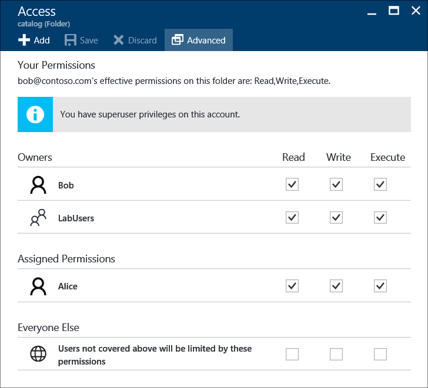

# Azure Data Lake Storage Gen1 中的安全性

许多企业都开始利用大数据分析获取业务见解，以帮助他们做出明智的决策。 组织的环境可能复杂、规范化，不同的用户越来越多。 确保更安全地存储关键业务数据并向个人用户授予访问权限的正确级别，这一点对企业来说至关重要。 Azure Data Lake Storage Gen1 旨在帮助企业实现这些安全要求。 在本文中，了解 Data Lake Storage Gen1 的安全功能，包括：

* 身份验证
* 授权
* 网络隔离
* 数据保护
* 审核

## 身份验证和标识管理

身份验证是用户与 Data Lake Storage Gen1 或连接到 Data Lake Storage Gen1 的任何服务进行交互时，验证用户身份的过程。 Data Lake Storage Gen1 使用 [Azure Active Directory](../active-directory/fundamentals/active-directory-whatis.md) 进行标识管理和身份验证，这是一种综合性的标识和访问管理云解决方案，可简化对用户和组的管理。

每个 Azure 订阅都会与 Azure Active Directory 实例关联。 只有在 Azure Active Directory 服务中定义的用户和服务标识才能使用 Azure 门户、命令行工具或组织通过 Data Lake Storage Gen1 SDK 生成的客户端应用程序来访问 Data Lake Storage Gen1 帐户。 作为一种集中的访问控制机制，使用 Azure Active Directory 的主要优点有：

* 简化身份生命周期管理。 只需删除或禁用目录中的帐户，就可迅速创建并快速吊销用户或服务（服务主体标识）的标识。
* 多重身份验证。 [多重身份验证](../active-directory/authentication/multi-factor-authentication.md)为用户登录和事务提供了额外的安全层。
* 通过标准开放协议（如 OAuth 或 OpenID）的任何客户端认证。
* 与企业目录服务和云标识提供程序联合。

## 授权和访问控制

Azure Active Directory 对用户进行身份验证，以便用户可以访问 Data Lake Storage Gen1。在此之后，授权控制 Data Lake Storage Gen1 的访问权限。 Data Lake Storage Gen1 按以下方式分隔帐户相关活动与数据相关活动的授权：

* Azure 向帐户管理提供的[基于角色的访问控制](../role-based-access-control/overview.md) (RBAC)
* 用于访问存储区中数据的 POSIX ACL

### 用于帐户管理的 RBAC

默认情况下，针对 Data Lake Storage Gen1 定义四种基本角色。 这些角色允许通过 Azure 门户、PowerShell cmdlet 和 REST API 对 Data Lake Storage Gen1 帐户执行不同的操作。 所有者和参与者角色可对帐户执行许多管理功能。 可以将读取者角色分配给仅查看帐户管理数据的用户。

请注意：尽管未给帐户管理分配角色，但某些角色会影响对数据的访问。 需要使用 ACL 来控制对用户在文件系统上所执行操作的访问。 下表显示管理权限的摘要和默认角色的数据访问权限。

| 角色 | 管理权限 | 数据访问权限 | 说明 |
| --- | --- | --- | --- |
| 未分配角色 |无 |受 ACL 约束 |用户不能使用 Azure 门户或 Azure PowerShell cmdlet 来浏览 Data Lake Storage Gen1。 用户只可以使用命令行工具。 |
| “所有者” |All |All |所有者角色为超级用户。 此角色可以管理所有内容，并具有对数据的完全访问权限。 |
| 读取器 |只读 |受 ACL 约束 |Reader 角色可以查看与帐户管理相关的所有内容，例如，向角色分配的用户。 Reader 角色不能进行任何更改。 |
| 参与者 |除了添加和删除角色的所有角色 |受 ACL 约束 |参与者角色可以管理帐户的某些方面，如部署、创建和管理警报。 参与者角色不能添加或删除角色。 |
| 用户访问管理员 |添加和删除角色 |受 ACL 约束 |用户访问管理角色可以管理对帐户的用户访问权限。 |

有关说明，请参阅[将用户或安全组分配给 Data Lake Storage Gen1 帐户](data-lake-store-secure-data.md#assign-users-or-security-groups-to-data-lake-storage-gen1-accounts)。

### 使用 ACL 对文件系统执行操作

Data Lake Storage Gen1 是一个类似于 Hadoop 分布式文件系统 (HDFS) 的分层文件系统，它支持 [POSIX ACL](https://hadoop.apache.org/docs/current/hadoop-project-dist/hadoop-hdfs/HdfsPermissionsGuide.html#ACLs_Access_Control_Lists)。 控制读取 (r)、写入 (w)，对所有者角色、所有者组和其他用户及组执行 (x) 资源的权限。 在 Data Lake Storage Gen1 中，可以对根文件夹、子文件夹和单个文件启用 ACL。 有关 ACL 在 Data Lake Storage Gen1 上下文中的工作原理的详细信息，请参阅 [Data Lake Storage Gen1 中的访问控制](data-lake-store-access-control.md)。

我们建议使用[安全组](../active-directory/fundamentals/active-directory-groups-create-azure-portal.md)为多个用户定义 ACL。 将用户添加到安全组，然后将文件的 ACL 或文件夹分配给该安全组。 分配的权限最多允许 28 个条目，因此提供分配的权限时，此操作十分有用。 有关如何使用 Azure Active Directory 安全组更好地保护 Data Lake Storage Gen1 中存储的数据的详细信息，请参阅[将用户或安全组作为 ACL 分配给 Data Lake Storage Gen1 文件系统](data-lake-store-secure-data.md#filepermissions)。

## 网络隔离

使用 Data Lake Storage Gen1 有助于控制对网络级别的数据存储的访问。 可以为受信任客户端建立防火墙，定义 IP 地址范围。 使用 IP 地址范围时，只有拥有定义范围内的 IP 地址的客户端才能连接到 Data Lake Storage Gen1。

Azure 虚拟网络（VNet）支持 Data Lake 第1代的服务标记。 服务标记代表给定 Azure 服务中的一组 IP 地址前缀。 Microsoft 管理服务标记包含的地址前缀，并在地址更改时自动更新服务标记。 有关详细信息，请参阅[Azure 服务标记概述](../virtual-network/service-tags-overview.md)。

## 数据保护

Data Lake Storage Gen1 会在其整个生命周期中保护用户的数据。 对于传输过程中的数据，Data Lake Storage Gen1 使用符合行业标准的传输层安全性 (TLS 1.2) 协议来保护网络上的数据。

Data Lake Storage Gen1 还针对帐户中存储的数据提供加密。 可以选择加密或不加密数据。 如果选择使用加密，可以先对存储在 Data Lake Storage Gen1 中的数据进行加密，然后再将其存储在持久性介质上。 在这种情况下，Data Lake Storage Gen1 会在保存数据前进行自动加密，在检索前进行自动解密，因此对于访问数据的客户端而言，它是完全透明的。 无需在客户端上进行代码更改，即可加密/解密数据。

对于密钥管理，Data Lake Storage Gen1 提供两种用于管理主加密密钥 (MEK) 的模式，MEK 是对存储在 Data Lake Storage Gen1 中的任何数据进行解密所必需的。 可以让 Data Lake Storage Gen1 代为管理 MEK，或选择使用 Azure Key Vault 帐户保留 MEK 所有权。 创建 Data Lake Storage Gen1 帐户时可以指定密钥管理模式。 有关如何提供加密相关配置的详细信息，请参阅[通过 Azure 门户开始使用 Azure Data Lake Storage Gen1](data-lake-store-get-started-portal.md)。

## 活动日志和诊断日志

可以使用活动或诊断日志，具体取决于所查找的日志是与帐户管理相关的活动的日志还是与数据相关的活动的日志。

* 与帐户管理相关的活动使用 Azure 资源管理器 API，并且通过活动日志显示在 Azure 门户中。
* 与数据相关的活动使用 WebHDFS REST API，并且通过诊断日志显示在 Azure 门户中。

### 活动日志

为遵守法规，如果需要深入探讨特定事件，组织可能需要足够的帐户管理活动的审核线索。 Data Lake Storage Gen1 内置的监视功能可记录所有帐户管理活动。

为帐户管理审核轨迹，、查看和选择要记录的列。 还可以将活动日志导出到 Azure 存储。

若要深入了解如何使用活动日志，请参阅[查看活动日志以审核对资源的操作](../azure-resource-manager/management/view-activity-logs.md)。

### 诊断日志

可以在 Azure 门户中启用数据访问审核和诊断日志记录，并将日志发送到 Azure Blob 存储帐户、事件中心或 Azure Monitor 日志。

有关如何使用 Data Lake Storage Gen1 的诊断日志的详细信息，请参阅[访问 Data Lake Storage Gen1 的诊断日志](data-lake-store-diagnostic-logs.md)。

## “摘要”

企业客户需要安全、易用的数据分析云平台。 Data Lake Storage Gen1 旨在利用 Azure Active Directory 集成、基于 ACL 的授权、网络隔离、传输中的数据加密、静态数据加密和审核，通过标识管理和身份验证来满足这些需求。

如果想要了解 Data Lake Storage Gen1 中的新功能，请在 [Data Lake Storage Gen1 UserVoice 论坛](https://feedback.azure.com/forums/327234-data-lake)中向我们发送反馈。

## 另请参阅

* [Azure Data Lake Storage Gen1 概述](data-lake-store-overview.md)
* [Data Lake Storage Gen1 入门](data-lake-store-get-started-portal.md)
* [保护 Data Lake Storage Gen1 中的数据](data-lake-store-secure-data.md)
