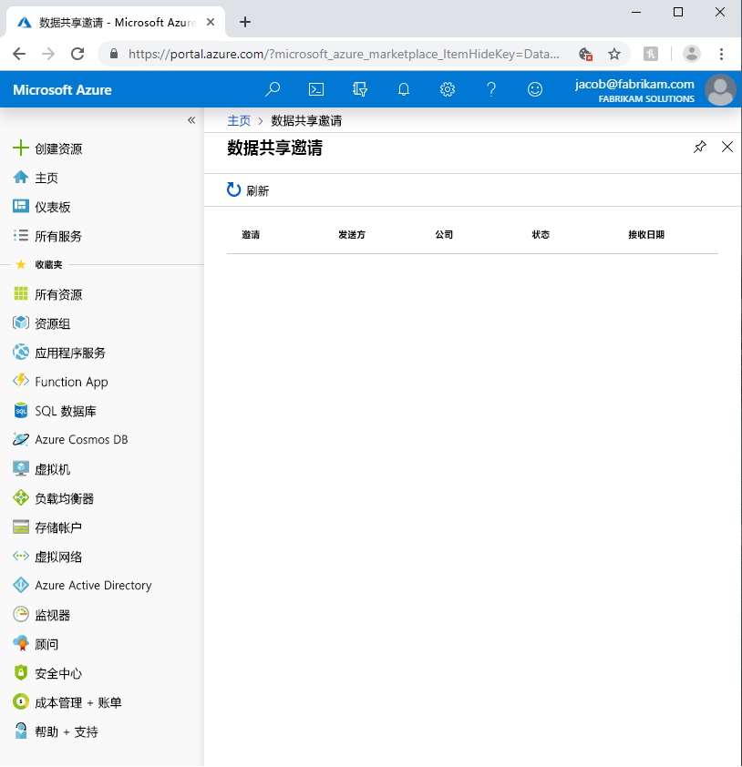

# <a name="troubleshoot-common-issues-in-azure-data-share"></a>解决 Azure 数据共享中的常见问题 

本文演示如何解决 Azure 数据共享的常见问题。 

## <a name="azure-data-share-invitations"></a>Azure Data Share 邀请 

在某些情况下，当新用户单击他人发送的电子邮件邀请中的“接受邀请”时，**** 会出现一个空的邀请列表。 



这可能是由于以下原因：

* **Azure 数据共享服务未注册为 Azure 租户中的任何 Azure 订阅的资源提供程序。** 如果 Azure 租户中没有数据共享资源，则会遇到此问题。 创建 Azure 数据共享资源时，它会自动在 Azure 订阅中注册资源提供程序。 您还可以按照以下步骤手动注册数据共享服务。 您需要具有 Azure 参与者角色才能完成这些步骤。

    1. 在 Azure 门户中，导航到“订阅”****
    1. 选择要用于创建 Azure 数据共享资源的订阅
    1. 单击“资源提供程序”****
    1. 搜索**微软.数据共享**
    1. 单击 **"注册"** 

    需要拥有 [Azure 参与者 RBAC 角色](https://docs.microsoft.com/azure/role-based-access-control/built-in-roles#contributor)才能完成这些步骤。 

* **邀请将发送到您的电子邮件别名，而不是 Azure 登录电子邮件。** 如果您已注册 Azure 数据共享服务或在 Azure 租户中创建了数据共享资源，但仍看不到邀请，则可能是因为提供程序已输入您的电子邮件别名作为收件人，而不是您的 Azure 登录电子邮件地址。 请与数据提供商联系，确保他们已将邀请发送到 Azure 登录电子邮件地址，而不是您的电子邮件别名。

* **邀请已被接受。** 电子邮件中的链接将带您到 Azure 门户中的"数据共享邀请"页，该页面仅列出挂起的邀请。 如果您已经接受了邀请，该邀请将不再显示在"数据共享邀请"页中。 转到数据共享资源，用于接受邀请以查看已接收的共享并配置目标 Azure 数据资源管理器群集设置。

## <a name="error-when-creating-or-receiving-a-new-share"></a>创建或接收新共享时出错

"无法添加数据集"

"无法映射数据集"

"无法授予数据共享资源 x 对 y 的访问"

"您没有适当的 x 权限"

"无法将 Azure 数据共享帐户的写入权限添加到一个或多个所选资源中"

如果在创建新共享或映射数据集时收到上述任何错误，则可能是由于对 Azure 数据存储的权限不足。 有关所需权限[，请参阅角色和要求](concepts-roles-permissions.md)。 

您需要编写权限才能共享或接收来自 Azure 数据存储的数据，而 Azure 数据存储通常存在于"参与者"角色中。 

如果这是您第一次从 Azure 数据存储共享或接收数据，则还需要*Microsoft.授权/角色分配/写入*权限，这通常存在于所有者角色中。 即使您创建了 Azure 数据存储资源，也不会自动使您成为资源的所有者。 获得适当的权限后，Azure 数据共享服务会自动授予数据共享资源对数据存储的托管标识访问权限。 此过程可能需要几分钟才能生效。 如果由于此延迟而出现故障，请在几分钟内重试。

基于 SQL 的共享需要其他权限。 有关详细信息，请参阅故障排除基于 SQL 的共享。

## <a name="troubleshooting-sql-based-sharing"></a>对基于 SQL 的共享进行故障排除

SQL 数据库中不存在用户 x

如果从基于 SQL 的源添加数据集时收到此错误，可能是因为您没有在 SQL 服务器上为 Azure 数据共享托管标识创建用户。  要解决此问题，运行以下脚本：

```sql
    create user "<share_acct_name>" from external provider; 
    exec sp_addrolemember db_datareader, "<share_acct_name>";
```      
如果在将数据集映射到基于 SQL 的目标时收到此错误，可能是因为您没有在 SQL 服务器上为 Azure 数据共享托管标识创建用户。  要解决此问题，运行以下脚本：

```sql
    create user "<share_acc_name>" from external provider; 
    exec sp_addrolemember db_datareader, "<share_acc_name>"; 
    exec sp_addrolemember db_datawriter, "<share_acc_name>"; 
    exec sp_addrolemember db_ddladmin, "<share_acc_name>";
```
请注意，*<share_acc_name>* 是 Data Share 资源的名称。      

确保您已遵循["共享数据](share-your-data.md)"中列出的所有先决条件，并接受[和接收数据](subscribe-to-data-share.md)教程。

## <a name="snapshot-failed"></a>快照失败
由于各种原因，快照可能会失败。 通过单击快照的开始时间以及每个数据集的状态，可以找到详细的错误消息。 

如果错误消息与权限相关，请验证数据共享服务具有所需的权限。 有关详细信息，请参阅[角色和要求](concepts-roles-permissions.md)。 如果这是第一次拍摄快照，则数据共享资源可能需要几分钟才能被授予对 Azure 数据存储的访问权限。 请等待几分钟，然后重试。

## <a name="next-steps"></a>后续步骤

若要了解如何开始共享数据，请继续阅读[共享数据](share-your-data.md)教程。 

要了解如何接收数据，请继续[接受和接收数据](subscribe-to-data-share.md)教程。

