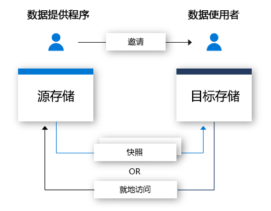

# 什么是 Azure Data Share 预览版？

当今这个世界，数据被视为重要的战略资产，许多组织需要通过简单且安全的方式将其与客户和合作伙伴共享。 目前，客户可以通过许多方式实现此目标，例如使用 FTP、电子邮件、API 等。 组织可能容易失去与其共享数据的人员的记录。 通常情况下，如果通过 FTP 或通过建立组织自己的 API 基础结构来共享数据，则预配和管理费用会很昂贵。 使用这些方法进行大规模共享时，会有相关的管理开销。 

许多组织需要对其共享的数据负责。 除了对数据负责，许多组织还希望能够以简单方式控制、管理和监视所有数据共享。 在当今世界，预期数据会继续以指数速度增长，组织需要以简单方式共享大数据。 客户需要最新的数据以确保他们能够获得及时的见解。

组织可以使用 Azure Data Share 预览版以简单且安全的方式与多个客户和合作伙伴共享数据。 只需点击几次，即可预配新的数据共享帐户、添加数据集，以及邀请客户和合作伙伴加入数据共享。 数据提供者始终可以控制其共享的数据。 可以通过 Azure Data Share 轻松管理和监视共享了哪些数据、何时进行的共享，以及由谁共享。 

数据提供者可以指定其数据共享的使用条款，这样就可以始终控制其数据的处理方式。 数据使用者必须接受这些条款才能接收数据。 数据提供者可以指定其数据使用者接收更新的频率。 数据提供者可以随时撤销对新更新的访问权限。 

可以使用 Azure Data Share 轻松地组合使用第三方提供的数据来丰富分析和 AI 方案，使见解更有说服力。 可以轻松地利用 Azure 分析工具来准备、处理和分析通过 Azure Data Share 共享的数据。 

数据提供者和数据使用者都必须拥有 Azure 订阅才能共享和接收数据。 如果还没有 Azure 订阅，可以创建一个[免费帐户](https://azure.microsoft.com/free/)。

## 适用于 Azure Data Share 的场景

Azure Data Share 可以用在许多不同的行业中。 例如，零售商可能需要与其供应商共享最近的销售点数据。 使用 Azure Data Share，零售商可以为所有供应商设置一个包含销售点数据的数据共享，按小时或按天共享销售情况。 

也可使用 Azure Data Share 为特定的行业建立数据市场。 例如，政府或研究机构可以定期与第三方共享有关人口增长的匿名数据。 

Azure Data Share 的另一个用例是建立数据联盟。 例如，许多不同的研究机构可以与单个受信任的团体共享数据。 可以使用 Azure 分析工具分析、聚合或处理数据，然后将其与相关方共享。 

## 工作原理

Azure Data Share 使用基于快照的共享方法，将数据从数据提供者的 Azure 订阅移到数据使用者的 Azure 订阅。 你作为数据提供者预配一个数据共享，然后邀请接收者加入数据共享。 数据使用者通过电子邮件接收数据共享邀请。 数据使用者接受邀请以后，即可触发已共享的数据共享的完整快照。 该数据将接收到数据使用者的存储帐户中。 数据使用者可以接收已共享数据的定期增量更新，因此可以始终拥有最新版的数据。 

数据提供者可以通过快照计划向其数据使用者提供对与其共享的数据的增量更新。 快照计划按小时或天提供。 数据使用者可以在接受和配置数据共享时订阅快照计划。 在共享数据会定期进行更新，而数据使用者需要最新数据的情况下，这很有用。 

数据使用者在接受数据共享以后，即可在所选存储帐户中接收数据。 例如，如果数据提供者使用 Azure Blob 存储共享数据，数据使用者可以在 Azure Data Lake Store 中接收该数据。 

## 关键功能

数据提供者可以使用 Azure Data Share 执行以下操作：

* 将 Azure 存储和 Azure Data Lake Store 中的数据与组织外部的客户和合作伙伴共享

* 记录与谁共享了数据

* 调整数据使用者接收数据更新的频率

* 允许使用者根据需要拉取最新版数据，或者允许他们按你定义的时间间隔自动接收对数据的增量更新

数据使用者可以使用 Azure Data Share 执行以下操作： 

* 查看共享数据类型的说明

* 查看数据的使用条款

* 接受或拒绝 Azure Data Share 邀请

* 触发组织与你共享的数据共享的完整或增量快照

* 订阅数据共享，以便通过增量快照副本接收数据的最新副本

* 在 Azure Blob 存储或 Azure Data Lake Gen2 帐户中接受共享的数据

可以通过 Azure 或 REST API 使用上面列出的所有关键功能。 若要更详细地了解如何通过 REST API 使用 Azure Data Share，请查看我们的参考文档。 

## 安全

Azure Data Share 利用 Azure 提供的基础安全措施来保护静态数据和传输中的数据。 将会对静态数据加密，通过基础存储机制提供支持。 也会对传输中的数据加密。 此外还会对静态的和传输中的数据共享元数据加密。 

可以在 Azure Data Share 资源级别设置访问控制，确保它由那些获得授权的用户访问。 

Azure Data Share 利用 Azure 资源的托管标识（以前称为 MSI）在 Azure Active Directory 中进行自动标识管理。 利用 Azure 资源的托管标识，可以访问用于数据共享的存储帐户。 在数据提供者和数据使用者之间没有凭据交换。 有关详细信息，请参阅 [Azure 资源的托管标识页](https://docs.microsoft.com/azure/active-directory/managed-identities-azure-resources/services-support-managed-identities)。 

## 支持的区域

如需提供 Azure Data Share 的 Azure区域的列表，请参阅[可用产品（按区域）](https://azure.microsoft.com/global-infrastructure/services/)页并搜索 Azure Data Share。 

Azure Data Share 本身不存储任何数据。 数据存储在共享的基础存储帐户中。 例如，如果数据生成者将其数据存储在美国西部的 Azure Data Lake Store 帐户中，则该帐户就是存储数据的位置。 如果数据生成者将数据与欧洲西部的 Azure 存储帐户共享，则数据会直接传输到欧洲西部的 Azure 存储帐户。 

Azure Data Share 服务不需在你的区域可用即可利用此服务。 例如，如果将数据存储在某个 Azure 存储帐户中，而该帐户所在的区域尚不提供 Azure Data Share，则仍然可以利用该服务来共享数据。 

## 后续步骤

若要了解如何开始共享数据，请继续阅读[共享数据](share-your-data.md)教程。
