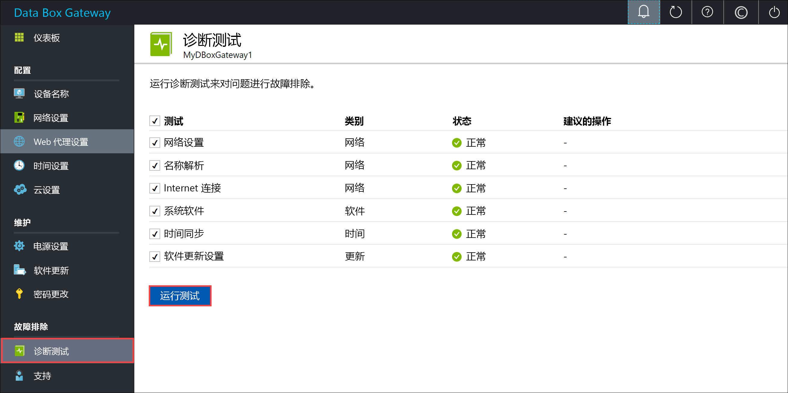
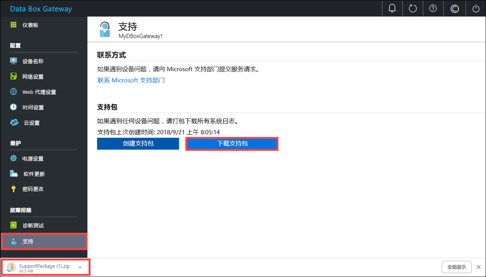
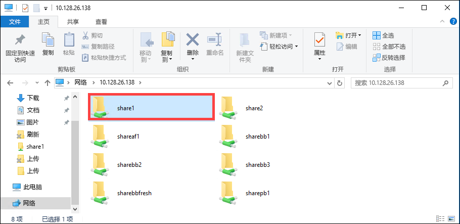

# <a name="troubleshoot-your-azure-data-box-gateway-issues"></a>排查 Azure Data Box Gateway 问题 

本文介绍如何排查 Azure Data Box Gateway 上的问题。 在本文中，学习如何：

> [!div class="checklist"]
> * 运行诊断
> * 收集支持包
> * 使用日志进行故障排除


## <a name="run-diagnostics"></a>运行诊断

若要诊断和排查任何设备错误，可以运行诊断测试。 在设备的本地 Web UI 中执行以下步骤，以运行诊断测试。

1. 在本地 Web UI 中，转到“故障排除”>“诊断测试”。 选择要运行的测试，然后单击“运行测试”。 这会运行测试来诊断网络、设备、Web 代理、时间或云设置可能存在的任何问题。 你将收到设备正在运行测试的通知。

    
 
2. 测试完成后，会显示结果。 如果未通过某项测试，会显示建议的措施的 URL。 可以单击该 URL 查看建议的措施。 
 
    


## <a name="collect-support-package"></a>收集支持包

日志包由所有可帮助 Microsoft 支持部门排查任何设备问题的相关日志组成。 可以通过本地 Web UI 生成日志包。

执行以下步骤收集支持包。 

1. 在本地 Web UI 中，转到“故障排除”>“支持”。 单击“创建支持包”。 系统随即开始收集支持包。 收集包可能需要几分钟时间。

    
 
2. 创建支持包后，单击“下载支持包”。 压缩包将下载到所选的路径。 可以将包解压缩。

    

## <a name="use-logs-to-troubleshoot"></a>使用日志进行故障排除

相关错误文件中包含上传和刷新过程中遇到的任何错误。

1. 若要查看错误文件，请转到共享，然后单击该共享以查看内容。 

      

2. 单击 Microsoft Data Box Gateway 文件夹。 此文件夹包含两个子文件夹：

   - Upload 文件夹：包含上传错误的日志文件。
   - Refresh 文件夹：包含刷新期间发生的错误。

     下面是 refresh 文件夹中的日志文件示例。

     ```
     <root container="brownbag1" machine="VM15BS020663" timestamp="07/18/2018 00:11:10" />
     <file item="test.txt" local="False" remote="True" error="16001" />
     <summary runtime="00:00:00.0945320" errors="1" creates="2" deletes="0" insync="3" replaces="0" pending="9" />
     ``` 

3. 如果此文件中包含错误（在示例中已突出显示），请记下错误代码（在本例中为 16001）。 根据以下错误参考查找此错误代码的说明。

    |     错误代码     |     异常名称                                         |     错误说明                                                                                                                                                                                                                     |
    |--------------------|------------------------------------------------------------|-------------------------------------------------------------------------------------------------------------------------------------------------------------------------------------------------------------------------------------------|
    |    100             |    ERROR_CONTAINER_OR_SHARE_NAME_LENGTH                    |    容器或共享名称必须包含 3 到 63 个字符。                                                                                                                                                                     |
    |    101             |    ERROR_CONTAINER_OR_SHARE_NAME_ALPHA_NUMERIC_DASH        |    容器或共享名称只能包含字母、数字或连字符。                                                                                                                                                       |
    |    102             |    ERROR_CONTAINER_OR_SHARE_NAME_IMPROPER_DASH             |    容器或共享名称只能包含字母、数字或连字符。                                                                                                                                                       |
    |    103             |    ERROR_BLOB_OR_FILE_NAME_CHARACTER_CONTROL               |    Blob 或文件名包含不受支持的控制字符。                                                                                                                                                                       |
    |    104             |    ERROR_BLOB_OR_FILE_NAME_CHARACTER_ILLEGAL               |    Blob 或文件名包含非法字符。                                                                                                                                                                                   |
    |    105             |    ERROR_BLOB_OR_FILE_NAME_SEGMENT_COUNT                   |    Blob 或文件名包含过多的段（每个段由斜杠 / 分隔）。                                                                                                                                              |
    |    106             |    ERROR_BLOB_OR_FILE_NAME_AGGREGATE_LENGTH                |    Blob 或文件名太长。                                                                                                                                                                                                     |
    |    107             |    ERROR_BLOB_OR_FILE_NAME_COMPONENT_LENGTH                |    Blob 或文件名中的某个段太长。                                                                                                                                                                            |
    |    108             |    ERROR_BLOB_OR_FILE_SIZE_LIMIT                           |    文件大小超过了最大上传文件大小。                                                                                                                                                                              |
    |    109             |    ERROR_BLOB_OR_FILE_SIZE_ALIGNMENT                       |    Blob 或文件未正确对齐。                                                                                                                                                                                               |
    |    110             |    ERROR_NAME_NOT_VALID_UNICODE                            |    Unicode 编码文件名或 Blob 无效。                                                                                                                                                                                  |
    |    111             |    ERROR_RESERVED_NAME_NOT_ALLOWED                         |    文件或 Blob 的名称或前缀是不受支持的保留名称（例如 COM1）。                                                                                                                             |
    |    2000            |    ERROR_ETAG_MISMATCH                                     |    etag 不匹配表示云中和设备上的块 Blob 之间存在冲突。 若要解决此冲突，请删除这些文件中的一个 - 云中的版本，或设备上的版本。    |
    |    2001            |    ERROR_UNEXPECTED_FINALIZE_FAILURE                       |    上传文件后处理文件时出现意外问题。    如果看到此错误并且此错误持续 24 小时以上，请联系支持人员。                                                      |
    |    2002            |    ERROR_ALREADY_OPEN                                      |    文件已在另一个进程中打开，在关闭句柄之前无法上传。                                                                                                                                       |
    |    2003            |    ERROR_UNABLE_TO_OPEN                                    |    无法打开要上传的文件。 如果看到此错误，请联系 Microsoft 支持人员。                                                                                                                                                |
    |    2004            |    ERROR_UNABLE_TO_CONNECT                                 |    无法连接要将数据上传到的容器。                                                                                                                                                                             |
    |    2005            |    ERROR_INVALID_CLOUD_CREDENTIALS                         |    由于帐户权限错误或已过期，无法连接到容器。 请检查访问权限。                                                                                                               |
    |    2006            |    ERROR_CLOUD_ACCOUNT_DISABLED                            |    帐户或共享已禁用，无法将数据上传到该帐户。                                                                                                                                                            |
    |    2007            |    ERROR_CLOUD_ACCOUNT_PERMISSIONS                         |    由于帐户权限错误或已过期，无法连接到容器。 请检查访问权限。                                                                                                               |
    |    2008            |    ERROR_CLOUD_CONTAINER_SIZE_LIMIT_REACHED                |    容器已满，无法添加新数据。 在 Azure 规范中根据类型检查受支持的容器大小。 例如，Azure 文件仅支持最大文件大小 5 TB。                                     |
    |    2009            |    ERROR_CLOUD_CONTAINER_MISSING                |     无法上传数据，因为与共享关联的容器不存在。                                     |    
    |    2997            |    ERROR_ITEM_CANCELED                                     |    发生了意外错误。 这是一种可以自行解决的暂时性错误。                                                                           |
    |    2998            |    ERROR_UNMAPPED_FAILURE                                  |    发生了意外错误。 该错误可能会自行解决，如果持续 24 小时以上，请联系 Microsoft 支持人员。                                                                                                     |
    |    16000           |    RefreshException                                        |    无法关闭此文件。                                                                                                                                                                                                        |
    |    16001           |    RefreshAlreadyExistsException                           |    无法关闭此文件，因为它已在本地系统上存在。                                                                                                                                                         |
    |    16002           |    RefreshWorkNeededException                              |    无法刷新此文件，因为它未完全上传。                                                                                                                                                                          | 


## <a name="next-steps"></a>后续步骤

- 详细了解[此版本中的已知问题](data-box-gateway-release-notes.md)。
