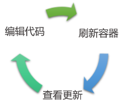
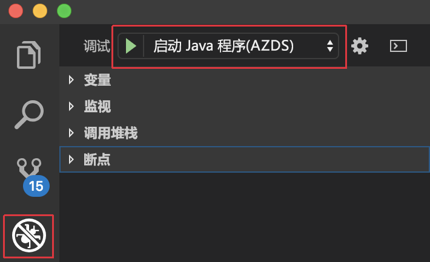

# <a name="get-started-on-azure-dev-spaces-with-java"></a>通过 Java 开始使用 Azure Dev Spaces

本指南介绍如何：

- 在 Azure 中创建针对开发进行了优化的基于 Kubernetes 的环境 - _开发空间_。
- 在容器中使用 VS Code 和命令行以迭代方式开发代码。
- 在团队环境中高效地开发和测试代码。

> [!Note]
> **如果在任何时候遇到问题**，请参阅[故障排除](troubleshooting.md)部分。

## <a name="install-the-azure-cli"></a>安装 Azure CLI
Azure Dev Spaces 需要进行最基本的本地计算机设置。 开发空间的大部分配置存储在云中，可以与其他用户共享。 首先，请下载并运行 [Azure CLI](/cli/azure/install-azure-cli?view=azure-cli-latest)。

### <a name="sign-in-to-azure-cli"></a>登录 Azure CLI
登录 Azure。 在终端窗口中键入以下命令：

```cmd
az login
```

> [!Note]
> 如果没有 Azure 订阅，可以创建一个[免费帐户](https://azure.microsoft.com/free)。

#### <a name="if-you-have-multiple-azure-subscriptions"></a>如果有多个 Azure 订阅...
通过运行以下命令可以查看订阅： 

```cmd
az account list
```
在 JSON 输出中找到具有 `isDefault: true` 的订阅。
如果这不是你想要使用的订阅，可以更改默认订阅：

```cmd
az account set --subscription <subscription ID>
```

## <a name="create-a-kubernetes-cluster-enabled-for-azure-dev-spaces"></a>创建为 Azure Dev Spaces 启用的 Kubernetes 群集

在命令提示符处，在[支持 Azure Dev Spaces 的区域](https://docs.microsoft.com/azure/dev-spaces/#a-rapid,-iterative-kubernetes-development-experience-for-teams)中创建资源组。

```cmd
az group create --name MyResourceGroup --location <region>
```

使用以下命令创建 Kubernetes 群集：

```cmd
az aks create -g MyResourceGroup -n MyAKS --location <region> --generate-ssh-keys
```

创建群集需要几分钟时间。

### <a name="configure-your-aks-cluster-to-use-azure-dev-spaces"></a>配置 AKS 群集以使用 Azure Dev Spaces

使用包含 AKS 群集的资源组和 AKS 群集名称输入以下 Azure CLI 命令。 此命令将群集配置为支持 Azure Dev Spaces。

   ```cmd
   az aks use-dev-spaces -g MyResourceGroup -n MyAKS
   ```

> [!IMPORTANT]
> Azure Dev Spaces 配置过程会删除群集中的 `azds` 命名空间（如果存在）。

## <a name="get-kubernetes-debugging-for-vs-code"></a>获取 VS Code 的 Kubernetes 调试功能
丰富的功能（如 Kubernetes调试）可供使用 VS Code 的 .NET Core 和 Node.js 开发人员使用。

1. 如果尚未安装 [VS Code](https://code.visualstudio.com/Download)，请安装它。
1. 下载并安装 [VS Azure Dev Spaces 扩展](https://marketplace.visualstudio.com/items?itemName=azuredevspaces.azds)。 在扩展的“市场”页上单击“安装”一次，然后再在 VS Code 中单击一次。 

若要使用 Azure Dev Spaces 调试 Java 应用程序，请下载并安装适用于VS Code 的 [Azure Dev Spaces 扩展的 Java调试器](https://marketplace.visualstudio.com/items?itemName=vscjava.vscode-java-debugger-azds)。 在扩展的“市场”页上单击“安装”一次，然后再在 VS Code 中单击一次。

## <a name="create-a-web-app-running-in-a-container"></a>创建在容器中运行的 Web 应用

在此部分中，将创建一个 Java Web 应用并让其在 Kubernetes 的容器中运行。

### <a name="create-a-java-web-app"></a>创建 Java Web 应用
请从 GitHub 下载代码，方法是：导航到 https://github.com/Azure/dev-spaces，然后选择“Clone or Download”（克隆或下载），将 GitHub 存储库下载到本地环境。 本指南的代码位于 `samples/java/getting-started/webfrontend` 中。

## <a name="preparing-code-for-docker-and-kubernetes-development"></a>准备用于 Docker 和 Kubernetes 开发的代码
到目前为止，已有一个可以在本地运行的基本 Web 应用。 现在，将通过创建定义应用的容器以及将应用部署到 Kubernetes 的方式的资产来将其容器化。 使用 Azure Dev Spaces，可以很容易完成此任务： 

1. 启动 VS Code 并打开 `webfrontend` 文件夹。 （可以忽略任何默认提示以添加调试资产或还原项目。）
1. 在 VS Code 中打开集成终端（使用“视图”>“集成终端”菜单）。
1. 运行此命令（确保 **webfrontend** 是当前文件夹）：

    ```cmd
    azds prep --public
    ```

Azure CLI 的 `azds prep` 命令使用默认设置生成 Docker 和 Kubernetes 资产：
* `./Dockerfile` 描述应用的容器映像，以及如何在容器内生成和运行源代码。
* `./charts/webfrontend` 下面的 [Helm 图表](https://docs.helm.sh)描述如何将容器部署到 Kubernetes。

暂无必要了解这些文件的全部内容。 但是，值得指出的是，**相同的 Kubernetes 和 Docker 配置即代码资产可以从开发一直用到生产，从而在不同的环境中提供更好的一致性。**
 
名为 `./azds.yaml` 的文件也由 `prep` 命令生成，并且它是 Azure Dev Spaces 的配置文件。 它通过额外配置对 Docker 和 Kubernetes 项目进行了补充，从而在 Azure 中实现了迭代开发体验。

## <a name="build-and-run-code-in-kubernetes"></a>在 Kubernetes 中生成并运行代码
让我们运行代码！ 在终端窗口中，从**根代码文件夹** webfrontend 运行以下命令：

```cmd
azds up
```

密切关注命令的输出，随着进展，你会注意到几件事情：
- 源代码已同步到 Azure 中的开发空间。
- 容器映像将在 Azure 中生成，由代码文件夹中的 Docker 资产指定。
- 将利用代码文件夹中 Helm 图表指定的容器映像创建 Kubernetes 对象。
- 将显示有关容器终结点的信息。 在我们的示例中，我们需要公共 HTTP URL。
- 假设上述阶段成功完成，你应该在容器启动时开始看到 `stdout`（和 `stderr`）输出。

> [!Note]
> 第一次运行 `up` 命令时，这些步骤需要较长时间，但后续运行应该会更快。

### <a name="test-the-web-app"></a>测试 Web 应用
扫描控制台输出以获取有关由 `up` 命令创建的公共 URL 的信息。 它的形式如下： 

```
(pending registration) Service 'webfrontend' port 'http' will be available at <url>
Service 'webfrontend' port 80 (TCP) is available at 'http://localhost:<port>'
```

在浏览器窗口中打开此 URL，你应看到 Web 应用加载。 在容器执行时，`stdout` 和 `stderr` 输出将流式传输到终端窗口。

> [!Note]
> 首次运行时，公共 DNS 可能要花费几分钟时间才能准备就绪。 如果公共 URL 无法解析，可以使用控制台输出中显示的替代 `http://localhost:<portnumber>` URL。 如果使用该 localhost URL，则容器看起来是在本地运行，但实际上是在 AKS 中运行。 为方便操作以及便于与本地计算机中的服务交互，Azure Dev Spaces 将与 Azure 中运行的容器建立临时的 SSH 隧道。 你可以返回，稍后在 DNS 记录准备就绪时再尝试公共 URL。
> ### <a name="update-a-content-file"></a>更新内容文件
> Azure Dev Spaces 不仅仅是用来让代码在 Kubernetes 中运行，它还可以用来快速地以迭代方式查看所做的代码更改在云的 Kubernetes 环境中的效果。

1. 在终端窗口中按 `Ctrl+C`（用于停止 `azds up`）。
1. 打开名为 `src/main/java/com/ms/sample/webfrontend/Application.java` 的代码文件并编辑问候消息：`return "Hello from webfrontend in Azure!";`
1. 保存文件。
1. 在终端窗口中运行 `azds up`。

此命令重新生成容器映像并重新部署 Helm 图表。 若要查看代码更改是否在正在运行的应用程序中生效，只需刷新浏览器即可。

不过，还有一种更快的开发代码的方法，该方法在下一部分介绍。 

## <a name="debug-a-container-in-kubernetes"></a>在 Kubernetes 中调试容器

在本部分中，将使用 VS Code 直接调试在 Azure 中运行的容器。 你还将学习如何实现更快的“编辑-运行-测试”循环。



> [!Note]
> **如果在任何时候遇到问题**，请参阅[故障排除](troubleshooting.md)部分，或在此页上发表评论。

### <a name="initialize-debug-assets-with-the-vs-code-extension"></a>使用 VS Code 扩展初始化调试资产
首先需要配置代码项目，以便 VS Code 与 Azure 中的开发空间进行通信。 Azure Dev Spaces 的 VS Code 扩展提供了一个帮助程序命令来设置调试配置。 

打开**命令面板**（使用“视图”|“命令面板”菜单），并使用“自动完成”来键入并选择此命令：`Azure Dev Spaces: Prepare configuration files for Azure Dev Spaces`。 

这将在 `.vscode` 文件夹下为 Azure Dev Spaces 添加调试配置。 此命令不应与 `azds prep` 命令混淆，后者配置部署的项目。


### <a name="select-the-azds-debug-configuration"></a>选择 AZDS 调试配置
1. 若要打开“调试”视图，请单击 VS Code 侧**活动栏**中的“调试”图标。
1. 选择“启动 Java 程序(AZDS)”作为活动的调试配置。



> [!Note]
> 如果在命令面板中看不到任何 Azure Dev Spaces 命令，请确保已安装 Azure Dev Spaces 的 VS Code 扩展。 确保在 VS Code 中打开的工作区是包含 azds.yaml 的文件夹。

### <a name="debug-the-container-in-kubernetes"></a>在 Kubernetes 中调试容器
按 **F5** 在 Kubernetes 中调试代码。

与 `up` 命令一样，代码会同步到开发空间，而容器则会在生成后部署到 Kubernetes。 这次调试程序自然会附加到远程容器。

> [!Tip]
> VS Code 状态栏会显示一个可点击的 URL。


在服务器端的代码文件中设置一个断点，例如，在 `src/main/java/com/ms/sample/webfrontend/Application.java` 源文件的 `greeting()` 函数中设置断点。 刷新浏览器页面即可命中断点。

可以不受限制地访问调试信息（例如调用堆栈、局部变量、异常信息等），就像在本地执行代码一样。

### <a name="edit-code-and-refresh"></a>编辑代码并刷新
在调试程序处于活动状态的情况下进行代码编辑， 例如，修改 `src/main/java/com/ms/sample/webfrontend/Application.java` 中的问候语。 

```java
public String greeting()
{
    return "I'm debugging Java code in Azure!";
}
```

保存文件，然后在“调试操作”窗格中单击“刷新”按钮。


Azure Dev Spaces 不会在每次进行代码编辑时都重新生成和重新部署新的容器映像（这通常需要很长时间），而是在现有的容器中以增量方式重新编译代码，加快编辑/调试循环速度。

在浏览器中刷新 Web 应用。 此时会看到自定义消息显示在 UI 中。

**现在，我们已掌握了一种快速迭代代码并直接在 Kubernetes 中进行调试的方法！** 接下来，我们了解如何创建和调用另一个容器。

## <a name="next-steps"></a>后续步骤

> [!div class="nextstepaction"]
> [了解多服务开发](multi-service-java.md)
