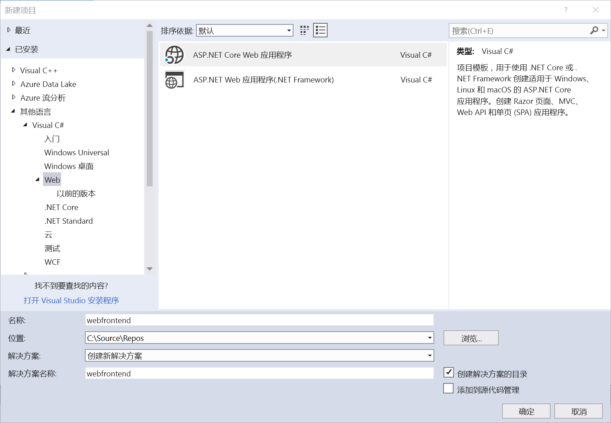
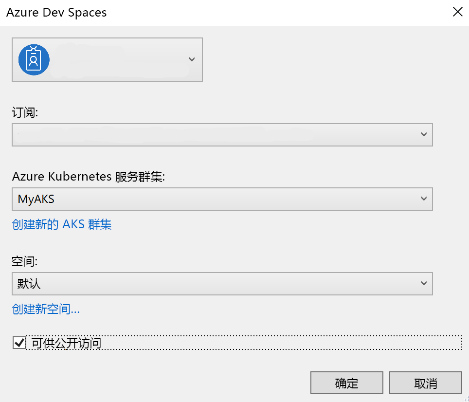

# <a name="create-a-kubernetes-dev-space-visual-studio-and-net-core-with-azure-dev-spaces"></a>创建 Kubernetes 开发空间：将 Visual Studio 和 .NET Core 与 Azure Dev Spaces 结合使用

[!INCLUDE [Azure Dev Spaces deprecation](../../includes/dev-spaces-deprecation.md)]

本指南介绍如何：

- 使用 Azure 中的托管 Kubernetes 群集设置 Azure Dev Spaces。
- 使用 Visual Studio 在容器中以迭代方式开发代码。
- 独立开发两个独立的服务，并使用 Kubernetes 的 DNS 服务发现来调用另一个服务。
- 在团队环境中高效地开发和测试代码。

> [!NOTE]
> **如果在任何时候遇到问题**，请参阅[故障排除](troubleshooting.md)部分。

## <a name="install-the-azure-cli"></a>安装 Azure CLI
Azure Dev Spaces 需要进行最基本的本地计算机设置。 开发空间的大部分配置存储在云中，可以与其他用户共享。 首先，请下载并运行 [Azure CLI](/cli/azure/install-azure-cli?view=azure-cli-latest)。

### <a name="sign-in-to-azure-cli"></a>登录 Azure CLI
登录 Azure。 在终端窗口中键入以下命令：

```azurecli
az login
```

> [!NOTE]
> 如果没有 Azure 订阅，可以创建一个[免费帐户](https://azure.microsoft.com/free)。

#### <a name="if-you-have-multiple-azure-subscriptions"></a>如果有多个 Azure 订阅...
通过运行以下命令可以查看订阅： 

```azurecli
az account list --output table
```

找到 *IsDefault* 为 *True* 的订阅。
如果这不是你想要使用的订阅，可以更改默认订阅：

```azurecli
az account set --subscription <subscription ID>
```

## <a name="create-a-kubernetes-cluster-enabled-for-azure-dev-spaces"></a>创建为 Azure Dev Spaces 启用的 Kubernetes 群集

在命令提示符处，在[支持 Azure Dev Spaces 的区域][supported-regions]中创建资源组。

```azurecli
az group create --name MyResourceGroup --location <region>
```

使用以下命令创建 Kubernetes 群集：

```azurecli
az aks create -g MyResourceGroup -n MyAKS --location <region> --generate-ssh-keys
```

创建群集需要几分钟时间。

### <a name="configure-your-aks-cluster-to-use-azure-dev-spaces"></a>配置 AKS 群集以使用 Azure Dev Spaces

使用包含 AKS 群集的资源组和 AKS 群集名称输入以下 Azure CLI 命令。 此命令将群集配置为支持 Azure Dev Spaces。

   ```azurecli
   az aks use-dev-spaces -g MyResourceGroup -n MyAKS
   ```
   
> [!IMPORTANT]
> Azure Dev Spaces 配置过程会删除群集中的 `azds` 命名空间（如果存在）。

## <a name="get-the-visual-studio-tools"></a>获取 Visual Studio 工具
在 Windows 上安装包含“Azure 开发”工作负载的最新版本的 [Visual Studio 2019](https://www.visualstudio.com/vs/)。

## <a name="create-a-web-app-running-in-a-container"></a>创建在容器中运行的 Web 应用

在此部分中，将创建一个 ASP.NET Core Web 应用并让其在 Kubernetes 的容器中运行。

### <a name="create-an-aspnet-web-app"></a>创建 ASP.NET Web 应用

在 Visual Studio 中创建新项目。 目前，该项目必须是 **ASP.NET Core Web 应用程序**。 将该项目命名为“webfrontend”。



选择“Web 应用程序(模型-视图-控制器)”模板，确保以对话框顶部两个下拉列表中的 **.NET Core** 和 **ASP.NET Core 2.0** 为目标。 单击“确定”以创建该项目  。


### <a name="enable-dev-spaces-for-an-aks-cluster"></a>为 AKS 群集启用 Dev Spaces

使用刚才创建的项目，从启动设置下拉列表中选择“Azure Dev Spaces”，如下所示。


在旁边显示的对话框中，确保已使用适当的帐户登录，然后选择一个现有的 Kubernetes 群集。



暂时让“空间”下拉列表默认为 `default`。 稍后会详细介绍此选项。 选中“可公开访问”复选框，允许通过公共终结点访问 Web 应用。 此设置不是必需的，但可以稍后用来在本演练中演示某些概念。 但请勿担心，不管什么情况，都可以使用 Visual Studio 来调试网站。


单击“确定”，选择或创建群集。

如果选择的群集不支持使用 Azure Dev Spaces，则会显示一条消息，询问是否需要对其进行配置。


选择“确定”。

> [!IMPORTANT]
> Azure Dev Spaces 配置过程会删除群集中的 `azds` 命名空间（如果存在）。

 将会启动一项后台任务来完成此操作。 将需要数分钟才能完成。 若要查看它是否仍在创建，请将鼠标指针悬停在状态栏左下角的“后台任务”图标上方，如下图所示。


> [!NOTE]
> 在成功创建开发空间之前，无法调试应用程序。

### <a name="look-at-the-files-added-to-project"></a>查看添加到项目的文件
在等待开发空间创建的过程中，可以在选择使用开发空间时查看已添加到项目的文件。

首先，可以看到添加了名为 `charts` 的文件夹，而在该文件夹中，已为应用程序的 [Helm 图表](https://docs.helm.sh)构建了基架。 这些文件用于将应用程序部署到开发空间中。

可以看到添加了名为 `Dockerfile` 的文件。 此文件提供的信息是以标准 Docker 格式将应用程序打包所必需的。

最后，你将看到一个名为 `azds.yaml` 的文件，其中包含开发空间所需的开发时配置。


## <a name="debug-a-container-in-kubernetes"></a>在 Kubernetes 中调试容器
成功创建开发空间之后，即可调试应用程序。 在代码中设置一个断点，例如在设置 `Message` 变量时所在的 `HomeController.cs` 文件的第 20 行处设置断点。 单击“F5”开始调试。 

Visual Studio 会与生成和部署应用程序所需的开发空间通信，然后打开有 Web 应用运行的浏览器。 容器看起来像是在本地运行，但实际上是在 Azure 的开发空间中运行。 使用 localhost 地址的原因是 Azure Dev Spaces 会创建一个通往在 AKS 中运行的容器的临时 SSH 隧道。

单击页面顶部的“关于”链接即可触发断点。 可以不受限制地访问调试信息（例如调用堆栈、局部变量、异常信息等），就像在本地执行代码一样。

## <a name="iteratively-develop-code"></a>以迭代方式开发代码

Azure Dev Spaces 不仅仅是用来让代码在 Kubernetes 中运行，它还可以用来快速地以迭代方式查看所做的代码更改在云的 Kubernetes 环境中的效果。

### <a name="update-a-content-file"></a>更新内容文件


1. 找到 `./Views/Home/Index.cshtml` 文件，对 HTML 进行编辑。 例如，将[读取 `<h2>Application uses</h2>` 的第 73 行](https://github.com/Azure/dev-spaces/blob/master/samples/dotnetcore/getting-started/webfrontend/Views/Home/Index.cshtml#L73)更改为如下内容： 
  
    ```html
    <h2>Hello k8s in Azure!</h2>`
    ```

2. 保存文件。
3. 转到浏览器并刷新页面。 此时会看到网页显示更新的 HTML。

发生了什么情况？ 对内容文件（例如 HTML 和 CSS）所做的编辑不需要在 .NET Core Web 应用中进行重新编译，因此，活动的 F5 会话会自动将任何修改的内容文件同步到 AKS 中正在运行的容器，方便你立即查看所做的内容编辑。

### <a name="update-a-code-file"></a>更新代码文件
更新代码文件需要的工作多一些，因为 .NET Core 应用需重新构建并生成更新的应用程序二进制文件。

1. 停止 Visual Studio 中的调试器。
1. 打开名为 `Controllers/HomeController.cs` 的代码文件，编辑“关于”页面将显示的消息：`ViewData["Message"] = "Your application description page.";`
1. 保存文件。
1. 按 **F5** 再次开始调试。 

Azure Dev Spaces 不会在每次进行代码编辑时都重新生成和重新部署新的容器映像（这通常需要很长时间），而是在现有的容器中以增量方式重新编译代码，加快编辑/调试循环速度。

刷新浏览器中的 Web 应用，然后转到“关于”页面。 此时会看到自定义消息显示在 UI 中。

## <a name="next-steps"></a>后续步骤

深入了解 Azure Dev Spaces 的工作方式。

> [!div class="nextstepaction"]
> [Azure Dev Spaces 工作原理](how-dev-spaces-works.md)


[supported-regions]: https://azure.microsoft.com/global-infrastructure/services/?products=kubernetes-service
