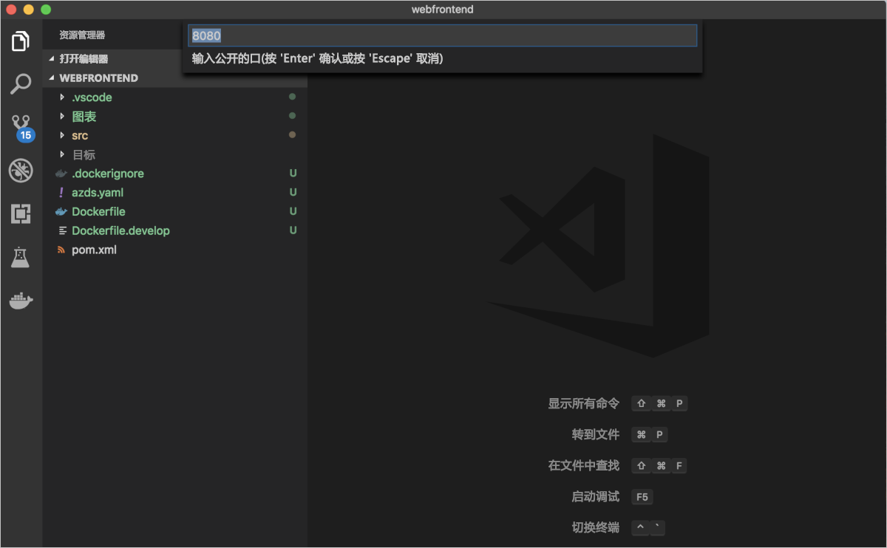

# <a name="quickstart-debug-and-iterate-on-kubernetes-with-visual-studio-code-and-java---azure-dev-spaces"></a>快速入门：在 Kubernetes 上使用 Visual Studio Code 和 Java 进行调试和循环访问 - Azure Dev Spaces

在本快速入门中，我们将使用托管 Kubernetes 群集设置 Azure Dev Spaces，并在 Visual Studio Code 中使用 Java 应用以迭代方式在容器中开发和调试代码。 还可以通过 Azure Dev Spaces 调试和测试 Azure Kubernetes Service (AKS) 中应用程序的所有组件，只需要稍微设置一下开发计算机即可。 

## <a name="prerequisites"></a>先决条件

- 具有活动订阅的 Azure 帐户。 [免费创建帐户](https://azure.microsoft.com/free/?ref=microsoft.com&utm_source=microsoft.com&utm_medium=docs&utm_campaign=visualstudio)。 
- [Java 开发工具包 (JDK) 1.8.0+](https://aka.ms/azure-jdks)。
- [Maven 3.5.0+](https://maven.apache.org/download.cgi)。
- [Visual Studio Code](https://code.visualstudio.com/download)。
- 适用于 Visual Studio Code 的 [Azure Dev Spaces](https://marketplace.visualstudio.com/items?itemName=azuredevspaces.azds) 和 [Azure Dev Spaces Java 调试器](https://marketplace.visualstudio.com/items?itemName=vscjava.vscode-java-debugger-azds)扩展。
- [Azure CLI](/cli/azure/install-azure-cli?view=azure-cli-latest)。
- [Git](https://www.git-scm.com/downloads)。

## <a name="create-an-azure-kubernetes-service-cluster"></a>创建 Azure Kubernetes 服务群集

需要在[支持的区域][supported-regions]中创建 AKS 群集。 以下命令创建名为 *MyResourceGroup* 的资源组，以及名为 *MyAKS* 的 AKS 群集。

```azurecli
az group create --name MyResourceGroup --location eastus
az aks create -g MyResourceGroup -n MyAKS --location eastus --generate-ssh-keys
```

## <a name="enable-azure-dev-spaces-on-your-aks-cluster"></a>在 AKS 群集上启用 Azure Dev Spaces

使用 `use-dev-spaces` 命令在 AKS 群集上启用 Dev Spaces，然后按提示操作。 以下命令在 *MyResourceGroup* 组中的 *MyAKS* 群集上启用 Dev Spaces，并创建一个默认开发空间。 

> [!NOTE]
> `use-dev-spaces` 命令还将安装 Azure Dev Spaces CLI（如果尚未安装）。 无法在 Azure Cloud Shell 中安装 Azure Dev Spaces CLI。

```azurecli
az aks use-dev-spaces -g MyResourceGroup -n MyAKS
```

```output
'An Azure Dev Spaces Controller' will be created that targets resource 'MyAKS' in resource group 'MyResourceGroup'. Continue? (y/N): y

Creating and selecting Azure Dev Spaces Controller 'MyAKS' in resource group 'MyResourceGroup' that targets resource 'MyAKS' in resource group 'MyResourceGroup'...2m 24s

Select a dev space or Kubernetes namespace to use as a dev space.
 [1] default
Type a number or a new name: 1

Kubernetes namespace 'default' will be configured as a dev space. This will enable Azure Dev Spaces instrumentation for new workloads in the namespace. Continue? (Y/n): Y

Configuring and selecting dev space 'default'...3s

Managed Kubernetes cluster 'MyAKS' in resource group 'MyResourceGroup' is ready for development in dev space 'default'. Type `azds prep` to prepare a source directory for use with Azure Dev Spaces and `azds up` to run.
```

## <a name="get-sample-application-code"></a>获取示例应用程序代码

本文使用 [Azure Dev Spaces 示例应用程序](https://github.com/Azure/dev-spaces)来演示 Azure Dev Spaces 的用法。

从 GitHub 克隆该应用程序。

```cmd
git clone https://github.com/Azure/dev-spaces
```

## <a name="prepare-the-sample-application-in-visual-studio-code"></a>在 Visual Studio Code 中准备示例应用程序

打开 Visual Studio Code，依次选择“文件”、“打开”，导航到 *dev-spaces/samples/java/getting-started/webfrontend* 目录，然后选择“打开”。   

现在，*webfrontend* 项目便在 Visual Studio Code 中打开。 若要在开发空间中运行应用程序，请在命令面板中使用 Azure Dev Spaces 扩展生成 Docker 和 Helm chart 资产。

若要在 Visual Studio Code 中打开命令面板，请依次选择“视图”、“命令面板”。   开始键入 `Azure Dev Spaces` 并选择“Azure Dev Spaces:  准备 Azure Dev Spaces 的配置文件”。


当 Visual Studio Code 还提示你配置基础映像、公开的端口和公共终结点时，请选择 `Azul Zulu OpenJDK for Azure (Free LTS)` 作为基础映像，选择 `8080` 作为公开的端口，并选择 `Yes` 以启用公共终结点。





此命令通过生成 Dockerfile 和 Helm 图表来使你的项目适合在 Azure Dev Spaces 中运行。 它还会在项目的根目录下生成包含调试配置的 *.vscode* 目录。

> [!TIP]
> Azure Dev Spaces 使用项目的 [Dockerfile 和 Helm 图表](how-dev-spaces-works-prep.md#prepare-your-code)来生成和运行代码，但是如果要更改项目的生成和运行方式，则可以修改这些文件。

## <a name="build-and-run-code-in-kubernetes-from-visual-studio-code"></a>通过 Visual Studio Code 在 Kubernetes 中生成并运行代码

选择左侧的“调试”图标，然后选择顶部的“启动 Java 程序(AZDS)”。  


此命令在 Azure Dev Spaces 中生成并运行你的服务。 底部的“终端”窗口会显示运行 Azure Dev Spaces 的服务的生成输出和 URL。  “调试控制台”会显示日志输出。 

> [!Note]
> 如果在“命令面板”中看不到任何 Azure Dev Spaces 命令，请确保已安装[适用于 Azure Dev Spaces 的 Visual Studio Code 扩展](https://marketplace.visualstudio.com/items?itemName=azuredevspaces.azds)。  另请确认是否在 Visual Studio Code 中打开了 *dev-spaces/samples/java/getting-started/webfrontend* 目录。

可以通过打开公共 URL 来查看服务是否正在运行。

依次选择“调试”、“停止调试”以停止调试程序。  

## <a name="update-code"></a>更新代码

若要部署服务的更新版本，可以更新项目中的任何文件，然后重新运行“启动 Java 程序(AZDS)”  。 例如：

1. 如果应用程序仍在运行，请依次选择“调试”  和“停止调试”  来停止该应用程序。
1. 将 [`src/main/java/com/ms/sample/webfrontend/Application.java`中的第 19 行](https://github.com/Azure/dev-spaces/blob/master/samples/java/getting-started/webfrontend/src/main/java/com/ms/sample/webfrontend/Application.java#L19)更新为：
    
    ```java
    return "Hello from webfrontend in Azure!";
    ```

1. 保存所做更改。
1. 重新运行“启动 Java 程序(AZDS)”  。
1. 导航到正在运行的服务并观察所做的更改。
1. 依次选择“调试”和“停止调试”以停止应用程序   。

## <a name="setting-and-using-breakpoints-for-debugging"></a>设置并使用用于调试的断点

使用“启动 Java 程序(AZDS)”启动服务  。 这在调试模式下也会运行服务。

依次选择“视图”、“资源管理器”，导航回到“资源管理器”视图。    打开 *src/main/java/com/ms/sample/webfrontend/Application.java* 并单击第 19 行的某处，将光标置于该处。 若要设置断点，请按 **F9**，或者依次选择“调试”、“切换断点”。  

在浏览器中打开服务，你会发现未显示任何消息。 返回 Visual Studio Code，将会看到，第 19 行已突出显示。 设置的断点在第 19 行处暂停了服务。 若要恢复服务，请按 **F5**，或者依次选择“调试”、“继续”。   返回浏览器，你会发现，现在显示了消息。

在附加调试器的情况下在 Kubernetes 中运行服务时，你对调试信息（例如调用堆栈、局部变量和异常信息）拥有完全访问权限。

通过将光标置于 *src/main/java/com/ms/sample/webfrontend/Application.java* 中的第 19 行并按 **F9** 来删除断点。

## <a name="update-code-from-visual-studio-code"></a>在 Visual Studio Code 中更新代码

当服务在调试模式下运行时，请更新 *src/main/java/com/ms/sample/webfrontend/Application.java* 中的第 19 行。 例如：
```java
return "Hello from webfrontend in Azure while debugging!";
```

保存文件。 依次选择“调试”、“重新开始调试”，或者在“调试”工具栏中选择“重新开始调试”按钮。    


在浏览器中打开服务，你会发现已显示更新的消息。

Azure Dev Spaces 不会在每次进行代码编辑时都重新生成和重新部署新的容器映像，而是在现有的容器中以增量方式重新编译代码，以加快编辑/调试循环的速度。

## <a name="clean-up-your-azure-resources"></a>清理 Azure 资源

```azurecli
az group delete --name MyResourceGroup --yes --no-wait
```

## <a name="next-steps"></a>后续步骤

了解 Azure Dev Spaces 如何帮助开发跨多个容器的更复杂应用程序，以及如何通过在不同的空间中使用不同的代码版本或分支来简化协作式开发。

> [!div class="nextstepaction"]
> [使用多个容器和团队开发](multi-service-java.md)


[supported-regions]: https://azure.microsoft.com/global-infrastructure/services/?products=kubernetes-service
