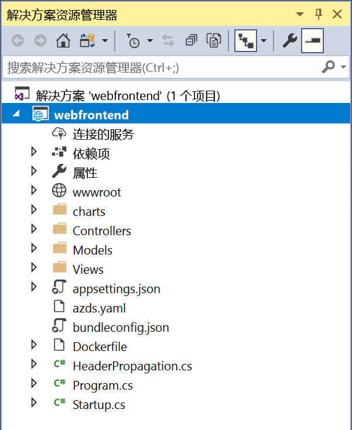

# 快速入门：使用 Azure Dev Spaces 创建 Kubernetes 开发环境（.NET Core 和 Visual Studio）

本指南介绍如何执行以下操作：

- 在 Azure 中创建针对开发进行了优化的基于 Kubernetes 的环境。
- 在容器中使用 Visual Studio 以迭代方式开发代码。

[!INCLUDE]

[!INCLUDE]

## 获取 Visual Studio 工具 
1. 安装最新版本的 [Visual Studio 2017](https://www.visualstudio.com/vs/)
1. 在 Visual Studio 安装程序中，确保选中以下工作负荷：
    * ASP.NET 和 Web 开发
1. 安装[适用于 Azure Dev Spaces 的 Visual Studio 扩展](https://aka.ms/get-azds-visualstudio)

现在可以使用 Visual Studio 创建 ASP.NET Web 应用了。

## 创建 ASP.NET Web 应用

在 Visual Studio 2017 中创建新项目。 目前，该项目必须是 **ASP.NET Core Web 应用程序**。 将该项目命名为“webfrontend”。

选择“Web 应用程序(模型-视图-控制器)”模板，确保以对话框顶部两个下拉列表中的 **.NET Core** 和 **ASP.NET Core 2.0** 为目标。 单击“确定”以创建该项目  。

## 在 Azure 中创建开发环境

使用 Azure Dev Spaces 时，可以创建基于 Kubernetes 的开发环境，这些环境由 Azure 完全托管，并且已针对开发进行优化。 在刚创建的项目处于打开状态的情况下，从启动设置下拉列表中选择“Azure Dev Spaces”，如下所示。

在旁边显示的对话框中，确保已使用适当的帐户登录，然后选择一个现有的群集。

暂时让“空间”下拉列表默认为 `default`。 稍后会详细介绍此选项。 选中“可公开访问”复选框，允许通过公共终结点访问 Web 应用。 此设置不是必需的，但可以稍后用来在本演练中演示某些概念。 但请勿担心，不管什么情况，都可以使用 Visual Studio 来调试网站。

单击“确定”，选择或创建群集。

如果选择的群集尚未配置为与 Azure Dev Spaces 一起使用，则会显示一条消息，询问你是否需要对其进行配置。

选择“确定”。 

将会启动一项后台任务来完成此操作。 将需要数分钟才能完成。 若要查看它是否仍在创建，请将鼠标指针悬停在状态栏左下角的“后台任务”图标上方，如下图所示。

> [!Note]
在成功创建开发环境之前，不能调试应用程序。

## 查看添加到项目的文件
在等待开发环境创建的过程中，可以在选择使用某个开发环境时查看已添加到项目的文件。

首先，可以看到添加了名为 `charts` 的文件夹，而在该文件夹中，已为应用程序的 [Helm 图表](https://docs.helm.sh)构建了基架。 这些文件用于将应用程序部署到开发环境中。

可以看到添加了名为 `Dockerfile` 的文件。 此文件提供的信息是以标准 Docker 格式将应用程序打包所必需的。 此外还会创建 `HeaderPropagation.cs` 文件，该文件稍后会在本演练中讨论。 

最后会看到一个名为 `azds.yaml` 的文件，其中包含开发环境所需的配置信息，例如是否允许通过公共终结点访问应用程序。

## 在 Kubernetes 中调试容器
成功创建开发环境之后，即可调试应用程序。 在代码中设置一个断点，例如在设置 `Message` 变量时所在的 `HomeController.cs` 文件的第 20 行处设置断点。 单击“F5”开始调试。 

Visual Studio 会与开发和部署应用程序所需的开发环境通信，然后打开有 Web 应用运行的浏览器。 容器看起来是在本地运行，但实际上是在 Azure 的开发环境中运行。 使用 localhost 地址的原因是 Azure Dev Spaces 会创建一个通往在 Azure 中运行的容器的临时 SSH 隧道。

单击页面顶部的“关于”链接即可触发断点。 可以不受限制地访问调试信息（例如调用堆栈、本地变量、异常信息等），就像在本地执行代码一样。

## 后续步骤

> [!div class="nextstepaction"]
> [使用多个容器和团队开发](get-started-netcore-visualstudio.md#call-another-container)