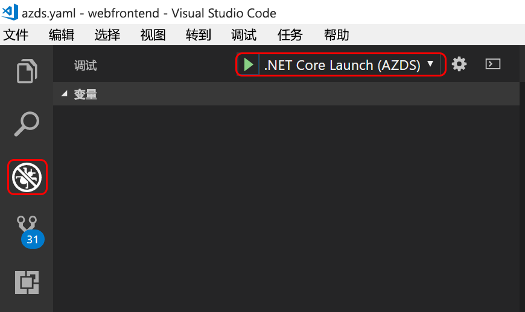

# <a name="quickstart-create-a-kubernetes-dev-space-with-azure-dev-spaces-net-core-and-vs-code"></a>快速入门：使用 Azure Dev Spaces 创建 Kubernetes dev 空间（.NET Core 和 VS Code）

本指南介绍如何：

- 使用 Azure 中的托管 Kubernetes 群集设置 Azure Dev Spaces。
- 在容器中使用 VS Code 和命令行以迭代方式开发代码。
- 通过 VS Code 调试开发空间中的代码

> [!Note]
> **如果在任何时候遇到问题**，请参阅[故障排除](troubleshooting.md)部分，或在此页上发表评论。 也可以试着学习更详细的[教程](get-started-netcore.md)。

## <a name="prerequisites"></a>先决条件

- Azure 订阅。 如果没有帐户，可以[创建一个免费帐户](https://azure.microsoft.com/free)。
- [Visual Studio Code](https://code.visualstudio.com/download)。
- [Azure CLI](/cli/azure/install-azure-cli?view=azure-cli-latest) 版本 2.0.43 或更高版本。
- 在 EastUS、EastUS2、CentralUS、WestUS2、WestEurope、SoutheastAsia、CanadaCentral 或 CanadaEast 区域中运行 Kubernetes 1.9.6 或更高版本且已启用“Http 应用程序路由”的 Kubernetes 群集。

    ```cmd
    az group create --name MyResourceGroup --location <region>
    az aks create -g MyResourceGroup -n MyAKS --location <region> --kubernetes-version 1.10.9 --enable-addons http_application_routing --generate-ssh-keys
    ```

## <a name="set-up-azure-dev-spaces"></a>设置 Azure Dev Spaces

Azure CLI 和 Azure Dev Spaces 扩展可以在 Windows、Mac 或 Linux 计算机上安装并运行。 对于 Linux，支持以下发行版：Ubuntu（18.04、16.04 和 14.04）、Debian 8 和 9、RHEL 7、Fedora 26+、CentOS 7、openSUSE 42.2 和 SLES 12。

请按以下步骤设置 Azure Dev Spaces：

1. 在 AKS 群集上设置 Dev Spaces：`az aks use-dev-spaces -g MyResourceGroup -n MyAKS`
1. 下载适用于 VS Code 的 [Azure Dev Spaces 扩展](https://marketplace.visualstudio.com/items?itemName=azuredevspaces.azds)。 在扩展的“市场”页上单击“安装”一次，然后再在 VS Code 中单击一次。

## <a name="build-and-run-code-in-kubernetes"></a>在 Kubernetes 中生成并运行代码

1. 从 GitHub 下载示例代码：[https://github.com/Azure/dev-spaces](https://github.com/Azure/dev-spaces) 
1. 将目录切换到 webfrontend 文件夹：`cd dev-spaces/samples/dotnetcore/getting-started/webfrontend`
1. 生成 Docker 和 Helm 图表资产：`azds prep --public`
1. 在 AKS 中生成并运行代码。 在终端窗口中，从 **webfrontend 文件夹**中运行以下命令：`azds up`
1. 扫描控制台输出以获取有关由 `up` 命令创建的 URL 的信息。 它的形式如下： 

   `(pending registration) Service 'webfrontend' port 'http' will be available at <url>\r\nService 'webfrontend' port 80 (TCP) is available at http://localhost:<port>` 

   在浏览器窗口中打开此 URL，你应看到 Web 应用加载。 
   
   > [!Note]
   > 首次运行时，公共 DNS 可能要花费几分钟时间才能准备就绪。 如果公共 URL 无法解析，可以使用控制台输出中显示的替代 http://localhost:<portnumber> URL。 如果使用该 localhost URL，则容器看起来是在本地运行，但实际上是在 AKS 中运行。 为方便操作以及便于与本地计算机中的服务交互，Azure Dev Spaces 将与 Azure 中运行的容器建立临时的 SSH 隧道。 你可以返回，稍后在 DNS 记录准备就绪时再尝试公共 URL。

### <a name="update-a-content-file"></a>更新内容文件

1. 定位到某个文件，例如 `./Views/Home/Index.cshtml`，对 HTML 进行编辑。 例如，将第 70 行的 `<h2>Application uses</h2>` 更改为类似 `<h2>Hello k8s in Azure!</h2>` 的内容
1. 保存文件。 稍后会在终端窗口中看到一条消息，指出正在运行的容器中的文件已更新。
1. 转到浏览器并刷新页面。 此时会看到网页显示更新的 HTML。

发生了什么情况？ 对内容文件（例如 HTML 和 CSS）所做的编辑不需要在 .NET Core Web 应用中进行重新编译，因此活动的 `azds up` 命令会自动将任何修改的内容文件同步到 Azure 中正在运行的容器，方便你立即查看所做的内容编辑。

### <a name="update-a-code-file"></a>更新代码文件
更新代码文件需要的工作多一些，因为 .NET Core 应用需重新构建并生成更新的应用程序二进制文件。

1. 在终端窗口中按 `Ctrl+C`（用于停止 `azds up`）。
1. 打开名为 `Controllers/HomeController.cs` 的代码文件，编辑“关于”页面将显示的消息：`ViewData["Message"] = "Your application description page.";`
1. 保存文件。
1. 在终端窗口中运行 `azds up`。 

此命令重新生成容器映像并重新部署 Helm 图表。 若要查看代码更改在运行的应用程序中的效果，请转到 Web 应用中的“关于”菜单。

不过，还有一种更快的开发代码的方法，该方法在下一部分介绍。 

## <a name="debug-a-container-in-kubernetes"></a>在 Kubernetes 中调试容器

在本部分中，将使用 VS Code 直接调试在 Azure 中运行的容器。 你还将学习如何实现更快的“编辑-运行-测试”循环。


### <a name="initialize-debug-assets-with-the-vs-code-extension"></a>使用 VS Code 扩展初始化调试资产
首先需要配置代码项目，以便 VS Code 与 Azure 中的开发空间进行通信。 Azure Dev Spaces 的 VS Code 扩展提供了一个帮助程序命令来设置调试配置。 

打开**命令面板**（使用“视图”|“命令面板”菜单），并使用“自动完成”来键入并选择此命令：`Azure Dev Spaces: Prepare configuration files for Azure Dev Spaces`。 

这将在 `.vscode` 文件夹下为 Azure Dev Spaces 添加调试配置。 此命令不应与 `azds prep` 命令混淆，后者配置部署的项目。


### <a name="select-the-azds-debug-configuration"></a>选择 AZDS 调试配置
1. 若要打开“调试”视图，请单击 VS Code 侧**活动栏**中的“调试”图标。
1. 选择“.NET Core 启动(AZDS)”作为活动的调试配置。



> [!Note]
> 如果在命令面板中看不到任何 Azure Dev Spaces 命令，请确保已安装 Azure Dev Spaces 的 VS Code 扩展。 确保在 VS Code 中打开的工作区是包含 azds.yaml 的文件夹。


### <a name="debug-the-container-in-kubernetes"></a>在 Kubernetes 中调试容器
按 **F5** 在 Kubernetes 中调试代码。

与 `up` 命令一样，代码会同步到开发空间，而容器则会在生成后部署到 Kubernetes。 这次调试程序自然会附加到远程容器。

> [!Tip]
> VS Code 状态栏会显示一个可点击的 URL。

在服务器端的代码文件中设置一个断点，例如，在 `Controllers/HomeController.cs` 源文件的 `Index()` 函数中设置断点。 刷新浏览器页面即可命中断点。

可以不受限制地访问调试信息（例如调用堆栈、局部变量、异常信息等），就像在本地执行代码一样。

### <a name="edit-code-and-refresh"></a>编辑代码并刷新
在调试程序处于活动状态的情况下进行代码编辑， 例如修改 `Controllers/HomeController.cs` 中“关于”页面的消息。 

```csharp
public IActionResult About()
{
    ViewData["Message"] = "My custom message in the About page.";
    return View();
}
```

保存文件，然后在“调试操作”窗格中单击“刷新”按钮。 


Azure Dev Spaces 不会在每次进行代码编辑时都重新生成和重新部署新的容器映像（这通常需要很长时间），而是在现有的容器中以增量方式重新编译代码，加快编辑/调试循环速度。

刷新浏览器中的 Web 应用，然后转到“关于”页面。 此时会看到自定义消息显示在 UI 中。

**现在，我们已掌握了一种快速迭代代码并直接在 Kubernetes 中进行调试的方法！**

## <a name="next-steps"></a>后续步骤

了解 Azure Dev Spaces 如何帮助开发跨多个容器的更复杂应用，以及如何通过在不同的空间中使用不同的代码版本或分支来简化协作开发。 

> [!div class="nextstepaction"]
> [使用多个容器和团队开发](team-development-netcore.md)
