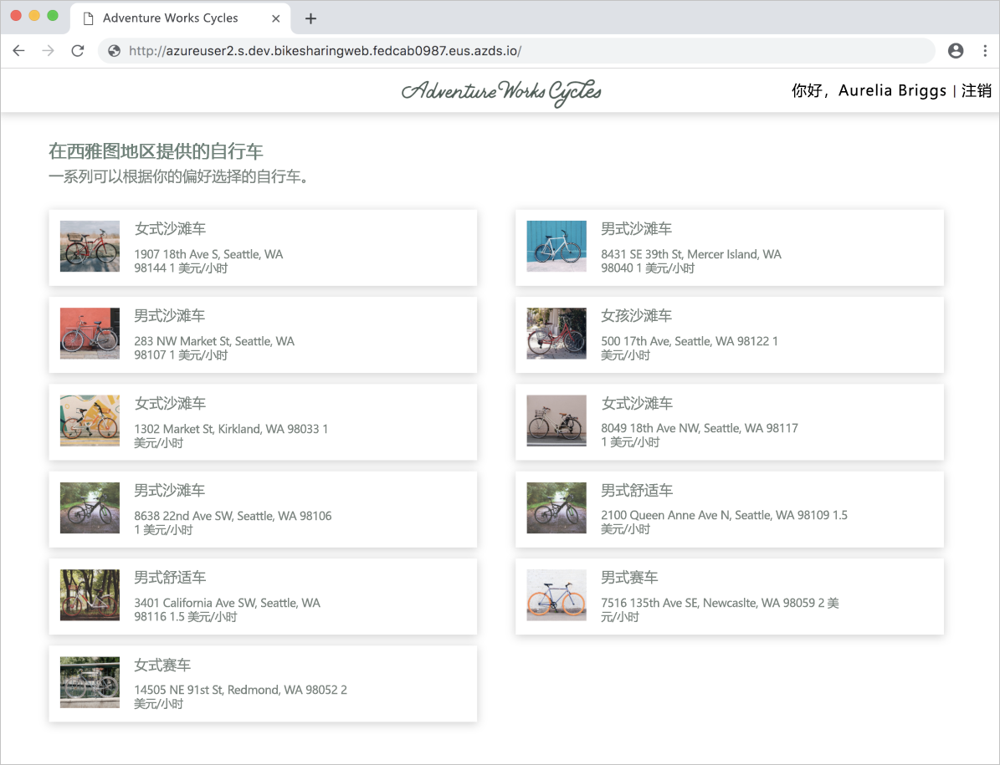

# <a name="quickstart-team-development-on-kubernetes---azure-dev-spaces"></a>快速入门：在 Kubernetes 上进行团队开发 - Azure Dev Spaces

本指南介绍如何：

- 在 Azure 中的托管 Kubernetes 群集上设置 Azure Dev Spaces。
- 将包含多个微服务的大型应用程序部署到开发空间。
- 在完整应用程序的上下文中的隔离开发空间内测试单个微服务。


## <a name="prerequisites"></a>先决条件

- Azure 订阅。 如果没有 Azure 订阅，可以创建一个[免费帐户](https://azure.microsoft.com/free)。
- [已安装 Azure CLI](/cli/azure/install-azure-cli?view=azure-cli-latest)。
- [Helm 2.13 - 2.16 已安装][helm-installed]。

## <a name="create-an-azure-kubernetes-service-cluster"></a>创建 Azure Kubernetes 服务群集

必须在[支持的区域][supported-regions]中创建 AKS 群集。 以下命令创建名为 *MyResourceGroup* 的资源组，以及名为 *MyAKS* 的 AKS 群集。

```cmd
az group create --name MyResourceGroup --location eastus
az aks create -g MyResourceGroup -n MyAKS --location eastus --disable-rbac --generate-ssh-keys
```

## <a name="enable-azure-dev-spaces-on-your-aks-cluster"></a>在 AKS 群集上启用 Azure Dev Spaces

使用 `use-dev-spaces` 命令在 AKS 群集上启用 Dev Spaces，然后按提示操作。 以下命令在 *MyResourceGroup* 组中的 *MyAKS* 群集上启用 Dev Spaces，并创建名为 *dev* 的开发空间。

> [!NOTE]
> `use-dev-spaces` 命令还将安装 Azure Dev Spaces CLI（如果尚未安装）。 无法在 Azure Cloud Shell 中安装 Azure Dev Spaces CLI。

```cmd
az aks use-dev-spaces -g MyResourceGroup -n MyAKS --space dev --yes
```

## <a name="get-sample-application-code"></a>获取示例应用程序代码

本文使用 [Azure Dev Spaces 单车共享示例应用程序](https://github.com/Azure/dev-spaces/tree/master/samples/BikeSharingApp)来演示 Azure Dev Spaces 的用法。

从 GitHub 克隆此应用程序，然后导航到其目录中：

```cmd
git clone https://github.com/Azure/dev-spaces
cd dev-spaces/samples/BikeSharingApp/
```

## <a name="retrieve-the-hostsuffix-for-dev"></a>检索 *dev* 的 HostSuffix

使用 `azds show-context` 显示 *dev* 的 HostSuffix。

```cmd
$ azds show-context

Name                ResourceGroup     DevSpace  HostSuffix
------------------  ----------------  --------  -----------------------
MyAKS               MyResourceGroup   dev       fedcab0987.eus.azds.io
```

## <a name="update-the-helm-chart-with-your-hostsuffix"></a>使用 HostSuffix 更新 Helm 图表

打开 [charts/values.yaml](https://github.com/Azure/dev-spaces/blob/master/samples/BikeSharingApp/charts/values.yaml)，并将 `<REPLACE_ME_WITH_HOST_SUFFIX>` 的所有实例替换为前面检索到的 HostSuffix 值。 保存更改并关闭该文件。

## <a name="run-the-sample-application-in-kubernetes"></a>在 Kubernetes 中运行示例应用程序

用于在 Kubernetes 上运行示例应用程序的命令是现有过程的一部分，不依赖于 Azure Dev Spaces 工具。 在本例中，Helm 是用于运行此示例应用程序的工具，但可以使用其他工具在群集内的命名空间中运行整个应用程序。 Helm 命令针对前面创建的名为 *dev* 的开发空间，但此开发空间也是 Kubernetes 命名空间。 因此，其他工具可以针对与其他命名空间相同的开发空间。

在群集中运行某个应用程序后，无论使用哪种工具部署该应用程序，都可以使用 Azure Dev Spaces 进行团队开发。

使用 `helm init` 和 `helm install` 命令在群集上设置和安装示例应用程序。

```cmd
cd charts/
helm init --wait
helm install -n bikesharing . --dep-up --namespace dev --atomic 
```
> [!Note]
> **如果你使用的是启用 RBAC 的群集**，请务必[为 Tiller 配置服务帐户](https://helm.sh/docs/using_helm/#role-based-access-control)。 否则 `helm` 命令将失败。

`helm install` 命令可能需要几分钟才能完成。 完成后，该命令的输出将显示由它部署到群集的所有服务的状态：

```cmd
$ cd charts/
$ helm init --wait
...
Happy Helming!

$ helm install -n bikesharing . --dep-up --namespace dev --atomic

Hang tight while we grab the latest from your chart repositories...
...
NAME               READY  UP-TO-DATE  AVAILABLE  AGE
bikes              1/1    1           1          4m32s
bikesharingweb     1/1    1           1          4m32s
billing            1/1    1           1          4m32s
gateway            1/1    1           1          4m32s
reservation        1/1    1           1          4m32s
reservationengine  1/1    1           1          4m32s
users              1/1    1           1          4m32s
```

在群集上安装示例应用程序后，由于已在群集上启用了 Dev Spaces，因此请使用 `azds list-uris` 命令来显示该示例应用程序在当前已选择的 *dev* 中的 URL。

```cmd
$ azds list-uris
Uri                                                 Status
--------------------------------------------------  ---------
http://dev.bikesharingweb.fedcab0987.eus.azds.io/  Available
http://dev.gateway.fedcab0987.eus.azds.io/         Available
```

通过 `azds list-uris` 命令打开公共 URL，导航到 *bikesharingweb* 服务。 在以上示例中，*bikesharingweb* 服务的公共 URL 为 `http://dev.bikesharingweb.fedcab0987.eus.azds.io/`。 选择“Aurelia Briggs (客户)”作为用户。  检查顶部是否显示了文本“Hi Aurelia Briggs | 注销”。 



## <a name="create-child-dev-spaces"></a>创建子开发空间

使用 `azds space select` 命令在 *dev* 下创建两个子空间：

```cmd
azds space select -n dev/azureuser1 -y
azds space select -n dev/azureuser2 -y
```

以上命令将在 *dev* 下创建名为 *azureuser1* 和 *azureuser2* 的两个子空间。 这些两个子空间表示开发人员 *azureuser1* 和 *azureuser2* 的不同开发空间，用于对示例应用程序进行更改。

使用 `azds space list` 命令列出所有开发空间，并确认 *dev/azureuser2* 是否已选中。

```cmd
$ azds space list
   Name            DevSpacesEnabled
-  --------------  ----------------
   default         False
   dev             True
   dev/azureuser1  True
*  dev/azureuser2  True
```

使用 `azds list-uris` 显示该示例应用程序在当前所选空间（即 *dev/azureuser2*）中的 URL。

```cmd
$ azds list-uris
Uri                                                             Status
--------------------------------------------------              ---------
http://azureuser2.s.dev.bikesharingweb.fedcab0987.eus.azds.io/  Available
http://azureuser2.s.dev.gateway.fedcab0987.eus.azds.io/         Available
```

确认 `azds list-uris` 命令显示的 URL 是否带有 *azureuser2.s.dev* 前缀。 此前缀确认当前选择的空间是 *azureuser2*，即 *dev* 的子级。

通过 `azds list-uris` 命令打开公共 URL，导航到 *dev/azureuser2* 开发空间的 *bikesharingweb* 服务。 在以上示例中，*bikesharingweb* 服务的公共 URL 为 `http://azureuser2.s.dev.bikesharingweb.fedcab0987.eus.azds.io/`。 选择“Aurelia Briggs (客户)”作为用户。  检查顶部是否显示了文本“Hi Aurelia Briggs | 注销”。 

## <a name="update-code"></a>更新代码

使用文本编辑器打开 *BikeSharingWeb/components/Header.js*，更改[包含 `userSignOut` className 的 span 元素](https://github.com/Azure/dev-spaces/blob/master/samples/BikeSharingApp/BikeSharingWeb/components/Header.js#L16)中的文本。

```html
<span className="userSignOut">
    <Link href="/devsignin"><span tabIndex="0">Welcome {props.userName} | Sign out</span></Link>
</span>
```

保存更改并关闭该文件。

## <a name="build-and-run-the-updated-bikesharingweb-service-in-the-devazureuser2-dev-space"></a>在 *dev/azureuser2* 开发空间中生成并运行已更新的 bikesharingweb 服务

导航到 *BikeSharingWeb/* 目录并运行 `azds up` 命令。

```cmd
$ cd ../BikeSharingWeb/
$ azds up

Using dev space 'dev/azureuser2' with target 'MyAKS'
Synchronizing files...2s
...
Service 'bikesharingweb' port 'http' is available at http://azureuser2.s.dev.bikesharingweb.fedcab0987.eus.azds.io/
Service 'bikesharingweb' port 80 (http) is available at http://localhost:54256
...
```

此命令在 *dev/azureuser2* 开发空间中生成并运行 *bikesharingweb* 服务。 此服务将与 *dev* 中运行的 *bikesharingweb* 服务一同运行，仅用于包含 *azureuser2.s* URL 前缀的请求。 有关父子开发空间之间的路由工作原理的详细信息，请参阅 [Azure Dev Spaces 的工作原理及其配置方式](how-dev-spaces-works.md)。

通过打开 `azds up` 命令输出中显示的公共 URL，导航到 *dev/azureuser2* 开发空间的 *bikesharingweb* 服务。 选择“Aurelia Briggs (客户)”作为用户。  检查右上角是否显示了更新的文本。 如果此项更改未立即出现，你可能需要刷新页面或清除浏览器缓存。


> [!NOTE]
> 在运行 `azds up` 时导航到服务时，HTTP 请求跟踪也会显示在 `azds up` 命令的输出中。 这些跟踪有助于对服务进行故障排除和调试。 可以在运行 `azds up` 时使用 `--disable-http-traces` 来禁用这些跟踪。

## <a name="verify-other-dev-spaces-are-unchanged"></a>检查其他开发空间是否未更改

如果 `azds up` 命令仍在运行，请按 *Ctrl+C*。

```cmd
$ azds list-uris --all
Uri                                                             Status
--------------------------------------------------              ---------
http://azureuser1.s.dev.bikesharingweb.fedcab0987.eus.azds.io/  Available
http://azureuser1.s.dev.gateway.fedcab0987.eus.azds.io/         Available
http://azureuser2.s.dev.bikesharingweb.fedcab0987.eus.azds.io/  Available
http://azureuser2.s.dev.gateway.fedcab0987.eus.azds.io/         Available
http://dev.bikesharingweb.fedcab0987.eus.azds.io/               Available
http://dev.gateway.fedcab0987.eus.azds.io/                      Available
```

在浏览器中导航到 *bikesharingweb* 的 *dev* 版本，选择“Aurelia Briggs (客户)”作为用户，并检查右上角是否显示了原始文本。  使用 *dev/azureuser1* URL 重复这些步骤。 可以看到，更改仅应用到了 *bikesharingweb* 的 *dev/azureuser2* 版本。 对 *dev/azureuser2* 进行这种隔离式的更改可让 *azureuser2* 在不影响 *azureuser1* 的情况下做出更改。

若要在 *dev* 和 *dev/azureuser1* 中反映这些更改，应遵循团队的现有工作流或 CI/CD 管道。 例如，此工作流可能涉及到向版本控制系统提交更改，并使用 CI/CD 管道或 Helm 等工具部署更新。

## <a name="clean-up-your-azure-resources"></a>清理 Azure 资源

```cmd
az group delete --name MyResourceGroup --yes --no-wait
```

## <a name="next-steps"></a>后续步骤

了解 Azure Dev Spaces 如何帮助开发跨多个容器的更复杂应用，以及如何通过在不同的空间中使用不同的代码版本或分支来简化协作开发。

> [!div class="nextstepaction"]
> [使用多个容器和团队开发](multi-service-nodejs.md)

[helm-installed]: https://v2.helm.sh/docs/using_helm/#installing-helm
[supported-regions]: about.md#supported-regions-and-configurations
