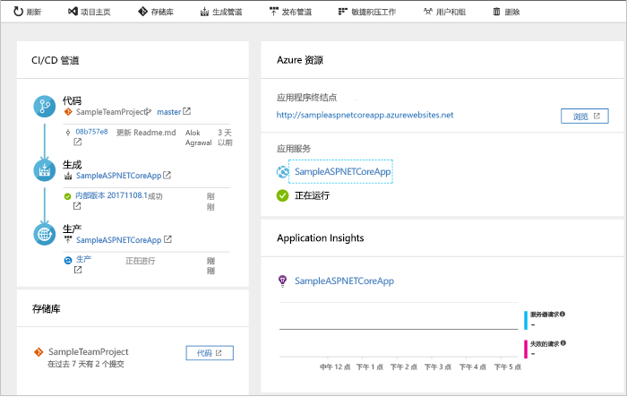
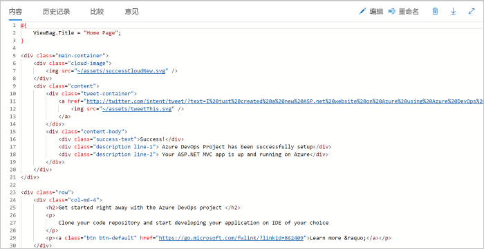
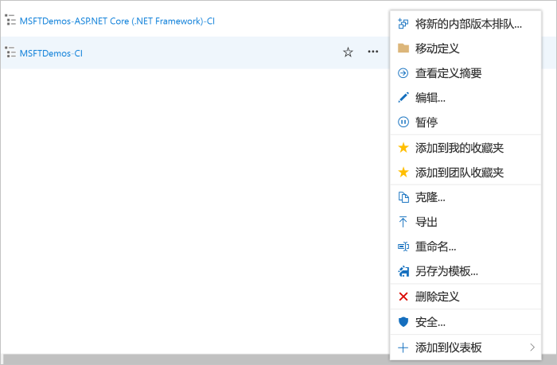

# 通过 Azure DevOps Starter 创建用于 .NET 的 CI/CD 管道

使用 DevOps Starter 为 .NET Core 或 ASP.NET 应用程序配置持续集成 (CI) 和持续交付 (CD)。 DevOps Starter 可以简化 Azure Pipelines 中生成和发布管道的初始配置。

如果没有 Azure 订阅，可以通过 [Visual Studio Dev Essentials](https://visualstudio.microsoft.com/dev-essentials/) 免费获取一个。

## 登录到 Azure 门户

DevOps Starter 在 Azure DevOps 中创建 CI/CD 管道。 可以创建新的 Azure DevOps 组织，或使用现有的组织。 DevOps 入门版还将在所选的 Azure 订阅中创建 Azure 资源。

1. 登录到 [Microsoft Azure 门户](https://portal.azure.com)。

1. 在搜索框中键入“DevOps 入门版”，然后选择。 单击“添加”以新建一个。 

    

## 选择示例应用程序和 Azure 服务

1. 选择 **.NET** 示例应用程序。 .NET 示例包括选择开源 ASP.NET 框架或跨平台 .NET Core 框架。

   

2. 此示例是一个 ASP.NET Core MVC 应用程序。 选择 **.NET Core** 应用程序框架，然后选择“下一步”  。    
    
3. 选择“Windows Web 应用”  作为部署目标，然后选择“下一步”  。 （可选）可以为部署选择其他 Azure 服务。 以前选择的应用程序框架规定了此处提供的 Azure 服务部署目标的类型。

## 配置 Azure DevOps 和 Azure 订阅 

1. 输入**项目名称**。

2. 创建新的免费 **Azure DevOps 组织**或从下拉列表中选择现有组织。

3. 选择 **Azure 订阅**，输入 **Web 应用**的名称或采用默认值，然后选择“完成”  。 几分钟后，DevOps Starter 部署概述会 在 Azure 门户中显示。 

4. 选择“转到资源”以查看 DevOps Starter 仪表板。 在右上角，将“项目”  固定在仪表板上，以便快速访问。 示例应用设置在 **Azure DevOps 组织**的存储库中。 执行生成，并将应用部署到 Azure。

5. 在此仪表板中可以查看代码存储库、CI/CD 管道，以及 Azure 中的应用。 在右侧的“Azure 资源”下，选择“浏览”以查看正在运行的应用。 

    

## 提交代码更改并执行 CI/CD

DevOps Starter 在 Azure Repos 或 GitHub 中创建了 Git 存储库。 若要查看存储库并对应用程序进行代码更改，请执行以下操作：

1. 在 DevOps Starter 仪表板的左侧，选择“主”分支的链接。 该链接会打开新建 Git 存储库的视图。

2. 在后续几个步骤中，可以使用 Web 浏览器直接对 **master** 分支进行代码更改并提交所做的更改。 还可以通过从存储库页右上角选择“克隆”  ，在喜欢的 IDE 中克隆 Git 存储库。 

3. 在左侧，将应用程序文件结构导航到 **Application/aspnet-core-dotnet-core/Pages/Index.cshtml**。

4. 选择“编辑”，  然后对 h2 标题进行更改。 例如，键入“Azure DevOps Starter 快速入门”或进行一些其他的更改。

      

5. 选择“提交”  ，留下注释，然后再次选择“提交”  。

6. 在浏览器中，转到 Azure DevOps Starter 仪表板。  此时会看到一个生成正在进行。 所做的更改会自动通过 CI/CD 管道进行生成和部署。

## 检查 CI/CD 管道

在上一步中，Azure DevOps Starter 自动配置了一个完整的 CI/CD 管道。 根据需要浏览和自定义管道。 请执行以下步骤，自行熟悉 Azure DevOps 的生成和发布管道。

1. 在 DevOps 入门版仪表板顶部，选择“生成管道”。 此链接会打开一个浏览器标签页，并打开新项目的 Azure DevOps 生成管道。

1. 选择省略号 (...)。此操作会打开一个菜单，可以在其中启动多项活动，例如将新生成排队、暂停某个生成、编辑生成管道。

1. 选择“编辑”  。

    

1. 在此窗格中，可以检查生成管道的各种任务。 该生成会执行各种任务，例如，从 Git 存储库提取源、还原依赖项、发布用于部署的输出。

1. 在生成管道的顶部，选择生成管道名称。

1. 将生成管道的名称更改为更具描述性的名称，选择“保存并排队”，然后选择“保存”。  

1. 在生成管道名称下，选择“历史记录”。    
在“历史记录”窗格中，此时会看到最近针对生成所做的更改的审核线索。   Azure Pipelines 会跟踪对生成管道所做的任何更改，并允许进行版本比较。

1. 选择“触发器”。  DevOps Starter 将自动创建一个 CI 触发器，每次向存储库提交内容都会启动新的生成。 可以选择在 CI 过程中包括或排除分库。

1. 选择“保留期”。  可以根据方案指定策略，以保留或删除特定数目的生成。

1. 选择“生成和发布”，然后选择“发布”。    
DevOps Starter 会创建一个发布管道，用于管理到 Azure 的部署。

1.  在左侧，选择发布管道旁边的省略号 (...)，然后选择“编辑”。  发布管道包含一个管道，用于定义发布过程。  

1. 在“项目”下选择“删除”   。 在前述步骤中检查过的生成管道生成用于项目的输出。 

1. 在“删除”图标的旁边，选择“持续部署触发器”。   此发布管道有一个启用的 CD 触发器，每次有新的生成项目可用时，此触发器就会运行部署。 （可选）可以禁用此触发器，这样就需要手动执行部署。  

1. 在左侧，选择“任务”。   这些任务是部署过程执行的活动。 在此示例中，已创建一个用于将项目部署到 Azure 应用服务的任务。

1. 在右侧，选择“查看发布”。  此视图显示发布历史记录。

1. 选择某个发布旁边的省略号 (...)，然后选择“打开”。  可以浏览多个菜单，例如“发布摘要”、“关联的工作项”、“测试”。

1. 选择“提交”。  此视图显示与特定部署相关联的代码提交。 

1. 选择“日志”。  日志包含有关部署过程的有用信息。 日志可以在部署过程中以及部署以后查看。

## 清理资源

不再需要创建的 Azure 应用服务和其他相关资源时，可将其删除。 请使用 DevOps 入门版仪表板上的“删除”功能。

## 后续步骤

若要详细了解如何根据团队的需求修改生成和发布管道，请参阅以下教程：

> [!div class="nextstepaction"]
> [自定义 CD 过程](https://docs.microsoft.com/azure/devops/pipelines/release/define-multistage-release-process?view=vsts)

## 视频

> [!VIDEO https://www.youtube.com/embed/itwqMf9aR0w]
