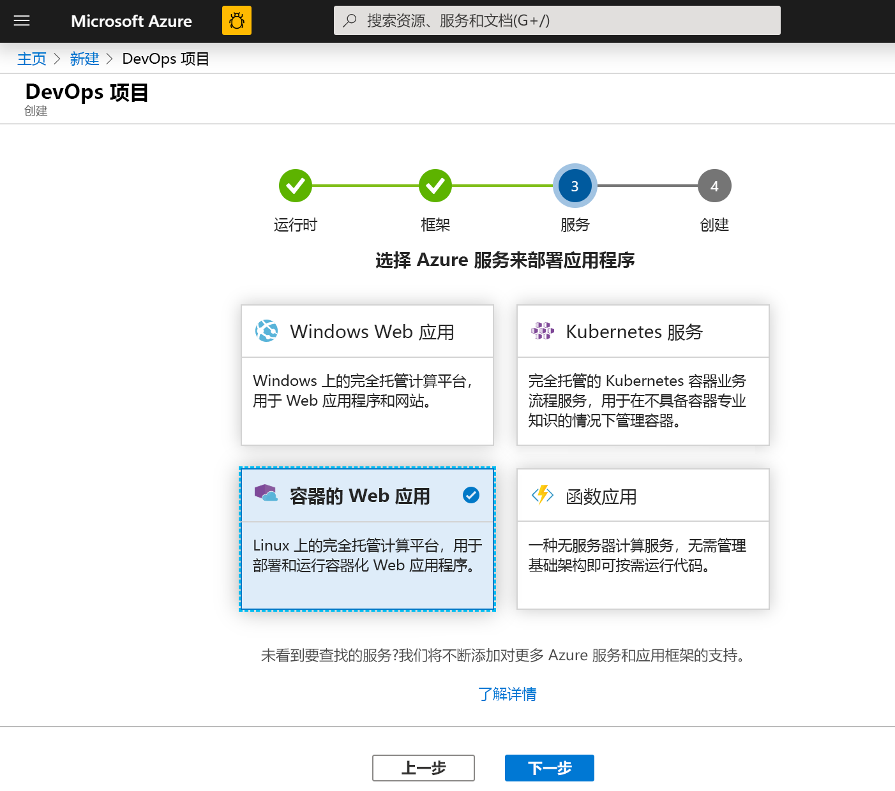
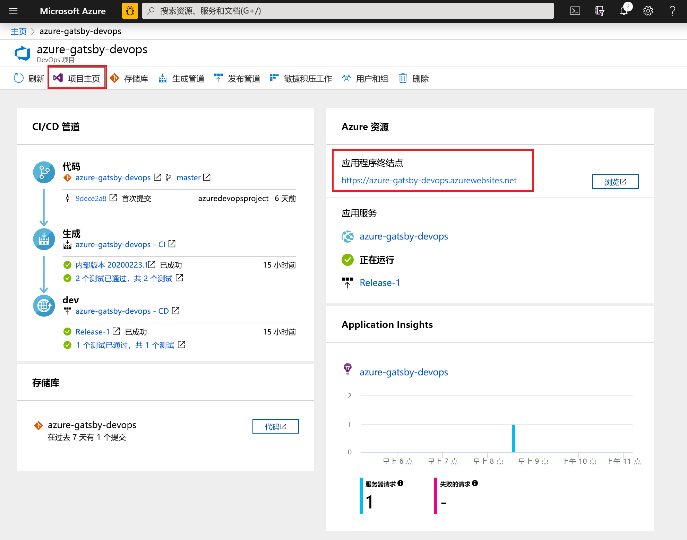
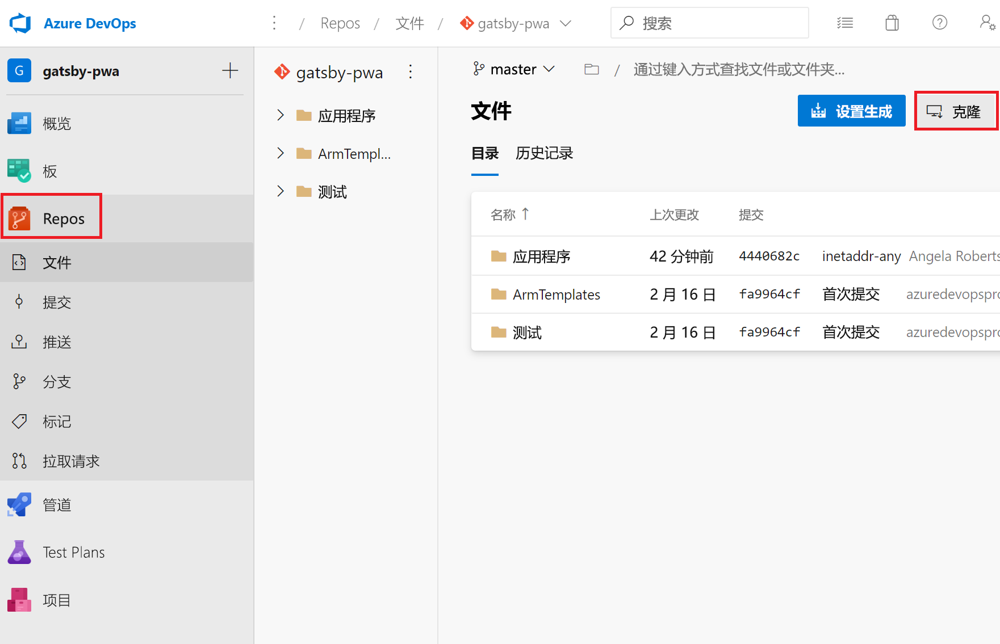
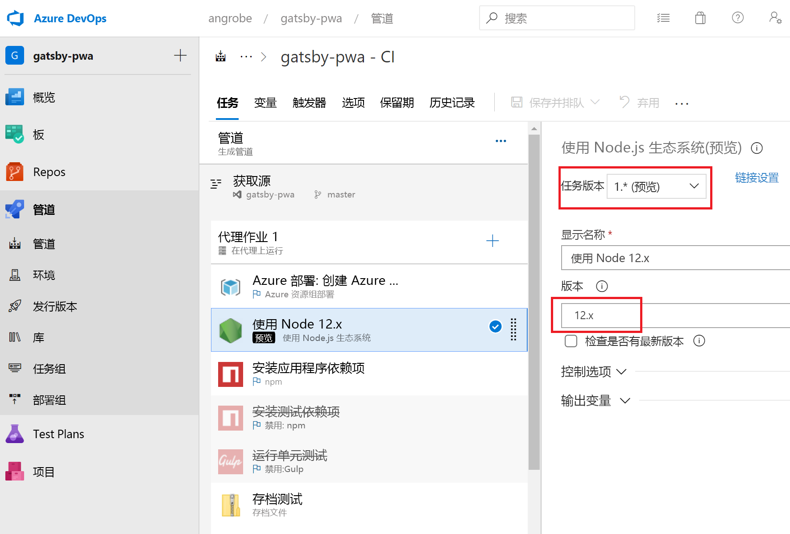
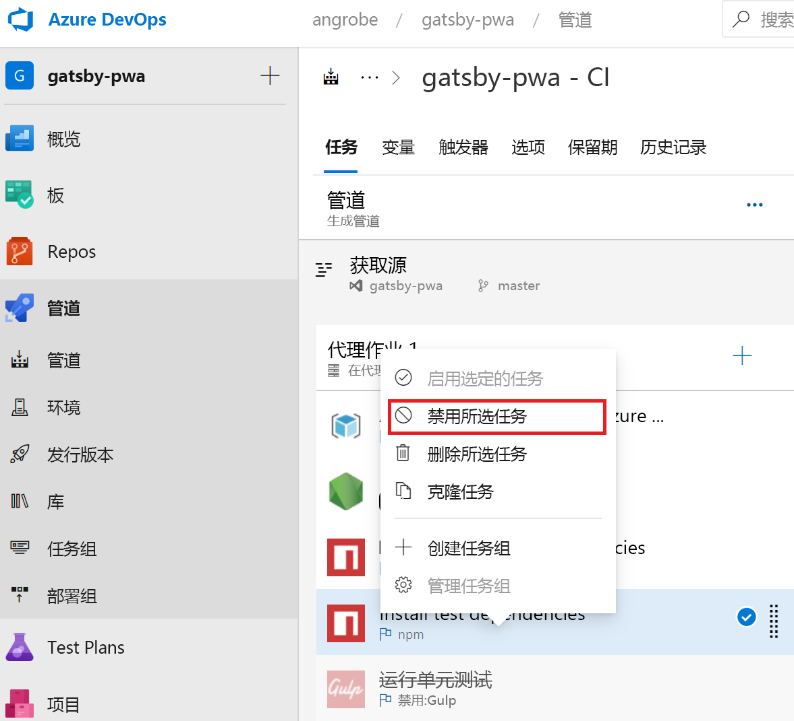
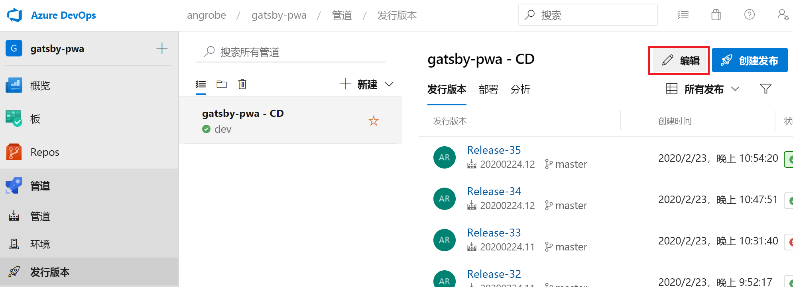
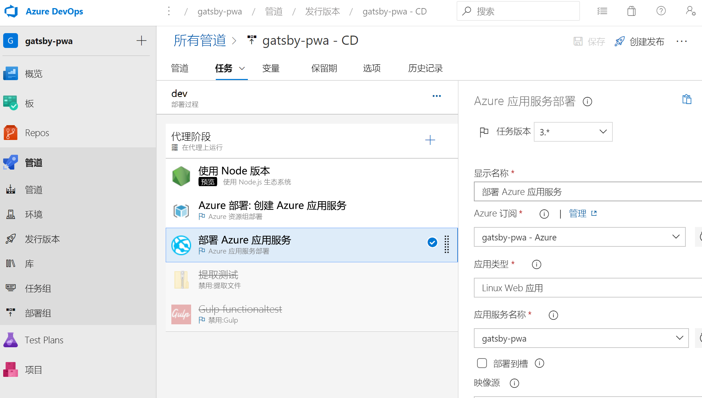

# <a name="create-a-cicd-pipeline-in-azure-pipelines-for-nodejs-with-azure-devops-starter"></a>使用 Azure DevOps Starter 在 Azure Pipelines 中创建 CI/CD 管道 Node.js

在本快速入门中，你将使用[GatsbyJS](https://www.gatsbyjs.org/)创建 NodeJS 渐进式 web 应用（PWA）以及简化的 Azure DevOps 入门创建体验。 完成此过程后，即已为 Azure Pipelines 中的 PWA 创建了持续集成 (CI) 和持续交付 (CD) 管道。 Azure DevOps Starter 设置开发、部署和监视所需的内容。

## <a name="prerequisites"></a>先决条件

- 具有活动订阅的 Azure 帐户。 [免费创建帐户](https://azure.microsoft.com/free/?ref=microsoft.com&utm_source=microsoft.com&utm_medium=docs&utm_campaign=visualstudio)。 
- 一个 [Azure DevOps](https://azure.microsoft.com/services/devops/) 组织。

## <a name="sign-in-to-the-azure-portal"></a>登录到 Azure 门户

DevOps 入门版在 Azure Pipelines 中创建 CI/CD 管道。 可以创建新的 Azure DevOps 组织，或使用现有的组织。 DevOps 入门版还将在所选的 Azure 订阅中创建 Azure 资源。

1. 登录到 [Azure 门户](https://portal.azure.com)，然后在左窗格中选择“创建资源”  。 

   

1. 在搜索框中键入“DevOps 入门版”，然后选择。 单击“添加”以新建一个。

    

## <a name="select-a-sample-application-and-azure-service"></a>选择示例应用程序和 Azure 服务

1. 选择 Node.js 示例应用程序。   

     

1. 默认的示例框架是**Express.js**。 将所选内容更改为**简单 Node.js 应用**，然后选择 "**下一步**"。 

     

1. 此步骤中提供的部署目标取决于在步骤2中选择的应用程序框架。 在此示例中， **Windows Web 应用**是默认的部署目标。 保留**用于容器的 Web 应用**集，然后选择 "**下一步**"。

    

## <a name="configure-a-project-name-and-an-azure-subscription"></a>配置项目名称和 Azure 订阅

1. 在 DevOps 入门创建工作流的最后一步，分配项目名称，选择 Azure 订阅，并选择 "**完成**"。  

    

1. 生成项目并将应用程序部署到 Azure 时，将显示 "摘要" 页。 短暂的一段时间后，将在[Azure DevOps 组织](https://dev.azure.com/)中创建一个项目，其中包含 git 存储库、看板、部署管道、测试计划和应用所需的项目。  

## <a name="managing-your-project"></a>管理项目

1. 导航到 "**所有资源**" 并找到 DevOps Starter。 选择**DevOps Starter**。

    

1. 你将定向到一个仪表板，该仪表板可用于查看你的项目主页、代码存储库、CI/CD 管道以及指向正在运行的应用程序的链接。 选择**项目主页**以查看**Azure DevOps**中的应用程序，并在另一个浏览器选项卡中，选择**应用程序终结点**以查看实时示例应用。 稍后我们将此示例更改为使用 GatsbyJS 生成的 PWA。

     

1. 在 Azure DevOps 项目中，您可以邀请团队成员进行协作并建立看板，以便开始跟踪您的工作。 有关详细信息，请参阅[此文](https://docs.microsoft.com/azure/devops/user-guide/what-is-azure-devops?view=azure-devops)。


## <a name="clone-the-repo-and-install-your-gatsby-pwa"></a>克隆存储库并安装 Gatsby PWA

DevOps Starter 在 Azure Repos 或 GitHub 中创建 git 存储库。 此示例创建了一个 Azure 存储库。 下一步是克隆存储库并进行更改。

1. 从**DevOps 项目**中选择 "**存储库**"，然后单击 "**克隆**"。  可以通过多种机制将 git 存储库克隆到桌面。  选择适合你的开发体验的用户。  

    

1. 将存储库克隆到桌面后，对初学者模板进行一些更改。 首先从终端安装 GatsbyJS CLI。

   ```powershell
    npm install -g gatsby
   ```

1. 在终端中，导航到存储库的根目录。 它应包含如下所示的三个文件夹：

    ```powershell
    Mode                LastWriteTime         Length Name
    ----                -------------         ------ ----
    d-----        2/23/2020  10:42 PM                Application
    d-----        2/23/2020   3:05 PM                ArmTemplates
    d-----        2/23/2020   3:05 PM                Tests
    ```
    
1. 我们不希望应用程序文件夹中的所有文件都替换为 Gatsby starter。 按顺序运行以下命令，以将其截断。
    
    ```powershell
    cp .\Application\Dockerfile .
    rmdir Application
    ```

1. 使用 Gatsby CLI 生成示例 PWA。 `gatsby new`从终端运行以开始 PWA 向导，并 `gatsby-starter-blog` 为初学者模板选择。 它应类似于以下示例：

    ```powershell
    c:\myproject> gatsby new
    √ What is your project called? ... my-gatsby-project
    ? What starter would you like to use? » - Use arrow-keys. Return to submit.
        gatsby-starter-default
        gatsby-starter-hello-world
    >   gatsby-starter-blog
        (Use a different starter)
    ```
    
1. 现在有一个名为的文件夹 `my-gatsby-project` 。 将其重命名为 `Application` ，并将其复制 `Dockerfile` 到其中。
    
    ```powershell
    mv my-gatsby-project Application
    mv Dockerfile Application
    ```
    
1. 在常用编辑器中，打开 Dockerfile，并将第一行从更改 `FROM node:8` 为 `FROM node:12` 。 此更改可确保你的容器使用的版本为版本为 Node.js，而不是版本3.x。 GatsbyJS 需要 Node.js 的更多新式版本。

1. 接下来，打开应用程序文件夹中的 package.js文件，然后编辑 "[脚本" 字段](https://docs.npmjs.com/files/package.json#scripts)，以确保你的开发和生产服务器在所有可用的网络接口（例如0.0.0.0）和端口80上进行侦听。 如果没有这些设置，则容器应用服务无法将流量路由到在容器中运行的 Node.js 应用。 `scripts`字段应类似于下面的内容。 具体来说，您需要 `develop` `serve` `start` 从默认值更改、和目标。

    ```json
      "scripts": {
        "build": "gatsby build",
        "develop": "gatsby develop  -H 0.0.0.0 -p 80",
        "format": "prettier --write \"**/*.{js,jsx,json,md}\"",
        "start": "npm run serve",
        "serve": "npm run build && gatsby serve -H 0.0.0.0 -p 80",
        "clean": "gatsby clean",
        "test": "echo \"Write tests! -> https://gatsby.dev/unit-testing\" && exit 1"
      }
    ```
    
## <a name="edit-your-cicd-pipelines"></a>编辑 CI/CD 管道

1. 在提交上一节中的代码之前，请对生成和发布管道进行一些更改。 编辑 "生成管道"，并将节点任务更新为使用版本为版本 Node.js。 将 "**任务版本**" 字段设置为 "1. x"，将 "**版本**" 字段设置为 "12. x"。

    

1. 在本快速入门中，我们不会创建单元测试，我们将在生成管道中禁用这些步骤。 编写测试时，可以重新启用这些步骤。 右键单击以选择标记为 "**安装测试依赖项**" 和 "**运行单元测试**并禁用它们" 的任务。

    

1. 编辑发布管道。

    

1. 对于生成管道，将节点任务更改为使用 test.txt 并禁用两个测试任务。 你的版本应类似于此屏幕截图。

    

1. 在浏览器左侧转到 **views/index.pug** 文件。

1. 选择“编辑”，**** 然后对 h2 标题进行更改。  例如，输入**立即开始借助 Azure DevOps Starter**或进行一些其他更改。

1. 选择“提交”并保存更改。

1. 在浏览器中，转到 DevOps 入门版仪表板。   
此时会看到一个生成正在进行。 通过 CI/CD 管道自动生成并部署所做的更改。

## <a name="commit-your-changes-and-examine-the-azure-cicd-pipeline"></a>提交更改并检查 Azure CI/CD 管道

在前两个步骤中，将 Gatsby 生成的 PWA 添加到了 git 存储库，并编辑了管道以生成并部署代码。 我们可以提交代码，并通过生成和发布管道观看 it 进度。

1. 从终端中项目的 git 存储库的根目录中运行以下命令，将代码推送到 Azure DevOps 项目：

    ```powershell
    git add .
    git commit -m "My first Gatsby PWA"
    git push
    ```
    
1. 生成将在完成后立即启动 `git push` 。 可从**Azure DevOps 仪表板**跟踪进度。

3. 几分钟后，生成和发布管道应会完成，PWA 应会部署到容器中。 在上面所示的仪表板中单击“应用程序终结点”链接，此时应会看到博客的 Gatsby 初学者项目。 

## <a name="clean-up-resources"></a>清理资源

不再需要创建的 Azure 应用服务和其他相关资源时，可将其删除。 请使用 DevOps 入门版仪表板上的“删除”功能。

## <a name="next-steps"></a>后续步骤

在配置 CI/CD 过程时，系统自动创建了生成和发布管道。 可以根据团队的需求更改这些生成和发布管道。 若要详细了解 CI/CD 管道，请参阅：

> [!div class="nextstepaction"]
> [自定义 CD 过程](https://docs.microsoft.com/azure/devops/pipelines/release/define-multistage-release-process?view=vsts)

