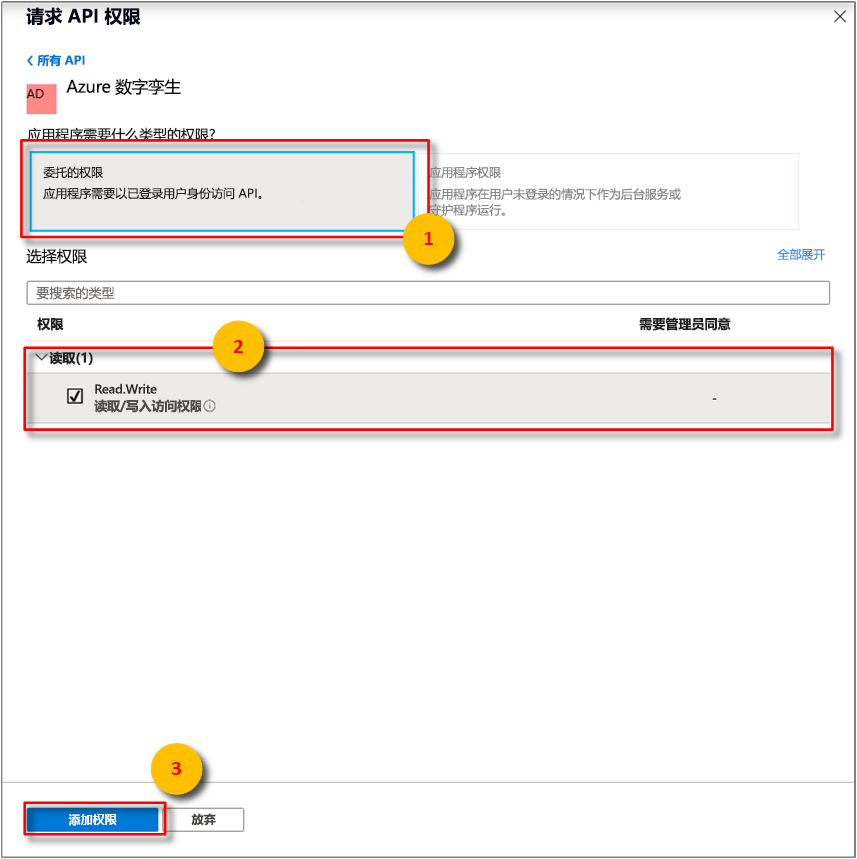

# <a name="how-to-configure-postman-for-azure-digital-twins"></a>如何为 Azure 数字孪生配置 Postman

本文介绍如何配置 Postman REST 客户端以与 Azure 数字孪生管理 API 进行交互并对其进行测试。 具体而言，本文介绍以下内容：

* 如何将 Azure Active Directory 应用程序配置为使用 OAuth 2.0 隐式授权流。
* 如何使用 Postman REST 客户端向管理 API 发出令牌承载 HTTP 请求。
* 如何使用 Postman 向管理 API 发出多部分 POST 请求。

## <a name="postman-summary"></a>Postman 摘要

通过 REST 客户端工具（如 [Postman](https://www.getpostman.com/)）开始使用 Azure 数字孪生，以准备本地测试环境。 Postman 客户端有助于快速创建复杂的 HTTP 请求。 前往 [www.getpostman.com/apps](https://www.getpostman.com/apps) 下载 Postman 客户端的桌面版本。

[Postman](https://www.getpostman.com/) 是一种 REST 测试工具，可将关键 HTTP 请求功能定位到有用的桌面和基于插件的 GUI 中。

通过 Postman 客户端，解决方案开发人员可以指定 HTTP 请求的类型（POST、GET、UPDATE、PATCH 和 DELETE）、要调用的 API 终结点以及 SSL 的使用。 Postman 还支持添加 HTTP 请求标头、参数、表单数据和正文。

## <a name="configure-azure-active-directory-to-use-the-oauth-20-implicit-grant-flow"></a>配置 Azure Active Directory 以使用 OAuth 2.0 隐式授权流

配置 Azure Active Directory 应用以使用 OAuth 2.0 隐式授权流。

1. 按照[快速入门](./quickstart-view-occupancy-dotnet.md)中的步骤创建 Azure AD 应用程序。 或[使用旧 AAD 边栏选项卡创建本机应用](./how-to-use-legacy-aad.md)。

1. 在 " **API 权限**" 下, 选择 "**添加权限**"。 然后, **Azure 数字孪生**在**我的组织使用的 api**下。 如果搜索没有找到该 API，请改为搜索“Azure 智能空间”。 然后, 选择 **"委托的权限**"、"**读取** > "、"**写入**" 和 "**添加权限**"。

    [](../../includes/media/digital-twins-permissions/aad-app-req-permissions.png#lightbox)

1. 选择 "**清单**" 打开应用程序的应用程序清单。 将“oauth2AllowImplicitFlow”设置为 `true`。

    [](media/how-to-configure-postman/implicit-flow.png#lightbox)

1. 将“回复 URL”配置为 `https://www.getpostman.com/oauth2/callback`。

    [](media/how-to-configure-postman/reply-url.png#lightbox)

1. 复制并保留 Azure Active Directory 应用的“应用程序 ID”。 它在后续步骤中会用到。

## <a name="obtain-an-oauth-20-token"></a>获取 OAuth 2.0 令牌

[!INCLUDE [digital-twins-management-api](../../includes/digital-twins-management-api.md)]

设置并配置 Postman 以获取 Azure Active Directory 令牌。 之后，使用获取的令牌向 Azure 数字孪生发出经过身份验证的 HTTP 请求：

1. 前往 [www.getpostman.com](https://www.getpostman.com/) 下载应用。
1. 验证“授权 URL”正确无误。 它应采用以下格式：

    ```plaintext
    https://login.microsoftonline.com/YOUR_AZURE_TENANT.onmicrosoft.com/oauth2/authorize?resource=0b07f429-9f4b-4714-9392-cc5e8e80c8b0
    ```

    | 姓名  | 替换为 | 示例 |
    |---------|---------|---------|
    | YOUR_AZURE_TENANT | 租户或组织的名称 | `microsoft` |

1. 依次选择“授权”选项卡、“OAuth 2.0”、“获取新访问令牌”。

    | 字段  | ReplTest1 |
    |---------|---------|
    | 授权类型 | `Implicit` |
    | 回调 URL | `https://www.getpostman.com/oauth2/callback` |
    | 身份验证 URL | 使用上面步骤 2 中的“授权 URL” |
    | 客户端 ID | 使用在上一节中创建或重新使用的 Azure Active Directory 应用的**应用程序 ID** |
    | 范围 | 留空 |
    | 状态 | 留空 |
    | 客户端身份验证 | `Send as Basic Auth header` |

1. 此时，客户端应如下所示：

    [](media/how-to-configure-postman/postman-oauth-token.png#lightbox)

1. 选择“请求令牌”。

    >[!TIP]
    >如果收到错误消息“无法完成 OAuth 2”，请尝试以下操作：
    > * 关闭并重新打开 Postman，然后重试。
  
1. 向下滚动并选择“使用令牌”。

<div id="multi"></div>

## <a name="make-a-multipart-post-request"></a>发出多部分 POST 请求

完成上述步骤后，请将 Postman 配置为发出已经过身份验证的 HTTP 多部分 POST 请求：

1. 在“标头”选项卡下，添加值为 `multipart/mixed` 的 HTTP 请求标头键 Content-Type。

   [](media/how-to-configure-postman/content-type.png#lightbox)

1. 将非文本数据序列化为文件。 JSON 数据将另存为 JSON 文件。
1. 在“正文”选项卡下，添加每个文件，方法是分配“键”名称（选择 `file` 或 `text`）。
1. 然后，通过“选择文件”按钮选择每个文件。

   [](media/how-to-configure-postman/form-body.png#lightbox)

   >[!NOTE]
   > * Postman 客户端不要求多部分区块有手动分配的 **Content-Type** 或 **Content-Disposition**。
   > * 对于每个部分，不需要指定这些标头。
   > * 对于整个请求，必须选择 `multipart/mixed` 或其他相应的 **Content-Type**。

1. 最后, 选择 "**发送**" 以提交多部分 HTTP POST 请求。

## <a name="next-steps"></a>后续步骤

- 要了解有关数字孪生管理 API 以及如何使用它们的详细信息，请参阅[如何使用 Azure 数字孪生管理 API](how-to-navigate-apis.md)。

- 使用多部分请求[将 Blob 添加到 Azure 数字孪生的实体](./how-to-add-blobs.md)。

- 若要了解如何使用管理 API 进行身份验证，请阅读[使用 API 进行身份验证](./security-authenticating-apis.md)。
