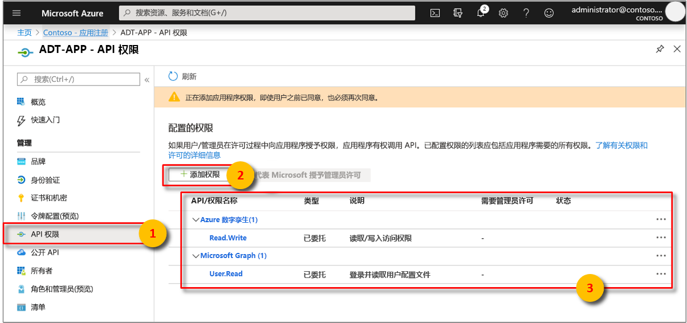

# <a name="how-to-configure-postman-for-azure-digital-twins"></a>如何为 Azure 数字孪生配置 Postman

本文介绍如何配置 Postman REST 客户端以与 Azure 数字孪生管理 API 进行交互并对其进行测试。 具体而言，本文介绍以下内容：

* 如何将 Azure Active Directory 应用程序配置为使用 OAuth 2.0 隐式授权流。
* 如何使用 Postman REST 客户端向管理 API 发出令牌承载 HTTP 请求。
* 如何使用 Postman 向管理 API 发出多部分 POST 请求。

## <a name="postman-summary"></a>Postman 摘要

通过 REST 客户端工具（如 [Postman](https://www.getpostman.com/)）开始使用 Azure 数字孪生，以准备本地测试环境。 Postman 客户端有助于快速创建复杂的 HTTP 请求。 前往 [www.getpostman.com/apps](https://www.getpostman.com/apps) 下载 Postman 客户端的桌面版本。

[Postman](https://www.getpostman.com/) 是一种 REST 测试工具，可将关键 HTTP 请求功能定位到有用的桌面和基于插件的 GUI 中。

通过 Postman 客户端，解决方案开发人员可以指定 HTTP 请求的类型（POST、GET、UPDATE、PATCH 和 DELETE）、要调用的 API 终结点以及 SSL 的使用。 Postman 还支持添加 HTTP 请求标头、参数、表单数据和正文。

## <a name="configure-azure-active-directory-to-use-the-oauth-20-implicit-grant-flow"></a>配置 Azure Active Directory 以使用 OAuth 2.0 隐式授权流

配置 Azure Active Directory 应用以使用 OAuth 2.0 隐式授权流。

1. 打开用于应用注册的“API 权限”窗格。 选择“添加权限”按钮。 在“请求 API 权限”窗格中，选择“我的组织使用的 API”选项卡，然后搜索：
    
    1. `Azure Digital Twins`。 选择 **Azure 数字孪生** API。

        [](../../includes/media/digital-twins-permissions/aad-aap-search-api-dt.png#lightbox)

    1. 或者，搜索 `Azure Smart Spaces Service`。 选择“Azure 智能空间服务”API。

        [](../../includes/media/digital-twins-permissions/aad-app-search-api.png#lightbox)

    > [!IMPORTANT]
    > 将显示的 Azure AD API 名称和 ID 取决于租户：
    > * 测试租户和客户帐户应搜索 `Azure Digital Twins`。
    > * 其他 Microsoft 帐户应搜索 `Azure Smart Spaces Service`。

1. 所选的 API 在同一个“请求 API 权限”窗格中显示为“Azure 数字孪生”。 选择“读取 (1)”下拉列表，然后选中“Read.Write”复选框。 选择“添加权限”按钮。

    [](../../includes/media/digital-twins-permissions/aad-app-req-permissions.png#lightbox)

1. 根据组织的设置，可能需要执行其他步骤才能授予对此 API 的管理员访问权限。 请联系管理员以了解详细信息。 在该管理员访问权限得到批准后，API 的“API 权限”窗格中的“需要管理员同意”列将如下所示：

    [](../../includes/media/digital-twins-permissions/aad-app-admin-consent.png#lightbox)

1. 配置要 `https://www.getpostman.com/oauth2/callback`的第二个**重定向 URI** 。

    [](media/how-to-configure-postman/authentication-redirect-uri.png#lightbox)

1. 若要确保[将应用注册为“公共客户端”](https://docs.microsoft.com/azure/active-directory/develop/scenario-desktop-app-registration)，请打开用于应用注册的“身份验证”窗格，然后在该窗格中向下滚动。 在“默认客户端类型”部分中，为“将应用程序视为公共客户端”选择“是”，然后点击“保存”。

    选中“访问令牌”以启用 Manifest.json 中的“oauth2AllowImplicitFlow”设置。

    [](../../includes/media/digital-twins-permissions/aad-public-client.png#lightbox)

1. 复制并保留 Azure Active Directory 应用的“应用程序 ID”。 它在后续步骤中会用到。

   [](../../includes/media//digital-twins-permissions/aad-app-reg-app-id.png#lightbox)


## <a name="obtain-an-oauth-20-token"></a>获取 OAuth 2.0 令牌

[!INCLUDE [digital-twins-management-api](../../includes/digital-twins-management-api.md)]

设置并配置 Postman 以获取 Azure Active Directory 令牌。 之后，使用获取的令牌向 Azure 数字孪生发出经过身份验证的 HTTP 请求：

1. 前往 [www.getpostman.com](https://www.getpostman.com/) 下载应用。
1. 验证“授权 URL”正确无误。 它应采用以下格式：

    ```plaintext
    https://login.microsoftonline.com/YOUR_AZURE_TENANT.onmicrosoft.com/oauth2/authorize?resource=0b07f429-9f4b-4714-9392-cc5e8e80c8b0
    ```

    | 名称  | 替换为 | 示例 |
    |---------|---------|---------|
    | YOUR_AZURE_TENANT | 租户或组织的名称 | `microsoft` |

1. 依次选择“授权”选项卡、“OAuth 2.0”、“获取新访问令牌”。

    | 字段  | 值 |
    |---------|---------|
    | 授权类型 | `Implicit` |
    | 回调 URL | `https://www.getpostman.com/oauth2/callback` |
    | 身份验证 URL | 使用**步骤 2**中的**授权 URL** |
    | 客户端 ID | 使用在上一节中创建或重新使用的 Azure Active Directory 应用的**应用程序 ID** |
    | 作用域 | 留空 |
    | 状态 | 留空 |
    | 客户端身份验证 | `Send as Basic Auth header` |

1. 此时，客户端应如下所示：

    [](media/how-to-configure-postman/configure-postman-oauth-token.png#lightbox)

1. 选择“请求令牌”。
  
1. 向下滚动并选择“使用令牌”。

## <a name="make-a-multipart-post-request"></a>发出多部分 POST 请求

完成上述步骤后，请将 Postman 配置为发出已经过身份验证的 HTTP 多部分 POST 请求：

1. 在 "**标头**" 选项卡下，添加值为 `multipart/mixed`的 HTTP 请求标头密钥**内容类型**。

   [](media/how-to-configure-postman/configure-postman-content-type.png#lightbox)

1. 将非文本数据序列化为文件。 JSON 数据将另存为 JSON 文件。
1. 在 "**正文**" 选项卡下，选择 `form-data`。 
1. 通过分配**密钥**名称来添加每个文件，并选择 "`File`"。
1. 然后，通过“选择文件”按钮选择每个文件。

   [](media/how-to-configure-postman/configure-postman-form-body.png#lightbox)

   >[!NOTE]
   > * Postman 客户端不要求多部分区块有手动分配的 **Content-Type** 或 **Content-Disposition**。
   > * 对于每个部分，不需要指定这些标头。
   > * 对于整个请求，必须选择 `multipart/mixed` 或其他相应的 **Content-Type**。

1. 最后，选择 "**发送**" 以提交多部分 HTTP POST 请求。 `200` 或 `201` 的状态代码指示请求成功。 你还将看到相应的响应消息。

## <a name="next-steps"></a>后续步骤

- 要了解有关数字孪生管理 API 以及如何使用它们的详细信息，请参阅[如何使用 Azure 数字孪生管理 API](how-to-navigate-apis.md)。

- 使用多部分请求[将 Blob 添加到 Azure 数字孪生的实体](./how-to-add-blobs.md)。

- 若要了解如何使用管理 API 进行身份验证，请阅读[使用 API 进行身份验证](./security-authenticating-apis.md)。
