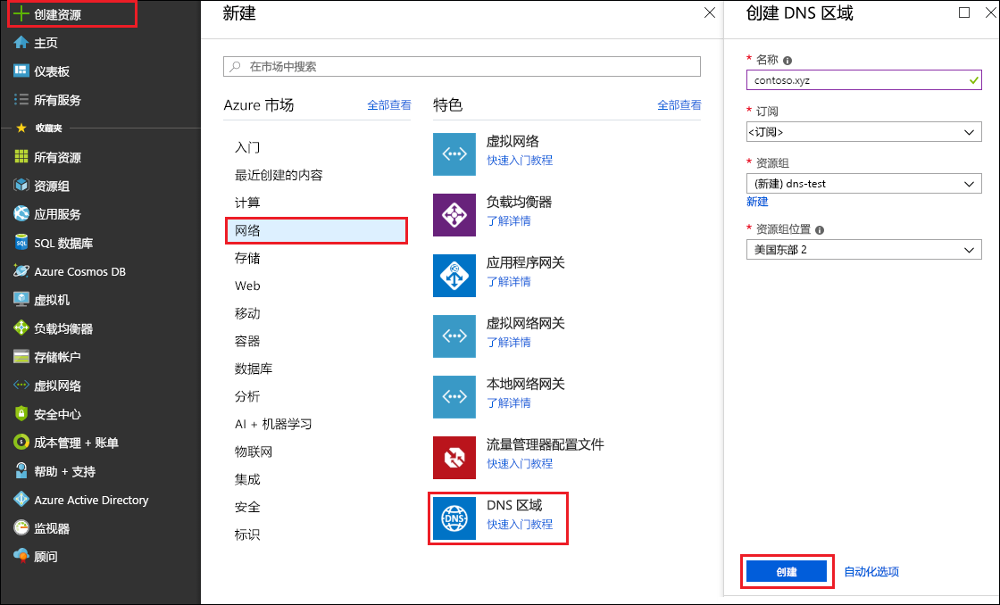
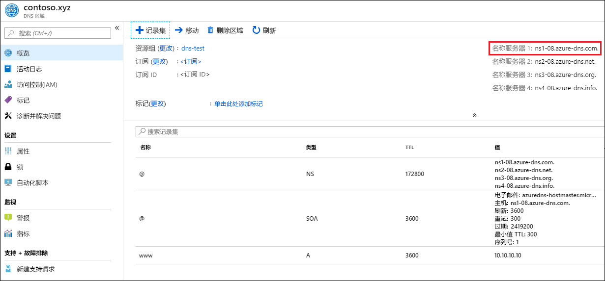

# 使用 Azure 门户的 Azure DNS 入门

> [!div class="op_single_selector"]
> * [Azure 门户](dns-getstarted-portal.md)
> * [PowerShell](dns-getstarted-powershell.md)
> * [Azure CLI 1.0](dns-getstarted-cli-nodejs.md)
> * [Azure CLI 2.0](dns-getstarted-cli.md)

本文将指导你完成创建你的第一个 DNS 区域和记录使用 Azure 门户的步骤。 你还可以执行这些步骤使用 Azure PowerShell 或跨平台 Azure CLI。

DNS 区域用于承载特定域的 DNS 记录。 若要启动托管在 Azure DNS 中的域，你需要创建该域名的 DNS 区域。 此 DNS 区域内然后创建你的域每个 DNS 记录。 最后，若要发布到 Internet DNS 区域，你需要配置域的名称服务器。 以下步骤描述了每个步骤。

## 创建的 DNS 区域

1. 登录到 Azure 门户
2. 在中心菜单上，单击，然后单击**新建 > 网络 >** ，然后单击**DNS 区域**以打开创建 DNS 区域边栏选项卡。

    

4. 上**创建 DNS 区域**边栏选项卡输入下面的值，然后单击**创建**:

   | **设置** | **Value** | **详细信息** |
   |---|---|---|
   |**名称**|contoso.com|DNS 区域的名称|
   |**订阅**|[你的订阅]|选择要创建的 DNS 区域中的订阅。|
   |**资源组**|**创建新：** contosoDNSRG|创建资源组。 资源组名称必须是在你选择的订阅中是唯一的。 若要了解有关资源组的详细信息，请阅读[资源管理器](../azure-resource-manager/resource-group-overview.md?toc=%2fazure%2fdns%2ftoc.json#resource-groups)概述文章。|
   |**位置**|美国西部||

> [!NOTE]
> 资源组引用的资源组的位置，并且对 DNS 区域没有任何影响。 DNS 区域位置始终是"全局"，并且不会显示。

## 创建 DNS 记录

下面的示例将指导你完成创建新的 A 记录的过程。 对于其他记录类型和要修改现有记录，请参阅[使用 Azure 门户的设置管理 DNS 记录和记录](dns-operations-recordsets-portal.md)。 

1. 与在 Azure 门户中创建该 DNS 区域**收藏夹**窗格中，单击**的所有资源**。 单击**contoso.com** DNS 区域中的所有资源边栏选项卡。 如果已选择的订阅中有多个资源，你可以输入**contoso.com**中**按名称筛选...** 若要轻松地访问 DNS 区域的框。

1. 在顶部**DNS 区域**边栏选项卡，选择**+ 记录集，这些**以打开**添加记录集**边栏选项卡。

1. 上**添加记录集**边栏选项卡，输入下面的值，然后单击**确定**。 在此示例中，您将创建一个 A 记录。

   |**设置** | **Value** | **详细信息** |
   |---|---|---|
   |**名称**|www|记录名称|
   |**类型**|指向| 类型的 DNS 记录中创建，可接受的值为 A、 AAAA、 CNAME、 MX、 NS、 SRV、 TXT、 和 PTR。  有关记录类型的详细信息，请访问[概述的 DNS 区域和记录](dns-zones-records.md)|
   |**TTL**|1|-生存时间的 DNS 请求。|
   |**TTL 单元**|Hours|TTL 值的时间度量。|
   |**IP 地址**|ipAddressValue| 此值是可解析的 DNS 记录的 IP 地址。|

## 查看记录

在 DNS 区域边栏选项卡的下半部分，你可以看到 DNS 区域的记录。 您应看到默认 DNS 和 SOA 记录，这在每个区域中创建，以及已创建任何新记录。

## 更新名称服务器

一旦您满意后，你的 DNS 区域和记录具有已正确设置，你需要配置你的域名用于 Azure DNS 名称服务器。 这使查找你的 DNS 记录在 Internet 上的其他用户。

在 Azure 门户中给出了你的时区的名称服务器：

应使用 （处购买的域名） 的域注册机构配置这些名称服务器。 你的注册机构提供的选项来设置域的名称服务器。 有关详细信息，请参阅[委托到 Azure DNS 域](dns-domain-delegation.md)。

## 删除所有资源

若要删除此文章中创建的所有资源，请完成以下步骤：

1. 在 Azure 门户**收藏夹**窗格中，单击**的所有资源**。 单击**MyResourceGroup**资源组中的所有资源边栏选项卡。 如果已选择的订阅中有多个资源，你可以输入**MyResourceGroup**中**按名称筛选...** 若要轻松地访问的资源组的框。
1. 在**MyResourceGroup**边栏选项卡，单击**删除**按钮。
1. 门户需要你键入以确认你想要将其删除的资源组的名称。 单击**删除**，类型*MyResourceGroup*资源组名称，然后单击**删除**。 删除资源组删除资源组中的所有资源，因此总是一定要删除它之前，请确认资源组的内容。 门户中删除资源组中包含的所有资源，然后都删除资源组本身。 此过程需要几分钟。

## 后续步骤

若要了解有关 Azure DNS 的详细信息，请参阅[Azure DNS 概述](dns-overview.md)。

若要了解有关管理 Azure DNS 中的 DNS 记录的详细信息，请参阅[使用 Azure 门户的设置管理 DNS 记录和记录](dns-operations-recordsets-portal.md)。

