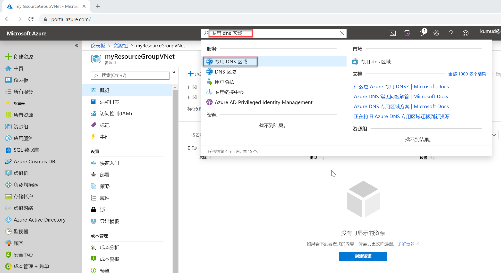

# <a name="quickstart-create-an-azure-private-dns-zone-using-the-azure-portal"></a>快速入门：使用 Azure 门户创建 Azure 专用 DNS 区域

本快速入门将引导你完成使用 Azure 门户创建第一个专用 DNS 区域和记录的步骤。

DNS 区域用来托管某个特定域的 DNS 记录。 若要开始在 Azure DNS 中托管域，需要为该域名创建 DNS 区域。 随后会在此 DNS 区域内为每个 DNS 记录创建域。 若要向虚拟网络发布专用 DNS 区域，请指定一个列表，其中包含允许在区域中解析记录的虚拟网络。  这些虚拟网络称为链接的虚拟网络。  启用自动注册后，Azure DNS 还会在创建虚拟机、更改其 IP 地址或删除虚拟机时更新区域记录。

此快速入门介绍如何：

> [!div class="checklist"]
> * 创建专用 DNS 区域
> * 创建虚拟网络
> * 链接虚拟网络
> * 创建测试虚拟机
> * 创建额外的 DNS 记录
> * 测试专用区域

如果还没有 Azure 订阅，可以在开始前创建一个[免费帐户](https://azure.microsoft.com/free/?WT.mc_id=A261C142F)。

如果你愿意，可以使用 [Azure PowerShell](private-dns-getstarted-powershell.md) 或 [Azure CLI](private-dns-getstarted-cli.md) 完成本快速入门中的步骤。

## <a name="create-a-private-dns-zone"></a>创建专用 DNS 区域

以下示例在名为 **MyAzureResourceGroup** 的资源组中创建名为 **private.contoso.com** 的 DNS 区域。

DNS 区域包含域的 DNS 条目。 若要开始在 Azure DNS 中托管域，请为该域名创建一个 DNS 区域。



1. 在门户搜索栏中的搜索文本框内键入“专用 dns 区域”，然后按 **Enter**。 
1. 选择“专用 DNS 区域”。 
2. 选择“创建专用 DNS 区域”。 

1. 在“创建专用 DNS 区域”页上，键入或选择以下值： 

   - **资源组**：选择“新建”，输入 *MyAzureResourceGroup*，然后选择“确定”。   资源组名称在 Azure 订阅中必须唯一。 
   -  **名称**：对于此示例，请键入 *private.contoso.com*。
1. 对于“资源组位置”，请选择“美国中西部”。  

1. 选择“查看 + 创建”  。

1. 选择“创建”  。

创建区域可能需要几分钟。

## <a name="create-a-virtual-network"></a>创建虚拟网络

1. 在门户页的左上角，依次选择“创建资源”、“网络”、“虚拟网络”。   
2. 对于“名称”，请键入 **myAzureVNet**。 
3. 对于“资源组”，请选择“MyAzureResourceGroup”。  
4. 对于“位置”，请选择“美国中西部”。  
5. 接受其他默认值，然后选择“创建”。 

## <a name="link-the-virtual-network"></a>链接虚拟网络

若要将专用 DNS 区域链接到虚拟网络，请创建一个虚拟网络链接。


1. 打开“MyAzureResourceGroup”资源组，并选择“private.contoso.com”专用区域。  
2. 在左窗格中，选择“虚拟网络链接”。 
3. 选择 **添加** 。
4. 键入 **myLink** 作为**链接名称**。
5. 对于“虚拟网络”，请选择“myAzureVNet”。  
6. 选中“启用自动注册”复选框。 
7. 选择“确定”  。

## <a name="create-the-test-virtual-machines"></a>创建测试虚拟机

现在，创建两台虚拟机，以便可以测试专用 DNS 区域：

1. 在门户页的左上角，依次选择“创建资源”、“Windows Server 2016 Datacenter”。  
1. 选择“MyAzureResourceGroup”作为资源组。 
1. 键入 **myVM01** 作为虚拟机的名称。
1. 选择“美国中西部”作为**区域**。 
1. 键入 **azureadmin** 作为管理员用户名。
2. 键入 **Azure12345678** 作为密码，并确认该密码。

5. 对“公共入站端口”选择“允许所选端口”，然后对“选择入站端口”选择“RDP (3389)”。    
10. 接受该页上的其他默认值，然后单击“下一步:  磁盘 >”。
11. 接受“磁盘”页上的默认值，然后单击“下一步:   网络 >”。
1. 确保为虚拟网络选择了“myAzureVNet”。 
1. 接受该页上的其他默认值，然后单击“下一步:  管理 >”。
2. 对于“启动诊断”，请选择“关闭”，接受其他默认值，然后选择“查看 + 创建”。   
1. 查看设置，然后单击“创建”。 

重复这些步骤创建名为 **myVM02** 的另一个虚拟机。

创建完这两个虚拟机需要花费几分钟时间。

## <a name="create-an-additional-dns-record"></a>创建额外的 DNS 记录

 下面的示例在 DNS 区域 **private.contoso.com** 的资源组 **MyAzureResourceGroup** 中创建相对名称为 **db** 的一个记录。 记录集的完全限定名称为 **db.private.contoso.com**。 记录类型为“A”，包含 **myVM01** 的 IP 地址。

1. 打开“MyAzureResourceGroup”资源组，并选择“private.contoso.com”专用区域。  
2. 选择“+ 记录集”。 
3. 对于“名称”，请键入 **db**。 
4. 对于“IP 地址”，请键入 **myVM01** 的 IP 地址。  启动虚拟机时，应会自动注册此地址。
5. 选择“确定”  。

## <a name="test-the-private-zone"></a>测试专用区域

现在，可以测试 **private.contoso.com** 专用区域的名称解析。

### <a name="configure-vms-to-allow-inbound-icmp"></a>将 VM 配置为允许入站 ICMP

可以使用 ping 命令来测试名称解析。 因此，在两台虚拟机上都将防火墙配置为允许入站 ICMP 数据包。

1. 连接到 myVM01，使用管理员权限打开 Windows PowerShell 窗口。
2. 运行以下命令：

   ```powershell
   New-NetFirewallRule –DisplayName “Allow ICMPv4-In” –Protocol ICMPv4
   ```

针对 myVM02 重复上述操作。

### <a name="ping-the-vms-by-name"></a>按名称对 VM 执行 ping 命令

1. 从 myVM02 Windows PowerShell 命令提示符下，使用自动注册的主机名对 myVM01 执行 ping 命令：
   ```
   ping myVM01.private.contoso.com
   ```
   应当会看到与以下内容类似的输出：
   ```
   PS C:\> ping myvm01.private.contoso.com

   Pinging myvm01.private.contoso.com [10.2.0.4] with 32 bytes of data:
   Reply from 10.2.0.4: bytes=32 time<1ms TTL=128
   Reply from 10.2.0.4: bytes=32 time=1ms TTL=128
   Reply from 10.2.0.4: bytes=32 time<1ms TTL=128
   Reply from 10.2.0.4: bytes=32 time<1ms TTL=128

   Ping statistics for 10.2.0.4:
       Packets: Sent = 4, Received = 4, Lost = 0 (0% loss),
   Approximate round trip times in milli-seconds:
       Minimum = 0ms, Maximum = 1ms, Average = 0ms
   PS C:\>
   ```
2. 现在，对之前创建的 **db** 名称执行 ping 命令：
   ```
   ping db.private.contoso.com
   ```
   应当会看到与以下内容类似的输出：
   ```
   PS C:\> ping db.private.contoso.com

   Pinging db.private.contoso.com [10.2.0.4] with 32 bytes of data:
   Reply from 10.2.0.4: bytes=32 time<1ms TTL=128
   Reply from 10.2.0.4: bytes=32 time<1ms TTL=128
   Reply from 10.2.0.4: bytes=32 time<1ms TTL=128
   Reply from 10.2.0.4: bytes=32 time<1ms TTL=128

   Ping statistics for 10.2.0.4:
       Packets: Sent = 4, Received = 4, Lost = 0 (0% loss),
   Approximate round trip times in milli-seconds:
       Minimum = 0ms, Maximum = 0ms, Average = 0ms
   PS C:\>
   ```

## <a name="delete-all-resources"></a>删除所有资源

不再需要时，可以通过删除 **MyAzureResourceGroup** 资源组来删除在本快速入门中创建的资源。


## <a name="next-steps"></a>后续步骤

> [!div class="nextstepaction"]
> [Azure DNS 专用区域方案](private-dns-scenarios.md)

