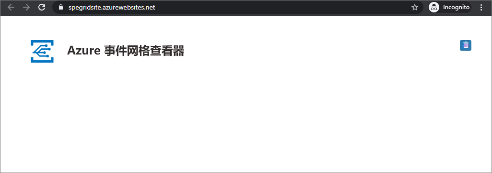

# <a name="build-your-own-disaster-recovery-for-custom-topics-in-event-grid"></a>为事件网格中的自定义主题构建自己的灾难恢复方案
灾难恢复侧重于从严重的应用程序功能丧失中恢复。 本教程逐步讲解如何设置事件处理体系结构，以便在特定区域中的事件网格服务不正常时能够予以恢复。

本教程将介绍如何为事件网格中的自定义主题创建主动-被动故障转移体系结构。 实现故障转移的方式为：在两个区域之间镜像主题和订阅，然后管理当某个主题不正常时执行的故障转移。 本教程中的体系结构可故障转移所有新流量。 必须注意，使用此设置时，在有问题的区域再次正常之前，正在进行的事件不可恢复。

> [!NOTE]
> 事件网格现在支持服务器端的自动异地灾难恢复 (GeoDR)。 如果希望更好地控制故障转移过程，仍然可以实现客户端灾难恢复逻辑。 有关自动 GeoDR 的详细信息，请参阅 [Azure 事件网格中的服务器端异地灾难恢复](geo-disaster-recovery.md)。

## <a name="create-a-message-endpoint"></a>创建消息终结点

若要测试故障转移配置，需要使用一个终结点来接收事件。 该终结点不是故障转移基础结构的一部分，而是充当事件处理程序，以便于测试。

为了简化测试，请部署一个用于显示事件消息的[预生成 Web 应用](https://github.com/Azure-Samples/azure-event-grid-viewer)。 所部署的解决方案包括应用服务计划、应用服务 Web 应用和 GitHub 中的源代码。

1. 选择“部署到 Azure”  将解决方案部署到你的订阅。 在 Azure 门户中，为参数提供值。

   <a href="https://portal.azure.com/#create/Microsoft.Template/uri/https%3A%2F%2Fraw.githubusercontent.com%2FAzure-Samples%2Fazure-event-grid-viewer%2Fmaster%2Fazuredeploy.json" target="_blank"></a>

1. 部署可能需要几分钟才能完成。 部署成功后，请查看 Web 应用以确保它正在运行。 在 Web 浏览器中导航到 `https://<your-site-name>.azurewebsites.net`
请务必记下此 URL，因为稍后需要用到。

1. 查看站点，但是尚未有事件发布到它。

   

[!INCLUDE [event-grid-register-provider-portal.md](../../includes/event-grid-register-provider-portal.md)]


## <a name="create-your-primary-and-secondary-topics"></a>创建主要和辅助主题

首先创建两个事件网格主题。 这些主题充当主要和辅助主题。 默认情况下，事件将会通过主要主题传送。 如果主要区域中发生服务中断，次要区域将接管工作。

1. 登录到 [Azure 门户](https://portal.azure.com)。 

1. 在 Azure 主菜单的左上角，选择“所有服务”> 搜索“事件网格”> 选择“事件网格主题”。   

   

    选择“事件网格主题”旁边的星号，将其添加到资源菜单以方便将来进行访问。

1. 在“事件网格主题”菜单中，选择“+添加”以创建主要主题。 

   * 为该主题提供逻辑名称，并添加“-primary”后缀以方便跟踪。
   * 此主题的区域是主要区域。

     

1. 创建主题后，导航到该主题，并复制“主题终结点”。  稍后需要使用该 URI。

    

1. 获取主题的访问密钥，稍后需要用到。 在资源菜单中单击“访问密钥”并复制“密钥 1”。 

    

1. 在“主题”边栏选项卡中，单击“+事件订阅”以创建订阅连接，用于订阅在本教程的先决条件部分所创建的事件接收者网站。 

   * 为事件订阅提供逻辑名称，并添加“-primary”后缀以方便跟踪。
   * 选择终结点类型 Web Hook。
   * 将终结点设置为事件接收者的事件 URL，类似于 `https://<your-event-reciever>.azurewebsites.net/api/updates`

     

1. 重复相同的流程以创建辅助主题和订阅。 这一次，请将“-primary”后缀替换为“-secondary”以方便跟踪。 最后，请确保将它们放在不同的 Azure 区域。 尽管可将其放在任何位置，但建议使用 [Azure 配对区域](../best-practices-availability-paired-regions.md)。 将辅助主题和订阅放在不同的区域可确保即使主要区域出现故障，也仍可传送新事件。

现在，应已准备好以下各项：

   * 用于测试的事件接收者网站。
   * 主要区域中的主要主题。
   * 用于将主要主题连接到事件接收者网站的主要事件订阅。
   * 次要区域中的辅助主题。
   * 用于将主要主题连接到事件接收者网站的辅助事件订阅。

## <a name="implement-client-side-failover"></a>实现客户端故障转移

设置一对区域冗余的主题和订阅后，可以实现客户端故障转移。 可通过多种方式实现故障转移，但所有方式都有一个共同的特征：如果一个主题不再正常，流量将重定向到其他主题。

### <a name="basic-client-side-implementation"></a>基本的客户端实现

以下示例代码是一个简单的 .NET 发布者，它始终尝试先发布到主要主题。 如果不成功，则故障转移辅助主题。 在任一情况下，它还会针对 `https://<topic-name>.<topic-region>.eventgrid.azure.net/api/health` 执行 GET，以检查另一主题的运行状况 API。 针对 **/api/health** 终结点执行 GET 后，正常的主题应该始终以 **200 OK** 做出响应。

```csharp
using System;
using System.Net.Http;
using System.Collections.Generic;
using Microsoft.Azure.EventGrid;
using Microsoft.Azure.EventGrid.Models;
using Newtonsoft.Json;

namespace EventGridFailoverPublisher
{
    // This captures the "Data" portion of an EventGridEvent on a custom topic
    class FailoverEventData
    {
        [JsonProperty(PropertyName = "teststatus")]
        public string TestStatus { get; set; }
    }

    class Program
    {
        static void Main(string[] args)
        {
            // TODO: Enter the endpoint each topic. You can find this topic endpoint value
            // in the "Overview" section in the "Event Grid Topics" blade in Azure Portal..
            string primaryTopic = "https://<primary-topic-name>.<primary-topic-region>.eventgrid.azure.net/api/events";
            string secondaryTopic = "https://<secondary-topic-name>.<secondary-topic-region>.eventgrid.azure.net/api/events";

            // TODO: Enter topic key for each topic. You can find this in the "Access Keys" section in the
            // "Event Grid Topics" blade in Azure Portal.
            string primaryTopicKey = "<your-primary-topic-key>";
            string secondaryTopicKey = "<your-secondary-topic-key>";

            string primaryTopicHostname = new Uri( primaryTopic).Host;
            string secondaryTopicHostname = new Uri(secondaryTopic).Host;

            Uri primaryTopicHealthProbe = new Uri("https://" + primaryTopicHostname + "/api/health");
            Uri secondaryTopicHealthProbe = new Uri("https://" + secondaryTopicHostname + "/api/health");

            var httpClient = new HttpClient();

            try
            {
                TopicCredentials topicCredentials = new TopicCredentials(primaryTopicKey);
                EventGridClient client = new EventGridClient(topicCredentials);

                client.PublishEventsAsync(primaryTopicHostname, GetEventsList()).GetAwaiter().GetResult();
                Console.Write("Published events to primary Event Grid topic.");

                HttpResponseMessage health = httpClient.GetAsync(secondaryTopicHealthProbe).Result;
                Console.Write("\n\nSecondary Topic health " + health);
            }
            catch (Microsoft.Rest.Azure.CloudException e)
            {
                TopicCredentials topicCredentials = new TopicCredentials(secondaryTopicKey);
                EventGridClient client = new EventGridClient(topicCredentials);

                client.PublishEventsAsync(secondaryTopicHostname, GetEventsList()).GetAwaiter().GetResult();
                Console.Write("Published events to secondary Event Grid topic. Reason for primary topic failure:\n\n" + e);

                HttpResponseMessage health = httpClient.GetAsync(primaryTopicHealthProbe).Result;
                Console.Write("\n\nPrimary Topic health " + health);
            }

            Console.ReadLine();
        }

        static IList<EventGridEvent> GetEventsList()
        {
            List<EventGridEvent> eventsList = new List<EventGridEvent>();

            for (int i = 0; i < 5; i++)
            {
                eventsList.Add(new EventGridEvent()
                {
                    Id = Guid.NewGuid().ToString(),
                    EventType = "Contoso.Failover.Test",
                    Data = new FailoverEventData()
                    {
                        TestStatus = "success"
                    },
                    EventTime = DateTime.Now,
                    Subject = "test" + i,
                    DataVersion = "2.0"
                });
            }

            return eventsList;
        }
    }
}
```

### <a name="try-it-out"></a>试用

准备好所有组件后，可以测试故障转移实现。 在 Visual Studio Code 或偏好的环境中运行上述示例。 将以下四个值替换为主题中的终结点和密钥：

   * primaryTopic - 主要主题的终结点。
   * secondaryTopic - 辅助主题的终结点。
   * primaryTopicKey - 主要主题的密钥。
   * secondaryTopicKey - 辅助主题的密钥。

尝试运行事件发布者。 应会看到，测试事件开始进入事件网格查看器，如下所示。


为确保故障转移正常进行，可以更改主要主题密钥中的几个字符，使密钥不再有效。 再次尝试运行发布者。 应该仍会看到新事件出现在事件网格查看器中，但在控制台中，会看到这些事件现在是通过辅助主题发布的。

### <a name="possible-extensions"></a>可能的延伸

可根据需要，通过多种方式延伸此示例。 对于高流量方案，可能需要定期独立检查主题的运行状况 API。 这样，当某个主题出现故障时，就不需要在每次发布时检查该 API。 知道某个主题不正常后，可以默认发布到辅助主题。

同样，可以根据具体的需要实现故障回复逻辑。 如果发布到最靠近的数据中心对于降低延迟而言至关重要，可以定期探测已故障转移的主题的运行状况 API。 该主题恢复正常后，即可放心地故障回复到附近的数据中心。

## <a name="next-steps"></a>后续步骤

- 了解如何[在 HTTP 终结点上接收事件](./receive-events.md)
- 了解如何[将事件路由到混合连接](./custom-event-to-hybrid-connection.md)
- 了解如何[使用 Azure DNS 和流量管理器进行灾难恢复](https://docs.microsoft.com/azure/networking/disaster-recovery-dns-traffic-manager)
