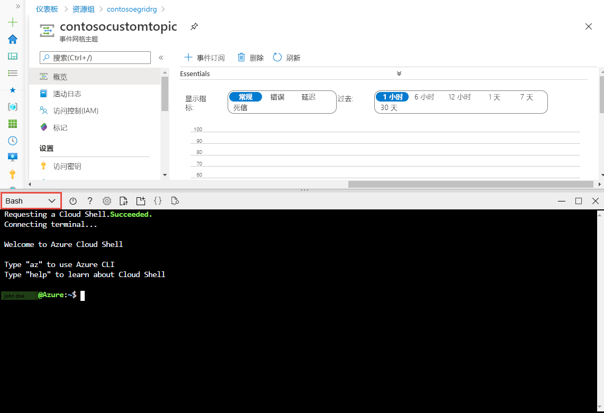

# <a name="quickstart-route-custom-events-to-web-endpoint-with-the-azure-portal-and-event-grid"></a>快速入门：使用 Azure 门户和事件网格将自定义事件路由到 Web 终结点

Azure 事件网格是针对云的事件处理服务。 在本文中，将使用 Azure 门户创建一个自定义主题，然后订阅该自定义主题，再触发可查看结果的事件。 通常，你会将事件发送到处理事件数据并执行操作的终结点。 但是，为了简化本文，你将事件发送到收集并显示消息的 Web 应用。

## <a name="prerequisites"></a>先决条件
[!INCLUDE [quickstarts-free-trial-note.md](../../includes/quickstarts-free-trial-note.md)]

[!INCLUDE [event-grid-register-provider-portal.md](../../includes/event-grid-register-provider-portal.md)]

## <a name="create-a-custom-topic"></a>创建自定义主题

事件网格主题提供用户定义的终结点，可向其发布事件。 

1. 登录到 [Azure 门户](https://portal.azure.com/)。
2. 在主题的搜索栏中，键入“事件网格主题”，然后从下拉列表中选择“事件网格主题” 。 

    :::image type="content" source="./media/custom-event-quickstart-portal/select-event-grid-topics.png" alt-text="搜索并选择“事件网格主题”":::
3. 在“事件网格主题”页上的工具栏中选择“添加”。  

    :::image type="content" source="./media/custom-event-quickstart-portal/add-event-grid-topic-button.png" alt-text="“添加事件网格主题”按钮":::
4. 在“创建主题”页上执行以下步骤：
    1. 选择 **Azure 订阅**。
    2. 选择现有的资源组，或者选择“新建”并输入**资源组**的**名称**。
    3. 为自定义主题提供唯一的**名称**。 主题名称必须唯一，因为它由 DNS 条目表示。 请不要使用图中所示的名称。 而是创建自己的名称 - 它必须介于 3 到 50 个字符之间，并且只包含值 a-z、A-Z、0-9 和“-”。
    4. 选择事件网格主题的**位置**。
    5. 在页面底部选择“查看 + 创建”。 

        :::image type="content" source="./media/custom-event-quickstart-portal/create-custom-topic.png" alt-text="“创建主题”页":::
    6. 在“创建主题”页的“查看 + 创建”选项卡上，选择“创建”  。 
    
        :::image type="content" source="./media/custom-event-quickstart-portal/review-create-page.png" alt-text="查看设置并创建":::
5. 部署成功后，在搜索栏中再次键入“事件网格主题”，然后像之前一样从下拉列表中选择“事件网格主题” 。 
6. 选择从列表中创建的主题。 

    :::image type="content" source="./media/custom-event-quickstart-portal/select-event-grid-topic.png" alt-text="从列表中选择主题":::

7. 此时会显示主题的“事件网格主题”页。 请将此页保持打开状态， 稍后在本快速入门中需要使用此页。 

    :::image type="content" source="./media/custom-event-quickstart-portal/event-grid-topic-home-page.png" alt-text="“事件网格主题”主页":::

## <a name="create-a-message-endpoint"></a>创建消息终结点
在为自定义主题创建订阅之前，请先创建事件消息的终结点。 通常情况下，终结点基于事件数据执行操作。 为了简化此快速入门，将部署用于显示事件消息的[预建的 Web 应用](https://github.com/Azure-Samples/azure-event-grid-viewer)。 所部署的解决方案包括应用服务计划、应用服务 Web 应用和 GitHub 中的源代码。

1. 在项目页中，选择“部署到 Azure”以将解决方案部署到订阅。 在 Azure 门户中，为参数提供值。

   <a href="https://portal.azure.com/#create/Microsoft.Template/uri/https%3A%2F%2Fraw.githubusercontent.com%2FAzure-Samples%2Fazure-event-grid-viewer%2Fmaster%2Fazuredeploy.json" target="_blank"></a>
1. 部署可能需要几分钟才能完成。 部署成功后，请查看 Web 应用以确保它正在运行。 在 Web 浏览器中导航到 `https://<your-site-name>.azurewebsites.net`

    如果部署失败，请查看错误消息。 这是因为网站名称已被占用。 再次部署模板，然后为网站选择其他名称。 
1. 查看站点，但是尚未有事件发布到它。

   

## <a name="subscribe-to-custom-topic"></a>订阅自定义主题

订阅事件网格主题，以告知事件网格要跟踪哪些事件，以及要将事件发送到何处。

1. 现在，请在自定义主题的“事件网格主题”页上的工具栏中，选择“+ 事件订阅”。 

    :::image type="content" source="./media/custom-event-quickstart-portal/new-event-subscription.png" alt-text="添加“事件订阅”按钮":::
2. 在“创建事件订阅”页上执行以下步骤：
    1. 输入事件订阅的“名称”。
    3. 对于“终结点类型”，请选择“Web Hook”。  
    4. 选择“选择终结点”。 

        :::image type="content" source="./media/custom-event-quickstart-portal/provide-subscription-values.png" alt-text="提供事件订阅值":::
    5. 对于 Webhook 终结点，请提供你的 Web 应用的 URL，并将 `api/updates` 添加到主页 URL。 选择“确认所选内容”。

        :::image type="content" source="./media/custom-event-quickstart-portal/provide-endpoint.png" alt-text="提供终结点 URL":::
    6. 返回“创建事件订阅”页，选择“创建”。 

3. 再次查看 Web 应用，并注意现已向该应用发送了订阅验证事件。 选择眼睛图标以展开事件数据。 事件网格发送验证事件，以便终结点可以验证它是否想要接收事件数据。 Web 应用包含用于验证订阅的代码。

    

## <a name="send-an-event-to-your-topic"></a>向主题发送事件

现在，让我们触发一个事件，看事件网格如何将消息分发到终结点。 使用 Azure CLI 或 PowerShell 向自定义主题发送测试性事件。 通常情况下，应用程序或 Azure 服务会发送事件数据。

第一个示例使用 Azure CLI。 它获取自定义主题的 URL 和密钥，以及示例事件数据。 将自定义主题名称用于 `<topic name>`。 它将创建示例事件数据。 JSON 的 `data` 元素是事件的有效负载。 可以将任何格式正确的 JSON 置于此字段中。 也可将主题字段用于高级路由和筛选。 CURL 是发送 HTTP 请求的实用工具。


### <a name="azure-cli"></a>Azure CLI
1. 在 Azure 门户中选择“Cloud Shell”。 Cloud Shell 在 Web 浏览器的底部窗格中打开。 

    :::image type="content" source="./media/custom-event-quickstart-portal/select-cloud-shell.png" alt-text="选择 Cloud Shell 图标":::
1. 在 Cloud Shell 窗口的左上角选择“Bash”。 

    
1. 运行以下命令以获取主题的**终结点**：复制并粘贴该命令后，更新**主题名称**和**资源组名称**，然后运行该命令。 将把示例事件发布到此主题终结点。 

    ```azurecli
    endpoint=$(az eventgrid topic show --name <topic name> -g <resource group name> --query "endpoint" --output tsv)
    ```
2. 运行以下命令以获取自定义主题的**密钥**：复制并粘贴该命令后，更新**主题名称**和**资源组名称**，然后运行该命令。 这是事件网格主题的主密钥。 要从 Azure 门户获取此密钥，请切换到“事件网格主题”页的“访问密钥”选项卡 。 要将事件发布到自定义主题，需要访问密钥。 

    ```azurecli
    key=$(az eventgrid topic key list --name <topic name> -g <resource group name> --query "key1" --output tsv)
    ```
3. 复制以下包含事件定义的语句，然后按 **ENTER**。 

    ```json
    event='[ {"id": "'"$RANDOM"'", "eventType": "recordInserted", "subject": "myapp/vehicles/motorcycles", "eventTime": "'`date +%Y-%m-%dT%H:%M:%S%z`'", "data":{ "make": "Ducati", "model": "Monster"},"dataVersion": "1.0"} ]'
    ```
4. 运行以下 **Curl** 命令以发布事件：在命令中，`aeg-sas-key` 标头设置为之前获得的访问密钥。 

    ```
    curl -X POST -H "aeg-sas-key: $key" -d "$event" $endpoint
    ```

### <a name="azure-powershell"></a>Azure PowerShell
第二个示例使用 PowerShell，执行的步骤类似。

1. 在 Azure 门户中选择“Cloud Shell”（或者转到 `https://shell.azure.com/`）。 Cloud Shell 在 Web 浏览器的底部窗格中打开。 

    :::image type="content" source="./media/custom-event-quickstart-portal/select-cloud-shell.png" alt-text="选择 Cloud Shell 图标":::
1. 在 Cloud Shell 中，选择 Cloud Shell 窗口的左上角的“PowerShell” 。 参阅“Azure CLI”部分的示例 **Cloud Shell** 窗口图像。
2. 设置以下变量。 复制并粘贴每个命令后，更新**主题名称**和**资源组名称**，然后运行该命令：

    资源组：
    ```powershell
    $resourceGroupName = "<resource group name>"
    ```

    事件网格主题名称：    
    ```powershell
    $topicName = "<topic name>"
    ```
3. 运行以下命令以获取主题的**终结点**和**密钥**：

    ```powershell
    $endpoint = (Get-AzEventGridTopic -ResourceGroupName $resourceGroupName -Name $topicName).Endpoint
    $keys = Get-AzEventGridTopicKey -ResourceGroupName $resourceGroupName -Name $topicName
    ```
4. 准备事件。 在 Cloud Shell 窗口中复制并运行这些语句。 

    ```powershell
    $eventID = Get-Random 99999

    #Date format should be SortableDateTimePattern (ISO 8601)
    $eventDate = Get-Date -Format s

    #Construct body using Hashtable
    $htbody = @{
        id= $eventID
        eventType="recordInserted"
        subject="myapp/vehicles/motorcycles"
        eventTime= $eventDate   
        data= @{
            make="Ducati"
            model="Monster"
        }
        dataVersion="1.0"
    }
    
    #Use ConvertTo-Json to convert event body from Hashtable to JSON Object
    #Append square brackets to the converted JSON payload since they are expected in the event's JSON payload syntax
    $body = "["+(ConvertTo-Json $htbody)+"]"
    ```
5. 使用 **Invoke-WebRequest** cmdlet 发送事件。 

    ```powershell
    Invoke-WebRequest -Uri $endpoint -Method POST -Body $body -Headers @{"aeg-sas-key" = $keys.Key1}
    ```

### <a name="verify-in-the-event-grid-viewer"></a>在事件网格查看器中验证
现已触发事件，并且事件网格已将消息发送到订阅时配置的终结点。 查看 Web 应用以查看刚刚发送的事件。

:::image type="content" source="./media/custom-event-quickstart-portal/event-grid-viewer-end.png" alt-text="事件网格查看器":::

## <a name="clean-up-resources"></a>清理资源
如果打算继续处理此事件，请不要清除本文中创建的资源。 否则，请删除本文中创建的资源。

1. 在左侧菜单中选择“资源组”。 如果左侧菜单中未显示此选项，请在左侧菜单中选择“所有服务”，然后选择“资源组”。  

    
1. 选择资源组以启动“资源组”页。 
1. 在工具栏中选择“删除资源组”。 
1. 输入资源组的名称以确认删除，然后选择“删除”。 

    图中显示的另一个资源组是 Cloud Shell 窗口创建并使用的。 如果你以后不打算使用 Cloud Shell 窗口，请删除该资源组。 

## <a name="next-steps"></a>后续步骤

了解如何创建自定义主题和事件订阅后，请详细了解事件网格的功能：

- [关于事件网格](overview.md)
- [将 Blob 存储事件路由到自定义 Web 终结点](../storage/blobs/storage-blob-event-quickstart.md?toc=%2fazure%2fevent-grid%2ftoc.json)
- [通过 Azure 事件网格和逻辑应用监视虚拟机的更改](monitor-virtual-machine-changes-event-grid-logic-app.md)
- [将大数据流式传输到数据仓库](event-grid-event-hubs-integration.md)
