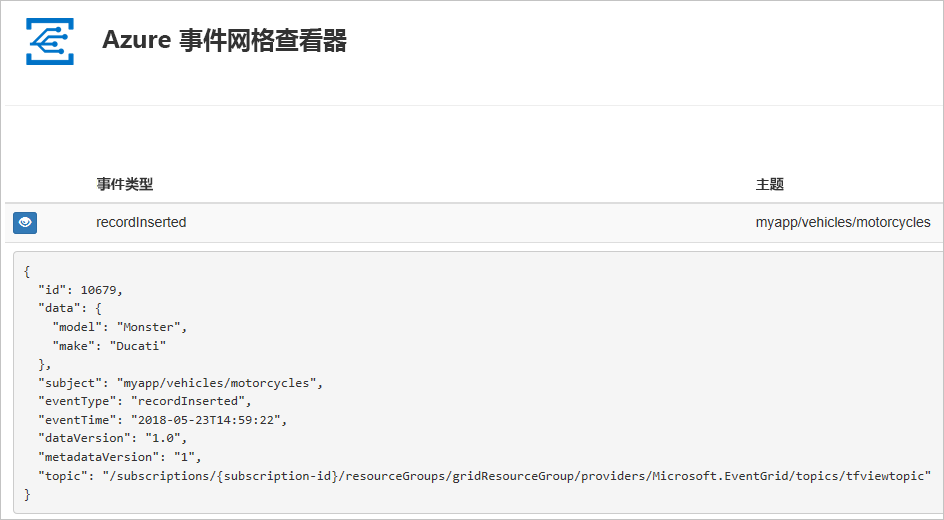
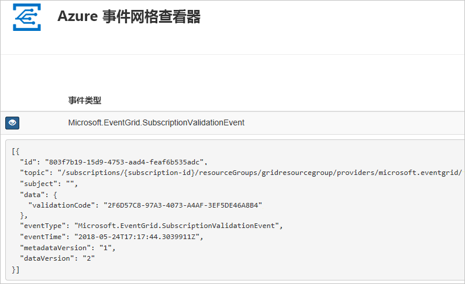

# <a name="quickstart-route-custom-events-to-web-endpoint-with-azure-cli-and-event-grid"></a>快速入门：使用 Azure CLI 和事件网格将自定义事件路由到 Web 终结点

Azure 事件网格是针对云的事件处理服务。 在本文中，将使用 Azure CLI 创建一个自定义主题，然后订阅该自定义主题，再触发可查看结果的事件。

通常，你会将事件发送到处理事件数据并执行操作的终结点。 但是，为了简化本文，你将事件发送到收集并显示消息的 Web 应用。

完成后即可看到事件数据已发送到 Web 应用。



[!INCLUDE [quickstarts-free-trial-note.md](../../includes/quickstarts-free-trial-note.md)]

[!INCLUDE [cloud-shell-try-it.md](../../includes/cloud-shell-try-it.md)]

如果选择在本地安装并使用 CLI，本文需要运行最新版 Azure CLI（2.0.70 或更高版本）。 要查找版本，请运行 `az --version`。 如果需要进行安装或升级，请参阅[安装 Azure CLI](/cli/azure/install-azure-cli)。

如果不使用 Cloud Shell，则必须先使用 `az login` 登录。

## <a name="create-a-resource-group"></a>创建资源组

事件网格主题是 Azure 资源，必须放置在 Azure 资源组中。 该资源组是在其中部署和管理 Azure 资源的逻辑集合。

使用“[az group create](/cli/azure/group#az-group-create)”命令创建资源组。 

以下示例在“westus2”  位置创建名为“gridResourceGroup”  的资源组。

```azurecli-interactive
az group create --name gridResourceGroup --location westus2
```

[!INCLUDE [event-grid-register-provider-cli.md](../../includes/event-grid-register-provider-cli.md)]

## <a name="create-a-custom-topic"></a>创建自定义主题

事件网格主题提供用户定义的终结点，可向其发布事件。 以下示例在资源组中创建自定义主题。 用主题的唯一名称替换 `<your-topic-name>`。 自定义主题名称必须唯一，因为它是 DNS 条目的一部分。 此外，它必须介于 3 到 50 个字符之间，并且只包含值 a-z、A-Z、0-9 和“-”

```azurecli-interactive
topicname=<your-topic-name>

az eventgrid topic create --name $topicname -l westus2 -g gridResourceGroup
```

## <a name="create-a-message-endpoint"></a>创建消息终结点

在订阅自定义主题之前，让我们创建事件消息的终结点。 通常情况下，终结点基于事件数据执行操作。 为了简化此快速入门，将部署用于显示事件消息的[预建的 Web 应用](https://github.com/Azure-Samples/azure-event-grid-viewer)。 所部署的解决方案包括应用服务计划、应用服务 Web 应用和 GitHub 中的源代码。

将 `<your-site-name>` 替换为 Web 应用的唯一名称。 Web 应用名称必须唯一，因为它是 DNS 条目的一部分。

```azurecli-interactive
sitename=<your-site-name>

az group deployment create \
  --resource-group gridResourceGroup \
  --template-uri "https://raw.githubusercontent.com/Azure-Samples/azure-event-grid-viewer/master/azuredeploy.json" \
  --parameters siteName=$sitename hostingPlanName=viewerhost
```

部署可能需要几分钟才能完成。 部署成功后，请查看 Web 应用以确保它正在运行。 在 Web 浏览器中导航到 `https://<your-site-name>.azurewebsites.net`

应会看到站点上当前未显示任何消息。

## <a name="subscribe-to-a-custom-topic"></a>订阅自定义主题

订阅事件网格主题，以告知事件网格要跟踪哪些事件，以及要将这些事件发送到何处。 以下示例将订阅所创建的自定义主题，并将 Web 应用中的 URL 作为事件通知的终结点传递。

Web 应用的终结点必须包括后缀 `/api/updates/`。

```azurecli-interactive
endpoint=https://$sitename.azurewebsites.net/api/updates

az eventgrid event-subscription create \
  --source-resource-id "/subscriptions/{subscription-id}/resourceGroups/{resource-group}/providers/Microsoft.EventGrid/topics/$topicname" 
  --name demoViewerSub 
  --endpoint $endpoint
  
```

再次查看 Web 应用，并注意现已向该应用发送了订阅验证事件。 选择眼睛图标以展开事件数据。 事件网格发送验证事件，以便终结点可以验证它是否想要接收事件数据。 Web 应用包含用于验证订阅的代码。




## <a name="send-an-event-to-your-custom-topic"></a>向自定义主题发送事件

让我们触发一个事件，看看事件网格如何将消息分发到终结点。 首先，让我们获取自定义主题的 URL 和密钥。

```azurecli-interactive
endpoint=$(az eventgrid topic show --name $topicname -g gridResourceGroup --query "endpoint" --output tsv)
key=$(az eventgrid topic key list --name $topicname -g gridResourceGroup --query "key1" --output tsv)
```

为简化本文，将使用要发送到自定义主题的示例事件数据。 通常情况下，应用程序或 Azure 服务会发送事件数据。 以下示例创建示例事件数据：

```azurecli-interactive
event='[ {"id": "'"$RANDOM"'", "eventType": "recordInserted", "subject": "myapp/vehicles/motorcycles", "eventTime": "'`date +%Y-%m-%dT%H:%M:%S%z`'", "data":{ "make": "Ducati", "model": "Monster"},"dataVersion": "1.0"} ]'
```

JSON 的 `data` 元素是事件的有效负载。 可以将任何格式正确的 JSON 置于此字段中。 也可将主题字段用于高级路由和筛选。

CURL 是发送 HTTP 请求的实用工具。 本文使用 CURL 向主题发送事件。 

```azurecli-interactive
curl -X POST -H "aeg-sas-key: $key" -d "$event" $endpoint
```

现已触发事件，并且事件网格已将消息发送到订阅时配置的终结点。 查看 Web 应用以查看刚刚发送的事件。

```json
[{
  "id": "1807",
  "eventType": "recordInserted",
  "subject": "myapp/vehicles/motorcycles",
  "eventTime": "2017-08-10T21:03:07+00:00",
  "data": {
    "make": "Ducati",
    "model": "Monster"
  },
  "dataVersion": "1.0",
  "metadataVersion": "1",
  "topic": "/subscriptions/{subscription-id}/resourceGroups/{resource-group}/providers/Microsoft.EventGrid/topics/{topic}"
}]
```

## <a name="clean-up-resources"></a>清理资源
如果打算继续处理此事件或事件查看器应用，请不要清除本文中创建的资源。 否则，请使用以下命令删除本文中创建的资源。

```azurecli-interactive
az group delete --name gridResourceGroup
```

## <a name="next-steps"></a>后续步骤

了解如何创建主题和事件订阅以后，即可进一步学习事件网格的功能：

- [关于事件网格](overview.md)
- [将 Blob 存储事件路由到自定义 Web 终结点](../storage/blobs/storage-blob-event-quickstart.md?toc=%2fazure%2fevent-grid%2ftoc.json)
- [通过 Azure 事件网格和逻辑应用监视虚拟机的更改](monitor-virtual-machine-changes-event-grid-logic-app.md)
- [将大数据流式传输到数据仓库](event-grid-event-hubs-integration.md)
