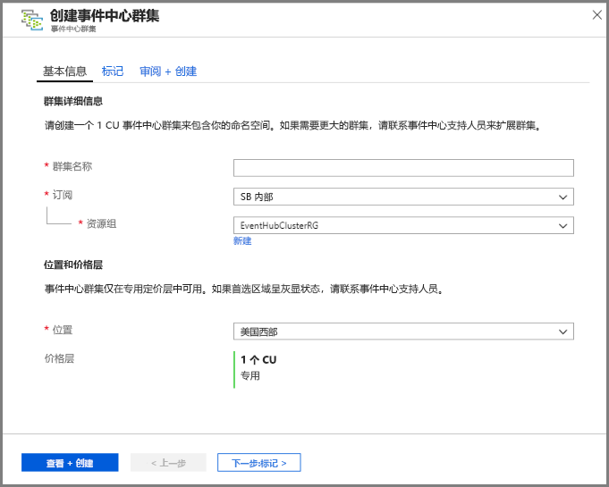
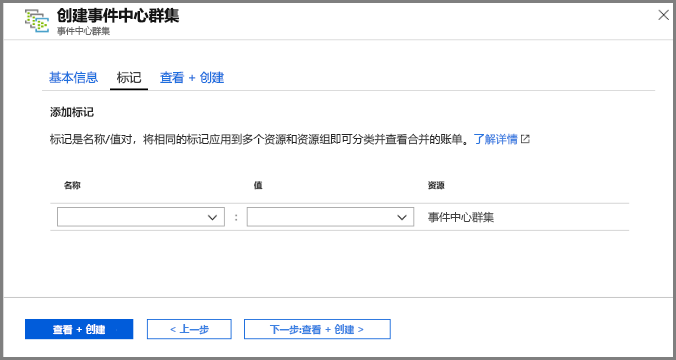
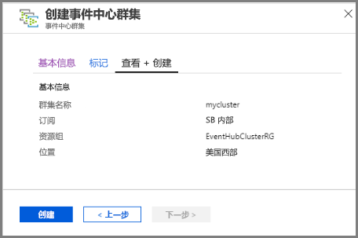
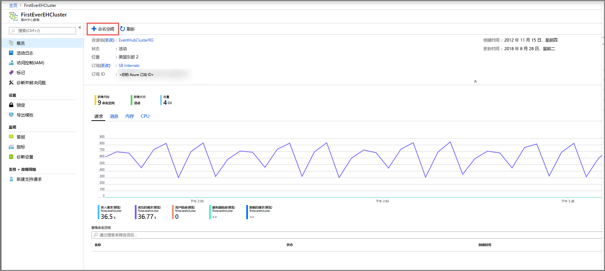
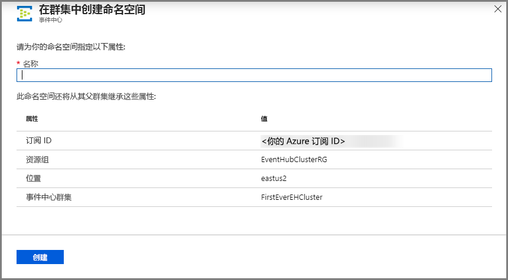
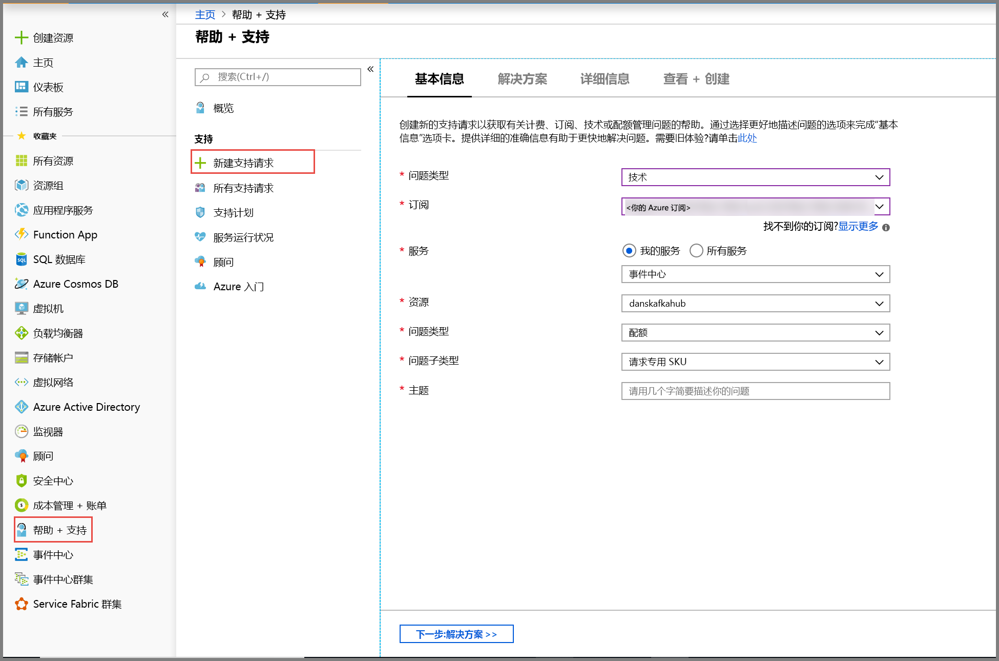

# 快速入门：使用 Azure 门户创建事件中心专用群集 
事件中心群集提供单租户部署来满足客户的苛刻流式处理要求。 此套餐提供有保障的 99.99% SLA，只能在专用定价层上使用。 [事件中心群集](event-hubs-dedicated-overview.md)每秒能够引入数百万个事件，且提供有保障的容量和亚秒级的延迟。 在群集中创建的命名空间和事件中心不仅包括标准套餐的所有功能，而且不存在任何引入限制。 专用套餐还免费随附了热门的[事件中心捕获](event-hubs-capture-overview.md)功能，可让你自动批处理数据流并将其记录到 [Azure Blob 存储](../storage/blobs/storage-blobs-introduction.md)或 [Azure Data Lake Storage Gen 1](../data-lake-store/data-lake-store-overview.md)。

专用群集是按**容量单位 (CU)** 预配和计费的，并预先分配了 CPU 数量和内存资源量。 可为每个群集购买 1、2、4、8、12、16 或 20 个 CU。 本快速入门将详细介绍如何通过 Azure 门户创建一个 1 CU 事件中心群集。

> [!NOTE]
> [Azure 门户](https://aka.ms/eventhubsclusterquickstart)目前提取此自助体验的预览版。 如果对专用套餐存有疑问，请联系[事件中心团队](mailto:askeventhubs@microsoft.com)。

## 必备条件
若要完成本快速入门，请确保具备以下项：

- 一个 Azure 帐户。 如果没有帐户，请在开始之前[购买一个帐户](https://azure.microsoft.com/pricing/purchase-options/pay-as-you-go/)。 此功能不支持免费的 Azure 帐户。 
- [Visual Studio](https://visualstudio.microsoft.com/vs/) 2017 Update 3（版本 15.3 (26730.01)）或更高版本。
- [.NET Standard SDK](https://dotnet.microsoft.com/download) 2.0 或更高版本。
- [已创建资源组](../event-hubs/event-hubs-create.md#create-a-resource-group)。

## 创建事件中心专用群集
事件中心群集提供唯一的范围容器，可以在该容器中创建一个或多个命名空间。 在门户的自助体验的这个预览阶段，可以在所选区域中创建 1 CU 群集。 如果需要大于 1 CU 的群集，可以提交 Azure 支持请求，以便在创建群集后将其纵向扩展。

若要使用 Azure 门户在资源组中创建群集，请完成以下步骤：

1. 单击[此链接](https://aka.ms/eventhubsclusterquickstart)，在 Azure 门户中创建群集。 与之相反，也可在左侧导航窗格中选择“所有服务”，接着在搜索栏中键入“事件中心群集”，然后从结果列表中选择“事件中心群集”。 
2. 在“创建群集”页上配置以下内容： 
    1. 输入**群集的名称**。 系统会立即检查该名称是否可用。
    2. 选择要在其中创建群集的**订阅**。
    3. 选择要在其中创建群集的**资源组**。
    4. 选择群集的**位置**。 如果首选区域灰显，则表明该区域容量出现暂时性不足的情况，请向事件中心团队提交[支持请求](#submit-a-support-request)。
    5. 选择页面底部的“下一步:  标记”按钮。 可能需要等待几分钟让系统完全预配资源。

        
3. 在“标记”页上配置以下内容： 
    1. 输入要添加的标记的**名称**和**值**。 此步骤是**可选的**。  
    2. 选择“查看 + 创建”按钮。 

        
4. 在“查看 + 创建”页上查看详细信息，然后选择“创建”。   

    

## 在群集中创建命名空间和事件中心

1. 若要在群集中创建命名空间，请在群集的“事件中心群集”页上，从顶部菜单中选择“+命名空间”。  

    
2. 在“创建命名空间”页上执行以下步骤：
    1. 输入**命名空间的名称**。  系统会检查该名称是否可用。
    2. 命名空间继承以下属性：
        1. 订阅 ID
        2. 资源组
        3. 位置
        4. 群集名称
    3. 选择“创建”以创建命名空间。  现在你可以管理该群集。  

        
3. 创建命名空间后，可以像平时在命名空间中所做的那样[创建事件中心](event-hubs-create.md#create-an-event-hub)。 

## 提交支持请求

若要在创建群集后更改群集大小，或者首选区域不可用，请按以下步骤提交支持请求：

1. 在 [Azure 门户](https://portal.azure.com)的左侧菜单中选择“帮助 + 支持”。 
2. 在“支持”菜单中选择“+ 新建支持请求”。 
3. 在“支持”页上执行以下步骤：
    1. 对于“问题类型”，请从下拉列表中选择“技术”。  
    2. 对于“订阅”，请选择自己的订阅。 
    3. 对于“服务”，请选择“我的服务”，然后选择“事件中心”。   
    4. 对于“资源”，如果你的群集已存在，请选择该群集；否则请选择“一般性问题/资源不可用”。  
    5. 对于“问题类型”，请选择“配额”。  
    6. 对于“问题子类型”，请从下拉列表中选择以下值之一： 
        1. 选择“专用 SKU 请求”，以请求在你所在的区域中支持该功能。 
        2. 如果你想要纵向扩展或缩减专用群集，请选择“请求纵向扩展或缩减专用群集”。  
    7. 在“主题”中描述问题。 

        

 ## 删除专用群集
 
1. 若要删除群集，请在顶部菜单中选择“删除”。  请注意，群集在创建以后，需支付至少 4 小时的使用费用。 
2. 随后会显示一条消息，要求你确认是否要删除该群集。
3. 键入**群集名称**并选择“删除”即可删除该群集。 

    

## 后续步骤
在本文中，你已创建一个事件中心群集。 有关在事件中心发送和接收事件，以及将事件捕获到 Azure 存储或 Azure Data Lake Store 的分步说明，请参阅以下教程：

- [在 .NET Core 中发送和接收事件](event-hubs-dotnet-standard-getstarted-send.md)
- [使用 Azure 门户启用事件中心捕获](event-hubs-capture-enable-through-portal.md)
- [使用适用于 Apache Kafka 的 Azure 事件中心](event-hubs-for-kafka-ecosystem-overview.md)
