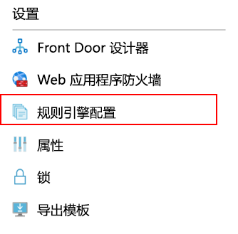

# <a name="configure-your-rules-engine"></a>配置规则引擎

本文提供在 Azure 门户和 CLI 中创建规则引擎配置和第一个规则的步骤。 

## <a name="configure-rules-engine-in-azure-portal"></a>在 Azure 门户中配置规则引擎
1. 在创建规则引擎配置之前，[创建一个 Front Door](quickstart-create-front-door.md)。

2. 在你的 Front Door 资源中，转到“设置”，然后选择“规则引擎配置”。 单击“添加”，为配置命名，然后开始创建你的第一个规则引擎配置。

    

3. 单击“添加规则”，创建你的一个规则。 然后即可通过单击“添加条件”或“添加操作”来定义规则。
    
    > [!NOTE]
    >- 若要从规则中删除条件或操作，请使用特定条件或操作右侧的垃圾桶。
    > - 若要创建适用于所有传入流量的规则，请不要指定任何条件。
    > - 若要在满足第一个匹配条件后停止对规则进行评估，请选中“停止评估剩余规则”。 如果选中了此规则，且满足特定规则的所有匹配条件，那么配置中的剩余规则将不会执行。  

     

4. 使用“上移”、“下移”和“移至顶部”按钮来确定配置中的规则的优先级。 优先级按升序排序，即首先列出的规则是最重要的规则。

5. 创建一个或多个规则后，按“保存”。 此操作将创建规则引擎配置。

6. 创建一个或多个配置后，请将规则引擎配置与路由规则关联起来。 虽然一个配置可以应用于多个路由规则，但一个路由规则只能包含一个规则引擎配置。 若要进行关联，请转到“Front Door 设计器” > “路由规则”。 选择要向其中添加规则引擎配置的路由规则，转到“路由详细信息” > “规则引擎配置”，然后选择要关联的配置。

    


## <a name="configure-rules-engine-in-azure-cli"></a>在 Azure CLI 中配置规则引擎

1. 安装 [Azure CLI](https://docs.microsoft.com/cli/azure/install-azure-cli?view=azure-cli-latest)（如果尚未安装）。 添加“front-door”扩展：- az extension add --name front-door。 然后，登录并切换到你的订阅：az account set --subscription <name_or_Id>。

2. 首先创建规则引擎 - 此示例显示的规则包含一个基于标头的操作和一个匹配条件。 

```azurecli-interactive
az network front-door rules-engine rule create -f {front_door} -g {resource_group} --rules-engine-name {rules_engine} --name {rule1} --priority 1 --action-type RequestHeader --header-action Overwrite --header-name Rewrite --header-value True --match-variable RequestFilenameExtension --operator Contains --match-values jpg png --transforms Lowercase
```

3. 列出所有规则。 

```azurecli-interactive
az network front-door rules-engine rule list -f {front_door} -g {rg} --name {rules_engine}
```

4. 添加一项转发路由替代操作。 

```azurecli-interactive
az network front-door rules-engine rule action add -f {front_door} -g {rg} --rules-engine-name {rules_engine} --name {rule1} --action-type ForwardRouteOverride --backend-pool {backend_pool_name} --caching Disabled
```

5. 列出规则中的所有操作。 

```azurecli-interactive
az network front-door rules-engine rule action list -f {front_door} -g {rg} -r {rules_engine} --name {rule1}
```

6. 将规则引擎配置关联到路由规则。  

```azurecli-interactive
az network front-door routing-rule update -g {rg} -f {front_door} -n {routing_rule_name} --rules-engine {rules_engine}
```

7. 取消关联规则引擎。 

```azurecli-interactive
az network front-door routing-rule update -g {rg} -f {front_door} -n {routing_rule_name} --remove rulesEngine # case sensitive word ‘rulesEngine’
```

如需详细信息，可在[此处](https://docs.microsoft.com/cli/azure/ext/front-door/network/front-door/rules-engine?view=azure-cli-latest)查找 AFD 规则引擎命令的完整列表。   

## <a name="next-steps"></a>后续步骤

- 详细了解 [AFD 规则引擎](front-door-rules-engine.md)。 
- 了解如何[创建 Front Door](quickstart-create-front-door.md)。
- 了解 [Front Door 的工作原理](front-door-routing-architecture.md)。
- 在 AFD 规则引擎 [CLI 参考](https://docs.microsoft.com/cli/azure/ext/front-door/network/front-door/rules-engine?view=azure-cli-latest)中查看详细信息。 
- 在 AFD 规则引擎 [PowerShell 参考](https://docs.microsoft.com/powershell/module/az.frontdoor/?view=azps-3.8.0)中查看详细信息。 
