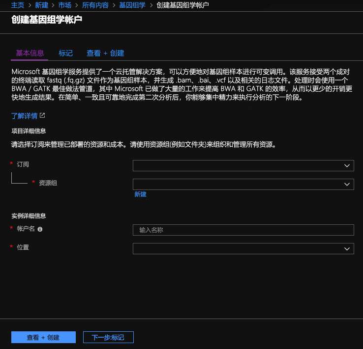
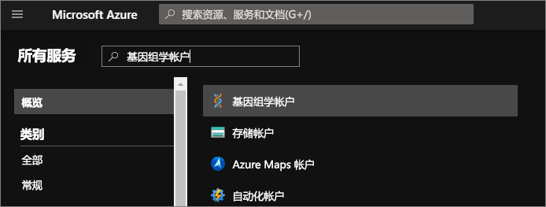
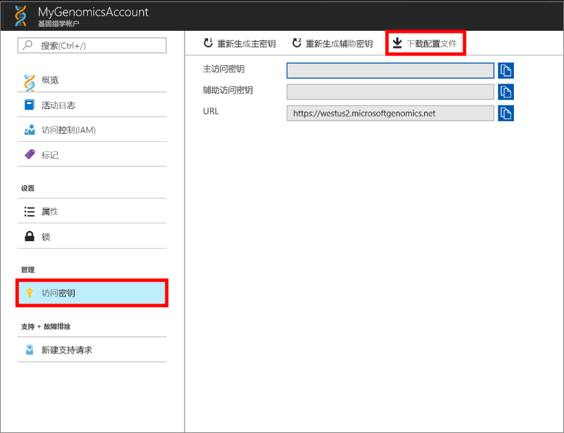
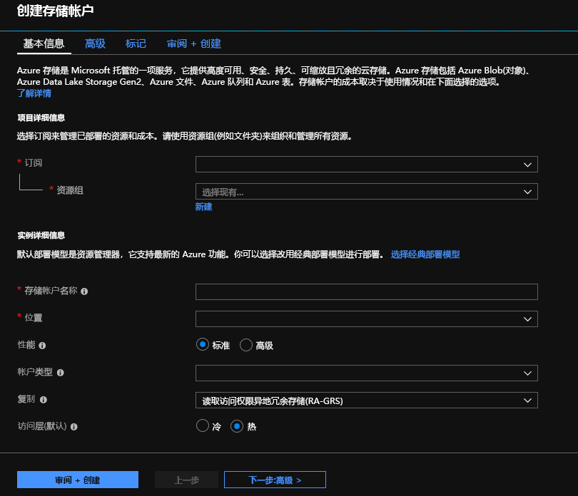
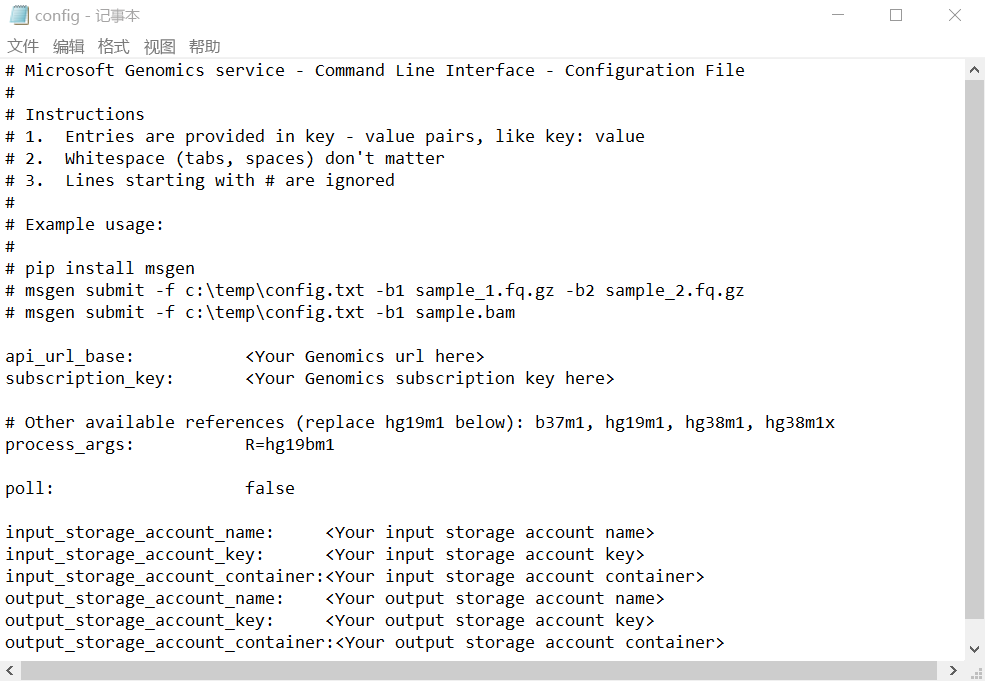

# <a name="quickstart-run-a-workflow-through-the-microsoft-genomics-service"></a>快速入门：通过 Microsoft 基因组学服务运行工作流

在本快速入门中，你会将输入数据上传到 Azure Blob 存储帐户中，并使用 Python 基因组学客户端通过 Microsoft 基因组学服务运行工作流。 Microsoft 基因组学是一种可缩放的安全服务，适用于二次分析，可以快速处理一个基因组，从原始的读数开始，生成比对读数和变体调用。 

## <a name="prerequisites"></a>先决条件

- 具有活动订阅的 Azure 帐户。 [免费创建帐户](https://azure.microsoft.com/free/?ref=microsoft.com&utm_source=microsoft.com&utm_medium=docs&utm_campaign=visualstudio)。 
- 装有 `pip` 的 [Python 2.7.12+](https://www.python.org/downloads/release/python-2714/)，并且系统路径中具有 `python`。 Microsoft 基因组学客户端与 Python 3 不兼容。 

## <a name="set-up-create-a-microsoft-genomics-account-in-the-azure-portal"></a>设置：在 Azure 门户中创建 Microsoft 基因组学帐户

要创建 Microsoft 基因组学帐户，请在 Azure 门户中导航到[“创建基因组学帐户”](https://portal.azure.com/#create/Microsoft.Genomics)。 如果还没有 Azure 订阅，请先创建一个，然后再创建 Microsoft 基因组学帐户。 



为基因组学帐户配置以下信息，如上图所示。 

 |**设置**          |  **建议的值**  | **字段说明** |
 |:-------------       |:-------------         |:----------            |
 |订阅         | 订阅名称|这是 Azure 服务的计费单位 - 有关订阅的详细信息，请参阅[订阅](https://account.azure.com/Subscriptions) |      
 |资源组       | MyResourceGroup       |  可以通过资源组将多个 Azure 资源（存储帐户、基因组学帐户等）分到一个组中，方便管理。 有关详细信息，请参阅[资源组](https://docs.microsoft.com/azure/azure-resource-manager/resource-group-overview#resource-groups)。 请参阅[命名规则](/azure/architecture/best-practices/resource-naming)，了解什么是有效的资源组名称 |
 |帐户名         | MyGenomicsAccount     |选择唯一的帐户标识符。 请参阅[命名规则](/azure/architecture/best-practices/resource-naming)，了解什么是有效的名称 |
 |位置                   | 美国西部 2                    |    在美国西部 2、西欧和东南亚提供服务 |

可以选择顶部菜单栏中的“通知”来监视部署过程。 


有关 Microsoft 基因组学的详细信息，请参阅[什么是 Microsoft 基因组学？](overview-what-is-genomics.md)

## <a name="set-up-install-the-microsoft-genomics-python-client"></a>设置：安装 Microsoft 基因组学 Python 客户端

需要在本地环境中安装 Python 和 Microsoft 基因组学 Python 客户端 `msgen`。 

### <a name="install-python"></a>安装 Python

Microsoft 基因组学 Python 客户端与 Python 2.7.12 或更高的 2.7.xx 版本兼容。 2.7.14 是建议的版本。 可以在[此处](https://www.python.org/downloads/release/python-2714/)找到下载版本。 

> [!IMPORTANT]
> Python 3.x 与 Python 2.7.xx 不兼容。  `msgen` 是 Python 2.7 应用程序。 运行 `msgen` 时，请确保有效的 Python 环境使用的是 Python 版本 2.7.xx。 如果尝试将 `msgen` 与 3.x 版本的 Python 一起使用，则可能会出错。

### <a name="install-the-microsoft-genomics-python-client-msgen"></a>安装 Microsoft 基因组学 Python 客户端 `msgen`

使用 Python `pip` 安装 Microsoft 基因组学客户端 `msgen`。 以下说明假定你的系统路径中已有 Python2.x。 如果存在无法识别 `pip` 安装的问题，则需要向系统路径添加 Python 和脚本子文件夹。

```
pip install --upgrade --no-deps msgen
pip install msgen
```

如果不希望将 `msgen` 作为系统范围的二进制文件安装且不希望修改系统范围的 Python 包，请将 `–-user` 标志与 `pip` 配合使用。
如果使用基于包的安装或 setup.py，则会安装所有必需的包。

### <a name="test-msgen-python-client"></a>测试 `msgen` Python 客户端
若要测试 Microsoft 基因组学客户端，请从基因组学帐户下载配置文件。 在 Azure 门户中导航到你的基因组学帐户：选择左上角的“所有服务”，然后搜索并选择“基因组学帐户”。****



选择刚刚创建的基因组学帐户，导航到“访问密钥”，然后下载配置文件。



使用以下命令测试 Microsoft 基因组学 Python 客户端是否正常运行

```Python
msgen list -f "<full path where you saved the config file>"
```

## <a name="create-a-microsoft-azure-storage-account"></a>创建 Microsoft Azure 存储帐户 
Microsoft 基因组学服务要求将输入作为块 Blob 存储在 Azure 存储帐户中。 它也会将输出文件作为块 Blob 写入到 Azure 存储帐户中用户指定的容器。 输入和输出可以驻留在不同的存储帐户中。
如果已将数据置于 Azure 存储帐户中，则只需确保该数据与基因组学帐户处于同一位置即可。 否则在运行 Microsoft 基因组学服务时会产生传出费用。 如果你没有 Azure 存储帐户，需要创建一个存储帐户并上传数据。 可在[此处](https://docs.microsoft.com/azure/storage/common/storage-create-storage-account)找到有关 Azure 存储帐户的详细信息，包括存储帐户是什么，以及它提供哪些服务。 若要创建 Azure 存储帐户，请在 Azure 门户中导航到[“创建存储帐户”](https://portal.azure.com/#create/Microsoft.StorageAccount-ARM)。  



如上图所示，为存储帐户配置以下信息。 对存储帐户使用大多数标准选项，仅指定帐户是“Blob 存储”帐户，而不是常规用途帐户。 Blob 存储帐户的下载和上传速度是常规用途帐户的 2-5 倍。  建议使用默认的部署模型，即 Azure 资源管理器。  

 |**设置**          |  **建议的值**  | **字段说明** |
 |:-------------------------       |:-------------         |:----------            |
 |订阅         | Azure 订阅 |有关订阅的详细信息，请参阅[订阅](https://account.azure.com/Subscriptions) |      
 |资源组       | MyResourceGroup       |  可以选择同一资源组作为基因组学帐户。 请参阅[命名规则](/azure/architecture/best-practices/resource-naming)，了解什么是有效的资源组名称 |
 |存储帐户名称         | MyStorageAccount     |选择唯一的帐户标识符。 请参阅[命名规则](/azure/architecture/best-practices/resource-naming)，了解什么是有效的名称 |
 |位置                  | 美国西部 2                  | 使用的位置与基因组学帐户的位置相同，目的是降低传出费用和延迟。  | 
 |性能                  | 标准                   | 默认值为“标准”。 有关标准和高级存储帐户的更多详细信息，请参阅 [Microsoft Azure 存储简介](https://docs.microsoft.com/azure/storage/common/storage-introduction)    |
 |帐户类型       | BlobStorage       |  Blob 存储帐户的下载和上传速度可以是常规用途帐户的 2-5 倍。 |
 |复制                  | 本地冗余存储                  | 本地冗余存储在创建存储帐户时所在区域的数据中心内复制数据。 有关详细信息，请参阅 [Azure 存储复制](https://docs.microsoft.com/azure/storage/common/storage-redundancy)    |
 |访问层                  | 热                   | 热访问是指存储帐户中对象的访问频率会更高。    |

然后选择“查看 + 创建”，以创建存储帐户。 与创建基因组学帐户时一样，可以选择顶部菜单栏中的“通知”来监视部署过程****。 

## <a name="upload-input-data-to-your-storage-account"></a>将输入数据上传到存储帐户

Microsoft 基因组学服务要求使用双端测序读长（fastq 或 bam 文件）作为输入文件。 进行探查时，可以选择上传自己的数据，也可以使用为你提供的可以公开使用的示例数据。 若要使用公开提供的示例数据，可以在下面的托管位置查找：

[https://msgensampledata.blob.core.windows.net/small/chr21_1.fq.gz](https://msgensampledata.blob.core.windows.net/small/chr21_1.fq.gz)
[https://msgensampledata.blob.core.windows.net/small/chr21_2.fq.gz](https://msgensampledata.blob.core.windows.net/small/chr21_2.fq.gz)

需要在存储帐户中为输入数据创建一个 Blob 容器，为输出数据创建另一个 Blob 容器。  请将输入数据上传到输入 Blob 容器中。 执行此操作可以使用各种工具，包括 [Microsoft Azure 存储资源管理器](https://azure.microsoft.com/features/storage-explorer/)、[BlobPorter](https://github.com/Azure/blobporter) 或 [AzCopy](https://docs.microsoft.com/azure/storage/common/storage-use-azcopy?toc=%2fazure%2fstorage%2fblobs%2ftoc.json)。 

## <a name="run-a-workflow-through-the-microsoft-genomics-service-using-the-msgen-python-client"></a>使用 `msgen` Python 客户端通过 Microsoft 基因组学服务运行工作流

若要通过 Microsoft 基因组学服务运行工作流，请编辑 *config.txt* 文件，为数据指定输入和输出存储容器。
打开从基因组学帐户下载的 *config.txt* 文件。 需指定的部分包括：订阅密钥和底部的六个项、存储帐户名称、输入和输出的密钥和容器名称。 若要查找该信息，可以在 Azure 门户中导航到存储帐户的“访问密钥”，也可以直接从 Azure 存储资源管理器导航****。  



如果想要运行 GATK4，请将 `process_name` 参数设置为 `gatk4`。

默认情况下，基因组学服务将输出 VCF 文件。 如果需要 gVCF 输出而非 VCF 输出（等效于 GATK 3.x 中的 `-emitRefConfidence` 和 GATK 4.x 中的 `emit-ref-confidence`），请将 `emit_ref_confidence` 参数添加到 config.txt，并将它设置为 `gvcf`，如上图所示。  若要更改回 VCF 输出，请将它从 *config.txt* 文件中删除，或者将 `emit_ref_confidence` 参数设置为 `none`。 

`bgzip` 是用于压缩 vcf 或 gvcf 文件的工具，`tabix` 会创建已压缩文件的索引。 默认情况下，基因组学服务在“.g.vcf”输出上运行 `bgzip`（后接 `tabix`），但默认情况下不对“.vcf”输出运行这些工具。 运行时，服务会生成“.gz”（bgzip 输出）和“.tbi”（tabix 输出）文件。 参数是布尔值；默认情况下，它对“.vcf”输出设置为 false，对“.g.vcf”输出设置为 true。 若要在命令行中使用它，请将 `-bz` 或 `--bgzip-output` 指定为 `true`（运行 bgzip 和 tabix）或 `false`。 若要在 config.txt 文件中使用此参数，请将 `bgzip_output: true` 或 `bgzip_output: false` 添加到文件中。

### <a name="submit-your-workflow-to-the-microsoft-genomics-service-using-the-msgen-python-client"></a>使用 `msgen` Python 客户端将工作流提交到 Microsoft 基因组学服务

使用 Microsoft 基因组学 Python 客户端通过以下命令提交工作流：

```python
msgen submit -f [full path to your config file] -b1 [name of your first paired end read] -b2 [name of your second paired end read]
```

可使用以下命令查看工作流的状态： 
```python
msgen list -f c:\temp\config.txt 
```

工作流完成后，可以在 Azure 存储帐户的已配置输出容器中查看输出文件。 

## <a name="next-steps"></a>后续步骤

在本文中，你已将示例输入数据上传到 Azure 存储中，并通过 `msgen` Python 客户端将工作流提交到了 Microsoft 基因组学服务。 要详细了解可以与 Microsoft 基因组学服务配合使用的其他输入文件类型，请查看以下页面：[配对的 FASTQ](quickstart-input-pair-FASTQ.md) | [BAM](quickstart-input-BAM.md) | [多个 FASTQ 或 BAM](quickstart-input-multiple.md)。 还可下载“Genomics Tutorial.ipynb”文件并使用 [Jupyter](https://docs.microsoft.com/azure/notebooks/tutorial-create-run-jupyter-notebook) 等笔记本阅读器打开并运行该文件，使用 [Azure Notebooks 示例](https://aka.ms/genomicsnotebook)浏览本教程。
