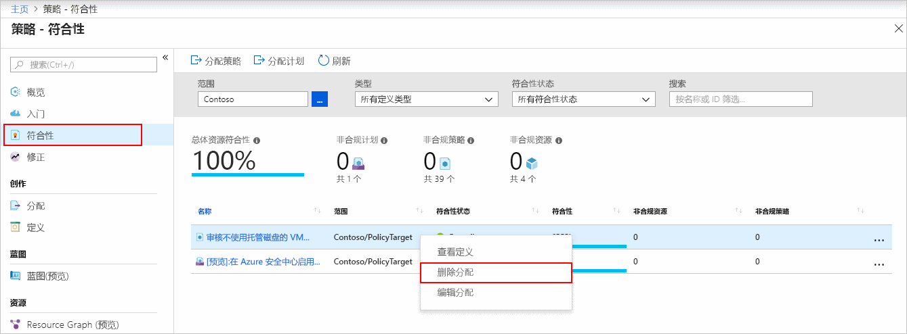

# 快速入门：使用资源管理器模板创建策略分配以识别不合规的资源

若要了解 Azure 中的符合性，第一步是确定资源的状态。
本快速入门逐步讲解如何创建策略分配，以识别未使用托管磁盘的虚拟机。

此过程结束时，你可以成功识别哪些虚拟机未使用托管磁盘。 这些虚拟机不符合策略分配要求。 

如果没有 Azure 订阅，请在开始之前创建一个[免费](https://azure.microsoft.com/free/)帐户。

## 创建策略分配

在本快速入门中，我们将创建一个策略分配，并分配一个名为“审核不使用托管磁盘的 VM”的内置策略定义。  有关可用内置策略的部分列表，请参阅 [Azure Policy 示例](./samples/index.md)。

可通过多种方法创建策略分配。 本快速入门使用[快速入门模板](https://azure.microsoft.com/resources/templates/101-azurepolicy-assign-builtinpolicy-resourcegroup/)。
下面是该模板的副本：

[!code-json[policy-assignment](~/quickstart-templates/101-azurepolicy-assign-builtinpolicy-resourcegroup/azuredeploy.json)]

> [!NOTE]
> Azure Policy 服务是免费的。  有关详细信息，请参阅 [Azure Policy 概述](./overview.md)。

1. 选择下图登录到 Azure 门户并打开模板：

   

1. 选择或输入以下值：

   | Name | 值 |
   |------|-------|
   | Subscription | 选择 Azure 订阅。 |
   | Resource group | 选择“新建”，指定名称，然后选择“确定”。   在屏幕截图中，资源组名称为 mypolicyquickstart\<MMDD 格式的日期>rg  。 |
   | 位置 | 选择区域。 例如“美国中部”。  |
   | 策略分配名称 | 指定策略分配名称。 如果需要，可以使用策略定义显示名称。 例如，“审核不使用托管磁盘的 VM”。  |
   | 资源组名称 | 指定要将策略分配到的资源组名称。 本快速入门使用默认值 **[resourceGroup().name]** 。 **[resourceGroup()](../../azure-resource-manager/resource-group-template-functions-resource.md#resourcegroup)** 是检索资源组的模板函数。 |
   | 策略定义 ID | 指定 **/providers/Microsoft.Authorization/policyDefinitions/0a914e76-4921-4c19-b460-a2d36003525a**。 |
   | 我同意上述条款和条件 | （选择） |

1. 选择“购买”。 

其他某些资源：

- 若要查找更多示例模板，请参阅 [Azure 快速入门模板](https://azure.microsoft.com/resources/templates/?resourceType=Microsoft.Authorization&pageNumber=1&sort=Popular)。
- 若要查看模板参考，请转到 [Azure 模板参考](/azure/templates/microsoft.authorization/allversions)。
- 若要了解如何开发资源管理器模板，请参阅 [Azure 资源管理器文档](/azure/azure-resource-manager/)。
- 若要了解订阅级部署，请参阅[在订阅级别创建资源组和资源](../../azure-resource-manager/deploy-to-subscription.md)。

## 识别不合规的资源

选择页面左侧的“符合性”  。 然后找到所创建的“审核未使用托管磁盘的 VM”策略分配  。

如果存在与此新分配不相符的任何现有资源，这些资源会在“不符合的资源”下显示  。

有关详细信息，请参阅[合规工作原理](./how-to/get-compliance-data.md#how-compliance-works)。

## 清理资源

删除创建的分配，请执行以下步骤：

1. 选择“Azure Policy”页面左侧中的“符合性”（或“分配”）并找到你创建的“审核未使用托管磁盘的 VM”策略分配。   

1. 右键单击“审核不使用托管磁盘的 VM”策略分配并选择“删除分配”。  

   

## 后续步骤

在本快速入门中，我们在某个范围分配了一个内置策略定义并评估了其合规性报告。 策略定义可验证范围内的所有资源都符合策略，并可标识不符合策略的资源。

要了解有关分配策略以验证新资源是否符合要求的详细信息，请继续以下教程：

> [!div class="nextstepaction"]
> [创建和管理策略](./tutorials/create-and-manage.md)