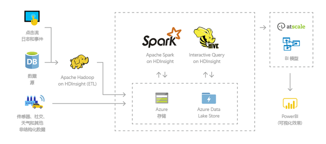
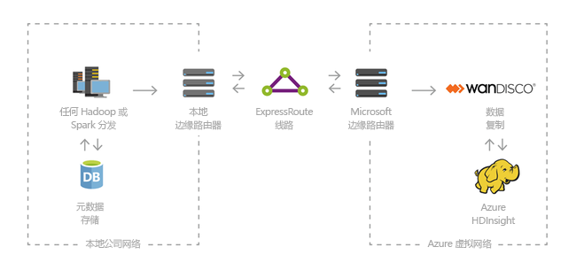

# Azure HDInsight、Hadoop 和 Spark 技术堆栈简介
本文介绍 Azure HDInsight，这是一项适用于企业的分析服务，具有完全托管、全面且开源的特点。 可以使用 Hadoop、Spark、Hive、LLAP、Kafka、Storm、R 等开源框架。 

[!INCLUDE [hdinsight-price-change](../../../includes/hdinsight-enhancements.md)]

[Apache Hadoop](http://hadoop.apache.org/) 是原始的开源框架，适用于对群集上的大数据集进行分布式处理和分析。 Hadoop 技术堆栈包括相关的软件和实用程序（Apache Hive、HBase、Spark、Kafka 等）。 若要查看 HDInsight 上的可用 Hadoop 技术堆栈组件，请参阅[可以与 HDInsight 配合使用的组件和版本][component-versioning]。 若要详细了解 HDInsight 中的 Hadoop，请参阅 [HDInsight 的 Azure 功能页](https://azure.microsoft.com/services/hdinsight/)。

[Apache Spark](http://spark.apache.org) 是一种开放源代码并行处理框架，支持内存中处理，以提升大数据分析应用程序的性能。 若要详细了解 HDInsight 中的 Spark，请参阅 [Spark on Azure HDInsight 简介](../spark/apache-spark-overview.md)。 

## 什么是 HDInsight 和 Hadoop 技术堆栈？ 
Azure HDInsight 是 [Hortonworks Data Platform (HDP)](https://hortonworks.com/products/data-center/hdp/) 提供的 Hadoop 组件的云发行版。  可以通过 Azure HDInsight 轻松、快速且经济有效地处理大量数据。 可以通过 Hadoop、Spark、Hive、LLAP、Kafka、Storm、R 等最常用的开源框架来启用各种方案，例如提取、转换和加载 (ETL)，数据仓库，机器学习以及 IoT。

## 什么是大数据？

大数据的收集量在增加，收集速度在加快，收集格式在增多。 大数据可以是历史数据（即已存储的数据），也可以是实时数据（即从数据源流式传输的数据）。 请参阅[使用 HDInsight 的方案](#scenarios-for-using-hdinsight)，了解大数据的最常见用例。

## 为何应使用 HDInsight？

本部分列出了 Azure HDInsight 的功能。

|功能  |说明  |
|---------|---------|
|云原生     |     可以使用 Azure HDInsight 在 Azure 上为 [Hadoop](apache-hadoop-linux-tutorial-get-started.md)、 [Spark](../spark/apache-spark-jupyter-spark-sql.md)、 [交互式查询 (LLAP)](../interactive-query/apache-interactive-query-get-started.md)、 [Kafka](../kafka/apache-kafka-get-started.md)、 [Storm](../storm/apache-storm-tutorial-get-started-linux.md)、 [HBase](../hbase/apache-hbase-tutorial-get-started-linux.md) 和  [R Server](../r-server/r-server-get-started.md) 创建优化群集。 HDInsight 还在所有生产工作负荷上提供端到端 SLA。  |
|低成本且可缩放     | 可以通过 HDInsight 纵向[缩放](../hdinsight-administer-use-portal-linux.md) 工作负荷。 可以通过 [创建按需群集](../hdinsight-hadoop-create-linux-clusters-adf.md) 来降低成本，只为自己使用的东西付费。 还可以生成数据管道，使作业可操作化。 使计算和存储分离，提高性能和灵活性。 |
|既安全又合规    | HDInsight 允许通过 [Azure 虚拟网络](../hdinsight-extend-hadoop-virtual-network.md)、[加密](../hdinsight-hadoop-create-linux-clusters-with-secure-transfer-storage.md)以及与 [Azure Active Directory](../domain-joined/apache-domain-joined-introduction.md) 集成来保护企业数据资产。 HDInsight 还满足最常用的行业和政府[符合性标准](https://azure.microsoft.com/overview/trusted-cloud)。        |
|监视    | Azure HDInsight 集成 [Azure Log Analytics](../hdinsight-hadoop-oms-log-analytics-tutorial.md)，可以通过单个界面来监视所有群集。        |
|全球推出 | 提供 HDInsight 的 [区域](https://azure.microsoft.com/regions/services/) 要多于提供任何其他大数据分析产品/服务的区域。 Azure HDInsight 还在中国和德国的 Azure 政府版中提供，满足关键主权领域的企业需求。 |  
|工作效率     |  可以通过 Azure HDInsight 将 Hadoop 和 Spark 的丰富生产力工具与你喜欢的开发环境（例如 [Visual Studio](apache-hadoop-visual-studio-tools-get-started.md) 和 [Eclipse](../spark/apache-spark-eclipse-tool-plugin.md)）结合使用，并支持 [IntelliJ](../spark/apache-spark-intellij-tool-plugin.md) for Scala、Python、R、Java 和 .NET。 数据科学家也可以使用 [Jupyter](../spark/apache-spark-jupyter-notebook-kernels.md) 和 [Zeppelin](../spark/apache-spark-zeppelin-notebook.md) 等常用 Notebook 进行协作。    |
|可扩展性     |  可以通过[脚本操作](../hdinsight-hadoop-customize-cluster-linux.md)来安装组件（Hue、Presto 等），从而扩展 HDInsight 群集，具体方法是：[添加边缘节点](../hdinsight-apps-use-edge-node.md)或[集成其他大数据认证应用程序](../hdinsight-apps-install-applications.md)。 HDInsight 允许通过[单击](https://azure.microsoft.com/services/hdinsight/partner-ecosystem/)部署方式无缝集成最常用的大数据解决方案。|

## 使用 HDInsight 的方案

Azure HDInsight 可以在各种用例中进行大数据处理。 大数据的收集量在增加，收集速度在加快，收集格式在增多。 大数据可以是历史数据（已收集和存储的数据），也可以是实时数据（直接从源流式传输的数据）。 处理此类数据的用例可以汇总成以下类别： 

### 批处理 (ETL)

提取、转换和加载 (ETL) 是指将非结构化或结构化数据从异类数据源中提取出来，转换成某种结构化格式，然后加载到数据存储中这一过程。 转换的数据可以用于数据科学或数据仓库。

### 物联网 (IoT)

可以使用 HDInsight 处理从各种设备实时接收的流数据。 有关详细信息，请[阅读此博客](https://azure.microsoft.com/blog/announcing-public-preview-of-apache-kafka-on-hdinsight-with-azure-managed-disks/)。

 

### 数据科学

可以使用 HDInsight 生成从数据中提取关键见解的应用程序。 也可在此基础上使用 Azure 机器学习来预测业务的未来趋势。 有关详细信息，请[阅读此客户经历](https://customers.microsoft.com/story/pros)。

### 数据仓库

可以使用 HDInsight 对任何格式的结构化或非结构化数据执行 PB 规模的交互式查询。 也可以通过生成模型将其连接到 BI 工具。 有关详细信息，请[阅读此客户经历](https://customers.microsoft.com/story/milliman)。 

### 混合

可以使用 HDInsight 将现有的本地大数据基础结构扩展到 Azure，充分利用云的高级分析功能。

## HDInsight 中的群集类型
HDInsight 包括特定的群集类型和群集自定义功能，例如添加组件、实用程序和语言。

### Spark、Kafka、交互式查询、HBase、自定义以及其他群集类型
HDInsight 提供了以下群集类型：

* **[Apache Hadoop](https://wiki.apache.org/hadoop)**：使用 [HDFS](#hdfs)、[YARN](#yarn) 资源管理和简单的 [MapReduce](#mapreduce) 编程模型并行处理和分析批处理数据。
* **[Apache Spark](http://spark.apache.org/)**：一种并行处理框架，支持内存中处理，提升大数据分析应用程序的性能；Spark 适用于 SQL、流式数据处理和机器学习。 请参阅[什么是 HDInsight 中的 Apache Spark？](../spark/apache-spark-overview.md)
* **[Apache HBase](http://hbase.apache.org/)**：构建于 Hadoop 上的 NoSQL 数据库，用于为大量非结构化和半结构化数据（可能为数十亿行乘以数百万列）提供随机访问和高度一致性。 请参阅[什么是 HDInsight 上的 HBase？](../hbase/apache-hbase-overview.md)
* **[Microsoft R Server](https://msdn.microsoft.com/microsoft-r/rserver)**：用于托管和管理并行分布式 R 进程的服务器。 它可让数据科研人员、统计人员和 R 程序员根据需要访问 HDInsight 上可缩放的分布式分析方法。 请参阅 [Overview of R Server on HDInsight](../r-server/r-server-overview.md)（R Server on HDInsight 概述）。
* **[Apache Storm](https://storm.incubator.apache.org/)**：分布式实时计算系统，用于快速处理大型数据流。 Storm 以 HDInsight 中的托管群集形式提供。 请参阅 [使用 Storm 和 Hadoop 分析实时传感器数据](../storm/apache-storm-sensor-data-analysis.md)。
* **[Apache 交互式查询预览版（AKA：Live Long and Process）](https://cwiki.apache.org/confluence/display/Hive/LLAP)**：内存中缓存，用于实现交互式且更快的 Hive 查询。 请参阅[在 HDInsight 中使用交互式查询](../interactive-query/apache-interactive-query-get-started.md)。
* **[Apache Kafka](https://kafka.apache.org/)**：一种开源平台，用于生成流式处理的数据管道和应用程序。 Kafka 还提供了消息队列功能，允许用户发布和订阅数据流。 请参阅 [Apache Kafka on HDInsight 简介](../kafka/apache-kafka-introduction.md)。

## HDInsight 中的开源组件

可以通过 Azure HDInsight 使用 Hadoop、Spark、Hive、LLAP、Kafka、Storm、HBase、R 之类的开源框架来创建群集。这些群集默认情况下附带其他开源组件，例如 [Ambari](https://github.com/apache/ambari/blob/trunk/ambari-server/docs/api/v1/index.md)、[Avro](http://avro.apache.org/docs/current/spec.html)、[Hive](http://hive.apache.org)、[HCatalog](https://cwiki.apache.org/confluence/display/Hive/HCatalog/)、[Mahout](https://mahout.apache.org/)、[MapReduce](http://wiki.apache.org/hadoop/MapReduce)、[YARN](http://hadoop.apache.org/docs/current/hadoop-yarn/hadoop-yarn-site/YARN.html)、[Phoenix](http://phoenix.apache.org/)、[Pig](http://pig.apache.org/)、[Sqoop](http://sqoop.apache.org/)、[Tez](http://tez.apache.org/)、[Oozie](http://oozie.apache.org/)、[ZooKeeper](http://zookeeper.apache.org/)。  

## HDInsight 上的编程语言
HDInsight 群集 - Spark、HBase、Kafka、Hadoop 和其他群集 - 支持多种编程语言，但某些编程语言默认情况下未安装。 对于默认情况下未安装的库、模块或程序包，请[使用脚本操作来安装组件](../hdinsight-hadoop-script-actions-linux.md)。 

### 默认编程语言支持
默认情况下，HDInsight 群集支持：

* Java
* Python

可以使用[脚本操作](../hdinsight-hadoop-script-actions-linux.md)来安装其他语言。

### Java 虚拟机 (JVM) 语言
除了 Java 外，许多语言可以在 Java 虚拟机 (JVM) 上运行；但是，运行其中某些语言可能需要在群集上安装其他组件。

HDInsight 群集支持以下基于 JVM 的语言：

* Clojure
* Jython (Python for Java)
* Scala

### Hadoop 特定的语言
HDInsight 群集支持以下特定于 Hadoop 技术堆栈的语言：

* 用于 Pig 作业的 Pig Latin
* 用于 Hive 作业的 HiveQL 和 SparkSQL

## HDInsight 上的商业智能
大家熟悉的商业智能 (BI) 工具使用 Power Query 外接程序或 Microsoft Hive ODBC 驱动程序来检索、分析和报告与 HDInsight 集成的数据：

* [使用 Azure HDInsight 上的数据可视化工具的 Apache Spark BI](../spark/apache-spark-use-bi-tools.md)
* [在 Azure HDInsight 中使用 Microsoft Power BI 可视化 Hive 数据](apache-hadoop-connect-hive-power-bi.md) 
* [在 Azure HDInsight 中使用 Power BI 可视化交互式查询 Hive 数据](../interactive-query/apache-hadoop-connect-hive-power-bi-directquery.md)
* [使用 Power Query 将 Excel 连接到 Hadoop](apache-hadoop-connect-excel-power-query.md)：了解如何使用 Microsoft Power Query for Excel，将 Excel 连接到存储 HDInsight 群集数据的 Azure 存储帐户。 所需的 Windows 工作站。 
* [使用 Microsoft Hive ODBC 驱动程序将 Excel 连接到 Hadoop](apache-hadoop-connect-excel-hive-odbc-driver.md)：了解如何使用 Microsoft Hive ODBC 驱动程序从 HDInsight 导入数据。 所需的 Windows 工作站。 
* [Microsoft 云平台](http://www.microsoft.com/server-cloud/solutions/business-intelligence/default.aspx)：了解有关 Power BI for Office 365、下载 SQL Server 试用版，以及设置 SharePoint Server 2013 和 SQL Server BI 的信息。
* [SQL Server Analysis Services](http://msdn.microsoft.com/library/hh231701.aspx)
* [SQL Server Reporting Services](http://msdn.microsoft.com/library/ms159106.aspx)

## 后续步骤

* [HDInsight 中的 Hadoop 入门](apache-hadoop-linux-tutorial-get-started.md)
* [HDInsight 中的 Spark 入门](../spark/apache-spark-jupyter-spark-sql.md)
* [Kafka on HDInsight 入门](../kafka/apache-kafka-get-started.md)
* [Storm on HDInsight 入门](../storm/apache-storm-tutorial-get-started-linux.md)
* [HBase on HDInsight 入门](../hbase/apache-hbase-tutorial-get-started-linux.md)
* [HDInsight 上的交互式查询 (LLAP) 入门](../interactive-query/apache-interactive-query-get-started.md)
* [R Server on HDInsight 入门](../r-server/r-server-get-started.md)
* [管理 HDInsight 群集](../hdinsight-administer-use-portal-linux.md)
* [保护 HDInsight 群集](../domain-joined/apache-domain-joined-introduction.md)
* [监视 HDInsight 群集](../hdinsight-hadoop-oms-log-analytics-tutorial.md)

[component-versioning]: ../hdinsight-component-versioning.md
[zookeeper]: http://zookeeper.apache.org/