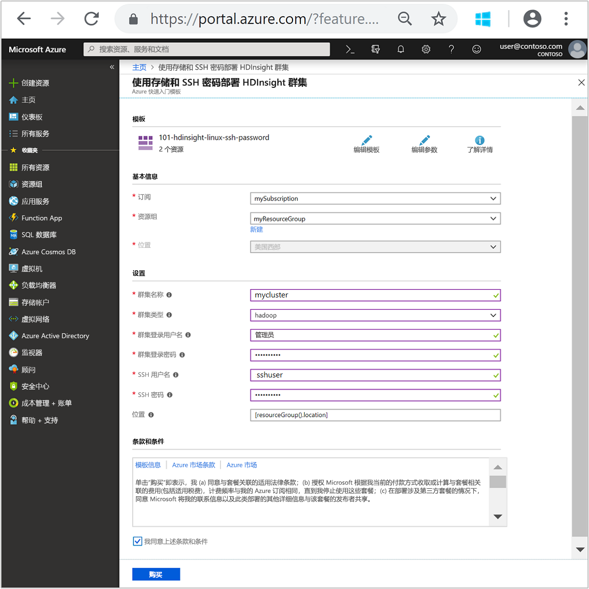
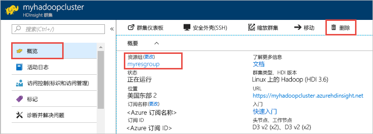

# 快速入门：使用资源管理器模板在 Azure HDInsight 中创建 Apache Hadoop 群集

在本快速入门中，你将了解如何使用资源管理器模板在 Azure HDInsight 中创建 Apache Hadoop 群集。

可以在 [Azure 快速入门模板](https://azure.microsoft.com/resources/templates/?resourceType=Microsoft.Hdinsight&pageNumber=1&sort=Popular)中查看类似的模板。 可以在[此处](https://docs.microsoft.com/azure/templates/microsoft.hdinsight/allversions)找到模板参考。  也可以使用 [Azure 门户](apache-hadoop-linux-create-cluster-get-started-portal.md)创建群集。  

目前，HDInsight 附带[七个不同的群集类型](../hdinsight-overview.md#cluster-types-in-hdinsight)。 每个群集类型都支持一组不同的组件。 所有群集类型都支持 Hive。 有关 HDInsight 中受支持组件的列表，请参阅 [HDInsight 提供的 Hadoop 群集版本中有哪些新功能？](../hdinsight-component-versioning.md)  

如果没有 Azure 订阅，请在开始之前[创建一个免费帐户](https://azure.microsoft.com/free/)。

## 创建 Hadoop 群集

1. 选择下面的“部署到 Azure”按钮以登录到 Azure，并在 Azure 门户中打开资源管理器模板  。
   
    

2. 输入或选择下列值：

    |属性  |说明  |
    |---------|---------|
    |**订阅**     |  选择 Azure 订阅。 |
    |**资源组**     | 创建资源组，或选择现有资源组。  资源组是 Azure 组件的容器。  在本例中，资源组包含 HDInsight 群集和依赖的 Azure 存储帐户。 |
    |**位置**     | 选择要在其中创建群集的 Azure 位置。  选择的位置与你越靠近，性能就越好。 |
    |**群集名称**     | 输入 Hadoop 群集的名称。 由于 HDInsight 中的所有群集共享同一 DNS 命名空间，因此该名称必须唯一。 此名称只能包含小写字母、数字和连字符，且必须以字母开头。  每个连字符的前后必须为非连字符字符。  名称的长度还必须介于 3 到 59 个字符之间。 |
    |**群集类型**     | 选择“hadoop”  。 |
    |**群集登录名和密码**     | 默认登录名为“admin”  。密码长度不得少于 10 个字符，且至少必须包含一个数字、一个大写字母和一个小写字母、一个非字母数字字符（' " ` \)字符除外）。 请确保不提供常见密码，如“Pass@word1”  。|
    |**SSH 用户名和密码**     | 默认用户名为“sshuser”  。  可以重命名 SSH 用户名。  SSH 用户密码的要求与群集登录密码的要求相同。|

    某些属性已在模板中硬编码。  可以通过模板配置这些值。 有关这些属性的详细说明，请参阅[在 HDInsight 中创建 Apache Hadoop 群集](../hdinsight-hadoop-provision-linux-clusters.md)。

    > [!NOTE]  
    > 提供的值必须唯一，并应遵循命名指南。 模板不会执行验证检查。 如果提供的值已被使用，或不遵循指南，则提交模板后可能会出错。  

    

3. 选择“我同意上述条款和条件”，然后选择“购买”   。 你将收到一则通知，说明正在进行部署。  创建群集大约需要 20 分钟时间。

4. 创建群集后，将收到“部署成功”的通知，通知中附有“转到资源组”链接   。  “资源组”页面将列出新的 HDInsight 群集以及与该群集关联的默认存储  。 每个群集都有一个 [Azure 存储帐户](../hdinsight-hadoop-use-blob-storage.md)或 [Azure Data Lake Storage 帐户](../hdinsight-hadoop-use-data-lake-store.md)依赖项。 该帐户称为默认存储帐户。 HDInsight 群集及其默认存储帐户必须共存于同一个 Azure 区域中。 删除群集不会删除存储帐户。

> [!NOTE]  
> 如需其他群集创建方法或要了解本快速入门中使用的属性，请参阅[创建 HDInsight 群集](../hdinsight-hadoop-provision-linux-clusters.md)。

## 清理资源

完成本快速入门后，可以删除群集。 有了 HDInsight，便可以将数据存储在 Azure 存储中，因此可以在群集不用时安全地删除群集。 此外，还需要为 HDInsight 群集付费，即使不用也是如此。 由于群集费用数倍于存储空间费用，因此在群集不用时删除群集可以节省费用。

> [!NOTE]  
> 如果立即进行下一教程，了解如何使用 Hadoop on HDInsight 运行 ETL 操作，建议保持群集运行  。 这是因为该教程中必须再次创建 Hadoop 群集。 但是，如果不立即学习下一教程，则必须立即删除该群集。

**删除群集和/或默认存储帐户**

1. 返回到包含 Azure 门户的浏览器选项卡。 你应该在群集概览页上。 如果仅希望删除群集但保留默认的存储帐户，请选择“删除”  。

    

2. 如果希望删除群集和默认存储帐户，请选择资源组名称（之前的屏幕截图中已突出显示），打开资源组页。

3. 选择“删除资源组”，删除资源组（包括群集和默认存储帐户）  。 注意，删除资源组会删除存储帐户。 如果想要保留存储帐户，请选择仅删除群集。

## 后续步骤

在本快速入门中，你已了解了如何使用资源管理器模板在 HDInsight 中创建 Apache Hadoop 群集。 下一篇文章将介绍如何使用 Hadoop on HDInsight 执行提取、转换和加载 (ETL) 操作。

> [!div class="nextstepaction"]
>[使用 HDInsight 上的交互式查询提取、转换和加载数据](../interactive-query/interactive-query-tutorial-analyze-flight-data.md)