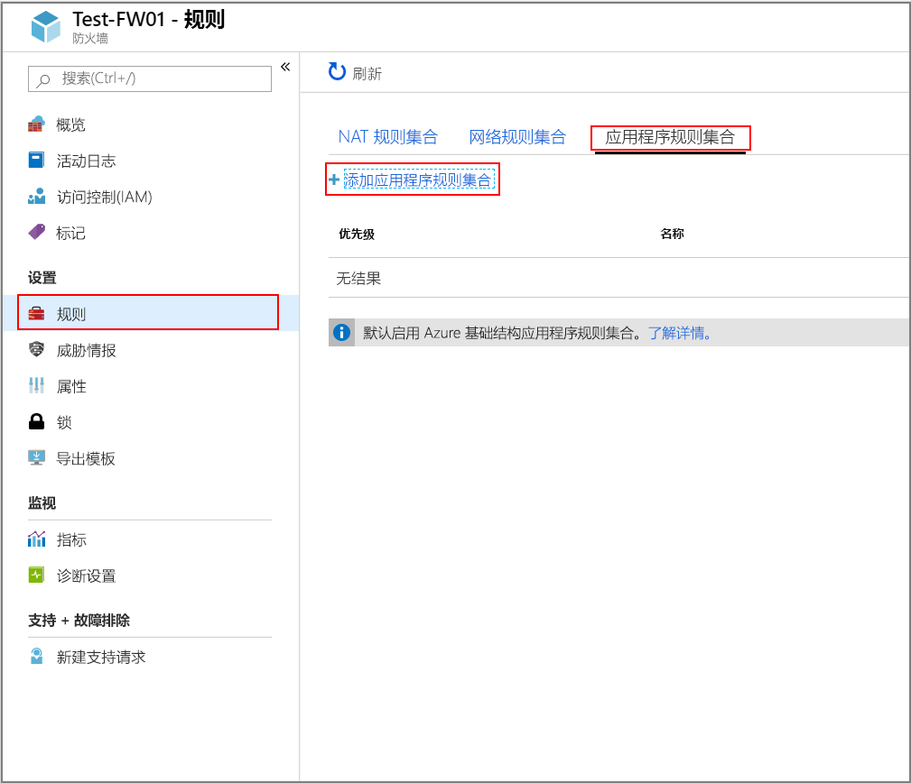
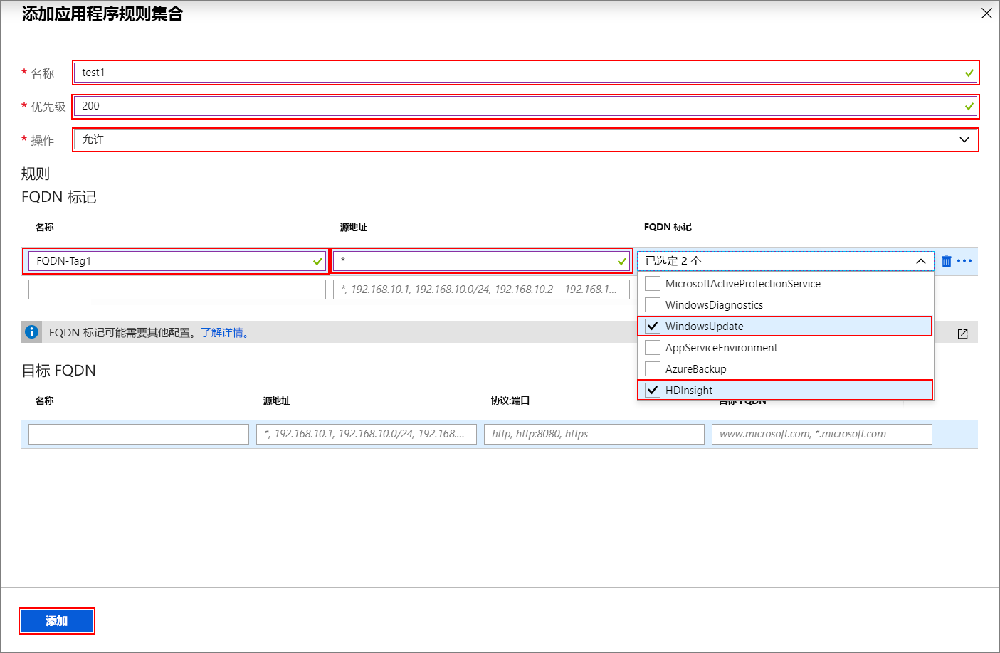
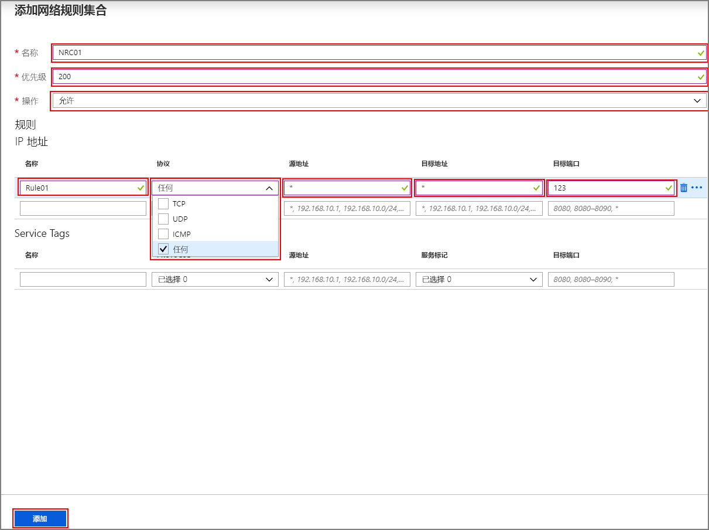

# <a name="configure-outbound-network-traffic-restriction-for-azure-hdinsight-clusters-preview"></a>配置出站网络流量限制为 Azure HDInsight 群集 （预览版）

本文提供的步骤，以便保护从 HDInsight 群集使用 Azure 防火墙的出站流量。 下面的步骤假定你正在配置的现有群集 Azure 防火墙。 如果要部署新群集，并且在防火墙后面，首先创建 HDInsight 群集和子网，然后按照本指南中的步骤。

## <a name="background"></a>背景

Azure HDInsight 群集通常部署在虚拟网络。 群集所依赖的外部虚拟网络需要网络访问权限才能正常运行的服务。

有几个需要入站的流量的依赖关系。 无法通过防火墙设备发送入站管理流量。 此流量的源地址已知的和已发布[此处](hdinsight-extend-hadoop-virtual-network.md#hdinsight-ip)。 此外可以使用此信息来保护群集的入站的流量创建网络安全组 (NSG) 规则。

HDInsight 的出站流量依赖项几乎完全定义使用 Fqdn，没有在其后面的静态 IP 地址。 静态地址缺乏意味着不能使用网络安全组 (Nsg) 来锁定的出站流量从一个群集。 地址会更改频率不够高，一个不能设置基于当前的名称解析规则并使用它来设置 NSG 规则。

保护出站地址的解决方案是使用可控制基于域的名称的出站流量的防火墙设备。 Azure 防火墙可以限制出站的 HTTP 和 HTTPS 通信，基于目标的 FQDN 或[FQDN 标记](https://docs.microsoft.com/azure/firewall/fqdn-tags)。

## <a name="configuring-azure-firewall-with-hdinsight"></a>使用 HDInsight 中配置 Azure 防火墙

可以锁定从你现有的 HDInsight 与 Azure 防火墙出口的步骤摘要是：
1. 创建防火墙。
1. 添加到防火墙的应用程序规则
1. 向防火墙添加网络规则。
1. 创建一个路由表。

### <a name="create-a-new-firewall-for-your-cluster"></a>创建群集的新的防火墙

1. 创建名为的子网**AzureFirewallSubnet**群集所在的虚拟网络中。 
1. 创建新的防火墙**测试 FW01**中的步骤[教程：使用 Azure 门户部署和配置 Azure 防火墙](../firewall/tutorial-firewall-deploy-portal.md#deploy-the-firewall)。

### <a name="configure-the-firewall-with-application-rules"></a>使用应用程序规则配置防火墙

创建使群集能够发送和接收重要的沟通的应用程序规则集合。

选择新的防火墙**测试 FW01**从 Azure 门户。 单击**规则**下**设置** > **应用程序规则集合** > **添加应用程序规则集合**.



上**添加应用程序规则集合**屏幕上，完成以下步骤：

1. 输入**名称**，**优先级**，然后单击**允许**从**操作**下拉列表菜单。
1. 添加以下规则：
    1. 一个规则以允许 HDInsight 和 Windows Update 通信：
        1. 在中**FQDN 标记**部分中，提供**名称**，并设置**源地址**到`*`。
        1. 选择**HDInsight**并**WindowsUpdate**从**FQDN 标记**下拉列表菜单。
    1. 允许 Windows 登录活动的规则：
        1. 在中**目标 Fqdn**部分中，提供**名称**，并设置**源地址**到`*`。
        1. 输入`https:443`下**协议： 端口**并`login.windows.net`下**目标 FQDN**。
    1. 如果群集受 WASB 和不使用更高版本的服务终结点，然后添加一条规则为 WASB:
        1. 在中**目标 Fqdn**部分中，提供**名称**，并设置**源地址**到`*`。
        1. 输入`http`或`https`具体取决于使用 wasb: / / 或 wasbs: / / 下**协议： 端口**和存储帐户 url 下的**目标 FQDN**。
1. 单击“添加”  。



### <a name="configure-the-firewall-with-network-rules"></a>将防火墙配置了网络规则

创建网络规则来正确配置 HDInsight 群集。

1. 选择新的防火墙**测试 FW01**从 Azure 门户。
1. 单击**规则**下**设置** > **网络规则集合** > **添加网络规则集合**。
1. 上**添加网络规则集合**屏幕中，输入**名称**，**优先级**，然后单击**允许**从**操作**下拉列表菜单。
1. 创建以下规则：
    1. 允许执行使用 NTP 的时钟同步的群集的网络规则。
        1. 在中**规则**部分中，提供**名称**，然后选择**任何**从**协议**下拉列表。
        1. 设置**源地址**并**目标地址**到`*`。
        1. 设置**目标端口**为 123。
    1. 如果正在使用企业安全包 (ESP)，然后添加一个允许与 AAD DS ESP 群集通信的网络规则。
        1. 确定你的域控制器的两个 IP 地址。
        1. 中的下一行**规则**部分中，提供**名称**，然后选择**任何**从**协议**下拉列表。
        1. 设置**源地址** `*`。
        1. 为使域控制器中输入的所有 IP 地址**目标地址**逗号分隔。
        1. 设置**目标端口**到`*`。
    1. 如果使用 Azure Data Lake 存储，你可以添加网络规则，以解决 ADLS Gen1 和第 2 代的 SNI 问题。 此选项会将流量路由到防火墙，这可能会导致大量数据负载的成本较高，但此通信是记录，并且可审核。
        1. 确定你的 Data Lake 存储帐户的 IP 地址。 您可以使用 powershell 命令，如`[System.Net.DNS]::GetHostAddresses("STORAGEACCOUNTNAME.blob.core.windows.net")`将 FQDN 解析为 IP 地址。
        1. 中的下一行**规则**部分中，提供**名称**，然后选择**任何**从**协议**下拉列表。
        1. 设置**源地址** `*`。
        1. 输入中的存储帐户的 IP 地址**目标地址**。
        1. 设置**目标端口**到`*`。
    1. （可选）如果使用 Log Analytics，然后创建网络规则，以启用与 Log Analytics 工作区的通信。
        1. 中的下一行**规则**部分中，提供**名称**，然后选择**任何**从**协议**下拉列表。
        1. 设置**源地址** `*`。
        1. 设置**目标地址**到`*`。
        1. 设置**目标端口**到`12000`。
    1. 为 SQL，您可以记录和审核 SQL 流量配置服务标记。
        1. 中的下一行**规则**部分中，提供**名称**，然后选择**任何**从**协议**下拉列表。
        1. 设置**源地址** `*`。
        1. 设置**目标地址**到`*`。
        1. 选择**Sql**从**服务标记**下拉列表。
        1. 设置**目标端口**到`1433,11000-11999,14000-14999`。
1. 单击**添加**以完成创建的网络规则集合。



### <a name="create-and-configure-a-route-table"></a>创建和配置路由表

创建路由表具有以下条目：

1. 七个地址，可在[此列表所需的 HDInsight 管理 IP 地址](../hdinsight/hdinsight-extend-hadoop-virtual-network.md#hdinsight-ip)使用的下一跃点**Internet**:
    1. 在所有区域中的所有群集的四个 IP 地址
    1. 特定于其中创建群集的区域的两个 IP 地址
    1. Azure 的递归解析程序的一个 IP 地址
1. 与要在 Azure 防火墙的专用 IP 地址的下一跃点的 IP 地址 0.0.0.0/0 的一个虚拟设备路由。

例如，若要配置的"Central US"美国区域中创建的群集的路由表，请使用步骤:

1. 登录到 Azure 门户。
1. 选择 Azure 防火墙**测试 FW01**。 复制**专用 IP 地址**上列出**概述**页。 对于此示例中我们将使用**示例 10.1.1.4 地址**
1. 创建新的路由表。
1. 单击**路由**下**设置**。
1. 单击**添加**在下表中创建的 IP 地址的路由。

| 路由名称 | 地址前缀 | 下一跃点类型 | 下一跃点地址 |
|---|---|---|---|
| 168.61.49.99 | 168.61.49.99/32 | Internet | NA |
| 23.99.5.239 | 23.99.5.239/32 | Internet | NA |
| 168.61.48.131 | 168.61.48.131/32 | Internet | NA |
| 138.91.141.162 | 138.91.141.162/32 | Internet | NA |
| 13.67.223.215 | 13.67.223.215/32 | Internet | NA |
| 40.86.83.253 | 40.86.83.253/32 | Internet | NA |
| 168.63.129.16 | 168.63.129.16/32 | Internet | NA |
| 0.0.0.0 | 0.0.0.0/0 | 虚拟设备 | 10.1.1.4 |


完成路由表配置：

1. 通过单击创建与 HDInsight 子网的路由表将分配**子网**下**设置**，然后**关联**。
1. 上**子网关联**屏幕上，选择已创建你的群集的虚拟网络并**AzureFirewallSubnet**您创建使用你的防火墙。
1. 单击“确定”。 


## <a name="edge-node-application-traffic"></a>边缘节点的应用程序流量

上述步骤将允许群集操作不会出现问题。 仍需要配置以适应在边缘节点上运行你自定义应用程序，如果适用的依赖关系。

必须标识应用程序依赖关系，并将其添加到 Azure 防火墙或路由表。

为应用程序通信，以避免非对称路由问题，必须创建路由。

如果应用程序具有其他依赖项，它们需要添加到你的 Azure 防火墙。 创建允许 HTTP/HTTPS 流量的应用程序规则，并针对其他方面的控制创建网络规则。

## <a name="logging"></a>日志记录

Azure 防火墙可以将日志发送到的几个不同的存储系统。 对于配置的说明日志记录你的防火墙，请按照中的步骤[教程：监视 Azure 防火墙日志和指标](../firewall/tutorial-diagnostics.md)。

完成后的日志记录设置，如果要将日志记录数据到 Log Analytics，可以查看阻止的流量使用一个查询如下所示：

```
AzureDiagnostics | where msg_s contains "Deny" | where TimeGenerated >= ago(1h)
```

将与 Azure Monitor 日志集成 Azure 防火墙时，首先获取应用程序正常工作时不知道的所有应用程序依赖关系。 可以通过[在 Azure Monitor 中分析日志数据](../azure-monitor/log-query/log-query-overview.md)详细了解 Azure Monitor 日志

## <a name="configure-another-network-virtual-appliance"></a>配置另一个网络虚拟设备

>[!Important]
> 将以下信息**仅**需要你想要配置 Azure 防火墙以外的网络虚拟设备 (NVA)。

前面的说明帮助你配置 Azure 防火墙限制的出站流量从 HDInsight 群集。 Azure 防火墙自动配置为允许的许多常见的重要方案的流量。 如果你想要使用另一个网络虚拟设备，你将需要手动配置很多其他功能。 请注意，作为以下你配置网络虚拟设备：

* 应在支持服务终结点的服务中配置服务终结点。
* IP 地址依赖关系是 HTTP/S 流量 （TCP 和 UDP 流量）。
* FQDN HTTP/HTTPS 终结点可放在 NVA 设备。
* 通配符 HTTP/HTTPS 终结点是依赖项的不同而异基于限定符数。
* 将分配到 HDInsight 子网创建路由表。

### <a name="service-endpoint-capable-dependencies"></a>支持服务终结点的依赖项

| **终结点** |
|---|
| Azure SQL |
| Azure 存储 |
| Azure Active Directory |

#### <a name="ip-address-dependencies"></a>IP 地址依赖项

| **终结点** | **详细信息** |
|---|---|
| \*:123 | NTP 时钟检查。 在端口 123 上的多个终结点中检查流量 |
| Ip 发布[此处](hdinsight-extend-hadoop-virtual-network.md#hdinsight-ip) | 这些是 HDInsight 服务 |
| AAD DS 专用 Ip 的 ESP 群集 |
| \*: 16800 KMS Windows 激活 |
| \*12000 for Log Analytics |

#### <a name="fqdn-httphttps-dependencies"></a>FQDN HTTP/HTTPS 依赖项

>[!Important]
> 下面的列表仅提供几个最重要的 Fqdn。 你可以配置 NVA 获取 Fqdn 的完整列表[此文件中](https://github.com/Azure-Samples/hdinsight-fqdn-lists/blob/master/HDInsightFQDNTags.json)。

| **终结点**                                                          |
|---|
| azure.archive.ubuntu.com:80                                           |
| security.ubuntu.com:80                                                |
| ocsp.msocsp.com:80                                                    |
| ocsp.digicert.com:80                                                  |
| wawsinfraprodbay063.blob.core.windows.net:443                         |
| registry-1.docker.io:443                                              |
| auth.docker.io:443                                                    |
| production.cloudflare.docker.com:443                                  |
| download.docker.com:443                                               |
| us.archive.ubuntu.com:80                                              |
| download.mono-project.com:80                                          |
| packages.treasuredata.com:80                                          |
| security.ubuntu.com:80                                                |
| azure.archive.ubuntu.com:80                                                |
| ocsp.msocsp.com:80                                                |
| ocsp.digicert.com:80                                                |

## <a name="next-steps"></a>后续步骤

* [Azure HDInsight 虚拟网络体系结构](hdinsight-virtual-network-architecture.md)
