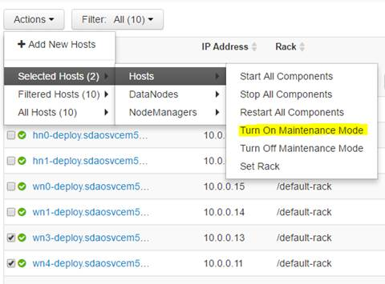

# 操作 Azure HDInsight 上的 ML Services 群集

使用 HDInsight 中的 ML Services 群集完成数据建模后，可操作该模型进行预测。 本文提供如何执行此任务的说明。

## 先决条件

* **HDInsight 上的 ML Services 群集**：有关说明，请参阅 [HDInsight 上的 ML Services 入门](r-server-get-started.md)。

* **安全外壳 (SSH) 客户端**：SSH 客户端可用于远程连接到 HDInsight 群集，并直接在群集上运行命令。 有关详细信息，请参阅 [Use SSH with HDInsight](../hdinsight-hadoop-linux-use-ssh-unix.md)（对 HDInsight 使用 SSH）。

## 使用单机配置操作 ML Services 群集

> [!NOTE]
> 以下步骤适用于 R Server 9.0 和 ML Server 9.1。 有关 ML Server 9.3，请参阅[使用管理工具管理操作化配置](https://docs.microsoft.com/machine-learning-server/operationalize/configure-admin-cli-launch)。

1. 通过 SSH 登录到边缘节点。

        ssh USERNAME@CLUSTERNAME-ed-ssh.azurehdinsight.net

    有关如何将 SSH 与 Azure HDInsight 配合使用的说明，请参阅[将 SSH 与 HDInsight 配合使用](../hdinsight-hadoop-linux-use-ssh-unix.md)。

1. 请更改相关版本的目录并使用 sudo 运行 .net dll： 

    - 对于 Microsoft ML Server 9.1：

            cd /usr/lib64/microsoft-r/rserver/o16n/9.1.0
            sudo dotnet Microsoft.RServer.Utils.AdminUtil/Microsoft.RServer.Utils.AdminUtil.dll

    - 对于 Microsoft R Server 9.0：

            cd /usr/lib64/microsoft-deployr/9.0.1
            sudo dotnet Microsoft.DeployR.Utils.AdminUtil/Microsoft.DeployR.Utils.AdminUtil.dll

1. 将提供选项供你选择。 选择第一个选项（如以下屏幕截图所示）“配置 ML Server 的操作化”。

    

1. 现在将提供选项供你选择要操作 ML Server 的方式。 输入 **A** 从提供的选项中选择第一项。

    

1. 出现提示时，输入然后再次输入本地管理员用户的密码。

1. 应看到提示操作成功的输出。 系统还会提示你从菜单中选择另一个选项。 选择 E 以返回到主菜单。

    

1. （可选）通过运行诊断测试来执行诊断检查，如下所示：

    a. 从主菜单中，选择 **6** 运行诊断测试。

    

    b. 从“诊断测试”菜单中选择 **A**。出现提示时，输入为本地管理员用户提供的密码。

    

    c. 验证输出是否显示总体运行状况通过测试。

    

    d. 从显示的菜单选项中，输入 **E** 返回到主菜单，然后输入 **8** 退出管理员实用程序。

### 在 Spark 上使用 Web 服务时延迟时间很长

如果在尝试使用 Web 服务时遇到长时间的延迟，而这些服务是在 Spark 计算上下文中使用 mrsdeploy 函数创建的，则可能需要添加一些缺失的文件夹。 Spark 应用程序属于名为“rserve2”的用户，不论何时使用 mrsdeploy 函数从 Web 服务调用它。 若要解决此问题，请执行以下操作：

    # Create these required folders for user 'rserve2' in local and hdfs:

    hadoop fs -mkdir /user/RevoShare/rserve2
    hadoop fs -chmod 777 /user/RevoShare/rserve2

    mkdir /var/RevoShare/rserve2
    chmod 777 /var/RevoShare/rserve2

    # Next, create a new Spark compute context:
 
    rxSparkConnect(reset = TRUE)

在此阶段，操作化的配置已完成。 现在，可以使用 RClient 上的 `mrsdeploy` 包连接到边缘节点上的操作化，并开始使用其功能（如[远程执行](https://docs.microsoft.com/machine-learning-server/r/how-to-execute-code-remotely)和 [Web 服务](https://docs.microsoft.com/machine-learning-server/operationalize/concept-what-are-web-services)）。 可能需要通过 SSH 登录设置端口转发隧道，具体取决于群集是否设置在虚拟网络上。 以下部分介绍如何设置此隧道。

### 虚拟网络上的 ML Services 群集

请确保允许流量通过端口 12800 到达边缘节点。 这样，便可以使用边缘节点连接到操作化功能。

    library(mrsdeploy)

    remoteLogin(
        deployr_endpoint = "http://[your-cluster-name]-ed-ssh.azurehdinsight.net:12800",
        username = "admin",
        password = "xxxxxxx"
    )

如果 `remoteLogin()` 无法连接到边缘节点，但你可以使用 SSH 连接到边缘节点，则需验证是否已正确设置允许端口 12800 上的流量的规则。 如果仍遇到此问题，则解决方法是通过 SSH 设置端口转发隧道。 有关说明，请参阅以下部分：

### ML Services 群集未设置在虚拟网络上

如果群集未设置在 vnet 上，或者如果通过 vnet 连接时遇到问题，可以使用 SSH 端口转发隧道：

    ssh -L localhost:12800:localhost:12800 USERNAME@CLUSTERNAME-ed-ssh.azurehdinsight.net

SSH 会话处于活动状态后，来自本地计算机端口 12800 的流量将通过 SSH 会话转发到边缘节点的端口 12800。 请确保在 `remoteLogin()` 方法中使用 `127.0.0.1:12800`。 这样将通过端口转发登录到边缘节点的操作化。

    library(mrsdeploy)

    remoteLogin(
        deployr_endpoint = "http://127.0.0.1:12800",
        username = "admin",
        password = "xxxxxxx"
    )

## 对 HDInsight 工作节点上的计算节点进行缩放操作

若要缩放计算节点，请先解除工作节点的授权，然后在已解除授权的工作节点上配置计算节点。

### 步骤 1：解除工作节点的授权

ML Services 群集未通过 YARN 托管。 如果工作节点未解除授权，YARN 资源管理器将无法正常工作，因为它不知道服务器所占用的资源。 为了避免这种情况，建议在扩大计算节点前解除辅助角色节点的授权。

请按照下列步骤解除工作节点的授权：

1. 登录到群集的 Ambari 控制台，并单击“主机”选项卡。

1. 选择（要解除授权）的工作节点。

1. 单击“操作” > “所选主机” > “主机” > “打开维护模式”。 例如，下图中，选择了对 wn3 和 wn4 解除授权。  

     

* 选择“操作” > “所选主机” > “DataNodes”> 单击“解除授权”。
* 选择“操作” > “所选主机” > “NodeManagers”> 单击“解除授权”。
* 选择“操作” > “所选主机” > “DataNodes”> 单击“停止”。
* 选择“操作” > “所选主机” > “NodeManagers”> 单击“停止”。
* 选择“操作” > “所选主机” > “主机”> 单击“停止所有组件”。
* 取消选择辅助角色节点并选择头节点。
* 选择“操作” > “所选主机”>“主机” > “重启所有组件”。

### 步骤 2：在每个已解除授权的工作节点上配置计算节点

1. 通过 SSH 登录到每个已解除授权的辅助角色节点。

1. 使用所用 ML Services 群集的相关 DLL 运行管理实用程序。 对于 ML Server 9.1，运行以下命令：

        dotnet /usr/lib64/microsoft-deployr/9.0.1/Microsoft.DeployR.Utils.AdminUtil/Microsoft.DeployR.Utils.AdminUtil.dll

1. 输入“1”，选择“配置 ML Server 的操作化”选项。

1. 输入“C”选择选项 `C. Compute node`。 这将在辅助角色节点上配置计算节点。

1. 退出管理实用工具。

### 步骤 3：在 Web 节点上添加计算节点详细信息

将所有已解除授权的工作节点配置为运行计算节点后，回到边缘节点，在 ML Server Web 节点的配置中添加已解除授权的工作节点的 IP 地址：

1. 通过 SSH 登录到边缘节点。

1. 运行 `vi /usr/lib64/microsoft-deployr/9.0.1/Microsoft.DeployR.Server.WebAPI/appsettings.json`。

1. 找到“Uris”部分，并添加工作节点的 IP 和端口详细信息。

       "Uris": {
         "Description": "Update 'Values' section to point to your backend machines. Using HTTPS is highly recommended",
         "Values": [
           "http://localhost:12805", "http://[worker-node1-ip]:12805", "http://[workder-node2-ip]:12805"
         ]
       }

## 后续步骤

* [管理 HDInsight 上的 ML Services 群集](r-server-hdinsight-manage.md)
* [适用于 HDInsight 上的 ML Services 群集的计算上下文选项](r-server-compute-contexts.md)
* [适用于 HDInsight 上的 ML Services 群集的 Azure 存储选项](r-server-storage.md)
