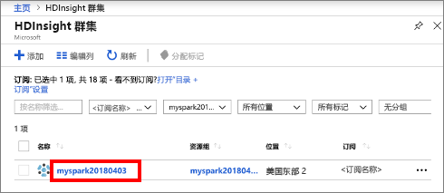
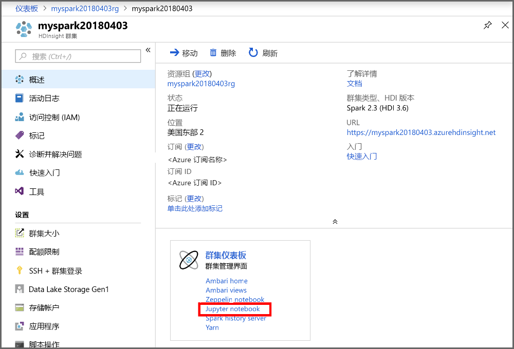
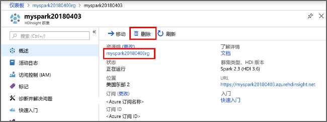

# <a name="quickstart-create-a-spark-cluster-in-hdinsight-using-the-azure-portal"></a>快速入门：使用 Azure 门户在 HDInsight 中创建 Spark 群集
了解如何在 Azure HDInsight 中创建 Apache Spark 群集，以及如何对 Hive 表运行 Spark SQL 查询。 通过 Apache Spark 可以使用内存处理进行快速数据分析和群集计算。 有关 Spark on HDInsight 的信息，请参阅[概述：Azure HDInsight 上的 Apache Spark](apache-spark-overview.md)。

在此快速入门中，使用 Azure 门户创建 HDInsight Spark 群集。 群集将 Azure 存储 Blob 用作群集存储。 有关使用 Data Lake Storage Gen2 的详细信息，请参阅[快速入门：在 HDInsight 中设置群集](../../storage/data-lake-storage/quickstart-create-connect-hdi-cluster.md)。

> [!IMPORTANT]
> HDInsight 群集是基于分钟按比例收费，而不管用户是否正在使用它们。 请务必在使用完之后删除群集。 有关详细信息，请参阅本文的[清理资源](#clean-up-resources)部分。

如果没有 Azure 订阅，请在开始之前[创建一个免费帐户](https://azure.microsoft.com/free/)。

## <a name="create-an-hdinsight-spark-cluster"></a>创建 HDInsight Spark 群集

1. 在 Azure 门户中，选择“创建资源” > “数据 + 分析” > “HDInsight”。 

    
2. 在“基本”下，提供以下值：
     
    |属性  |说明  |
    |---------|---------|
    |**群集名称**     | 为 HDInsight Spark 群集命名。 用于此快速入门的群集名称为“myspark20180403”。|
    |**订阅**     | 从下拉列表中，选择用于此群集的 Azure 订阅。 用于此快速入门的订阅是 &lt;Azure 订阅。 |
    |**群集类型**| 展开该项目，然后选择“Spark”作为群集类型，并指定 Spark 群集版本。 <br/>  |
    |**群集登录用户名**| 输入群集登录用户名。  默认名称为 *admin*。在此快速入门中稍后使用该帐户登录到 Jupyter notebook。 |
    |**群集登录密码**| 输入群集登录密码。 |
    |**安全外壳 (SSH) 用户名**| 输入 SSH 用户名。 用于此快速入门的 SSH 用户名为“sshuser”。 默认情况下，此帐户的密码与群集登录用户名帐户的密码相同。 |
    |**资源组**     | 指定是要创建新的资源组还是使用现有的资源组。 资源组是用于保存 Azure 解决方案相关资源的容器。 用于此快速入门的资源组名称为“myspark20180403rg”。 |
    |**位置**     | 选择资源组的位置。 模板将此位置用于创建群集，以及用于默认群集存储。 用于此快速入门的位置为“美国东部 2”。 |

    

    选择“下一步”，转到“存储”页。
3. 在“存储”下，提供以下值：

    - **选择存储帐户**：选择“新建”，然后为新存储帐户命名。 用于此快速入门的存储帐户名称为“myspark20180403store”。

    

    > [!NOTE] 
    > 屏幕截图上显示“选择现有”。 可以在“新建”和“选择现有”之间切换此链接。

    默认容器具有默认名称。  可以根据需要更改此名称。

    选择“下一步”，转到“摘要”页。 


3. 在“摘要”页上，选择“创建”。 创建群集大约需要 20 分钟时间。 必须先创建群集，才能继续下一会话。

如果在创建 HDInsight 群集时遇到问题，可能是因为没有这样做的适当权限。 有关详细信息，请参阅[访问控制要求](../hdinsight-administer-use-portal-linux.md#create-clusters)。

## <a name="create-a-jupyter-notebook"></a>创建 Jupyter 笔记本

Jupyter Notebook 是支持各种编程语言的交互式笔记本环境。 通过此笔记本可以与数据进行交互、结合代码和 markdown 文本以及执行简单的可视化效果。 

1. 打开 [Azure 门户](https://portal.azure.com)。
2. 选择“HDInsight 群集”，然后选择所创建的群集。

    

3. 在门户中，选择“群集仪表板”，然后选择“Jupyter Notebook”。 出现提示时，请输入群集的群集登录凭据。

   

4. 选择“新建” > “PySpark”，创建笔记本。 

   

   新笔记本随即已创建，并以 Untitled(Untitled.pynb) 名称打开。


## <a name="run-spark-sql-statements"></a>运行 Spark SQL 语句

SQL（结构化查询语言）是用于查询和定义数据的最常见、最广泛使用的语言。 Spark SQL 作为 Apache Spark 的扩展使用，可使用熟悉的 SQL 语法处理结构化数据。

1. 验证 kernel 已就绪。 如果在 Notebook 中的内核名称旁边看到空心圆，则内核已准备就绪。 实心圆表示内核正忙。

    

    首次启动 Notebook 时，内核在后台执行一些任务。 等待内核准备就绪。 
2. 将以下代码粘贴到一个空单元格中，然后按 **SHIFT + ENTER** 来运行这些代码。 此命令列出群集上的 Hive 表：

    ```PySpark
    %%sql
    SHOW TABLES
    ```
    将 Jupyter Notebook 与 HDInsight Spark 群集配合使用时，会获得一个预设的 `sqlContext`，可以使用它通过 Spark SQL 来运行 Hive 查询。 `%%sql` 指示 Jupyter Notebook 使用预设 `sqlContext` 运行 Hive 查询。 该查询从默认情况下所有 HDInsight 群集都带有的 Hive 表 (hivesampletable) 检索前 10 行。 需要大约 30 秒才能获得结果。 输出如下所示： 

    

    每次在 Jupyter 中运行查询时，Web 浏览器窗口标题中都会显示“(繁忙)”状态和 Notebook 标题。 右上角“PySpark”文本的旁边还会出现一个实心圆。
    
2. 运行另一个查询，请查看 `hivesampletable` 中的数据。

    ```PySpark
    %%sql
    SELECT * FROM hivesampletable LIMIT 10
    ```
    
    屏幕在刷新后会显示查询输出。

    

2. 请在 Notebook 的“文件”菜单中选择“关闭并停止”。 关闭 Notebook 会释放群集资源。

## <a name="clean-up-resources"></a>清理资源
HDInsight 将数据保存在 Azure 存储或 Azure Data Lake Storage 中，因此可以在未使用群集时安全地删除群集。 此外，还需要为 HDInsight 群集付费，即使不用也是如此。 由于群集费用数倍于存储空间费用，因此在群集不用时删除群集可以节省费用。 如果要立即开始[后续步骤](#next-steps)中所列的教程，可能需要保留群集。

切换回 Azure 门户，并选择“删除”。



还可以选择资源组名称，打开“资源组”页，然后选择“删除资源组”。 通过删除资源组，可以删除 HDInsight Spark 群集和默认存储帐户。

## <a name="next-steps"></a>后续步骤 

本快速入门介绍了如何创建 HDInsight Spark 群集并运行基本的 Spark SQL 查询。 转到下一教程，了解如何使用 HDInsight Spark 群集针对示例数据运行交互式查询。

> [!div class="nextstepaction"]
>[在 Spark 上运行交互式查询](./apache-spark-load-data-run-query.md)
