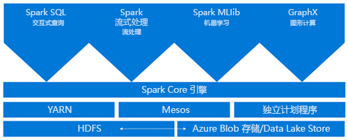

# Azure HDInsight 中的 Apache Spark 是什么

Apache Spark 是并行处理框架，支持使用内存中处理来提升大数据分析应用程序的性能。 Azure HDInsight 中的 Apache Spark 是 Microsoft 的 Apache Spark 在云中的实现。 使用 HDInsight 可在 Azure 中轻松创建和配置 Spark 群集。 HDInsight 中的 Spark 群集兼容 Azure 存储和 Azure Data Lake Storage。 因此，可使用 HDInsight Spark 群集来处理存储在 Azure 中的数据。 有关组件和版本信息，请参阅 [Azure HDInsight 中的 Apache Hadoop 组件和版本](../hdinsight-component-versioning.md)。

## 什么是 Apache Spark？

Spark 提供了用于内存中群集计算的基元。 Spark 作业可以将数据加载和缓存到内存中并重复地对其进行查询。 内存中计算比基于磁盘的应用程序（例如通过 Hadoop 分布式文件系统 (HDFS) 共享数据的 Hadoop）快速得多。 Spark 还集成到 Scala 编程语言中，让你可以像处理本地集合一样处理分布式数据集。 无需将所有内容构造为映射和化简操作。

HDInsight 中的 Spark 群集提供完全托管的 Spark 服务。 下面列出了在 HDInsight 中创建 Spark 群集的优势。

| Feature | 说明 |
| --- | --- |
| 轻松创建 |可以使用 Azure 门户、Azure PowerShell 或 HDInsight .NET SDK，在几分钟之内于 HDInsight 中创建新的 Spark 群集。 请参阅 [HDInsight 中的 Apache Spark 群集入门](apache-spark-jupyter-spark-sql-use-portal.md)。 |
| 易于使用 |HDInsight 中的 Spark 群集包括 Jupyter 和 Apache Zeppelin Notebook。 可以使用这些笔记本执行交互式数据处理和可视化。 请参阅[将 Apache Zeppelin 笔记本与 Apache Spark 配合使用](apache-spark-zeppelin-notebook.md)和[在 Apache Spark 群集上加载数据并运行查询](apache-spark-load-data-run-query.md)。|
| REST API |HDInsight 中的 Spark 群集包含 [Apache Livy](https://github.com/cloudera/hue/tree/master/apps/spark/java#welcome-to-livy-the-rest-spark-server)，它是基于 REST-API 的 Spark 作业服务器，用于远程提交和监视作业。 请参阅[使用 Apache Spark REST API 将远程作业提交到 HDInsight Spark 群集](apache-spark-livy-rest-interface.md)。|
| 支持 Azure Data Lake Storage | HDInsight 中的 Spark 群集可使用 Azure Data Lake Storage 作为主存储或附加存储。 有关 Data Lake Storage 的详细信息，请参阅 [Azure Data Lake Storage 概述](../../data-lake-store/data-lake-store-overview.md)。 |
| 与 Azure 服务集成 |HDInsight 中的 Spark 群集随附了 Azure 事件中心的连接器。 可以使用事件中心来构建流式处理应用程序。 此类应用程序包括已作为 Spark 的一部分提供的 Apache Kafka。 |
| 对 ML Server 的支持 | HDInsight 中对 ML Server 的支持是作为 **ML Services** 群集类型提供的。 可以将 ML Services 群集设置为以 Spark 群集承诺的速度运行分布式 R 计算。 有关详细信息，请参阅[什么是 Azure HDInsight 中的 ML Services？](../r-server/r-server-overview.md)。 |
| 与第三方 IDE 集成 | HDInsight 提供多个 IDE 插件，这些插件可用于创建应用程序，并将应用程序提交到 HDInsight Spark 群集。 有关详细信息，请参阅[使用 Azure Toolkit for IntelliJ IDEA](apache-spark-intellij-tool-plugin.md)、[使用用于 VSCode 的 Spark 和 Hive 工具](../hdinsight-for-vscode.md)和[使用 Azure Toolkit for Eclipse](apache-spark-eclipse-tool-plugin.md)。|
| 并发查询 |HDInsight 中的 Spark 群集支持并发查询。 此功能允许一个用户运行多个查询，或者不同的用户运行多个查询，以及让应用程序共享相同的群集资源。 |
| SSD 缓存 |可以选择将数据缓存在内存中，或缓存在已附加到群集节点的 SSD 中。 内存缓存提供最佳的查询性能，但可能费用不菲。 SSD 缓存是改善查询性能的绝佳选项，而且不需要根据内存中的整个数据集创建满足其需求的群集规模。 请参阅[使用 Azure HDInsight IO 缓存提高 Apache Spark 工作负载的性能](apache-spark-improve-performance-iocache.md)。 |
| 与 BI 工具集成 |HDInsight 中的 Spark 群集为 BI 工具（例如用于数据分析的 Power BI）提供了连接器。 |
| 预先加载的 Anaconda 库 |HDInsight 中的 Spark 群集随附预先安装的 Anaconda 库。 [Anaconda](https://docs.continuum.io/anaconda/) 提供将近 200 个用于机器学习、数据分析、可视化效果等的库。 |
| 自适应性 | HDInsight 允许通过自动缩放功能动态更改群集节点的数量。 请参阅[自动缩放 Azure HDInsight 群集](../hdinsight-autoscale-clusters.md)。 此外，由于所有数据都存储在 Azure 存储或 Data Lake Storage 中，因此可以在不丢失数据的情况下删除 Spark 群集。 |
| SLA |HDInsight 中的 Spark 群集附有全天候支持和保证正常运行时间达 99.9% 的 SLA。 |

默认情况下，HDInsight 中的 Apache Spark 群集可通过群集提供以下组件。

* [Spark Core](https://spark.apache.org/docs/latest/)。 包括 Spark Core、Spark SQL、Spark 流式处理 API、GraphX 和 MLlib。
* [Anaconda](https://docs.continuum.io/anaconda/)
* [Apache Livy](https://github.com/cloudera/hue/tree/master/apps/spark/java#welcome-to-livy-the-rest-spark-server)
* [Jupyter 笔记本](https://jupyter.org)
* [Apache Zeppelin 笔记本](http://zeppelin-project.org/)

HDInsight Spark 群集提供了一个 [ODBC 驱动程序](https://go.microsoft.com/fwlink/?LinkId=616229)，用于从 BI 工具（例如 Microsoft Power BI）建立连接。

## Spark 群集体系结构

了解 Spark 在 HDInsight 群集上的运行方式后，即可轻松了解 Spark 的组件。

Spark 应用程序在群集上作为独立的进程集运行。 由主程序（称为驱动程序）中的 SparkContext 对象进行协调。

SparkContext 可连接到多种类型的群集管理器，可跨应用程序分配资源。 这些群集管理器包括 Apache Mesos、[Apache Hadoop YARN](https://hadoop.apache.org/docs/current/hadoop-yarn/hadoop-yarn-site/YARN.html) 或 Spark 群集管理器。 在 HDInsight 中，Spark 使用 YARN 群集管理器运行。 连接后，Spark 可获取群集中工作节点上的执行程序，该执行程序是为应用程序运行计算和存储数据的进程。 然后，它将应用程序代码（由传递给 SparkContext 的 JAR 或 Python 文件指定）发送到执行程序。 最后，SparkContext 将任务发送给执行程序来运行。

SparkContext 在工作节点上运行用户的主函数，并执行各种并行操作。 然后，SparkContext 收集操作的结果。 工作节点从 Hadoop 分布式文件系统读取数据并将数据写入其中。 工作节点还将已转换数据作为弹性分布式数据集 (RDD) 缓存在内存中。

SparkContext 连接到 Spark 主节点，负责将应用程序转换为各个任务的有向图 (DAG)。 这些任务在工作节点上的执行程序进程内执行。 每个应用程序都有其自己的执行程序进程。 这些进程会在整个应用程序的持续时间内保持运行，并在多个线程中运行任务。

## HDInsight 中的 Spark 用例

HDInsight 中的 Spark 群集适用于以下主要方案：

### 交互式数据分析和 BI

HDInsight 中的 Apache Spark 将数据存储在 Azure 存储或 Azure Data Lake Storage 中。 业务专员和关键决策者可以分析这些数据并据此生成报表。 他们还可以使用 Microsoft Power BI 基于所分析的数据生成交互式报表。 分析师可以从群集存储内的非结构化/半结构化数据着手，使用 Notebook 来定义数据的架构，并使用 Microsoft Power BI 生成数据模型。 HDInsight 中的 Spark 群集还支持许多第三方 BI 工具。 例如，Tableau 可以简化数据分析师、业务专员和关键决策者的工作。

* [教程：使用 Power BI 可视化 Spark 数据](apache-spark-use-bi-tools.md)

### Spark 机器学习

Apache Spark 附带了 [MLlib](https://spark.apache.org/mllib/)。 MLlib 是在 Spark 基础上构建的机器学习库，可以从 HDInsight 中的 Spark 群集使用。 HDInsight 中的 Spark 群集还包含 Anaconda - 为机器学习提供各种包的 Python 发行版。 结合内置的 Jupyter 和 Zeppelin 笔记本支持，你有了一个用于创建机器学习应用程序的环境。

* [教程：使用 HVAC 数据预测建筑物温度](apache-spark-ipython-notebook-machine-learning.md)  
* [教程：预测食品检测结果](apache-spark-machine-learning-mllib-ipython.md)

### Spark 流式处理和实时数据分析

HDInsight 中的 Spark 群集提供丰富的支持，供你生成实时分析解决方案。 Spark 已包含一些连接器用于从 Kafka、Flume、Twitter、ZeroMQ 或 TCP 套接字等多个源引入数据。 HDInsight 中的 Spark 为从 Azure 事件中心引入数据增加了了一流的支持。 事件中心是 Azure 上最广泛使用的队列服务。 HDInsight 中的 Spark 群集完全支持事件中心，因此已成为生成实时分析管道的理想平台。

* [Apache Spark 流式处理概述](apache-spark-streaming-overview.md)
* [Apache Spark 结构化流的概述](apache-spark-structured-streaming-overview.md)

## 从哪里开始？

可通过以下文章深入了解 HDInsight 中的 Apache Spark：

* [快速入门：使用 Jupyter 在 HDInsight 中创建 Apache Spark 群集并运行交互式查询](./apache-spark-jupyter-spark-sql-use-portal.md)
* [教程：使用 Jupyter 运行 Apache Spark 作业](./apache-spark-load-data-run-query.md)
* [教程：使用 BI 工具分析数据](./apache-spark-use-bi-tools.md)
* [教程：使用 Apache Spark 进行机器学习](./apache-spark-ipython-notebook-machine-learning.md)
* [教程：使用 IntelliJ 创建 Scala Maven 应用程序](./apache-spark-create-standalone-application.md)

## 后续步骤

在此概述中，可了解 Azure HDInsight 中 Apache Spark 的一些基础知识。 了解如何创建 HDInsight Spark 群集并运行一些 Spark SQL 查询：

* [在 HDInsight 中创建 Apache Spark 群集](./apache-spark-jupyter-spark-sql-use-portal.md)
