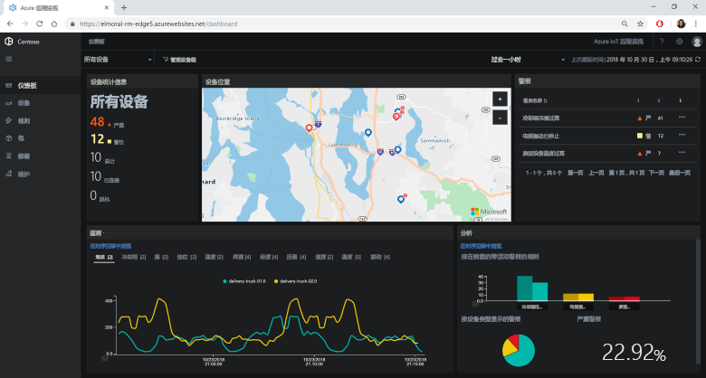
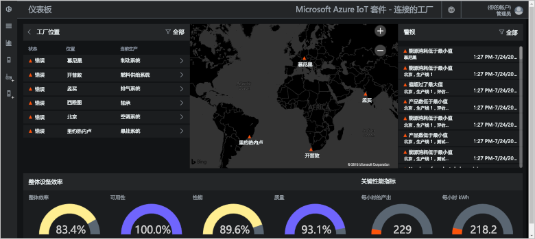
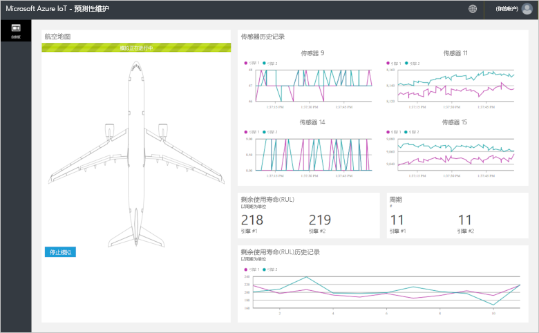
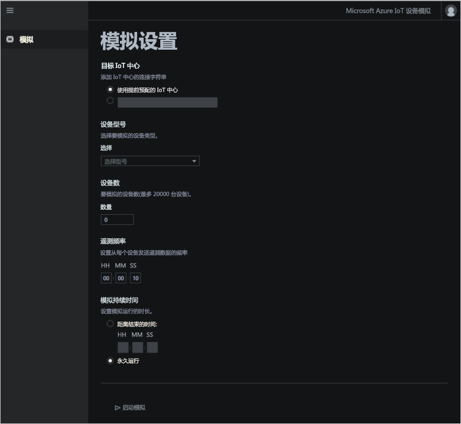

# Azure IoT 解决方案加速器是什么？

基于云的 IoT 解决方案通常使用自定义代码和云服务来管理设备连接、数据处理、分析和呈现。

IoT 解决方案加速器是完整且易于部署的 IoT 解决方案，可以实现常见的 IoT 方案。 这些方案包括远程监视、连接工厂、预测性维护和设备模拟。 部署解决方案加速器时，部署将包括全部所需的基于云的服务，以及全部所需的应用程序代码。

解决方案加速器是你自己的 IoT 解决方案的起点。 所有解决方案加速器的源代码都是开源的，并已在 GitHub 中提供。 建议按要求下载并自定义解决方案加速器。

此外，在从头开始生成自定义的 IoT 解决方案之前，可以使用解决方案加速器作为学习工具。 解决方案加速器针对基于云的 IoT 解决方案实施成熟的做法，你也可以遵循这些做法。

每个解决方案加速器中的应用程序代码包括一个 Web 应用，用于管理解决方案加速器。

## 支持的 IoT 方案

目前，有四个解决方案加速器可供部署：

### 远程监视

使用[远程监视解决方案加速器](iot-accelerators-remote-monitoring-sample-walkthrough.md)可以从远程设备收集遥测数据，以及控制远程设备。 示例设备包括客户现场安装的散热系统，或者远地泵房中安装的阀门。

可以使用远程监视仪表板查看联网设备发出的遥测数据、预配新设备，或者升级联网设备上的固件：

### 互连工厂

使用[连接工厂解决方案加速器](iot-accelerators-connected-factory-features.md)可以从配备了 [OPC 统一体系结构](https://opcfoundation.org/about/opc-technologies/opc-ua/)接口的工业资产收集遥测数据，以及控制这些资产。 工业资产可能包括工厂生产线上的组装和测试工位。

可以使用互联工厂仪表板来监视和管理工业设备：

### 预测性维护

使用[预测性维护解决方案加速器](iot-accelerators-predictive-walkthrough.md)可以预测远程设备何时可能会发生故障，以便在设备发生故障之前进行维护。 此解决方案加速器使用机器学习算法，基于设备遥测数据预测故障。 示例设备包括飞机引擎或电梯。

可以使用预测性维护仪表板来查看预测性维护分析：

### 设备模拟

使用[设备模拟解决方案加速器](iot-accelerators-device-simulation-overview.md)可以运行能够生成真实遥测数据的模拟设备。 可以使用此解决方案加速器测试其他解决方案加速器的行为，或测试自己的自定义 IoT 解决方案。

可以使用设备模拟 Web 应用来配置并运行模拟：

## 设计原理

所有解决方案加速器遵循相同的设计原理和目标。 它们在设计上具有以下特点：

* **可缩放**：允许连接和管理数百万个联网设备。
* **可扩展**：允许根据要求进行自定义。
* **易于理解**：可让你了解其工作原理及其实施方式。
* **模块化**：允许将服务更换为其他替代项。
* **安全**：将 Azure 安全性与内置的连接和设备安全功能相结合。

## 体系结构和语言

原始的解决方案加速器是使用模型-视图-控制器 (MVC) 体系结构以 .NET 编写的。 Microsoft 正在将解决方案加速器更新为新的微服务体系结构。 下表显示了解决方案加速器的当前状态，并提供了 GitHub 存储库的链接：

| 解决方案加速器   | 体系结构  | 语言     |
| ---------------------- | ------------- | ------------- |
| 远程监视      | 微服务 | [Java](https://github.com/Azure/azure-iot-pcs-remote-monitoring-java) 和 [.NET](https://github.com/Azure/azure-iot-pcs-remote-monitoring-dotnet) |
| 预测性维护 | MVC           | [.NET](https://github.com/Azure/azure-iot-predictive-maintenance)          |
| 互连工厂      | MVC           | [.NET](https://github.com/Azure/azure-iot-connected-factory)          |
| 设备模拟      | 微服务 | [.NET](https://github.com/Azure/device-simulation-dotnet)          |

若要了解有关微服务体系结构的详细信息，请参阅 [Azure IoT 参考体系结构简介](iot-accelerators-architecture-overview.md)。

## 部署选项

可以通过 [Microsoft Azure IoT 解决方案加速器](https://www.azureiotsolutions.com/Accelerators#)站点或命令行部署解决方案加速器。

可以按以下配置部署远程监视解决方案加速器：

* **标准：** 扩展的基础结构部署，适用于开发生产型部署。 Azure 容器服务将微服务部署到多个 Azure 虚拟机。 Kubernetes 会协调托管单个微服务的 Docker 容器。
* **基本：** 降低成本版，用于演示或部署测试。 所有微服务都部署到一个 Azure 虚拟机。
* **本地：** 用于测试和开发的本地计算机部署。 此方法将微服务部署到本地 Docker 容器，并连接到云中的 IoT 中心、Azure Cosmos DB 和 Azure 存储服务。

运行解决方案加速器的成本是[运行底层 Azure 服务的成本](https://azure.microsoft.com/pricing)的总和。 选择部署选项时，会看到所用的 Azure 服务的详细信息。

## 后续步骤

若要试用某个 IoT 解决方案加速器，请参阅以下快速入门：

* [尝试远程监视解决方案](quickstart-remote-monitoring-deploy.md)
* [尝试互联工厂解决方案](quickstart-connected-factory-deploy.md)
* [尝试预测性维护解决方案](quickstart-predictive-maintenance-deploy.md)
* [尝试设备模拟解决方案](quickstart-device-simulation-deploy.md)
