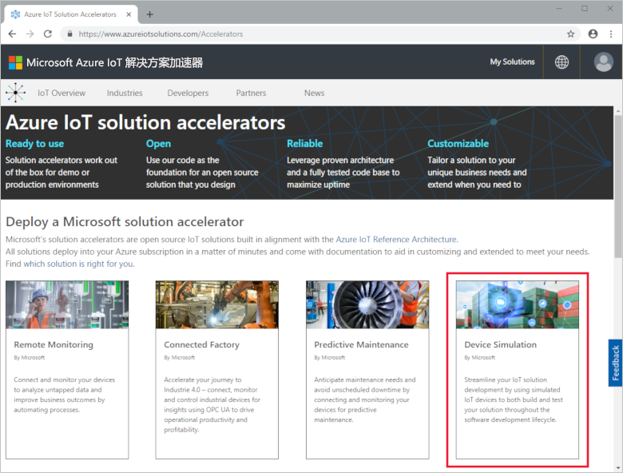
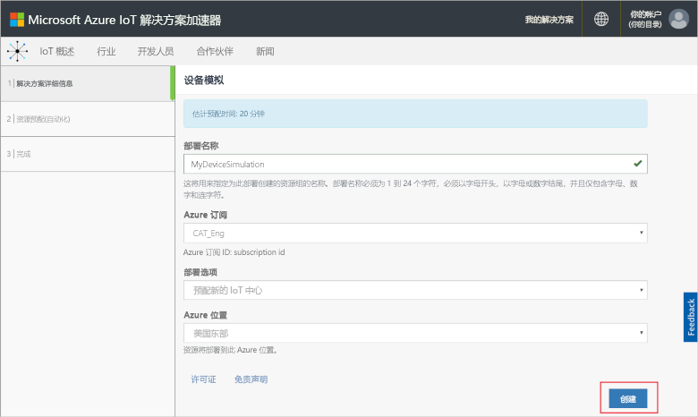
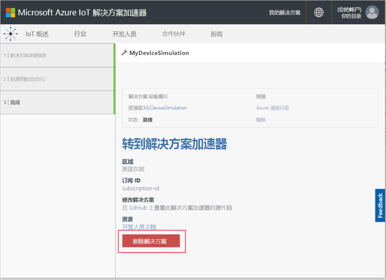

# 快速入门：部署并运行基于云的设备模拟解决方案

本快速入门介绍如何部署用于测试 IoT 解决方案的 Azure IoT 设备模拟解决方案加速器。 在部署解决方案加速器以后，请使用“模拟”页来创建并运行模拟。

若要完成本快速入门，需要一个有效的 Azure 订阅。

如果没有 Azure 订阅，请在开始之前创建一个 [免费帐户](https://azure.microsoft.com/free/?WT.mc_id=A261C142F)。

## 部署解决方案

将解决方案加速器部署到 Azure 订阅时，必须设置一些配置选项。

使用 Azure 帐户凭据登录到 [azureiotsolutions.com](https://www.azureiotsolutions.com/Accelerators)。

单击“设备模拟”磁贴上的“立即尝试”。

在“创建设备模拟解决方案”页上输入唯一的“解决方案名称”。 记下解决方案名称，该名称是包含解决方案的所有资源的 Azure 资源组的名称。

选择要用于部署解决方案加速器的**订阅**和**区域**。 通常，我们会选择离自己最近的区域。 只有订阅中的[全局管理员或用户](iot-accelerators-permissions.md)才能完成部署。

勾选用于部署 IoT 中心的框，该中心可以与设备模拟解决方案配合使用。 之后可以随时更改模拟使用的 IoT 中心。

单击“创建解决方案”，开始预配解决方案。 此过程至少需要五分钟才能完成运行：

## 登录到解决方案

在预配过程完成后，可以登录到设备模拟解决方案加速器仪表板。

在“预配的解决方案”页上，单击新的设备模拟解决方案加速器：

可以在显示的面板中查看有关设备模拟解决方案加速器的信息。 选择“解决方案仪表板”，查看设备模拟解决方案加速器：

单击“接受”以接受权限请求，设备模拟解决方案仪表板会在浏览器中显示：

## 配置模拟

在仪表板中配置并运行模拟。 使用下表中的值来配置模拟：

| 设置             | 值                       |
| ------------------- | --------------------------- |
| 目标 IoT 中心      | 使用预先预配的 IoT 中心 |
| 设备型号        | 冷却器                     |
| 设备数   | 10                          |
| 遥测频率 | 10 秒                  |
| 模拟持续时间 | 5 分钟                   |

## 运行模拟

单击“启动模拟”。 模拟运行的时间取决于所选持续时间。 可以随时单击“停止模拟”来停止模拟。 模拟显示当前运行的统计信息。 单击“在 Azure 门户中查看 IoT 中心指标”即可查看 IoT 中心报告的指标：

只能通过预配的解决方案加速器实例一次运行一个模拟。

## 清理资源

如果打算深入进行探索，请保留已部署的设备模拟解决方案加速器。

如果不再需要该解决方案加速器，请从[预配的解决方案](https://www.azureiotsolutions.com/Accelerators#dashboard)页中选择它，然后单击“删除解决方案”以将其删除：

## 后续步骤

本快速入门介绍了如何部署设备模拟解决方案加速器并运行 IoT 设备模拟。

若要了解如何在模拟中使用现有的 IoT 中心，请参阅以下操作方法指南：

> [!div class="nextstepaction"]
> [将现有的 IoT 中心与设备模拟解决方案加速器配合使用](iot-accelerators-device-simulation-choose-hub.md)
