# 浏览 Azure IoT Central UI

本文介绍了 Microsoft Azure IoT Central UI。 可以通过 UI 创建、管理和使用 Azure IoT Central 解决方案及其已连接的设备。

作为“解决方案构建者”可以使用 Azure IoT Central UI 来定义 Azure IoT Central 解决方案  。 他们可以使用 UI 执行以下操作：

* 定义连接到解决方案的设备类型。
* 配置用于设备的规则和操作。 
* 为使用解决方案的“操作员”自定义 UI。 

“操作员”  可以使用 Azure IoT Central UI 来管理 Azure IoT Central 解决方案。 他们可以使用 UI 执行以下操作：

* 监视设备。
* 配置设备。
* 排查和修正设备问题。
* 设置新设备。

## IoT Central 主页

你可以在 [IoT Central 主页](https://aka.ms/iotcentral-get-started)页面上详细了解有关 IoT Central 的最新消息和可用功能，创建新的应用程序以及查看和启动现有的应用程序。

> [!div class="mx-imgBorder"]
> 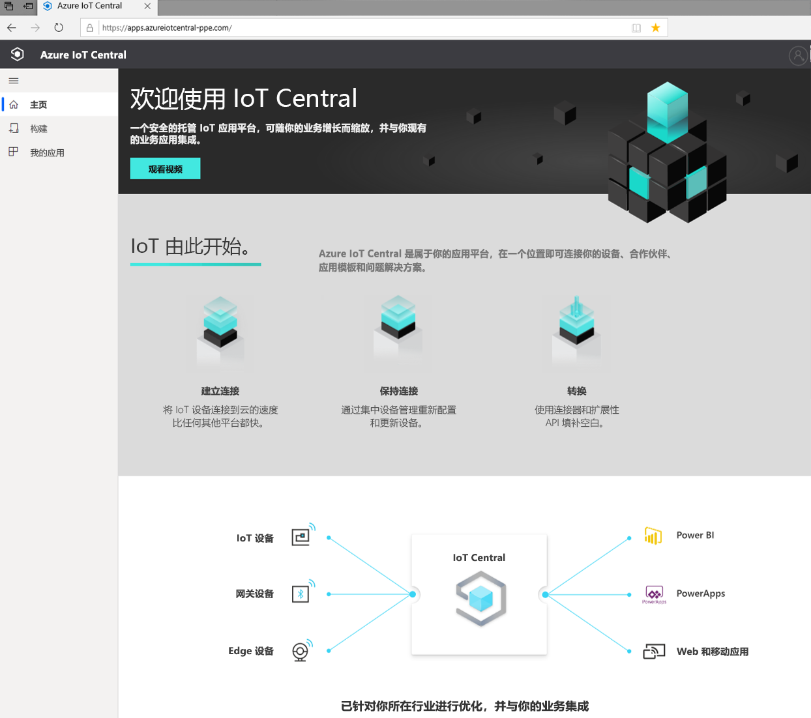

### 创建应用程序

在“生成”部分，你可以浏览与行业相关的 IoT Central 模板列表，以帮助你快速入门，也可以使用“自定义应用”模板从头开始。  
> [!div class="mx-imgBorder"]
> 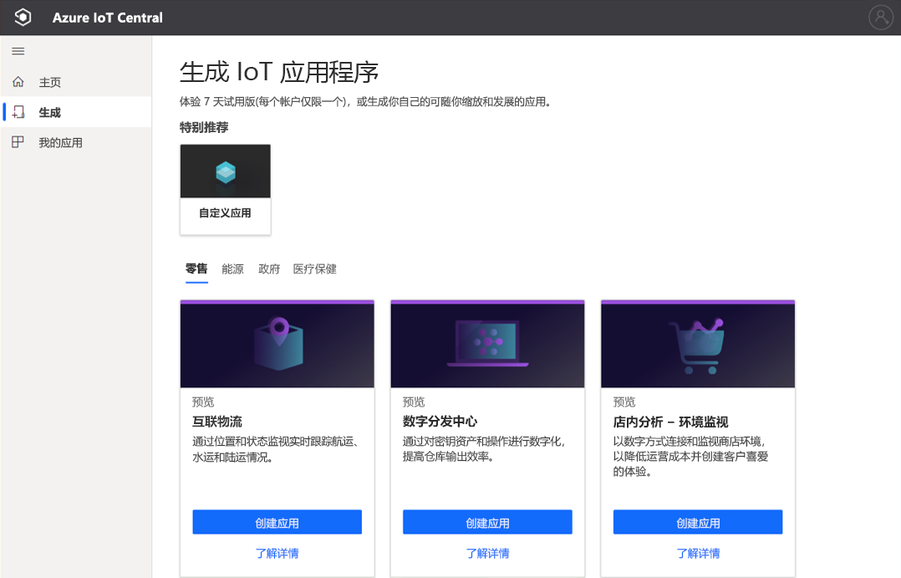

有关详细信息，请参阅[创建 Azure IoT Central 应用程序](quick-deploy-iot-central.md)快速入门。

### 启动应用程序

可以转到应用创建过程中你或解决方案构建者选择的 URL 来启动 IoT Central 应用程序。 你还可以在 [IoT Central 应用管理器](https://aka.ms/iotcentral-apps)中看到有权访问的所有应用程序的列表。

> [!div class="mx-imgBorder"]
> 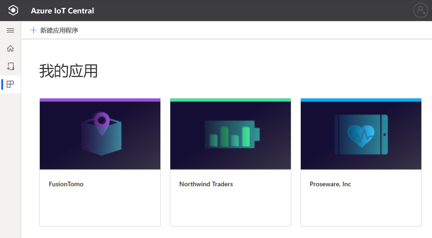

## 导航应用程序

进入 IoT 应用程序后，使用左侧窗格访问不同区域。 可选择左窗格顶部的三行图标来展开或折叠该窗格：

> [!NOTE]
> 左窗格中显示的项目将取决于用户角色。 详细了解[管理用户和角色](howto-manage-users-roles.md)。 

:::row:::
  :::column span="":::
      > [!div class="mx-imgBorder"]
      > 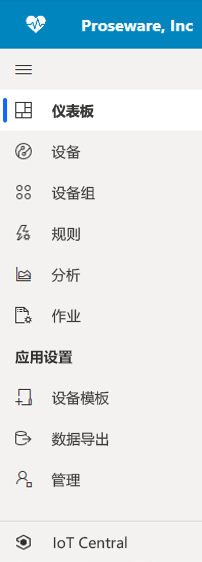
  :::column-end:::
  :::column span="2":::
     “仪表板”  显示应用程序仪表板。 作为“解决方案构建者”，你可以为操作员自定义全局仪表板  。 根据用户角色的不同，操作员还可以创建自己的个人仪表板。
     
     **设备**使你能够管理连接的设备 - 实际设备和模拟设备。

     **设备组**允许查看和创建由查询指定的设备的逻辑集合。 可以保存此查询，并通过应用程序使用设备组执行批量操作。

     **规则**允许创建和编辑用于监视设备的规则。 规则是基于设备遥测和触发可自定义操作来评估的。

     **分析**允许基于设备数据创建自定义视图来从应用程序获得见解。

     **作业**允许通过运行批量操作来大规模管理设备。

     **设备模板**是创建和管理连接到应用程序的设备特性的地方。

     **数据导出**允许配置对外部服务的连续导出，例如存储和队列。

     **管理**是管理应用程序的设置、自定义、计费、用户和角色的地方。

     **IoT Central** 允许管理员跳回 IoT Central 的应用管理器  。
     
   :::column-end:::
:::row-end:::

### 搜索、帮助、主题和支持

顶部的菜单显示在每个页面中：

> [!div class="mx-imgBorder"]
> 

* 若要搜索设备模板和设备，请输入“搜索”  值。
* 若要更改 UI 语言或主题，请选择“设置”  图标。 详细了解[管理应用程序首选项](howto-manage-preferences.md)
* 若要从应用程序中注销，请选择“帐户”  图标。
* 若要获取帮助和支持，请选择**帮助**下拉列表以显示资源列表。 在针对免费定价计划的应用程序中，支持资源包括对[实时聊天](howto-show-hide-chat.md)的访问权限。

可以为 UI 选择浅色主题或深色主题：

> [!NOTE]
> 如果管理员已为应用程序配置自定义主题，则无法在浅色主题和深色主题之间切换。

> [!div class="mx-imgBorder"]
> 

### 仪表板
> [!div class="mx-imgBorder"]
> 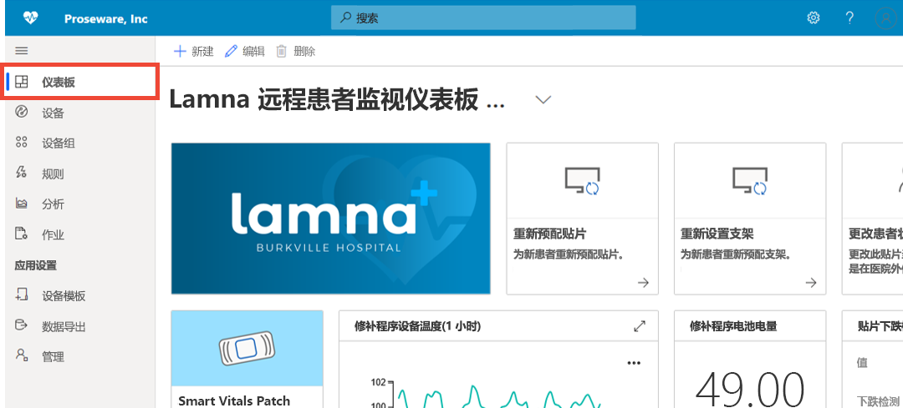

* 仪表板是登录到 Azure IoT Central 应用程序后看到的第一个页面。 解决方案构建者可以为其他用户创建和自定义多个全局应用程序仪表板  。 详细了解[将磁贴添加到仪表板](howto-add-tiles-to-your-dashboard.md)

* 如果操作员的用户角色允许，则可以创建个人仪表板来监视所关注的内容  。 若要了解详细信息，请参阅[创建 Azure IoT Central 个人仪表板](howto-create-personal-dashboards.md)操作指南文章。

### 设备

> [!div class="mx-imgBorder"]
> 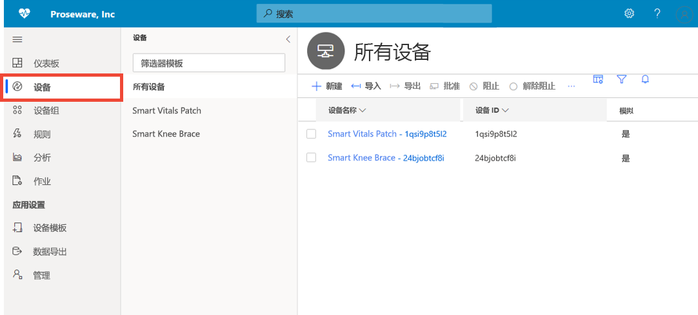

Explorer 页面显示 Azure IoT Central 应用程序中按“设备模板”分组的“设备”。   

* 设备模板定义可以连接到应用程序的设备类型。
* 设备表示应用程序中的真实或模拟设备。

若要了解更多信息，请参阅[监视设备](./quick-monitor-devices.md)快速入门。 

### 设备组

> [!div class="mx-imgBorder"]
> 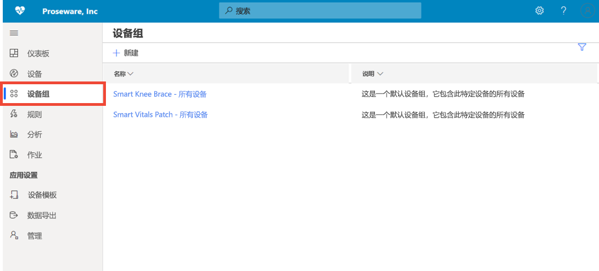

设备组是相关设备的集合。 解决方案构建者定义查询以标识设备组中包含的设备  。 使用设备组在应用程序中执行批量操作。 若要了解详细信息，请参阅[在 Azure IoT Central 应用程序中使用设备组](tutorial-use-device-groups.md)一文。

### 规则
> [!div class="mx-imgBorder"]
> 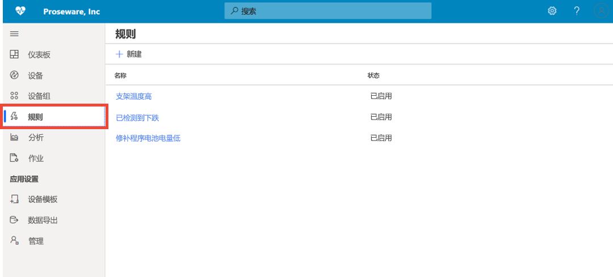

借助规则页可根据设备的遥测、状态或事件定义规则。 规则触发时，它可以触发一个或多个操作，例如发送电子邮件、通过 Webhook 警报通知外部系统等。若要了解信息，请参阅[配置规则](tutorial-create-telemetry-rules.md)教程。 

### Analytics

> [!div class="mx-imgBorder"]
> 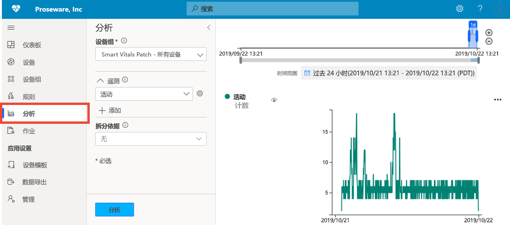

借助分析可基于设备数据创建自定义视图以从应用程序获得见解。 若要了解详细信息，请参阅[为 Azure IoT Central 应用程序创建分析](howto-create-analytics.md)一文。

### 作业

> [!div class="mx-imgBorder"]
> 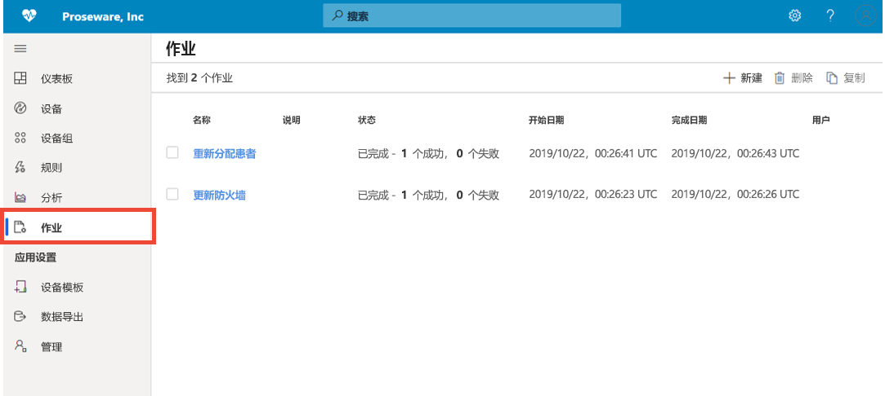

“作业”页可让你对设备执行批量设备管理操作。 可以更新设备属性、设置，并对设备组执行命令。 若要了解详细信息，请参阅[运行作业](howto-run-a-job.md)文章。

### 设备模板

> [!div class="mx-imgBorder"]
> 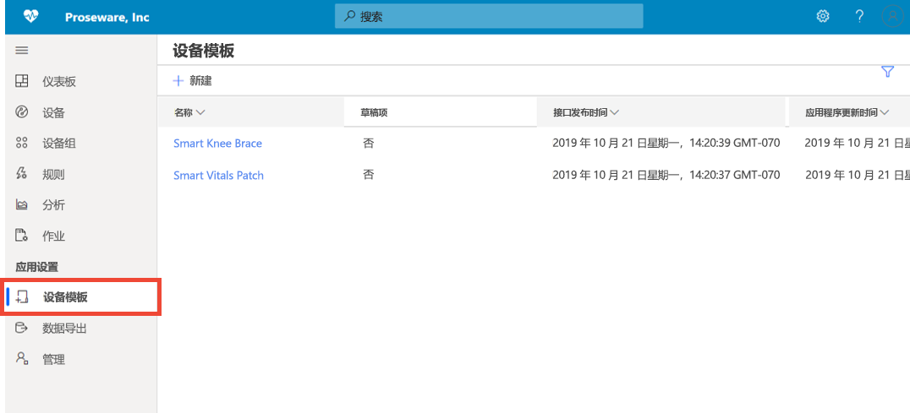

设备模板页可供构建者创建和管理应用程序中的设备模板。 设备模板指定设备特征，例如：

* 遥测、状态和事件度量
* 属性
* 命令
* 视图

解决方案构建者还可以创建表单和仪表板，供操作员用来管理设备  。

若要了解详细信息，请参阅[在 Azure IoT Central 应用程序中定义新的设备类型](howto-set-up-template.md)教程。 

### 数据导出
> [!div class="mx-imgBorder"]
> 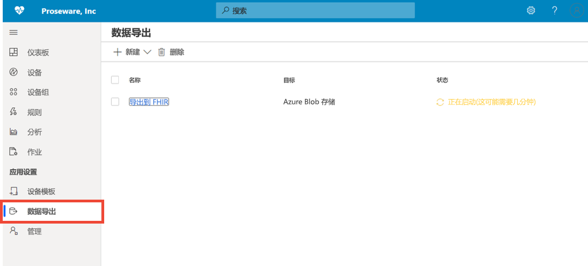

借助数据导出可设置从应用程序到外部系统的数据流，如遥测。 若要了解详细信息，请参阅[导出 Azure IoT Central 中的数据](./howto-export-data.md)一文。

### 管理
> [!div class="mx-imgBorder"]
> 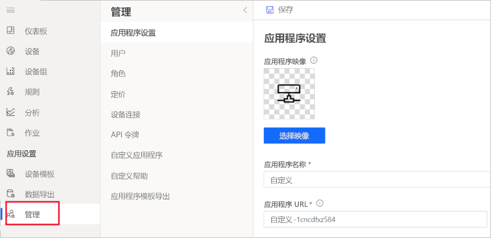

借助管理页可配置和自定义 IoT Central 应用程序。 你可在此更改应用程序名称、URL、主题、管理用户和角色、创建 API 令牌以及导出应用程序。 若要了解详细信息，请参阅[管理 Azure IoT Central 应用程序](howto-administer.md)一文。

## 后续步骤

现在，你已大致了解了 Azure IoT Central 并且熟悉了 UI 的布局，建议的下一步骤是完成[创建 Azure IoT Central 应用程序](quick-deploy-iot-central.md)快速入门。
