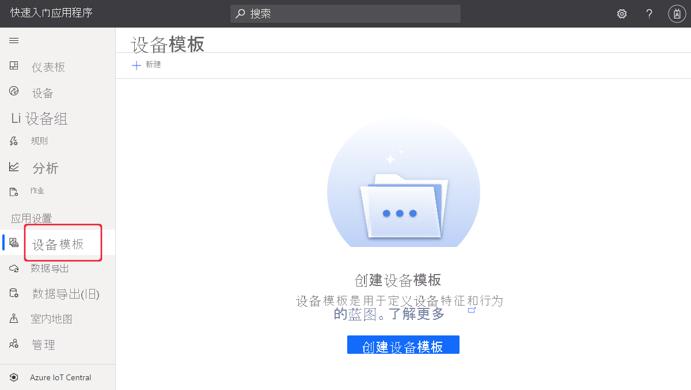
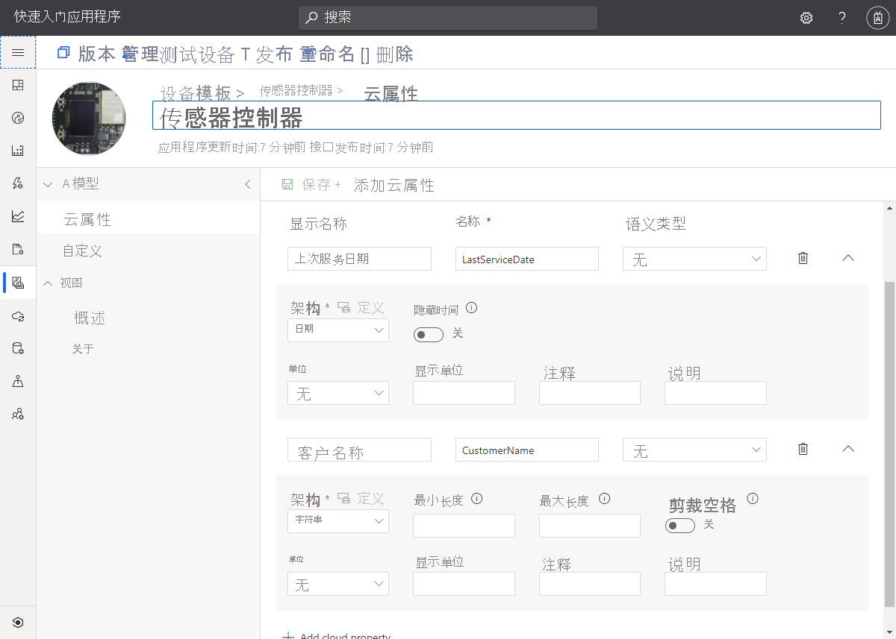
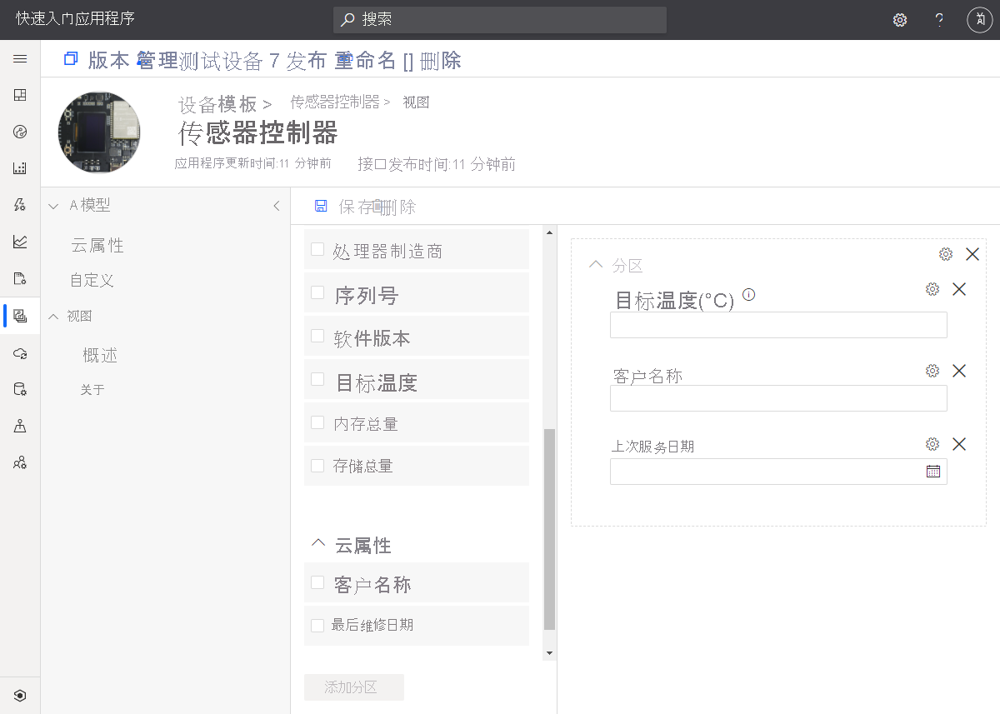
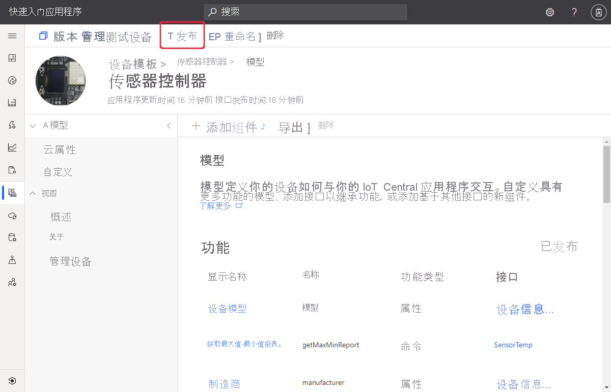
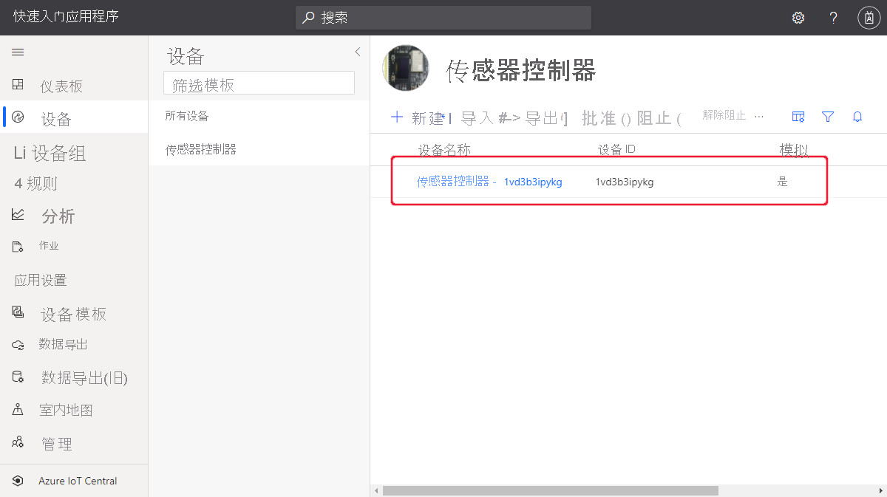
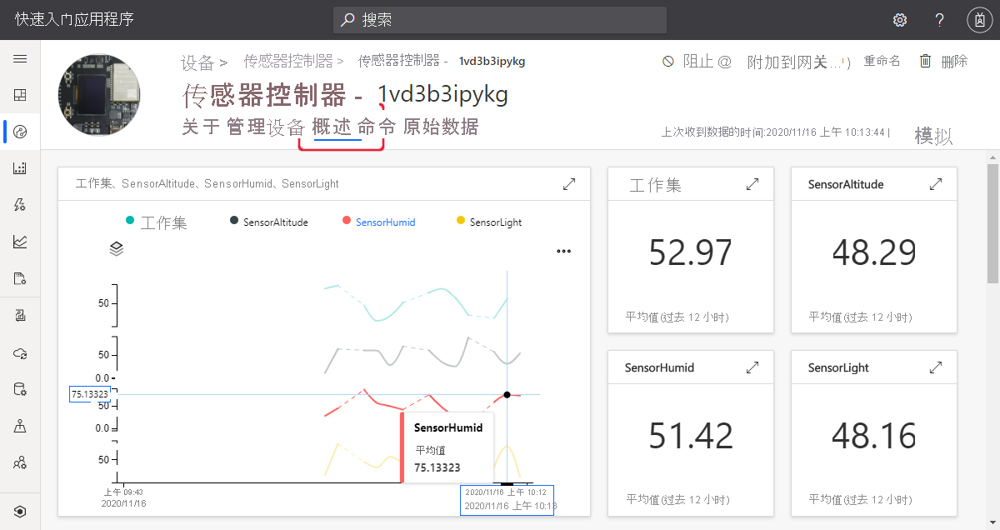

# 快速入门：将模拟设备添加到 IoT Central 应用程序

*本文适用于操作员、构建者和管理员。*

设备模板定义连接到 IoT Central 应用程序的设备的功能。 功能包括设备发送的遥测数据、设备属性以及设备响应的命令。 在设备模板中，构建者或操作员可以将实际设备和模拟设备添加到应用程序中。 在连接实际设备之前，模拟设备对于测试 IoT Central 应用程序的行为非常有用。

在本快速入门中，你将添加“MXChip IoT DevKit”（DevKit）开发板的设备模板并创建模拟设备。 无需准备真实的设备即可完成本快速入门，你将使用一个模拟的设备。 DevKit 设备：

* 发送温度等遥测数据。
* 报告设备特定的属性，例如亮度级别。
* 响应打开和关闭等命令。
* 报告常规设备属性，例如固件版本和序列号。

## 先决条件

完成[创建 Azure IoT Central 应用程序](./quick-deploy-iot-central.md)快速入门，使用“自定义应用”>“自定义应用程序”模板创建 IoT Central 应用程序。

## 创建模板

构建人员可在 IoT Central 应用程序中创建和编辑设备模板。 发布设备模板后，可以生成模拟设备，或者从设备模板连接真实设备。 使用模拟设备可以在连接实际设备之前先测试应用程序的行为。

若要将新设备模板添加到应用程序，请在左侧窗格中选择“设备模板”选项卡。

设备模板包含设备功能模型，该模型定义设备发送的遥测数据、设备属性以及设备响应的命令。

### 添加设备功能模型

可使用多个选项将设备功能模型添加到 IoT Central 应用程序。 可以从头开始创建模型、从文件导入模型，或者从设备目录中选择设备。 IoT Central 还支持“设备优先”方法：设备首次连接时，自动从存储库中导入模型。 本快速入门将从设备目录中选择一个设备，以导入其设备功能模型。

以下步骤说明如何使用设备目录导入“MXChip IoT DevKit”设备的功能模型。 这些设备将遥测数据（例如温度）发送到应用程序：

1. 若要添加新的设备模板，请在“设备模板”页上选择“+”   。

1. 在“选择模板类型”页上向下滚动，直到看到“MXChip IoT DevKit”磁贴。

1. 选择“MXChip IoT DevKit”磁贴，然后选择“下一步:   自定义”。

1. 在“查看”页上，选择“创建”   。

1. 几秒钟后，即可看到新的设备模板：

    

    MXChip IoT DevKit 功能模型包含“mxchip_sensor”、“mxchip_settings”和“设备信息”等接口。 接口定义 MXChip IoT DevKit 设备的功能。 功能包括设备发送的遥测数据、设备报告的属性，以及设备响应的命令。

### 添加云属性

设备模板可以包含云属性。 云属性仅存在于 IoT Central 应用程序中，永远不会与设备相互发送和接收信息。 添加云属性：

1. 依次选择“云属性”、“+ 添加云属性”。 使用下表中的信息将两个云属性添加到设备模板：

    | 显示名称      | 语义类型 | 架构 |
    | ----------------- | ------------- | ------ |
    | 最后维修日期 | 无          | Date   |
    | 客户名称     | 无          | 字符串 |

1. 选择“保存”以保存更改：

    

## 视图

构建人员可将应用程序自定义为向操作员显示有关设备的信息。 完成自定义后，操作员可以管理连接到应用程序的设备。 可为操作员创建两种类型的视图来让他们与设备交互：

* 用于查看和编辑设备与云属性的窗体。
* 用于可视化设备（包括其发送的遥测数据）的仪表板。

### 默认视图

默认视图是开始可视化重要设备信息的快捷方法。 最多可为设备模板生成三个默认视图：

* “命令”视图可让操作员将命令发送到设备。
* “概述”视图使用图表和指标来显示设备遥测数据。
* “关于”视图显示设备属性。

在设备模板中选择“视图”节点。 添加模板时，可以看到 IoT Central 生成了“概述”和“关于”视图。

若要添加可供操作员用来管理设备的新“管理设备”窗体：

1. 选择“视图”节点，然后选择“编辑设备和云数据”磁贴来添加新视图。

1. 将窗体名称更改为“管理设备”。

1. 依次选择“客户名称”和“上次服务日期”云属性、“风扇速度”属性。 然后选择“添加部分”：

    

1. 选择“保存”以保存新窗体。

## 发布设备模板

需要先发布设备模板，然后才能创建模拟设备或连接真实设备。 尽管首次创建模板时 IoT Central 已发布了该模板，但仍必须发布更新的版本。

若要发布设备模板：

1. 从“设备模板”页转到你的设备模板。

1. 选择“发布”：

    

1. 在“将此设备模板发布到应用程序”对话框中，选择“发布”。 

发布设备模板后，它将显示在“设备”页上。 在发布的设备模板中，除非创建新的版本，否则无法编辑设备功能模型。 但是，在不创建新版本的情况下，可以在发布的设备模板中更新云属性、自定义项和视图。 进行任何更改后，选择“发布”将这些更改推送给操作员。 

## 添加模拟设备

若要将模拟设备添加到应用程序，请使用创建的“MXChip IoT DevKit”设备模板。

1. 若要以操作员身份添加新设备，请在左侧窗格中选择“设备”  。 “设备”选项卡将显示“所有设备”和“MXChip IoT DevKit”设备模板。 选择“MXChip IoT DevKit”。

1. 若要添加模拟的 DevKit 设备，请选择 **+** 。 使用建议的**设备 ID** 或输入自己的小写**设备 ID**。 也可输入新设备的名称。 确保“模拟”开关为“开”，然后选择“创建”。

    

现在，可以使用模拟数据来与构建人员为设备模板创建的视图交互：

1. 在“设备”页上选择你的模拟设备

    * “概述”视图将显示模拟遥测数据的绘图：

        

    * “关于”视图将显示属性值，包括已添加到视图中的云属性。

    * 在“命令”视图中可以运行命令，例如，针对设备运行 **blink**。

    * “管理设备”视图是你为操作员创建的用于管理设备的窗体。

    * 借助“原始数据”视图，可以查看设备发送的原始遥测和属性值。 此视图对于调试设备非常有用。

## 使用模拟设备改进视图

创建新的模拟设备后，构建者可以使用此设备继续改进设备模板的视图并基于其构建。

1. 在左侧窗格中选择“设备模板”，然后选择“MXChip IoT DevKit”模板。

1. 选择要编辑的任何视图，或创建新视图。 选择“配置预览设备”，然后选择“从正在运行的设备中选择”。 在此处可以选择不配置预览设备、选择配置用于测试的真实设备，或者选择已添加到 IoT Central 中的现有设备。

1. 在列表中选择模拟设备。 然后，选择“应用”  。 现在，你可以在设备模板视图构建体验中看到相同的模拟设备。 此视图对于图表和其他可视化效非常有用。

    

## 后续步骤

在本快速入门中，你已了解如何创建“MXChip IoT DevKit”设备模板，并将模拟设备添加到应用程序。

若要了解有关连接到应用程序的监视设备的详细信息，请继续阅读快速入门：

> [!div class="nextstepaction"]
> [配置规则和操作](./quick-configure-rules.md)
