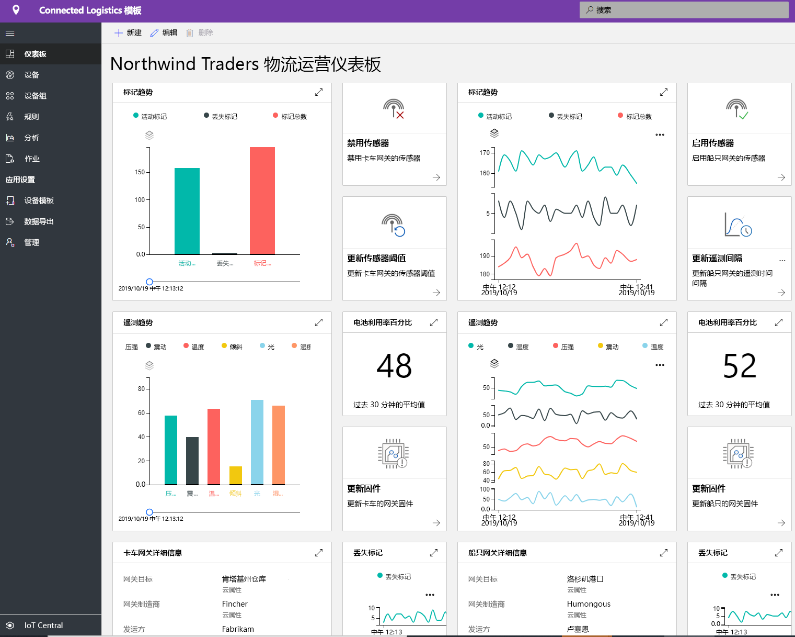
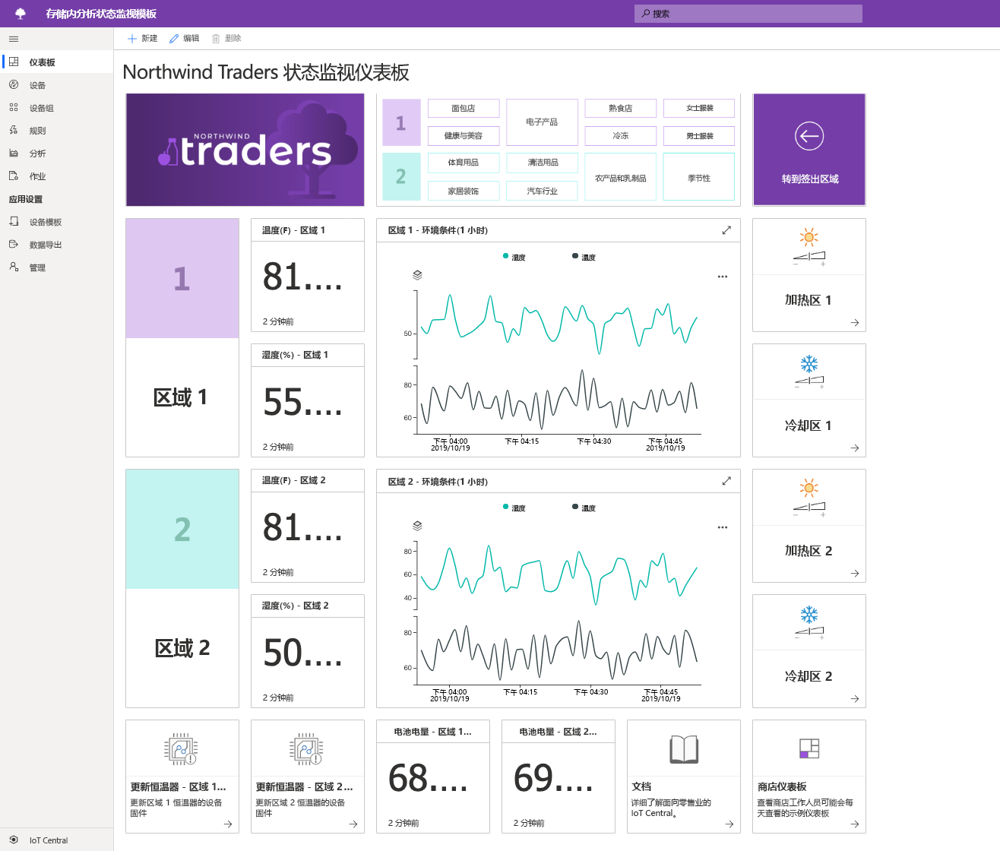
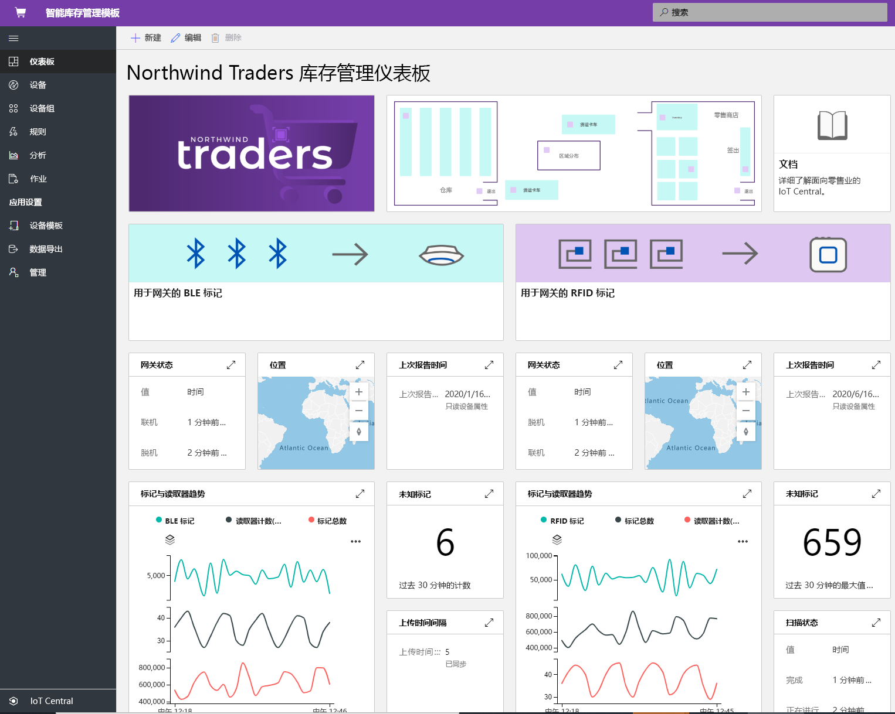

# 使用 Azure IoT Central 生成零售解决方案

[!INCLUDE [iot-central-pnp-original](../../../includes/iot-central-pnp-original-note.md)]

Azure IoT Central 是面向解决方案构建者的物联网 (IoT) 应用平台，它简化了构建和管理可缩放应用程序的问题。 在本文中，我们将重点介绍 IoT Central 中的几个特定于零售的应用程序模板。 解决方案构建者可以利用已发布的模板构建 IoT 解决方案，来优化供应链，改进客户的店内体验，更高效地跟踪库存。

> [!div class="mx-imgBorder"]
> 

## 什么是联接的物流解决方案？
在 2020 年，全球物流支出预计将达到 10.6 万亿美元，是最高的行业 GDP。 货运是物流总支出的主体 (70%)。 货运提供商面临激烈的竞争压力和严峻的限制。 第三方提供商正在面临时间期限不断缩减以及补偿费用不断上涨的挑战。 地理政治、极端气候事件以及犯罪活动带来的风险进一步加剧了物流业的压力。 

借助 IoT 传感器，可以通过 GPS 跨多模转换（空气、水和地面）收集和监视环境状况（温度、湿度、坡度、冲击、光线）和货物位置。 从传感器、设备、天气和事件收集的数据可以与基于云的商业智能系统集成。 联接的物流解决方案有以下优势：
* 通过实时跟踪进行货物转运 
* 通过实时环境状况监视和冷链保持货运完整性
* 安全性，避免货物被盗、丢失或损坏
* 地理围栏、路线优化、船队管理。 车辆分析
* 出发和抵达预测 

### 全新体验
合作伙伴可以利用模板开发端到端联接物流解决方案和上述优势。 这个已发布的模板以 IoT Central 中设备的设备连接、配置和管理为中心。 

> [!div class="mx-imgBorder"]
> 

> [!div class="mx-imgBorder"]
> 

请注意，上面的仪表板是示例体验，可以完全自定义此应用程序，以符合所需的用例。

请从[端到端教程](./tutorial-iot-central-connected-logistics-pnp.md)入手，它将逐步说明如何利用联接的物流解决方案模板构建解决方案。

## 什么是数字分发中心解决方案？
随着越来越多的制造商和零售商进入世界各地，它们的供应链也已扩展到前所未有的复杂程度。 分发中心正在成为主要挑战。 分发中心/仓库正在面临电子商务带来的压力和冲击。 消费者现在希望有大量的产品可供选择，并且希望在购买后的 1-2 天内即可到货。 分发中心必须适应这些趋势，并克服当前导致效率低下的问题。 

如今，过度依赖人工意味着分拣和打包占据分发中心成本的 55%-65%。 弊端在于，一方面人工会降低分发中心的效率，另一方面剧烈波动的员工需求（节假日员工需求上涨 10 倍）加剧了满足货运量的难度。 这种季节性波动会导致高流动性和高出错率，并且高成本返工需求也随之增加。
通过启用数字反馈循环，基于 IoT 支持的摄像头的解决方案可以提供转换优势。 分发中心的数据流入会生成可操作见解，它们反之会生成更优质的数据。

好处有： 
* 当货物抵达并通过输送系统转移时，摄像头进行监视
* 发现有问题的货物，并将它们送至维修之处
* 高效地追踪订单
* 降低成本，提高效率，最大程度提高效用

### 全新体验
合作伙伴可以利用此应用程序模板构建数字分发中心，来获取可操作见解以及上述好处。 这个已发布的模板以 IoT Central 中的摄像头和边缘设备的设备连接、配置和管理为中心。 

> [!div class="mx-imgBorder"]
> 

请注意，上面的仪表板是示例体验，可以完全自定义此应用程序，以符合所需的用例。

请从[端到端教程](./tutorial-iot-central-digital-distribution-center-pnp.md)入手，它将逐步说明如何利用数字分发中心模板构建解决方案。

## 什么是店内分析环境监视？
在如今的竞争环境下，零售商正在寻求新方法，来为客户提供独特或特殊产品/服务，以驱动其实体商店的流量。 许多零售商都认为店内的环境状况是区别于竞争者的重要工具。 零售商希望确保他们可以一直维持商店内的愉悦环境，为客户提供舒适的体验。  

IoT Central 内的店内分析环境监视应用程序模板为解决方案构建者提供了生成端到端解决方案的画布。 借助应用程序模板，他们可以使用各种传感器设备进行数字连接，并监视零售商店环境。 这些传感器设备捕获有意义的信号，这些信号可以转换为业务见解，使零售商可以降低运营成本，并生成客户喜欢的体验。

可以使用应用程序模板实现以下目的：

*  将各种 IoT 传感器无缝连接到 IoT Central 应用程序实例。
*  监视并管理传感器网络以及环境中的网关设备的运行状况。
*  创建关于店内环境状况的自定义规则，以触发相应的警报。
*  将店内的环境状况转换为见解，供零售店团队使用。
* 将聚合的见解导出到为零售员工成员提供支持的现有或新的业务应用程序。

### 全新体验
应用程序模板附带一套设备模板以及全新的操作者体验。 它使用一组模拟设备来填充仪表板元素。 使用[店内分析环境监视](https://aka.ms/conditiontemplate)应用模板部署 IoT Central 应用程序后，将登陆到默认的应用程序仪表板，如下所示。 

> [!div class="mx-imgBorder"]
> 

请注意，上面的仪表板是示例体验，可以完全自定义此应用程序，以符合所需的用例。 

请从[端到端教程](./tutorial-in-store-analytics-create-app-pnp.md)入手，它将逐步说明如何利用店内分析环境监视模板构建解决方案。

## 什么是店内分析结帐？
在日益激烈的环境下，要提供超出客户预期并使客户重新惠顾的店内体验，这是现代零售商时常面临的一种不断增长的压力。 尽管一些零售商已开始部署技术来满足此需求，但结帐体验是广为忽略的一个方面。

解决方案构建者可以使用 IoT Central 的店内分析结帐应用程序模板生成为零售员工提供关于商店结帐区的有意义见解的体验。 它使用一组模拟设备来确定零售店内各个结帐通道的占用状态。 可以使用传感器捕捉各个结帐通道的人数以及平均等待时间。

此模板可提供实现以下目的的基准 IoT 解决方案，从而帮助解决方案构建者加快其进入市场计划： 

* 将各种 IoT 传感器无缝连接到 IoT Central 应用程序实例。
* 监视并管理传感器网络以及环境中的网关设备的运行状况。
* 创建关于店内结帐状况的自定义规则，以触发相应的警报。
* 将店内的结帐状况转换为见解，供零售店团队使用。
* 将聚合的见解导出到为零售员工成员提供支持的现有或新的业务应用程序。

### 全新体验
应用程序模板附带一套设备模板以及全新的操作者体验。 它使用一组模拟设备来填充仪表板元素。 使用[店内分析结帐](https://aka.ms/checkouttemplate)应用模板部署 IoT Central 应用程序后，将登陆到默认的应用程序仪表板，如下所示。 

> [!div class="mx-imgBorder"]
> 

请注意，上面的仪表板是示例体验，可以完全自定义此应用程序，以符合所需的用例。 

请从[端到端教程](./tutorial-in-store-analytics-create-app-pnp.md)入手，它将逐步说明如何利用店内分析结帐模板构建解决方案。

## 什么是智能库存管理解决方案？
“库存”是零售商持有的存货。 每个零售商都需要库存，来应对供应和物流生产周期。 库存可以说是每个零售商都需要购买的最有价值的资源。 在当今的全渠道环境下，库存管理是确保适当产品在适当时间处于适当位置的关键要求。 库存存储过多或过少可能会损害零售商的业务。 缺少库存管理功能导致每年零售商会损失 8%-10% 的收入。

由射频标识 (RFID)、信标和摄像头支持的 IoT 数据为成比例解决此重大挑战提供了机遇。 IoT 信号固有的连接性和实时分析已成为零售商库存困境的规则颠覆者。  从传感器、设备、天气和事件收集的数据可以与基于云的商业智能系统集成。  
智能库存管理的好处有： 
* 保护组织免遭缺货困境，确保所需的客户服务级别。 
* 近乎实时地提供对库存准确性的深入分析和见解
* 确定可满足客户订单需求的相应库存量

### 全新体验
合作伙伴可以使用模板开发端到端的智能库存管理解决方案和上述好处。 此已发布的模板以 IoT Central 中的 RFID 和低耗电蓝牙 (BLE) 阅读器的设备连接、配置和管理为中心。 

> [!div class="mx-imgBorder"]
> 

请注意，上面的仪表板是示例体验，可以完全自定义此应用程序，以符合所需的用例。 

请从[端到端教程](./tutorial-iot-central-smart-inventory-management-pnp.md)入手，它将逐步说明如何利用智能库存管理模板构建解决方案。

## 后续步骤
开始生成零售解决方案：
* 请从[端到端教程](./tutorial-in-store-analytics-create-app-pnp.md)入手，它将逐步说明如何利用店内分析应用程序模板构建解决方案。
* 了解如何部署[联接的物流解决方案模板](./tutorial-iot-central-connected-logistics-pnp.md)
* 了解如何部署[数字分发中心模板](./tutorial-iot-central-digital-distribution-center-pnp.md)
* 了解如何部署[智能库存管理模板](./tutorial-iot-central-smart-inventory-management-pnp.md)
* 请参阅 [IoT Central 概述](../preview/overview-iot-central.md)，详细了解 IoT Central
