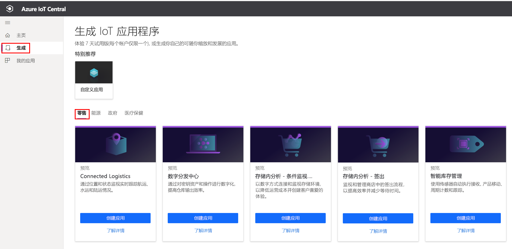
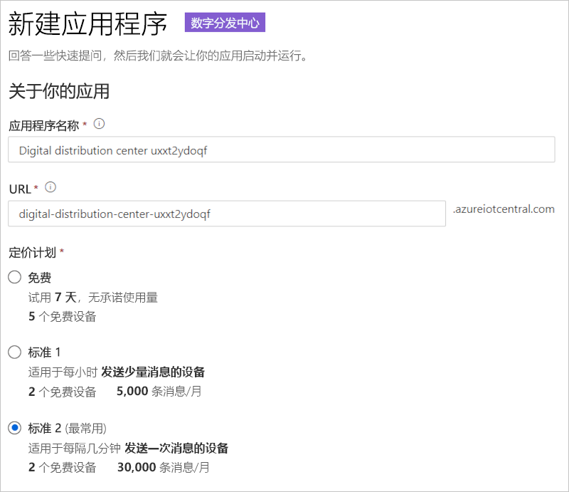
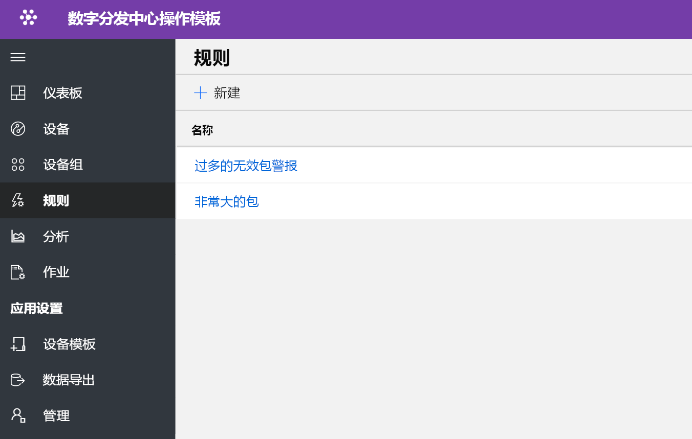
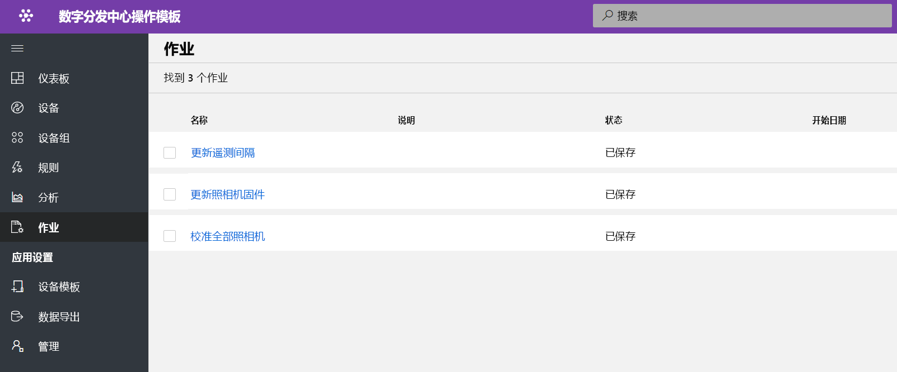
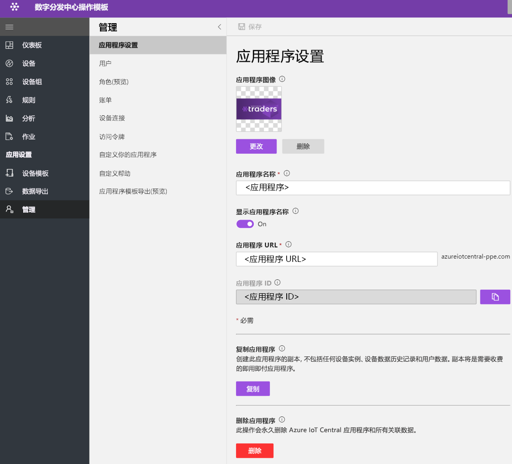

# 教程：部署并演练数字分发中心应用程序模板

[!INCLUDE [iot-central-pnp-original](../../../includes/iot-central-pnp-original-note.md)]

本教程介绍如何开始部署 IoT Central 数字分发中心应用程序模板  。 你将了解如何部署模板、有哪些现成的内容以及接下来要执行哪些操作。

本教程介绍如何执行下列操作： 
* 创建数字分发中心应用程序 
* 演练应用程序 

## 先决条件
* 无需满足特定的先决条件，就可以部署此应用
* 建议使用 Azure 订阅，但不使用也可以

## 创建数字分发中心应用程序模板

可以使用以下步骤创建应用程序

1. 导航到 Azure IoT Central 应用程序管理器网站。 从左侧导航栏中选择“生成”，然后单击“零售”选项卡   。

> [!div class="mx-imgBorder"]
> 

2. 选择“零售”选项卡，然后在“数字分发中心应用程序”下选择“创建应用”   ****

3. “创建应用”将打开“新建应用程序”窗体，并按如下所示填写所需的详细信息  。
   **应用程序名称**：可以使用默认的建议名称，也可以输入易记的应用程序名称。
   **URL**：可以使用建议的默认 URL，也可以输入唯一且容易记住的 URL。 接下来，如果已经具有 Azure 订阅，则建议使用默认设置。 否则，可以开始使用七天免费试用版，并选择在免费试用到期之前的任何时间内转换为即用即付。
   **计费信息**：必须提供目录、Azure 订阅和区域详细信息才能配置资源。
   **创建**：选择页面底部的“创建”以部署应用程序。

> [!div class="mx-imgBorder"]
> 

## 演练应用程序仪表板 

成功部署应用模板后，默认仪表板是一个以分发中心操作员为中心的门户。 Northwind Trader 是一家虚构的分发中心解决方案提供商，他们管理着传送带系统。 

在此仪表板中，你将看到一个网关和一台充当 IoT 设备的摄像机。 网关将提供有关包的遥测（例如有效、无效、未标识和大小）以及相关设备孪生属性。 所有下游命令都在 IoT 设备（例如照相机）上执行。 此仪表板已预先配置为展示关键的分发中心设备操作活动。

仪表板以逻辑方式组织，用于显示 Azure IoT 网关和 IoT 设备的设备管理功能。  
   * 可以执行网关命令和控制任务
   * 管理解决方案中的所有摄像机。 

> [!div class="mx-imgBorder"]
> 

## 设备模板

单击“设备模板”选项卡，你将看到网关功能模型。 功能模型是围绕两个不同的接口“摄像机”和“数字分发网关”构建的  

> [!div class="mx-imgBorder"]
> 

**照相机** - 此接口组织所有特定于照相机的命令功能 

> [!div class="mx-imgBorder"]
> 

**数字分发网关** - 此接口表示来自相机、云定义的设备孪生属性和网关信息的所有遥测。

> [!div class="mx-imgBorder"]
> 

## 网关命令
此接口组织了所有网关命令功能

> [!div class="mx-imgBorder"]
> 

## 规则
选择“规则”选项卡以查看此应用程序模板中存在的两个不同规则。 这些规则配置为通过电子邮件将通知发送给操作员以进行进一步调查。

 **无效包裹过多警报** - 摄像机检测到大量无效包裹通过传送带系统时，将触发此规则。
 
**大型包裹** - 如果摄像机检测到无法检查其质量的大型包裹，则将触发此规则。 

> [!div class="mx-imgBorder"]
> 

## 作业
选择“作业”选项卡以查看此应用程序模板中存在的五个不同的作业：可以使用作业功能来执行解决方案范围的操作。 此处，数字分发中心作业将使用设备命令和孪生功能执行以下任务：
   * 在开始包裹检测之前先校准摄像头 
   * 定期更新摄像头固件
   * 修改遥测间隔时间以管理数据上传

> [!div class="mx-imgBorder"]
> 

## 清理资源
如果不打算继续使用此应用程序，请访问“管理” > “应用程序设置”并单击“删除”，以删除应用程序模板    。

> [!div class="mx-imgBorder"]
> 

## 后续步骤
* 详细了解数字分发中心解决方案体系结构[数字分发中心的概念](./architecture-digital-distribution-center-pnp.md)
* 详细了解其他 [IoT Central 零售模板](./overview-iot-central-retail-pnp.md)
* 请参阅 [IoT Central 概述](../preview/overview-iot-central.md)，详细了解 IoT Central
