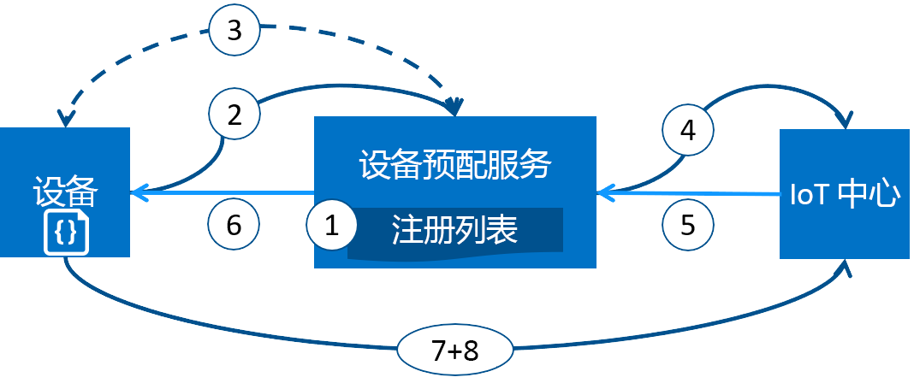

# 使用 Azure IoT 中心设备预配服务预配设备
Microsoft Azure 提供一套丰富的集成公有云服务，满足所有 IoT 解决方案需求。 IoT 中心设备预配服务是针对 IoT 中心的帮助程序服务，无需人为干预即可零接触实时预配至合适的 IoT 中心，客户可以采用安全且可缩放的方式预配数百万台设备。

## 何时使用设备预配服务
很多预配情况下，设备预配服务是将设备连接并配置到 IoT 中心的绝佳选择，例如：

* 零接触预配到单一 IoT 解决方案，无需在出厂（初始设置）时对 IoT 中心连接信息进行硬编码
* 跨多个中心对设备进行负载均衡
* 根据销售交易数据将设备连接到其所有者的 IoT 解决方案（多租户）
* 根据用例将设备连接到特定的 IoT 解决方案（解决方案隔离）
* 将设备连接到具有最低延迟的 IoT 中心（异地分片）
* 根据设备中的更改重新进行预配
* 滚动设备使用的密钥以连接到 IoT 中心（当不使用 X.509 证书进行连接时）

## 幕后
上一部分中列出的所有方案都可通过相同流程采用零接触预配的预配服务来完成。 预配向来所涉及的许多手动步骤通过设备预配服务自动完成，以减少部署 IoT 设备的时间并降低手动错误的风险。 下面介绍预配设备幕后发生的情况。 第一步是手动的，随后所有步骤均为自动。

1. 设备制造商将设备注册信息添加到 Azure 门户中的注册列表。
2. 设备联络出厂时设置的预配服务终结点。 设备向预配服务传递其识别性信息来证明其标识。
3. 预配服务通过使用 nonce 质询（[受信任的平台模块](https://trustedcomputinggroup.org/work-groups/trusted-platform-module/)）或标准 X.509 验证 (X.509) 根据注册列表项来验证注册 ID 和密钥，从而验证设备的标识。
4. 预配服务将设备注册到 IoT 中心，并填充设备的[所需孪生状态](../iot-hub/iot-hub-devguide-device-twins.md)。
5. IoT 中心将设备 ID 信息返回给预配服务。
6. 预配服务将 IoT 中心连接信息返回到设备。 设备现在可以开始将数据直接发送到 IoT 中心。
7. 设备连接到 IoT 中心。
8. 设备从其在 IoT 中心中的设备孪生获取所需的状态。

## 预配过程
在设备的部署过程中有两个不同的步骤，其中设备预配服务部分可以独立完成：

* 制造步骤，其中设备在出厂时创建和准备，以及
* 云设置步骤，其中将设备预配服务配置为自动预配。

这两个步骤都与现有的制造和部署过程无缝衔接。 设备预配服务甚至简化了一些部署过程，这些过程需要大量的手动操作来获取设备上的连接信息。

### 制造步骤
此步骤有关制造线上发生的情况。 此步骤中涉及的角色包括硅设计者、硅制造商、集成商和/或设备的最终制造商。 此步骤关于创建硬件本身。

设备预配服务不会在制造过程中引入新的步骤；而是与在设备上安装初始软件和（理想情况下）HSM 的现有步骤相关。 此步骤中不创建设备 ID，而是使用预配服务信息对设备进行简单的编程，因此设备开启时，将调用预配服务以获取其连接信息/IoT 解决方案分配。

同样在此步骤中，制造商向设备部署人员/操作员提供识别性密钥信息。 这非常简单，如同确认所有设备都有从由设备部署人员/操作员提供的签名证书生成的 X.509 证书，及至从每个 TPM 设备提取 TPM 认可密钥的公共部分。 这些服务如今由众多硅制造商提供。

### 云设置步骤
此步骤有关配置云实现正确的自动预配。 云设置步骤中通常涉及两种类型的用户：知道设备需要如何初始设置的用户（设备操作员），以及知道如何在 IoT 中心之间拆分设备的人员（解决方案操作员）。

必须对预配进行一次性初始设置，此任务通常由解决方案操作员处理。 配置预配服务后，不需要修改，除非用例发生更改。

将服务配置为自动预配后，必须使其准备好注册设备。 此步骤由设备操作员完成，设备操作员知道设备的所需配置，并且负责确保预配服务在寻找其 IoT 中心时可以正确地证明设备的标识。 设备操作员从制造商处获取识别性密钥信息，并将其添加到注册列表。 添加新条目或现有条目更新为关于设备的最新信息后，随之会更新注册列表。

## 注册和预配
预配意味着各种含义，具体取决于使用术语的行业。 在将 IoT 设备预配至其云解决方案的情况中，预配由两部分构成：

1. 第一部分是通过注册设备来建立设备和 IoT 解决方案之间的初始连接。
2. 第二部分是根据其注册到的解决方案的具体要求将适当的配置应用于设备。

只有完成这两个步骤后，我们才能说该设备已完全预配。 某些云服务仅提供预配过程的第一步，即将设备注册到 IoT 解决方案终结点，但不提供初始配置。 设备预配服务自动执行这两个步骤，为设备提供无缝的预配体验。

## 设备预配服务的功能
设备预配服务具有许多功能，使其成为预配设备的理想选择。

* 对基于 X.509 和 TPM 的标识的安全证明支持。
* 注册列表，其中包含可能在某一时刻注册的设备/设备组的完整记录。 注册列表包含有关设备注册后所需的设备配置信息，并可随时更新。
* 多分配策略，用于根据自己的需要控制设备预配服务向 IoT 中心分配设备的方式。
* 监视和诊断日志，用于确保一切都正常工作。
* 多中心支持，允许设备预配服务将设备分配给多个 IoT 中心。 设备预配服务可跨多个 Azure 订阅与中心进行通讯。
* **跨区域支持**，允许设备预配服务将设备分配给多个 IoT 中心。

可在[设备概念](concepts-device.md)、[服务概念](concepts-service.md)和[安全概念](concepts-security.md)中详细了解设备预配中涉及的概念和功能。

## 跨平台支持
设备预配服务与所有 Azure IoT 服务一样，可以在各种操作系统上跨平台运行。 Azure 提供各种不同的开放源 SDK [语言](https://github.com/Azure/azure-iot-sdks)以便将设备连接和管理服务。 设备设置服务支持用于将设备连接的以下协议：

* HTTPS
* AMQP
* 基于 WebSocket 的 AMQP
* MQTT
* 基于 WebSocket 的 MQTT

设备预配服务仅对服务操作支持 HTTPS 连接。

## 区域
设备预配服务在许多区域可用。 我们对 [Azure 区域](https://azure.microsoft.com/regions/)的所有服务维护其现有区域和新宣布推出区域的更新列表。 可以在 [Azure 状态](https://azure.microsoft.com/status/)页上看到设备预配服务可用的区域。

> [!NOTE]
> 设备预配服务是全球性的，不局限于某个位置。 但是，必须指定与设备预配服务配置文件关联的元数据将驻留在其中一个区域。

## 可用性
我们为设备预配服务维护 99.9% 服务级别协议，可以[阅读 SLA](https://azure.microsoft.com/support/legal/sla/iot-hub/)。 完整 [Azure SLA](https://azure.microsoft.com/support/legal/sla/) 说明了 Azure 作为整体的保证可用性。

## 配额
每个 Azure 订阅附带默认的配额限制，这些限制可能影响 IoT 解决方案的范围。 每个订阅的当前限制是每订阅 10 个设备预配服务。

有关配额限制的更多详细信息，请参阅：

* [Azure 订阅服务限制](../azure-subscription-service-limits.md)

## 相关 Azure 组件
设备预配服务使用 Azure IoT 中心自动进行设备预配。 了解有关 [IoT 中心](https://docs.microsoft.com/azure/iot-hub/)的详细信息。

## 后续步骤
现已大致了解在 Azure 中配置 IoT 设备。 后续步骤是尝试端对端 IoT 方案。
> [!div class="nextstepaction"]
> [使用 Azure 门户设置 IoT 中心设备预配服务](quick-setup-auto-provision.md)
> [创建和预配模拟设备](quick-create-simulated-device.md)
> [设置设备进行预配](tutorial-set-up-device.md)
