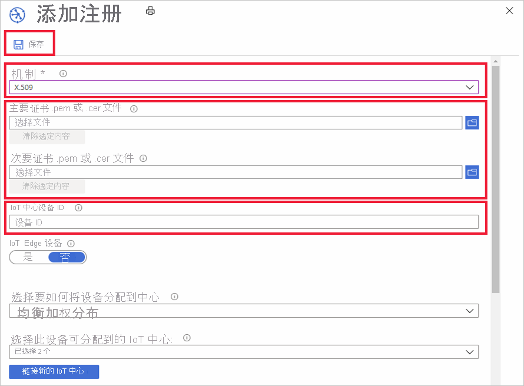

# 如何通过 Azure 门户管理设备注册

“设备注册”将创建单台设备或一组设备在某一时刻向 Azure IoT 中心设备预配服务进行注册的记录  。 注册记录包含设备在该注册过程中 () 的初始配置。 此配置中包含的是要将设备分配到的 IoT 中心，或从一组集线器配置集线器的分配策略。 本文演示了如何针对预配服务管理设备注册。

## 创建设备注册

可通过两种方法向预配服务注册设备：

* **注册组** 是共享公共证明机制的一组设备的条目。 建议将注册组用于大量共享初始配置的设备，或者用于设备全部进入同一租户。 支持使用 [对称密钥](concepts-symmetric-key-attestation.md) 或 [x.509 证书](concepts-x509-attestation.md) 的设备。 

    有关使用对称密钥创建和使用注册组的分步说明，请参阅 [使用对称密钥设置设备](how-to-legacy-device-symm-key.md) 教程。

    使用以下步骤在门户中为一组设备创建注册组：

    1. 登录 Azure 门户，单击左侧菜单中的“所有资源”。  
    1. 从资源列表中单击要向其注册设备的设备预配服务。  
    1. 在预配服务中，单击 " **管理注册**"，然后单击顶部的 " **添加注册组** " 按钮。  
     
        
        
    1. 当 "添加注册组" 面板出现时，输入注册信息，然后单击 " **保存**"。  
     
        
        
        | 字段 | 说明 |
        | :--- | :--- |
        | **组名** | 设备组所需的名称。 |
        | **证明类型** | 根据设备将使用的证明方法，单击证明类型的 " **证书** " 或 " **对称密钥** "。 |
        | **证书类型** | 如果你使用证书证明，则可用。 根据设备证书签名的证书，选择 " **CA 证书** " 或 " **中间** "。 |
        | **主证书** | 如果要使用根 CA 证书对设备证书进行签名，则必须将根 CA 证书的 [所有权证明](how-to-verify-certificates.md) 填写完成。 然后，可以选择该证书作为设备组的 **主证书** 。  如果要使用中间证书对设备证书进行签名，则可以使用 "上传" 按钮来上传中间证书。 签署中间的证书还必须对其进行 [所有权证明](how-to-verify-certificates.md) 。 |

        
    

* **单个注册** 是可分配到 IoT 中心的单个设备的条目。 支持使用 [对称密钥](concepts-symmetric-key-attestation.md)、 [X.509 证书](concepts-x509-attestation.md)和 [TPM 证明](concepts-tpm-attestation.md) 的设备。 

    可通过以下步骤在门户中创建单独注册。

    1. 登录 Azure 门户，单击左侧菜单中的“所有资源”。
    1. 从资源列表中单击要向其注册设备的设备预配服务。
    1. 在预配服务中，单击 " **管理注册**"，然后单击顶部的 " **添加单个注册** " 按钮。   

       

    1. 当 "添加注册" 面板出现时，输入单个设备注册的信息，然后单击 " **保存**"。 
     
        
    
        | 字段 | 说明 |
        | :--- | :--- |
        | **机制** | 根据设备将使用的证明方法，选择要使用的证明机制的 **x.509**、 **TPM** 或 **对称密钥** 。 |
        | 认证设置 | 有关创建和使用使用对称密钥或 x.509 证书的单独注册的分步说明，请参阅 [预配对称设备](quick-create-simulated-device-symmetric-key-java.md#create-a-device-enrollment) 或 [预配 x.509 证书设备](quick-create-simulated-device-x509-java.md#create-a-self-signed-x509-device-certificate-and-individual-enrollment-entry) 快速入门。  有关使用 TPM 证明创建和使用单个注册的分步说明，请参阅 [预配模拟的 TPM 设备](quick-create-simulated-device-tpm-java.md#create-a-device-enrollment-entry) 示例。|
        | **IoT 中心设备 ID** |  此 ID 代表你的设备。 它必须遵循设备 ID 的规则。 有关详细信息，请参阅 [设备标识属性](../iot-hub/iot-hub-devguide-identity-registry.md#device-identity-properties)。  使用 x.509 证书时，此文本必须是为注册注册的设备证书上的使用者名称。 此使用者名称必须符合设备 ID 规则。|
            

## 更新注册条目
可通过以下步骤在门户中更新现有注册条目。

1. 在 Azure 门户中打开设备预配服务，然后单击“管理注册”。 
1. 导航到要修改的注册条目。 单击该条目会打开设备注册的摘要信息。 
1. 在此页上，你可以修改除安全类型和凭据之外的项，例如设备应链接到的 IoT 中心和设备 ID。 还可以修改初始的设备孪生状态。 
1. 完成后，单击“保存”更新设备注册。 

    

## 删除设备注册
如果不需要将设备预配到任何 IoT 中心，可以通过以下步骤删除门户中的相关注册条目。

1. 在 Azure 门户中打开设备预配服务，然后单击“管理注册”。 
1. 导航到要删除的注册条目并选中。 
1. 单击顶部的“删除”按钮，然后在出现确认提示时选择“是”。 
1. 操作完成后，你将看到已从设备注册列表中删除的条目。 
 
    

