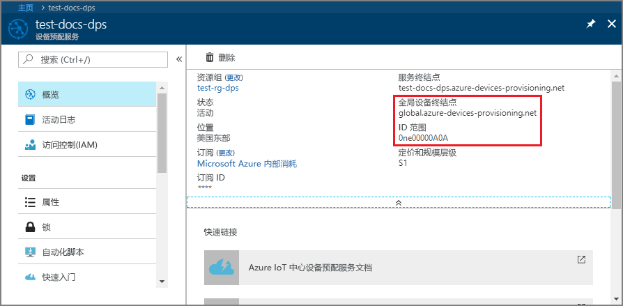

# <a name="create-and-provision-a-simulated-tpm-device-using-python-device-sdk-for-iot-hub-device-provisioning-service"></a>使用适用于 IoT 中心设备预配服务的 Python 设备 SDK 创建和预配模拟的 TPM 设备

[!INCLUDE [iot-dps-selector-quick-create-simulated-device-tpm](../../includes/iot-dps-selector-quick-create-simulated-device-tpm.md)]

以下步骤演示了如何在运行 Windows OS 的开发计算机上创建模拟设备、如何将 Windows TPM 模拟器作为设备的[硬件安全模块 (HSM)](https://azure.microsoft.com/blog/azure-iot-supports-new-security-hardware-to-strengthen-iot-security/) 运行，以及如何使用 Python 代码示例通过设备预配服务和 IoT 中心连接该模拟设备。 

如果不熟悉自动预配过程，还务必查看[自动预配概念](concepts-auto-provisioning.md)。 另外，在继续操作之前，请确保已完成[通过 Azure 门户设置 IoT 中心设备预配服务](./quick-setup-auto-provision.md)中的步骤。 

[!INCLUDE [IoT Device Provisioning Service basic](../../includes/iot-dps-basic.md)]

## <a name="prepare-the-environment"></a>准备环境 

1. 确保已在计算机上安装 [Visual Studio 2015](https://www.visualstudio.com/vs/older-downloads/) 或 [Visual Studio 2017](https://www.visualstudio.com/vs/)。 必须启用“使用 C++ 进行桌面开发”工作负荷才能进行 Visual Studio 安装。

1. 下载并安装 [CMake 生成系统](https://cmake.org/download/)。

1. 确保在计算机上安装 `git` 并将其添加到可供命令窗口访问的环境变量。 请参阅[软件自由保护组织提供的 Git 客户端工具](https://git-scm.com/download/)，了解要安装的最新版 `git` 工具，其中包括 Git Bash，这是一个命令行应用，可以用来与本地 Git 存储库交互。 

1. 打开命令提示符或 Git Bash。 为设备模拟代码示例克隆 GitHub 存储库：
    
    ```cmd/sh
    git clone https://github.com/Azure/azure-iot-sdk-python.git --recursive
    ```

1. 在该 GitHub 存储库的本地副本中创建一个用于 CMake 生成过程的文件夹。 

    ```cmd/sh
    cd azure-iot-sdk-python/c
    mkdir cmake
    cd cmake
    ```

1. 代码示例使用 Windows TPM 模拟器。 运行以下命令，启用 SAS 令牌身份验证。 该命令还会为模拟设备生成 Visual Studio 解决方案。

    ```cmd/sh
    cmake -Duse_prov_client:BOOL=ON -Duse_tpm_simulator:BOOL=ON ..
    ```

1. 在单独的命令提示符处，导航到 TPM 模拟器文件夹，然后运行 [TPM](https://docs.microsoft.com/windows/device-security/tpm/trusted-platform-module-overview) 模拟器。 单击“允许访问”。 该模拟器通过套接字在端口 2321 和 2322 上进行侦听。 请勿关闭此命令窗口；本快速入门指南自始至终都需让该模拟器保持运行状态。 

    ```cmd/sh
    .\azure-iot-sdk-python\c\provisioning_client\deps\utpm\tools\tpm_simulator\Simulator.exe
    ```

    


## <a name="create-a-device-enrollment-entry"></a>创建设备注册项

1. 打开在 cmake 文件夹中生成的名为 `azure_iot_sdks.sln` 的解决方案，将其内置到 Visual Studio 中。

1. 右键单击“tpm_device_provision”项目，然后选择“设为启动项目”。 运行解决方案。 输出窗口会显示进行设备注册所需的“认可密钥”和“注册 ID”。 记下这些值。 

    

1. 登录到 Azure 门户，单击左侧菜单上的“所有资源”按钮，打开设备预配服务。

1. 在设备预配服务摘要边栏选项卡上，选择“管理注册”。 选择“单个注册”选项卡，单击顶部的“添加”按钮。 

1. 在“添加注册列表项”下，输入以下信息：
    - 选择“TPM”作为标识证明*机制*。
    - 输入 TPM 设备的*注册 ID* 和*认可密钥*。 
    - 选择与预配服务链接的 IoT 中心。
    - 输入唯一设备 ID。 为设备命名时，请确保避免使用敏感数据。
    - 使用设备所需的初始配置更新“初始设备孪生状态”。
    - 完成后，单击“保存”按钮。 

      

   成功注册以后，设备的“注册 ID”会显示在“单个注册”选项卡下的列表中。 


## <a name="simulate-the-device"></a>模拟设备

1. 下载并安装 [Python 2.x 或 3.x](https://www.python.org/downloads/)。 请确保根据安装程序的要求，使用 32 位或 64 位安装。 在安装过程中出现提示时，请确保将 Python 添加到特定于平台的环境变量中。
    - 如果使用 Windows OS，则请安装 [Visual C++ 可再发行组件包](http://www.microsoft.com/download/confirmation.aspx?id=48145)，以便使用 Python 中的本机 DLL。

1. 按照[这些说明](https://github.com/Azure/azure-iot-sdk-python/blob/master/doc/python-devbox-setup.md)生成 Python 包。

    > [!NOTE]
        > 如果运行 `build_client.cmd`，请确保使用 `--use-tpm-simulator` 标志。

    > [!NOTE]
        > 如果使用 `pip`，请确保也安装 `azure-iot-provisioning-device-client` 包。 请注意，发布的 PIP 包使用真实的 TPM 而非模拟器。 若要使用模拟器，需使用 `--use-tpm-simulator` 标志从源进行编译。

1. 导航到示例文件夹。

    ```cmd/sh
    cd azure-iot-sdk-python/provisioning_device_client/samples
    ```

1. 使用 Python IDE，编辑名为 **provisioning\_device\_client\_sample.py** 的 Python 脚本。 将 *GLOBAL\_PROV\_URI* 和 *ID\_SCOPE* 变量修改先前记下的值。 此外，请确保 *SECURITY\_DEVICE\_TYPE* 设置为 `ProvisioningSecurityDeviceType.TPM`

    ```python
    GLOBAL_PROV_URI = "{globalServiceEndpoint}"
    ID_SCOPE = "{idScope}"
    SECURITY_DEVICE_TYPE = ProvisioningSecurityDeviceType.TPM
    PROTOCOL = ProvisioningTransportProvider.HTTP
    ```

    

1. 运行示例。 

    ```cmd/sh
    python provisioning_device_client_sample.py
    ```

1. 请注意相关消息，这些消息模拟设备启动后连接到设备预配服务以获取 IoT 中心信息的情况。 

    

1. 将模拟设备成功预配到与预配服务链接的 IoT 中心以后，设备 ID 会显示在该中心的“Device Explorer”边栏选项卡上。

     

    如果从设备的注册项中的默认值更改了“初始设备孪生状态”，则它会从中心拉取所需的孪生状态，并执行相应的操作。 有关详细信息，请参阅[了解并在 IoT 中心内使用设备孪生](../iot-hub/iot-hub-devguide-device-twins.md)


## <a name="clean-up-resources"></a>清理资源

如果打算继续使用和探索设备客户端示例，请勿清理在本快速入门中创建的资源。 如果不打算继续学习，请通过以下步骤删除通过本快速入门创建的所有资源。

1. 关闭计算机上的设备客户端示例输出窗口。
1. 关闭计算机上的 TPM 模拟器窗口。
1. 在 Azure 门户的左侧菜单中单击“所有资源”，然后选择设备预配服务。 打开服务的“管理注册”边栏选项卡，然后单击“单个注册”选项卡。选择在本快速入门中注册的设备的“注册 ID”，然后单击顶部的“删除”按钮。 
1. 在 Azure 门户的左侧菜单中单击“所有资源”，然后选择 IoT 中心。 打开中心的“IoT 设备”边栏选项卡，选择在本快速入门中注册的设备的“设备 ID”，然后单击顶部的“删除”按钮。

## <a name="next-steps"></a>后续步骤

在本快速入门中，你已在计算机上创建 TPM 模拟设备，并已使用 IoT 中心设备预配服务将其预配到 IoT 中心。 若要了解如何以编程方式注册 TPM 设备，请继续阅读快速入门中关于 TPM 设备的编程注册内容。 

> [!div class="nextstepaction"]
> [Azure 快速入门 - 将 TPM 设备注册到 Azure IoT 中心设备预配服务](quick-enroll-device-tpm-python.md)
