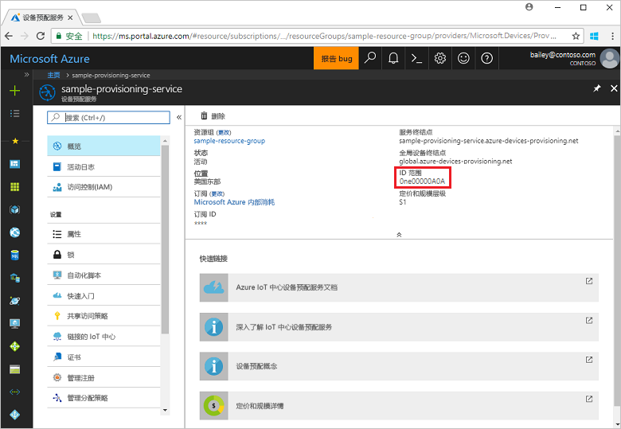

# <a name="create-and-provision-a-simulated-x509-device-using-c-device-sdk-for-iot-hub-device-provisioning-service"></a>使用适用于 IoT 中心设备预配服务的 C# 设备 SDK 创建和预配模拟的 X.509 设备
[!INCLUDE [iot-dps-selector-quick-create-simulated-device-x509](../../includes/iot-dps-selector-quick-create-simulated-device-x509.md)]

以下步骤演示了如何在运行 Windows OS 的开发计算机上生成 [Azure IoT 中心 C# SDK](https://github.com/Azure/azure-iot-sdk-csharp) 模拟的 X.509 设备示例，以及如何通过设备预配服务和 IoT 中心连接该模拟设备。

如果不熟悉自动预配过程，请务必还查看[自动预配概念](concepts-auto-provisioning.md)。 另外，在继续操作之前，请确保已完成[通过 Azure 门户设置 IoT 中心设备预配服务](./quick-setup-auto-provision.md)中的步骤。 

[!INCLUDE [IoT DPS basic](../../includes/iot-dps-basic.md)]

<a id="setupdevbox"></a>
## <a name="prepare-the-development-environment"></a>准备开发环境 

1. 确保已在计算机上安装 [.NET Core SDK](https://www.microsoft.com/net/download/windows)。 

1. 确保在计算机上安装 `git` 并将其添加到可供命令窗口访问的环境变量。 请参阅[软件自由保护组织提供的 Git 客户端工具](https://git-scm.com/download/)，了解要安装的最新版 `git` 工具，其中包括 Git Bash，这是一个命令行应用，可以用来与本地 Git 存储库交互。 

4. 打开命令提示符或 Git Bash。 克隆 [Azure IoT SDK for C#](https://github.com/Azure/azure-iot-sdk-csharp) GitHub 存储库：
    
    ```cmd
    git clone --recursive https://github.com/Azure/azure-iot-sdk-csharp.git
    ```

## <a name="create-a-self-signed-x509-device-certificate-and-individual-enrollment-entry"></a>创建自签名的 X.509 设备证书和单个注册项

1. 在命令提示符处将目录更改为 X.509 设备预配示例的项目目录。

    ```cmd
    cd .\azure-iot-sdk-csharp\provisioning\device\samples\ProvisioningDeviceClientX509
    ```

2. 示例代码设置为使用在受密码保护的 PKCS12 格式文件 (certificate.pfx) 中存储的 X.509 证书。 另外，还需要一个公钥证书文件 (certificate.cer)，用于在本快速入门的后面部分创建单个注册。 若要生成自签名的证书及其关联的 .cer 和 .pfx 文件，请运行以下命令：

    ```cmd
    powershell .\GenerateTestCertificate.ps1
    ```

3. 脚本会提示输入 PFX 密码。 请记住此密码，运行示例时必须使用它。

      


4. 登录到 Azure 门户，单击左侧菜单上的“所有资源”按钮，打开预配服务。

5. 在“设备预配服务摘要”边栏选项卡上，选择“管理注册”。 选择“单个注册”选项卡，单击顶部的“添加”按钮。 

6. 在“添加注册”面板下，输入以下信息：
    - 选择“X.509”作为标识证明机制。
    - 在“主要证书 .pem 或 .cer 文件”下，单击“选择文件”选择在前述步骤中创建的证书文件 certificate.cer。
    - 将“设备 ID”保留为空。 对设备进行预配时，其设备 ID 将设置为 X.509 证书 **iothubx509device1** 中的公用名称 (CN)。 此名称也会是用于单个注册项的注册 ID 的名称。 
    - （可选）可以提供以下信息：
        - 选择与预配服务链接的 IoT 中心。
        - 使用设备所需的初始配置更新“初始设备孪生状态”。
    - 完成后，单击“保存”按钮。 

    [](./media/quick-create-simulated-device-x509-csharp/individual-enrollment.png#lightbox)
    
   成功注册以后，X.509 注册项会在“单个注册”选项卡的“注册 ID”栏下显示为 **iothubx509device1**。 

## <a name="provision-the-simulated-device"></a>预配模拟的设备

1. 在预配服务的“概览”边栏选项卡中，记下“ID 范围”的值。

     


2. 键入以下命令，生成并运行 X.509 设备预配示例。 将 `<IDScope>` 值替换为预配服务的 ID 范围。 

    ```cmd
    dotnet run <IDScope>
    ```

3. 出现提示时，输入以前创建的 PFX 文件的密码。 请注意相关消息，这些消息模拟设备启动后连接到设备预配服务以获取 IoT 中心信息的情况。 

     

4. 验证设备是否已预配。 将模拟设备成功预配到与预配服务链接的 IoT 中心以后，设备 ID 会显示在该中心的“IoT 设备”边栏选项卡上。 

     

    如果从设备的注册项中的默认值更改了“初始设备孪生状态”，则它会从中心拉取所需的孪生状态，并执行相应的操作。 有关详细信息，请参阅[了解并在 IoT 中心内使用设备孪生](../iot-hub/iot-hub-devguide-device-twins.md)


## <a name="clean-up-resources"></a>清理资源

如果打算继续使用和探索设备客户端示例，请勿清理在本快速入门中创建的资源。 如果不打算继续学习，请通过以下步骤删除通过本快速入门创建的所有资源。

1. 关闭计算机上的设备客户端示例输出窗口。
1. 关闭计算机上的 TPM 模拟器窗口。
1. 在 Azure 门户的左侧菜单中单击“所有资源”，然后选择设备预配服务。 在“所有资源”边栏选项卡的顶部单击“删除”。  
1. 在 Azure 门户的左侧菜单中单击“所有资源”，然后选择 IoT 中心。 在“所有资源”边栏选项卡的顶部单击“删除”。  

## <a name="next-steps"></a>后续步骤

本快速入门介绍了如何在 Windows 计算机上创建模拟 X.509 设备，以及如何使用门户中的 Azure IoT 中心设备预配服务将其预配到 IoT 中心。 若要了解如何以编程方式注册 X.509 设备，请继续阅读快速入门中关于 X.509 设备的编程注册内容。 

> [!div class="nextstepaction"]
> [Azure 快速入门 - 将 X.509 设备注册到 Azure IoT 中心设备预配服务](quick-enroll-device-x509-node.md)
