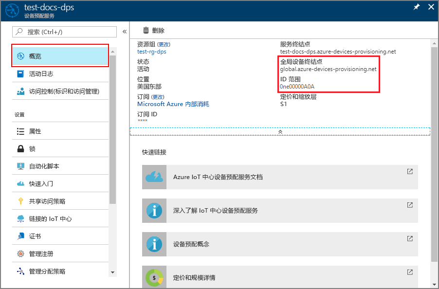

# <a name="create-and-provision-an-x509-simulated-device-using-nodejs-device-sdk-for-iot-hub-device-provisioning-service"></a>使用适用于 IoT 中心设备预配服务的 Node.js 设备 SDK 创建和预配 X.509 模拟设备
[!INCLUDE [iot-dps-selector-quick-create-simulated-device-x509](../../includes/iot-dps-selector-quick-create-simulated-device-x509.md)]

IoT 中心设备预配服务是一项适用于 IoT 中心的帮助程序服务，用于提供预配到 IoT 中心的零接触设备。 使用设备预配服务，可以通过安全且可缩放的方式预配数百万台设备。

设备预配包括两个步骤。 第一步是根据解决方案的具体要求，在设备预配服务中创建相应的注册条目。  第二步是在设备与设备预配服务之间建立连接，然后将设备注册到 IoT 中心。 完成这两个步骤后，即可认为该设备已完全预配好。 设备预配服务自动执行这两个步骤，为设备提供无缝的预配体验。 有关详细信息，请参阅[设备预配服务概念](https://docs.microsoft.com/en-us/azure/iot-dps/concepts-service)。

这些步骤介绍了如何使用 [Azure IoT 中心 Node.js 设备 SDK](https://github.com/Azure/azure-iot-sdk-node) 在设备预配服务中创建注册条目、在开发计算机上模拟 X.509 设备、将模拟设备与设备预配服务连接，以及在 IoT 中心注册设备。


## <a name="prepare-the-environment"></a>准备环境 

1. 在继续操作之前，请完成[通过 Azure 门户设置 IoT 中心设备预配服务](./quick-setup-auto-provision.md)中的步骤。

1. 请确保已在计算机上安装 [Node.js v4.0 或更高版本](https://nodejs.org)。

1. 确保在计算机上安装 [Git](https://git-scm.com/download/) 并将其添加到可供命令窗口访问的环境变量。 

1. 确保在计算机上安装 [OpenSSL](https://www.openssl.org/) 并将其添加到可供命令窗口访问的环境变量。 此库可以从源生成和安装，也可以从[第三方](https://wiki.openssl.org/index.php/Binaries)（例如[这个第三方](https://sourceforge.net/projects/openssl/)）下载和安装。 

    > [!NOTE]
    > 如果已创建“根”、“中间”和/或“叶”X.509 证书，则可跳过此步骤以及与生成证书相关的所有后续步骤。
    >


## <a name="create-an-enrollment-entry"></a>创建注册条目

注册是存在在设备预配服务中并可能在某一时刻注册的设备或设备组的记录。 注册记录包含有关设备或设备组的信息，包括 X.509 证书详细信息，以及其他注册信息。 设备预配服务支持两种类型的注册，即“单个注册”和“注册组”。 有关详细信息，请参阅[注册概念](https://docs.microsoft.com/en-us/azure/iot-dps/concepts-service#enrollment)。

若要创建自己的 X.509 测试证书，请参阅[安全性概念](https://docs.microsoft.com/en-us/azure/iot-dps/concepts-security#x509-certificates)，了解哪些证书是解决方案所需的，以及参阅 [Tools for the Azure IoT Device Provisioning Device SDK for Node.js](https://github.com/azure/azure-iot-sdk-node/tree/master/provisioning/tools)（用于 Node.js 的 Azure IoT 设备预配设备 SDK 的工具），了解实现详情。

1. 打开命令提示符。 克隆代码示例的 GitHub 存储库：
    
    ```cmd/sh
    git clone https://github.com/Azure/azure-iot-sdk-node.git --recursive
    ```

1. 导航到证书生成器脚本，然后生成该项目。 

    ```cmd/sh
    cd azure-iot-sdk-node/provisioning/tools
    npm install
    ```

1. 根据设置以下述方式之一创建注册信息：

    - **单个注册**：

        1. 使用自己的 _certificate-name_ 运行脚本，创建叶证书。 请注意，叶证书的公用名称会成为[注册 ID](https://docs.microsoft.com/en-us/azure/iot-dps/concepts-device#registration-id)，因此请确保只使用小写的字母数字和连字符。

        ```cmd/sh
        node create_test_cert.js device {certificate-name}
        ```
         
        1. 在 **Azure** 门户中，打开**设备预配服务**摘要边栏选项卡。 选择“管理注册”，然后选择“单个注册”选项卡，然后单击顶部的“添加”按钮。 

        1. 在“添加注册列表项”下，输入以下信息：
            - 选择“X.509”作为标识证明机制。
            - 使用“文件资源管理器”小组件，在“证书 .pem 或 .cer 文件”下选择在前述步骤中创建的证书文件 **_{certificate-name}\_cert.pem_**。
            - （可选）可以提供以下信息：
                - 选择与预配服务链接的 IoT 中心。
                - 输入唯一设备 ID。 为设备命名时，请确保避免使用敏感数据。 
                - 使用设备所需的初始配置更新“初始设备孪生状态”。
            - 完成后，单击“保存”按钮。 

          

    成功注册以后，X.509 设备会在“单独注册”选项卡的“注册 ID”列下显示为 **{certificatename}**。记下此值以备将来使用。

    - **注册组**： 

        1. 使用自己的 _root-name_ 运行脚本，创建根证书。

        ```cmd/sh
        node create_test_cert.js root {root-name}
        ```

        1. 在 **Azure** 门户中，打开**设备预配服务**摘要边栏选项卡。 选择“证书”，然后单击顶部的“添加”按钮。

        1. 在“添加证书”下输入以下信息：
            - 输入唯一的证书名称。
            - 选择以前创建的 **_{root-name}\_cert.pem_** 文件。
            - 完成后，单击“保存”按钮。

        

        1. 选择新建的证书：
            - 单击“生成验证码”。 复制生成的代码。
            - 创建验证证书。 使用以下命令，输入验证码，或者在运行的 Node 脚本窗口中右键单击进行粘贴：

                ```cmd/sh
                node create_test_cert.js verification {rootname_cert} {verification code}
                ```

            - 使用“文件资源管理器”小组件，在“验证证书 .pem 或 .cer 文件”下选择在前述步骤中创建的证书文件 **_verification_cert.pem_**。 单击“验证”。

            

        1. 选择“管理注册”。 选择“注册组”选项卡，单击顶部的“添加”按钮。
            - 输入唯一的组名称。
            - 选择以前创建的唯一证书名称
            - （可选）可以提供以下信息：
                - 选择与预配服务链接的 IoT 中心。
                - 使用设备所需的初始配置更新“初始设备孪生状态”。

        

        成功注册以后，X.509 设备组会显示在“注册组”选项卡的“组名称”栏下。记下此值以备将来使用。

        1. 使用自己的 _certficate-name_（后接以前使用过的 _root-name_）来运行脚本，创建叶证书。 叶证书的公用名称会成为[注册 ID](https://docs.microsoft.com/en-us/azure/iot-dps/concepts-device#registration-id)，因此请确保只使用小写的字母数字和连字符。

            ```cmd/sh
            node create_test_cert.js device {certificate-name} {root-name}
            ```

        > [!NOTE]
        > 还可使用 `node create_test_cert.js intermediate {certificate-name} {parent-name}` 创建中间证书。 只需确保在最后一步创建叶证书，使用最后一个中间证书作为其根/父证书。 有关详细信息，请参阅[控制设备访问权限](https://docs.microsoft.com/en-us/azure/iot-dps/concepts-security#controlling-device-access-to-the-provisioning-service-with-x509-certificates)。
        >


## <a name="simulate-the-device"></a>模拟设备

[Azure IoT 中心 Node.js 设备 SDK](https://github.com/Azure/azure-iot-sdk-node) 提供了进行设备模拟的简单方式。 若要阅读更多材料，请参阅[设备概念](https://docs.microsoft.com/en-us/azure/iot-dps/concepts-device)。

1. 在 Azure 门户中，选择设备预配服务的“概览”边栏选项卡，记下“全局设备终结点”和“ID 范围”的值。

     

1. 将证书和密钥复制到示例文件夹。

    ```cmd/sh
    copy .\{certificate-name}_cert.pem ..\device\samples\{certificate-name}_cert.pem
    copy .\{certificate-name}_key.pem ..\device\samples\{certificate-name}_key.pem
    ```

1. 导航到设备测试脚本，然后生成项目。 

    ```cmd/sh
    cd ..\device\samples
    npm install
    ```

1. 编辑 **register\_x509.js** 文件。 进行下述更改，然后保存文件。
    - 将 `provisioning host` 替换为在上面的“步骤 1”中注明的“全局设备终结点”。
    - 将 `id scope` 替换为在上面的“步骤 1”中注明的“ID 范围”。 
    - 将 `reigstration id` 替换为“注册 ID”或“组名称”。
    - 将 `cert filename` 和 `key filename` 替换为在上面的“步骤 2”中复制的文件。 

1. 执行脚本，验证该设备是否已成功预配。

    ```cmd/sh
    node register_x509.js
    ```   

1. 在门户中导航到已链接到预配服务的 IoT 中心，然后打开“IoT 设备”边栏选项卡。 将模拟的 X.509 设备成功预配到中心以后，设备 ID 会显示在“IoT 设备”边栏选项卡上，“状态”为“已启用”。 如果在运行示例设备应用程序之前已打开边栏选项卡，则可能需要单击顶部的“刷新”按钮。 

     

    如果从设备的注册项中的默认值更改了“初始设备孪生状态”，则它会从中心拉取所需的孪生状态，并执行相应的操作。 有关详细信息，请参阅[了解并在 IoT 中心内使用设备孪生](../iot-hub/iot-hub-devguide-device-twins.md)。


## <a name="clean-up-resources"></a>清理资源

如果打算继续使用和探索设备客户端示例，请勿清理在本快速入门中创建的资源。 如果不打算继续学习，请通过以下步骤删除通过本快速入门创建的所有资源。

1. 关闭计算机上的设备客户端示例输出窗口。
1. 在 Azure 门户的左侧菜单中单击“所有资源”，然后选择设备预配服务。 打开服务的“管理注册”边栏选项卡，然后单击“单个注册”或“注册组”选项卡。选择在本快速入门中注册的设备的“注册 ID”或“组名称”，然后单击顶部的“删除”按钮。 
1. 在 Azure 门户的左侧菜单中单击“所有资源”，然后选择 IoT 中心。 打开中心的“IoT 设备”边栏选项卡，选择在本快速入门中注册的设备的“设备 ID”，然后单击顶部的“删除”按钮。


## <a name="next-steps"></a>后续步骤

在本快速入门中，你已创建模拟 X.509 设备，并已使用门户中的 Azure IoT 中心设备预配服务将其预配到 IoT 中心。 若要了解如何以编程方式注册 X.509 设备，请继续阅读快速入门中关于 X.509 设备的编程注册内容。 

> [!div class="nextstepaction"]
> [Azure 快速入门 - 将 X.509 设备注册到 Azure IoT 中心设备预配服务](quick-enroll-device-x509-node.md)
