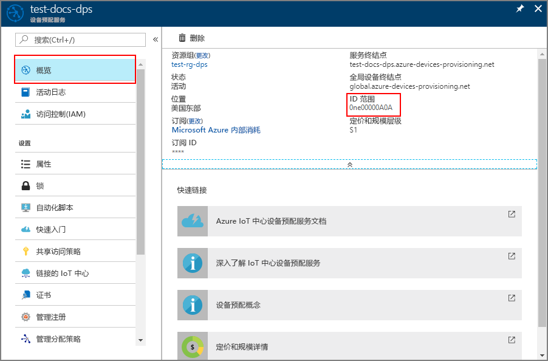
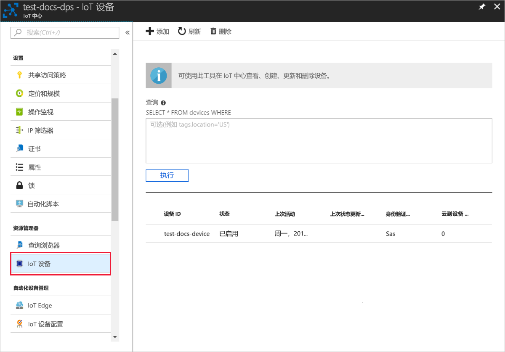

# <a name="create-and-provision-an-x509-simulated-device-using-c-device-sdk-for-iot-hub-device-provisioning-service"></a>使用适用于 IoT 中心设备预配服务的 C 设备 SDK 创建和预配 X.509 模拟设备
[!INCLUDE [iot-dps-selector-quick-create-simulated-device-x509](../../includes/iot-dps-selector-quick-create-simulated-device-x509.md)]

以下步骤演示了如何在运行 Windows OS 的开发计算机上模拟 X.509 设备，以及如何使用代码示例通过设备预配服务和 IoT 中心连接该模拟设备。 

如果不熟悉自动预配过程，请务必还查看[自动预配概念](concepts-auto-provisioning.md)。 另外，在继续操作之前，请确保已完成[通过 Azure 门户设置 IoT 中心设备预配服务](./quick-setup-auto-provision.md)中的步骤。 

[!INCLUDE [IoT DPS basic](../../includes/iot-dps-basic.md)]

<a id="setupdevbox"></a>

## <a name="prepare-the-development-environment"></a>准备开发环境 

1. 确保已在计算机上安装 Visual Studio 2015 或 [Visual Studio 2017](https://www.visualstudio.com/vs/)。 必须启用[“使用 C++ 进行桌面开发”](https://www.visualstudio.com/vs/support/selecting-workloads-visual-studio-2017/)工作负荷才能进行 Visual Studio 安装。

2. 下载并安装 [CMake 生成系统](https://cmake.org/download/)。 在进行 `cmake` 安装**之前**，必须在计算机上安装包含“使用 C++ 进行桌面开发”工作负荷的 Visual Studio。 

3. 确保在计算机上安装 `git` 并将其添加到可供命令窗口访问的环境变量。 请参阅[软件自由保护组织提供的 Git 客户端工具](https://git-scm.com/download/)，了解要安装的最新版 `git` 工具，其中包括 Git Bash，这是一个命令行应用，可以用来与本地 Git 存储库交互。 

4. 打开命令提示符或 Git Bash。 为设备模拟代码示例克隆 GitHub 存储库：
    
    ```cmd
    git clone https://github.com/Azure/azure-iot-sdk-c.git --recursive
    ```

5. 在该 GitHub 存储库的本地副本中创建一个用于 CMake 生成过程的文件夹。 

    ```cmd
    cd azure-iot-sdk-c
    mkdir cmake
    cd cmake
    ```

6. 代码示例使用 X.509 证书通过 X.509 身份验证提供证明。 运行以下命令生成特定于开发客户端平台和[证明机制](concepts-security.md#attestation-mechanism)（X.509 证书）的 SDK 版本。 该命令还会为模拟设备生成 Visual Studio 解决方案。 

    ```cmd
    cmake -Duse_prov_client:BOOL=ON ..
    ```
    
    如果 `cmake` 找不到 C++ 编译器，则可能会在运行以上命令时出现生成错误。 如果出现这种情况，请尝试在 [Visual Studio 命令提示符](https://docs.microsoft.com/dotnet/framework/tools/developer-command-prompt-for-vs)窗口中运行该命令。 


<a id="portalenroll"></a>

## <a name="create-a-self-signed-x509-device-certificate-and-individual-enrollment-entry"></a>创建自签名的 X.509 设备证书和单个注册项

1. 打开在 cmake 文件夹中生成的名为 `azure_iot_sdks.sln` 的解决方案，将其内置到 Visual Studio 中。

2. 右键单击 **Provision\_Tools** 文件夹中的 **dice\_device\_enrollment** 项目，然后选择“设置为启动项目”。 运行解决方案。 在输出窗口中，当系统提示时输入 **i** 完成单个注册。 输出窗口会显示在本地为模拟设备生成的 X.509 证书。 将输出（从 *-----BEGIN CERTIFICATE-----* 开始，到第一个 *-----END CERTIFICATE-----* 结束）复制到剪贴板，确保将这两行也包括进去。 请注意，只需要输出窗口中的第一个证书。
 
3. 在 Windows 计算机上创建名为 **_X509testcert.pem_** 的文件，在所选编辑器中将其打开，然后将剪贴板内容复制到该文件中。 保存文件。 

4. 登录到 Azure 门户，单击左侧菜单上的“所有资源”按钮，打开预配服务。

5. 在“设备预配服务摘要”边栏选项卡上，选择“管理注册”。 选择“单个注册”选项卡，单击顶部的“添加”按钮。 

6. 在“添加注册”面板下，输入以下信息：
    - 选择“X.509”作为标识证明机制。
    - 在“主要证书 .pem 或 .cer 文件”下，单击“选择文件”选择在前述步骤中创建的证书文件 X509testcert.pem。
    - （可选）可以提供以下信息：
      - 选择与预配服务链接的 IoT 中心。
      - 输入唯一设备 ID。 为设备命名时，请确保避免使用敏感数据。 
      - 使用设备所需的初始配置更新“初始设备孪生状态”。
    - 完成后，单击“保存”按钮。 

    [](./media/quick-create-simulated-device-x509/individual-enrollment.png#lightbox)

   成功注册以后，X.509 设备会在“单独注册”选项卡的“注册 ID”列下显示为 **riot-device-cert**。 


<a id="firstbootsequence"></a>

## <a name="simulate-first-boot-sequence-for-the-device"></a>模拟设备的首次启动顺序

1. 在 Azure 门户中，选择设备预配服务的“概览”边栏选项卡，记下“ID 范围”的值。

     

2. 在计算机的 Visual Studio 中，导航到 **Provision\_Samples** 文件夹下名为 **prov\_dev\_client\_sample** 的示例项目，然后打开 **prov\_dev\_client\_sample.c** 文件。

3. 为 `id_scope` 变量指定“ID 范围”值。 

    ```c
    static const char* id_scope = "[ID Scope]";
    ```

4. 在同一文件的 **main()** 函数中，请确保将 **SECURE_DEVICE_TYPE** 设置为 X.509。

    ```c
    SECURE_DEVICE_TYPE hsm_type;
    hsm_type = SECURE_DEVICE_TYPE_X509;
    ```

   注释掉或删除可能存在的 `hsm_type = SECURE_DEVICE_TYPE_TPM;` 语句。 

5. 右键单击“prov\_dev\_client\_sample”项目，然后选择“设为启动项目”。 运行示例。 请注意相关消息，这些消息模拟设备启动后连接到设备预配服务以获取 IoT 中心信息的情况。 查找指示已成功注册到中心的消息：已从 yourhuburl 服务收到注册信息!。 系统提示时，关闭该窗口。

6. 在门户中导航到已链接到预配服务的 IoT 中心，然后打开“IoT 设备”边栏选项卡。 将模拟的 X.509 设备成功预配到中心以后，设备 ID 会显示在“IoT 设备”边栏选项卡上，“状态”为“已启用”。 请注意，如果在运行示例设备应用程序之前已打开边栏选项卡，则可能需要单击顶部的“刷新”按钮。 

     

    如果从设备的注册项中的默认值更改了“初始设备孪生状态”，则它会从中心拉取所需的孪生状态，并执行相应的操作。 有关详细信息，请参阅[了解并在 IoT 中心内使用设备孪生](../iot-hub/iot-hub-devguide-device-twins.md)。


> [!IMPORTANT]
> 也可对 X.509 设备进行组注册，方法是对本快速入门中的步骤进行以下修改：
>    1. 将 Windows 计算机配置为使用 **OpenSSL** 库而非默认的 **SChannel**，只需按 [Set up a Windows development environment](https://github.com/Azure/azure-iot-sdk-c/blob/master/doc/devbox_setup.md#windows)（设置 Windows 开发环境）指南中有关 **WebSocket** 的部分进行操作即可。 请注意，Linux 计算机默认使用 OpenSSL。 
>    2. 在上面的[在设备预配服务中创建设备注册项](#portalenroll)部分的步骤 2 中，输入 **g** 进行组注册。
>    3. 在[同一部分](#portalenroll)的步骤 4 和步骤 5 中选择“注册组”，然后输入组项的所需信息。  
>

## <a name="clean-up-resources"></a>清理资源

如果打算继续使用和探索设备客户端示例，请勿清理在本快速入门中创建的资源。 如果不打算继续学习，请通过以下步骤删除通过本快速入门创建的所有资源。

1. 关闭计算机上的设备客户端示例输出窗口。
1. 在 Azure 门户的左侧菜单中单击“所有资源”，然后选择设备预配服务。 打开服务的“管理注册”边栏选项卡，然后单击“单个注册”选项卡。选择在本快速入门中注册的设备的“注册 ID”，然后单击顶部的“删除”按钮。 
1. 在 Azure 门户的左侧菜单中单击“所有资源”，然后选择 IoT 中心。 打开中心的“IoT 设备”边栏选项卡，选择在本快速入门中注册的设备的“设备 ID”，然后单击顶部的“删除”按钮。

## <a name="next-steps"></a>后续步骤

本快速入门介绍了如何在 Windows 计算机上创建模拟 X.509 设备，以及如何使用门户中的 Azure IoT 中心设备预配服务将其预配到 IoT 中心。 若要了解如何以编程方式注册 X.509 设备，请继续阅读快速入门中关于 X.509 设备的编程注册内容。 

> [!div class="nextstepaction"]
> [Azure 快速入门 - 将 X.509 设备注册到 Azure IoT 中心设备预配服务](quick-enroll-device-x509-java.md)
