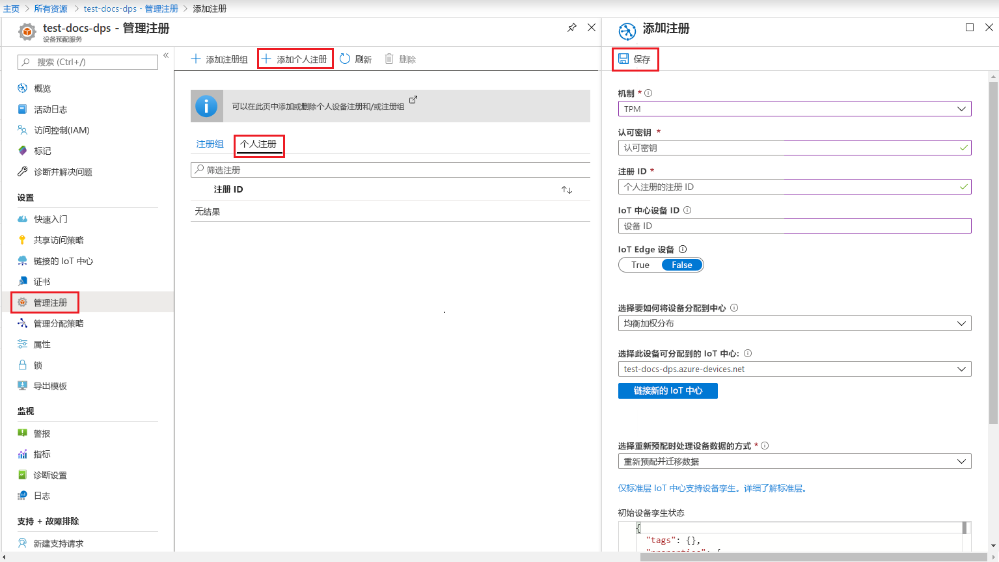

# <a name="create-and-provision-a-simulated-tpm-device-using-c-device-sdk-for-iot-hub-device-provisioning-service"></a>使用适用于 IoT 中心设备预配服务的 C 设备 SDK 创建和预配模拟的 TPM 设备
> [!div class="op_single_selector"]
> * [C](quick-create-simulated-device.md)
> * [Java](quick-create-simulated-device-tpm-java.md)
> * [C#](quick-create-simulated-device-tpm-csharp.md)
> * [Python](quick-create-simulated-device-tpm-python.md)

以下步骤演示了如何在运行 Windows OS 的开发计算机上创建模拟设备、如何将 Windows TPM 模拟器作为设备的[硬件安全模块 (HSM)](https://azure.microsoft.com/blog/azure-iot-supports-new-security-hardware-to-strengthen-iot-security/) 运行，以及如何使用代码示例通过设备预配服务和 IoT 中心连接该模拟设备。 

在继续操作之前，请确保完成[通过 Azure 门户设置 IoT 中心设备预配服务](./quick-setup-auto-provision.md)中的步骤。

<a id="setupdevbox"></a>

## <a name="prepare-the-development-environment"></a>准备开发环境 

1. 确保已在计算机上安装 Visual Studio 2015 或 [Visual Studio 2017](https://www.visualstudio.com/vs/)。 必须启用[“使用 C++ 进行桌面开发”](https://www.visualstudio.com/vs/support/selecting-workloads-visual-studio-2017/)工作负荷才能进行 Visual Studio 安装。

2. 下载并安装 [CMake 生成系统](https://cmake.org/download/)。 在进行 `cmake` 安装**之前**，必须在计算机上安装包含“使用 C++ 进行桌面开发”工作负荷的 Visual Studio。

3. 确保在计算机上安装 `git` 并将其添加到可供命令窗口访问的环境变量。 请参阅[软件自由保护组织提供的 Git 客户端工具](https://git-scm.com/download/)，了解要安装的最新版 `git` 工具，其中包括 Git Bash，这是一个命令行应用，可以用来与本地 Git 存储库交互。 

4. 打开命令提示符或 Git Bash。 为设备模拟代码示例克隆 GitHub 存储库：
    
    ```cmd/sh
    git clone https://github.com/Azure/azure-iot-sdk-c.git --recursive
    ```

5. 在该 GitHub 存储库的本地副本中创建一个用于 CMake 生成过程的文件夹。 

    ```cmd/sh
    cd azure-iot-sdk-c
    mkdir cmake
    cd cmake
    ```

6. 代码示例使用 Windows TPM 模拟器。 运行以下命令，启用 SAS 令牌身份验证。 该命令还会为模拟设备生成 Visual Studio 解决方案。

    ```cmd/sh
    cmake -Duse_prov_client:BOOL=ON -Duse_tpm_simulator:BOOL=ON ..
    ```

    如果 `cmake` 找不到 C++ 编译器，则可能会在运行以上命令时出现生成错误。 如果出现这种情况，请尝试在 [Visual Studio 命令提示符](https://docs.microsoft.com/dotnet/framework/tools/developer-command-prompt-for-vs)窗口中运行该命令。 

7. 在单独的命令提示符处，导航到 GitHub 根文件夹，然后运行 [TPM](https://docs.microsoft.com/windows/device-security/tpm/trusted-platform-module-overview) 模拟器。 该模拟器通过套接字在端口 2321 和 2322 上进行侦听。 请勿关闭此命令窗口；本快速入门指南自始至终都需让该模拟器保持运行状态。 

   如果在 *cmake* 文件夹中，则请运行以下命令：

    ```cmd/sh
    cd..
    .\provisioning_client\deps\utpm\tools\tpm_simulator\Simulator.exe
    ```

<a id="simulatetpm"></a>

## <a name="simulate-tpm-device"></a>模拟 TPM 设备

1. 打开在 cmake 文件夹中生成的名为 `azure_iot_sdks.sln` 的解决方案，将其内置到 Visual Studio 中。

2. 在 Visual Studio 的“解决方案资源管理器”窗格中，导航到 **Provision\_Tools** 文件夹。 右键单击“tpm_device_provision”项目，然后选择“设为启动项目”。 

3. 运行解决方案。 输出窗口会显示进行设备注册所需的“注册 ID”和“认可密钥”。 记下这些值。 


<a id="portalenrollment"></a>

## <a name="create-a-device-enrollment-entry-in-the-portal"></a>在门户中创建设备注册项

1. 登录到 Azure 门户，单击左侧菜单上的“所有资源”按钮，打开设备预配服务。

2. 在设备预配服务摘要边栏选项卡上，选择“管理注册”。 选择“单个注册”选项卡，单击顶部的“添加”按钮。 

3. 在“添加注册列表项”下，输入以下信息：
    - 选择“TPM”作为标识证明*机制*。
    - 输入 TPM 设备的*注册 ID* 和*认可密钥*。
    - （可选）可以提供以下信息：
        - 选择与预配服务链接的 IoT 中心。
        - 输入唯一设备 ID。 为设备命名时，请确保避免使用敏感数据。
        - 使用设备所需的初始配置更新“初始设备孪生状态”。
    - 完成后，单击“保存”按钮。 

      

   成功注册以后，设备的“注册 ID”会显示在“单个注册”选项卡下的列表中。 


<a id="firstbootsequence"></a>

## <a name="simulate-first-boot-sequence-for-the-device"></a>模拟设备的首次启动顺序

1. 在 Azure 门户中，选择设备预配服务的“概览”边栏选项卡，记下“ID 范围”的值。

     

2. 在计算机上的 Visual Studio *解决方案资源管理器*中，导航到 **Provision\_Samples** 文件夹。 选择名为 **prov\_dev\_client\_sample** 的示例项目，打开 **prov\_dev\_client\_sample.c** 文件。

3. 为 `id_scope` 变量指定“ID 范围”值。 

    ```c
    static const char* id_scope = "[ID Scope]";
    ```

4. 在同一文件的 **main()** 函数中，请确保将 **SECURE_DEVICE_TYPE** 设置为 TPM。

    ```c
    SECURE_DEVICE_TYPE hsm_type;
    hsm_type = SECURE_DEVICE_TYPE_TPM;
    ```

   注释掉或删除默认存在的 `hsm_type = SECURE_DEVICE_TYPE_X509;` 语句。 

5. 右键单击“prov\_dev\_client\_sample”项目，然后选择“设为启动项目”。 运行解决方案。 

6. 请注意相关消息，这些消息模拟设备启动后连接到设备预配服务以获取 IoT 中心信息的情况。 将模拟设备成功预配到与预配服务链接的 IoT 中心以后，设备 ID 会显示在该中心的“IoT 设备”边栏选项卡上。 

     

    如果从设备的注册项中的默认值更改了“初始设备孪生状态”，则它会从中心拉取所需的孪生状态，并执行相应的操作。 有关详细信息，请参阅[了解并在 IoT 中心内使用设备孪生](../iot-hub/iot-hub-devguide-device-twins.md)


## <a name="clean-up-resources"></a>清理资源

如果打算继续使用和探索设备客户端示例，请勿清理在本快速入门中创建的资源。 如果不打算继续学习，请通过以下步骤删除通过本快速入门创建的所有资源。

1. 关闭计算机上的设备客户端示例输出窗口。
1. 关闭计算机上的 TPM 模拟器窗口。
1. 在 Azure 门户的左侧菜单中单击“所有资源”，然后选择设备预配服务。 打开服务的“管理注册”边栏选项卡，然后单击“单个注册”选项卡。选择在本快速入门中注册的设备的“注册 ID”，然后单击顶部的“删除”按钮。 
1. 在 Azure 门户的左侧菜单中单击“所有资源”，然后选择 IoT 中心。 打开中心的“IoT 设备”边栏选项卡，选择在本快速入门中注册的设备的“设备 ID”，然后单击顶部的“删除”按钮。

## <a name="next-steps"></a>后续步骤

在本快速入门中，你已在计算机上创建 TPM 模拟设备，并已使用 IoT 中心设备预配服务将其预配到 IoT 中心。 若要了解如何以编程方式注册 TPM 设备，请继续阅读快速入门中关于 TPM 设备的编程注册内容。 

> [!div class="nextstepaction"]
> [Azure 快速入门 - 将 TPM 设备注册到 Azure IoT 中心设备预配服务](quick-enroll-device-tpm-java.md)

