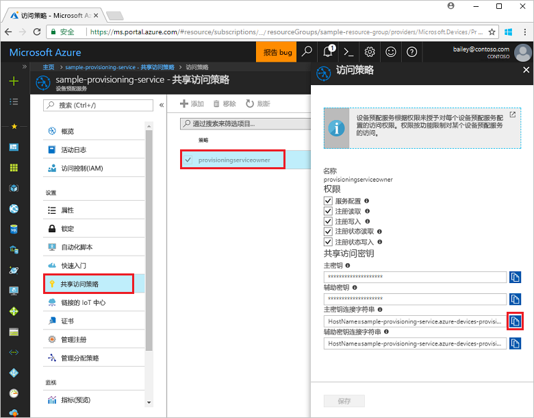
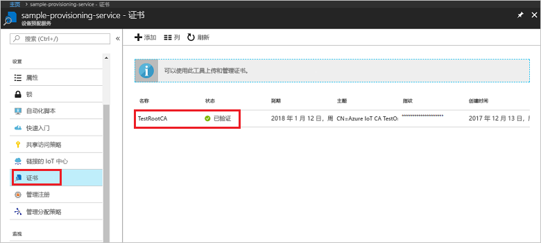
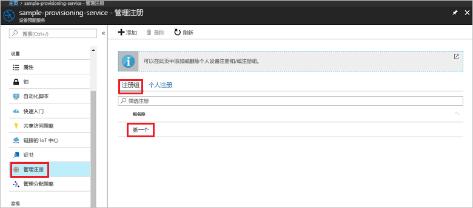

# <a name="quickstart-enroll-x509-devices-to-the-device-provisioning-service-using-nodejs"></a>快速入门：使用 Node.js 将 X.509 设备注册到设备预配服务

[!INCLUDE [iot-dps-selector-quick-enroll-device-x509](../../includes/iot-dps-selector-quick-enroll-device-x509.md)]

在本快速入门中，你将使用 Node.js 以编程方式创建使用中间或根 CA X.509 证书的注册组。 该注册组是使用用于 Node.js 的 IoT SDK 和一个示例 Node.js 应用程序创建的。

## <a name="prerequisites"></a>先决条件

- 完成[使用 Azure 门户设置 IoT 中心设备预配服务](./quick-setup-auto-provision.md)。
- 具有活动订阅的 Azure 帐户。 [免费创建一个](https://azure.microsoft.com/free/?ref=microsoft.com&utm_source=microsoft.com&utm_medium=docs&utm_campaign=visualstudio)。
- [Node.js v4.0+](https://nodejs.org)。 本快速入门将在下面安装[用于 Node.js 的 IoT SDK](https://github.com/Azure/azure-iot-sdk-node)。
- [Git](https://git-scm.com/download/)。
- [Azure IoT C SDK](https://github.com/Azure/azure-iot-sdk-c)。

## <a name="prepare-test-certificates"></a>准备测试证书

对于本快速入门，必须具有一个包含中间或根 CA X.509 证书的公共部分的 .pem 或.cer 文件。 此证书必须上传到预配服务，并由该服务进行验证。

若要详细了解如何将基于 X.509 证书的公钥基础结构 (PKI) 与 Azure IoT 中心和设备预配服务配合使用，请参阅 [X.509 CA 证书安全概述](https://docs.microsoft.com/azure/iot-hub/iot-hub-x509ca-overview)。

[Azure IoT C SDK](https://github.com/Azure/azure-iot-sdk-c) 包含的测试工具可以帮助你创建 X.509 证书链、从该链上传根证书或中间证书，以及通过服务执行所有权证明操作，对证书进行验证。 根据设计，使用 SDK 工具创建的证书只能用于**开发测试**。 这些证书**不得在生产环境中使用**。 它们包含硬编码的密码（“1234”），在 30 天后过期。 若要了解如何获取适用于生产用途的证书，请参阅 Azure IoT 中心文档中的[如何获取 X.509 CA 证书](https://docs.microsoft.com/azure/iot-hub/iot-hub-x509ca-overview#how-to-get-an-x509-ca-certificate)。

若要使用此测试工具来生成证书，请执行以下步骤：
 
1. 找到[最新版](https://github.com/Azure/azure-iot-sdk-c/releases/latest) Azure IoT C SDK 的标记名称。

2. 打开命令提示符或 Git Bash shell，并切换到计算机上的某个工作文件夹。 运行以下命令，克隆最新版 [Azure IoT C SDK](https://github.com/Azure/azure-iot-sdk-c) GitHub 存储库。 使用在上一步找到的标记作为 `-b` 参数的值：

    ```cmd/sh
    git clone -b <release-tag> https://github.com/Azure/azure-iot-sdk-c.git
    cd azure-iot-sdk-c
    git submodule update --init
    ```

    应该预料到此操作需要几分钟才能完成。

   测试工具位于你克隆的存储库的 *azure-iot-sdk-c/tools/CACertificates* 中。

3. 根据[管理示例和教程的测试 CA 证书](https://github.com/Azure/azure-iot-sdk-c/blob/master/tools/CACertificates/CACertificateOverview.md)中的步骤进行操作。 


## <a name="create-the-enrollment-group-sample"></a>创建注册组示例 

Azure IoT 设备预配服务支持两类注册：

- [注册组](concepts-service.md#enrollment-group)：用于注册多个相关设备。
- [单个注册](concepts-service.md#individual-enrollment)：用于注册单个设备。

注册组可以控制对设备的预配服务的访问，此类设备在其证书链中共享常用签名证书。 若要了解详细信息，请参阅[使用 X.509 证书控制设备对预配服务的访问](./concepts-security.md#controlling-device-access-to-the-provisioning-service-with-x509-certificates)。
 
1. 在工作文件夹的命令窗口中，运行以下命令：
  
     ```cmd\sh
     npm install azure-iot-provisioning-service
     ```  

2. 使用文本编辑器，在工作文件夹中创建 **create_enrollment_group.js** 文件。 将以下代码添加到文件并进行保存：

    ```
    'use strict';
    var fs = require('fs');

    var provisioningServiceClient = require('azure-iot-provisioning-service').ProvisioningServiceClient;

    var serviceClient = provisioningServiceClient.fromConnectionString(process.argv[2]);

    var enrollment = {
      enrollmentGroupId: 'first',
      attestation: {
        type: 'x509',
        x509: {
          signingCertificates: {
            primary: {
              certificate: fs.readFileSync(process.argv[3], 'utf-8').toString()
            }
          }
        }
      },
      provisioningStatus: 'disabled'
    };

    serviceClient.createOrUpdateEnrollmentGroup(enrollment, function(err, enrollmentResponse) {
      if (err) {
        console.log('error creating the group enrollment: ' + err);
      } else {
        console.log("enrollment record returned: " + JSON.stringify(enrollmentResponse, null, 2));
        enrollmentResponse.provisioningStatus = 'enabled';
        serviceClient.createOrUpdateEnrollmentGroup(enrollmentResponse, function(err, enrollmentResponse) {
          if (err) {
            console.log('error updating the group enrollment: ' + err);
          } else {
            console.log("updated enrollment record returned: " + JSON.stringify(enrollmentResponse, null, 2));
          }
        });
      }
    });
    ```

## <a name="run-the-enrollment-group-sample"></a>运行注册组示例
 
1. 若要运行示例，需要适用于预配服务的连接字符串。 
    1. 登录到 Azure 门户，选择左侧菜单上的“所有资源”按钮，打开设备预配服务  。 
    2. 单击“共享访问策略”，然后选择需要用来打开其属性的访问策略。  在“访问策略”窗口中，复制并记下主密钥连接字符串。  

        


3. 如[准备测试证书](quick-enroll-device-x509-node.md#prepare-test-certificates)中所述，还需要一个 .pem 文件，其中包含的 X.509 中间或根 CA 证书此前已上传并通过预配服务进行验证。 若要查看证书是否已上传并验证，请在 Azure 门户的设备预配服务摘要页中选择“证书”。  找到要用于组注册的证书，确保其状态值为“已验证”。 

     

1. 若要为证书创建[注册组](concepts-service.md#enrollment-group)，请运行以下命令（在命令参数两侧添加引号）：
 
     ```cmd\sh
     node create_enrollment_group.js "<the connection string for your provisioning service>" "<your certificate's .pem file>"
     ```
 
3. 成功创建以后，命令窗口会显示新的注册组的属性。

     

4. 验证注册组是否已创建。 在 Azure 门户的设备预配服务摘要边栏选项卡上，选择“管理注册”  。 选择“注册组”选项卡，验证新注册项 (*first*) 是否存在。 

     
 
## <a name="clean-up-resources"></a>清理资源
如果打算学习 Node.js 服务示例，请勿清除本快速入门中创建的资源。 如果不打算继续学习，请通过以下步骤删除通过本快速入门创建的所有 Azure 资源。
 
1. 关闭计算机上的 Node.js 示例输出窗口。
2. 在 Azure 门户中导航到设备预配服务，选择“管理注册”，然后选择“注册组”选项卡   。选中通过本快速入门注册的 X.509 设备的“组名称”旁边的复选框，然后按窗格顶部的“删除”按钮   。    
3. 在 Azure 门户的设备预配服务中选择“证书”，然后选择为本快速入门上传的证书，再按“证书详细信息”窗口顶部的“删除”按钮。     
 
## <a name="next-steps"></a>后续步骤

本快速入门介绍了如何使用 Azure IoT 中心设备预配服务为 X.509 中间或根 CA 证书创建组注册。 若要深入了解设备预配，请继续学习本教程有关如何在 Azure 门户中进行设备预配服务设置的内容。 

另请参阅 [Node.js 设备预配示例](https://github.com/Azure/azure-iot-sdk-node/tree/master/provisioning/device/samples)。
 
> [!div class="nextstepaction"]
> [Azure IoT 中心设备预配服务教程](./tutorial-set-up-cloud.md)
