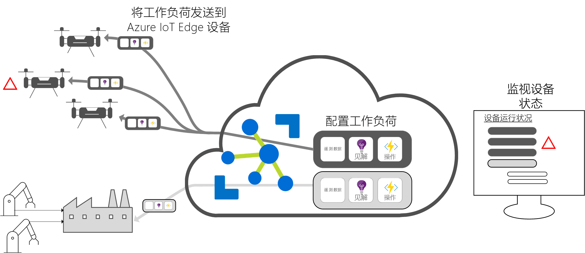

# 什么是 Azure IoT Edge

Azure IoT Edge 将云分析和自定义业务逻辑移到设备，这样你的组织就可以专注于业务见解而非数据管理。 配置 IoT 软件，通过标准容器将其部署到设备，然后对其进行监视，这一切都可以从云中操作。

>[!NOTE]
>Azure IoT Edge 在 IoT 中心的免费层和标准层中提供。 免费层仅用于测试和评估。 有关基本和标准层的详细信息，请参阅[如何选择合适的 IoT 中心层](../iot-hub/iot-hub-scaling.md)。

分析可以提升 IoT 解决方案中的业务价值，但并非所有分析都需要在云中进行。 如果希望设备能够尽快响应突发事件，可以在设备上执行异常情况检测。 同样，如果希望减少带宽费用，避免传输数 TB 的原始数据，则可在本地执行数据清理和聚合， 然后再将见解发送到云中进行分析。 

Azure IoT Edge 包含三个组件：
* IoT Edge 模块是容器，可以运行 Azure 服务、第三方服务或者你自己的代码。 这些模块部署到 IoT Edge 设备，在设备上以本地方式执行。 
* IoT Edge 运行时在每个 IoT Edge 设备上运行，管理部署到每个设备的模块。 
* 可以通过基于云的界面远程监视和管理 IoT Edge 设备。

## IoT Edge 模块

IoT Edge 模块是执行单位，以 Docker 兼容容器的方式来实现，在边缘运行业务逻辑。 可以将多个模块配置为互相通信，创建一个数据处理管道。 可以开发自定义模块，或者将某些 Azure 服务打包到模块中，以脱机方式在边缘提供见解。 

### 边缘的人工智能

可以使用 Azure IoT Edge 来部署复杂事件处理、机器学习、图像识别和其他高价值 AI，不需在内部编写代码。 Azure Functions、Azure 流分析、Azure 机器学习之类的 Azure 服务均可通过 Azure IoT Edge 在本地运行，但是，你也可以运行 Azure 服务之外的内容。 任何人均可创建 AI 模块，通过 Azure 市场提供给社区使用。 

### 自带代码

如果希望将自己的代码部署到设备，则也可使用 Azure IoT Edge。 与其他 Azure IoT 服务一样，Azure IoT Edge 始终使用同一编程模型。 同一代码可以在设备上运行，也可以在云中运行。 Azure IoT Edge 既支持 Linux，也支持 Windows，允许你根据所选平台来编码。 它支持 Java、.NET Core 2.0、Node.js、C、Python，允许开发人员使用熟悉的语言和现有的业务逻辑进行编码。

## IoT Edge 运行时

Azure IoT Edge 运行时允许在 IoT Edge 设备上使用自定义逻辑和云逻辑。 它位于 IoT Edge 设备上，执行管理和通信操作。 该运行时执行多个功能：

* 在设备上安装和更新工作负荷。
* 维护设备上的 Azure IoT Edge 安全标准。
* 确保 IoT Edge 模块始终处于运行状态。
* 将模块运行状况报告给云以进行远程监视。
* 管理下游叶设备与 IoT Edge 设备之间、IoT Edge 设备上的模块之间以及 IoT Edge 设备与云之间的通信。

如何使用 Azure IoT Edge 设备取决于你自己。 通常使用运行时将 AI 部署到网关，由后者聚合和处理来自其他本地设备的数据，但此部署模型只是一个选项。 叶设备也可以是 Azure IoT Edge 设备，不管这些设备是连接到网关，还是直接连接到云。

Azure IoT Edge 运行时在各种 IoT 设备上运行，因此可以通过各种方式来使用该运行时。 它支持 Linux 和 Windows 操作系统，并可提取硬件详细信息。 如果要处理的数据不多，请使用比 Raspberry Pi 3 小的设备；如果要运行资源密集型工作负荷，请使用工业化服务器。

## IoT Edge 云界面

管理企业设备的软件生命周期很复杂。 管理数百万台异源 IoT 设备的软件生命周期则更为困难。 必须针对特定类型的设备创建和配置工作负荷，然后将其大规模部署到解决方案中的数百万台设备，最后再进行监视，捕获行为异常的设备。 这些活动不能逐个设备地来完成，必须大规模地进行操作。

Azure IoT Edge 与 Azure IoT 解决方案加速器无缝集成，提供一个符合解决方案需要的控制平面。 云服务允许：

* 创建和配置在特定类型的设备上运行的工作负荷。
* 将工作负荷发送到一组设备。
* 监视在现场设备上运行的工作负荷。

## 后续步骤

通过[在模拟设备上部署 IoT Edge](quickstart.md)，体会上述概念。