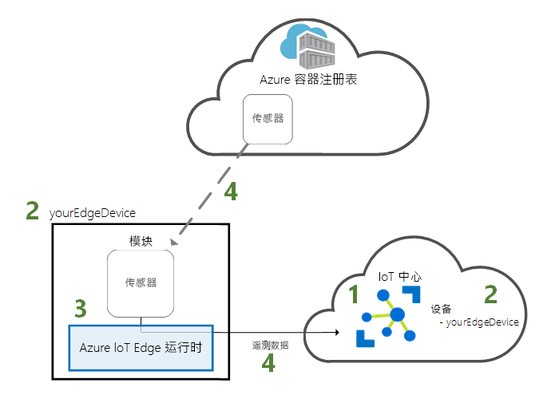
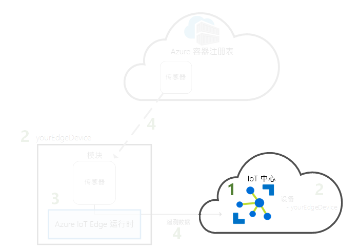
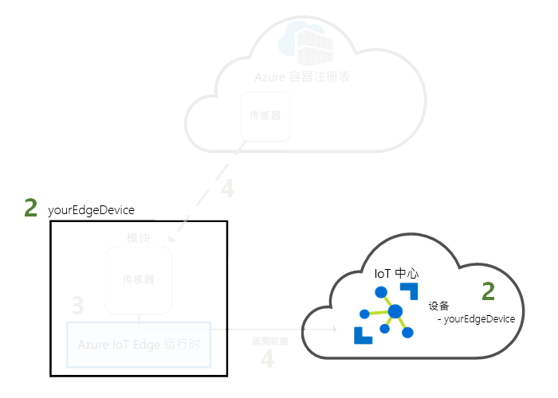
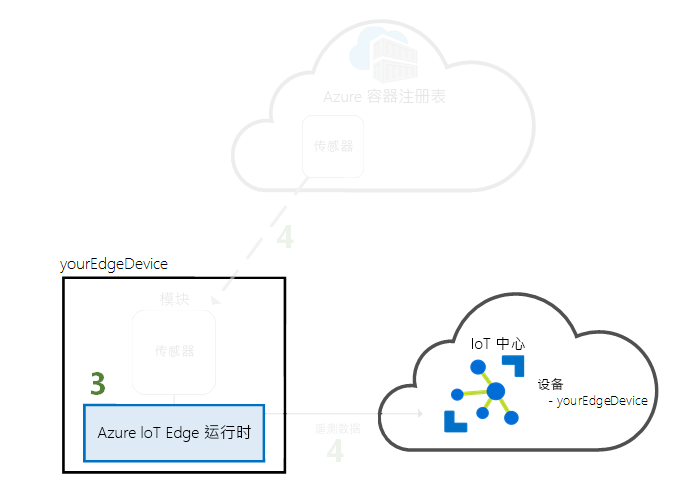
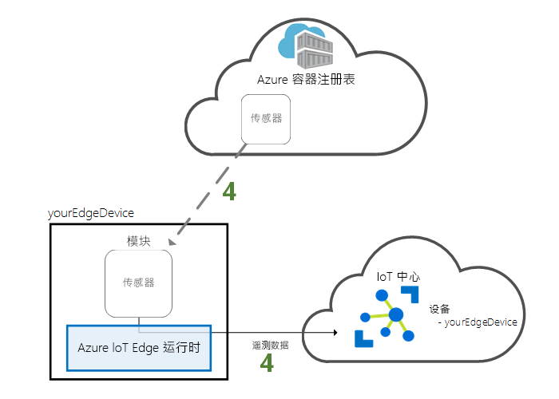

# <a name="quickstart-deploy-your-first-iot-edge-module-from-the-azure-portal-to-a-windows-device---preview"></a>快速入门：将第一个 IoT Edge 模块从 Azure 门户部署到 Windows 设备 - 预览

此快速入门中，使用 Azure IoT Edge 云接口将预生成的代码远程部署到 IoT Edge 设备。 若要完成此任务，首先使用 Windows 设备模拟 IoT Edge 设备，然后即可向其部署模块。

此快速入门介绍如何：

1. 创建 IoT 中心。
2. 将 IoT Edge 设备注册到 IoT 中心。
3. 在设备上安装并启动 IoT Edge 运行时。
4. 以远程方式将模块部署到 IoT Edge 设备并将遥测数据发送到 IoT 中心。



在本快速入门中部署的模块为模拟传感器，可以生成温度、湿度和压强数据。 其他 Azure IoT Edge 教程均以本教程中通过部署模块（这些模块通过分析模拟数据来获得业务见解）执行的操作为基础。

>[!NOTE]
>Windows 上的 IoT Edge 运行时为[公开预览版](https://azure.microsoft.com/support/legal/preview-supplemental-terms/)。

如果没有可用的 Azure 订阅，可以在开始前创建一个[免费帐户](https://azure.microsoft.com/free)。

[!INCLUDE [cloud-shell-try-it.md](../../includes/cloud-shell-try-it.md)]

请使用 Azure CLI 完成本快速入门中的多个步骤。Azure IoT 有一个可以启用其他功能的扩展。

将 Azure IoT 扩展添加到 Cloud Shell 实例。

   ```azurecli-interactive
   az extension add --name azure-cli-iot-ext
   ```

## <a name="prerequisites"></a>先决条件

云资源：

* 一个资源组，用于管理在本快速入门中使用的所有资源。

   ```azurecli-interactive
   az group create --name IoTEdgeResources --location westus
   ```

IoT Edge 设备：

* 充当 IoT Edge 设备的 Windows 计算机或虚拟机。 使用支持的 Windows 版本：
  * Windows 10 或更高版本
  * Windows Server 2016 或更高版本
* 如果是 Windows 计算机，请确保它符合 Hyper-V 的[系统要求](https://docs.microsoft.com/virtualization/hyper-v-on-windows/reference/hyper-v-requirements)。
* 如果是虚拟机，则启用[嵌套虚拟化](https://docs.microsoft.com/virtualization/hyper-v-on-windows/user-guide/nested-virtualization)并分配至少 2GB 内存。
* 安装[用于 Windows 的 Docker](https://docs.docker.com/docker-for-windows/install/) 并确保其正在运行。

> [!TIP]
> 在 Docker 设置过程中，有一个使用 Windows 容器或 Linux 容器的选项。 本快速入门介绍如何配置 IoT Edge 运行时，使之与 Linux 容器配合使用。

## <a name="create-an-iot-hub"></a>创建 IoT 中心

通过 Azure CLI 创建 IoT 中心，启动快速入门。



免费级的 IoT 中心适用于此快速入门。 如果曾经用过 IoT 中心并且已创建免费的中心，则可使用该 IoT 中心。 每个订阅仅能有一个免费 IoT 中心。

以下代码在资源组“IoTEdgeResources”中创建免费的“F1”中心。 将 *{hub_name}* 替换为 IoT 中心的唯一名称。

   ```azurecli-interactive
   az iot hub create --resource-group IoTEdgeResources --name {hub_name} --sku F1
   ```

   如果由于订阅中已经有一个免费的中心而出现错误，请将 SKU 更改为 **S1**。

## <a name="register-an-iot-edge-device"></a>注册 IoT Edge 设备

使用新创建的 IoT 中心注册 IoT Edge 设备。


为模拟设备创建设备标识，以便它可以与 IoT 中心通信。 设备标识存在于云中，而将物理设备关联到设备标识时，则使用唯一的设备连接字符串。

由于 IoT Edge 设备的行为和托管方式与典型 IoT 设备不同，请从一开始就将此设备声明为 IoT Edge 设备。

1. 在 Azure Cloud Shell 中输入以下命令，以便在中心创建名为 **myEdgeDevice** 的设备。

   ```azurecli-interactive
   az iot hub device-identity create --device-id myEdgeDevice --hub-name {hub_name} --edge-enabled
   ```

1. 检索设备的连接字符串，该字符串将物理设备与其在 IoT 中心的标识链接在一起。

   ```azurecli-interactive
   az iot hub device-identity show-connection-string --device-id myEdgeDevice --hub-name {hub_name}
   ```

1. 复制并保存连接字符串。 在下一部分中配置 IoT Edge 运行时时将用到此值。

## <a name="install-and-start-the-iot-edge-runtime"></a>安装和启动 IoT Edge 运行时

在 IoT Edge 设备上安装 Azure IoT Edge 运行时，并使用设备连接字符串对其进行配置。


IoT Edge 运行时部署在所有 IoT Edge 设备上。 它有三个组件。 每次某个 Edge 设备在启动后通过启动 IoT Edge 代理来启动此设备时，**IoT Edge 安全守护程序**就会启动。 **IoT Edge 代理**协助部署和监视 IoT Edge 设备（包括 IoT Edge 中心）的模块。 IoT Edge 中心管理 IoT Edge 设备模块之间以及设备和 Azure IoT 中心之间的通信。

在运行时安装期间，系统会要求你提供设备连接字符串。 请使用从 Azure CLI 检索的字符串。 此字符串将物理设备与 Azure 中的 IoT Edge 设备标识关联在一起。

此部分的说明要求为 IoT Edge 运行时配置 Linux 容器。 若要使用 Windows 容器，请参阅[在 Windows 上安装与 Windows 容器配合使用的 Azure IoT Edge 运行时](how-to-install-iot-edge-windows-with-windows.md)。

在准备用作 IoT Edge 设备的 Windows 计算机或 VM 中完成以下步骤。

### <a name="download-and-install-the-iot-edge-service"></a>下载并安装 IoT Edge 服务

使用 PowerShell 下载并安装 IoT Edge 运行时。 使用从 IoT 中心检索的设备连接字符串来配置设备。

1. 在 IoT Edge 设备上，以管理员身份运行 PowerShell。

2. 在设备上下载并安装 IoT Edge 服务。

   ```powershell
   . {Invoke-WebRequest -useb aka.ms/iotedge-win} | Invoke-Expression; `
   Install-SecurityDaemon -Manual -ContainerOs Linux
   ```

3. 当系统提示输入 **DeviceConnectionString** 时，请提供在上一部分复制的字符串。 请勿对连接字符串使用引号。

### <a name="view-the-iot-edge-runtime-status"></a>查看 IoT Edge 运行时状态

验证是否已成功安装并配置运行时。

1. 检查 IoT Edge 服务的状态。

   ```powershell
   Get-Service iotedge
   ```

2. 若需排查服务问题，请检索服务日志。

   ```powershell
   # Displays logs from today, newest at the bottom.

   Get-WinEvent -ea SilentlyContinue `
    -FilterHashtable @{ProviderName= "iotedged";
      LogName = "application"; StartTime = [datetime]::Today} |
    select TimeCreated, Message |
    sort-object @{Expression="TimeCreated";Descending=$false} |
    format-table -autosize -wrap
   ```

3. 查看在 IoT Edge 设备上运行的所有模块。 由于此服务是第一次运行，因此只会看到 **edgeAgent** 模块在运行。 edgeAgent 模块会默认运行，用于安装并启动部署到设备的任何其他模块。

   ```powershell
   iotedge list
   ```

   

IoT Edge 设备现在已配置好。 它可以运行云部署型模块了。

## <a name="deploy-a-module"></a>部署模块

从云端管理 Azure IoT Edge 设备，部署将遥测数据发送到 IoT 中心的模块。


[!INCLUDE [iot-edge-deploy-module](../../includes/iot-edge-deploy-module.md)]

## <a name="view-generated-data"></a>查看生成的数据

此快速入门中，创建了新的 IoT Edge 设备，并在该设备上安装了 IoT Edge 运行时。 然后，使用了 Azure 门户推送 IoT Edge 模块，使其在不更改设备本身的情况下在设备上运行。 这种情况下，推送的模块创建可用于本教程的环境数据。

确认从云中部署的模块正在 IoT Edge 设备上运行。

```powershell
iotedge list
```

   

查看从 tempSensor 模块发送到云的消息。

```powershell
iotedge logs tempSensor -f
```

  

也可使用 [Visual Studio Code 的 Azure IoT Toolkit 扩展](https://marketplace.visualstudio.com/items?itemName=vsciot-vscode.azure-iot-toolkit)查看 IoT 中心接收的消息。

## <a name="clean-up-resources"></a>清理资源

若要继续学习 IoT Edge 教程，可以使用在本快速入门中注册并设置的设备。 否则，可删除创建的 Azure 资源，并从设备中删除 IoT Edge 运行时。

### <a name="delete-azure-resources"></a>删除 Azure 资源

如果是在新资源组中创建的虚拟机和 IoT 中心，则可删除该组以及所有关联的资源。 如果该资源组中有需要保留的内容，则请将要清除的资源逐一删除。

删除 **IoTEdgeResources** 组。

   ```azurecli-interactive
   az group delete --name IoTEdgeResources
   ```

### <a name="remove-the-iot-edge-runtime"></a>删除 IoT Edge 运行时

如果计划使用 IoT Edge 设备执行将来的测试，但希望 tempSensor 模块在未使用时停止向 IoT 中心发送数据，请使用以下命令停止 IoT Edge 服务。

   ```powershell
   Stop-Service iotedge -NoWait
   ```

当准备好再次启动测试时，可以重启服务

   ```powershell
   Start-Service iotedge
   ```

若要从设备中删除这些安装，请使用以下命令。  

删除 IoT Edge 运行时。

   ```powershell
   . {Invoke-WebRequest -useb aka.ms/iotedge-win} | Invoke-Expression; `
   Uninstall-SecurityDaemon
   ```

删除 IoT Edge 运行时以后，已创建的容器会被停止，但仍存在于设备上。 查看所有容器。

   ```powershell
   docker ps -a
   ```

通过 IoT Edge 运行时删除在设备上创建的容器。 更改 tempSensor 容器的名称（如果使用了其他名称）。

   ```powershell
   docker rm -f tempSensor
   docker rm -f edgeHub
   docker rm -f edgeAgent
   ```
   
## <a name="next-steps"></a>后续步骤

在本快速入门中，你创建了新的 IoT Edge 设备并使用 Azure IoT Edge 云接口将代码部署到该设备上。 现在，你有了一个可以生成其环境的原始数据的测试设备。

可以继续阅读其他教程，了解如何使用 Azure IoT Edge 将此数据转化为边缘业务见解。

> [!div class="nextstepaction"]
> [使用 Azure Functions 筛选传感器数据](tutorial-deploy-function.md)
