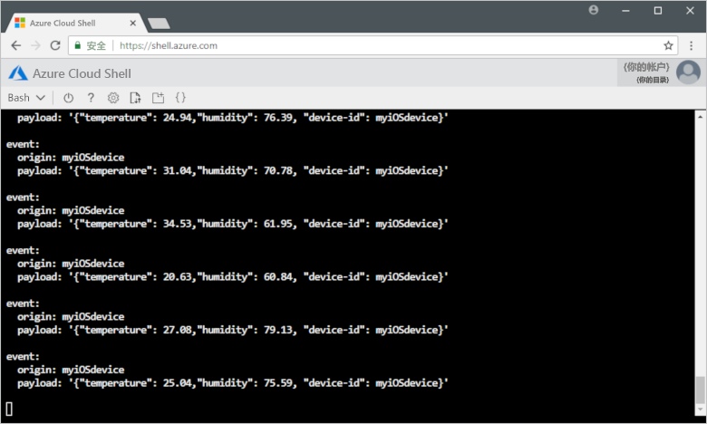

# <a name="quickstart-send-telemetry-from-a-device-to-an-iot-hub-ios"></a>快速入门：将遥测数据从设备发送到 IoT 中心 (iOS)

[!INCLUDE [iot-hub-quickstarts-1-selector](../../includes/iot-hub-quickstarts-1-selector.md)]

IoT 中心是一项 Azure 服务，用于将大量遥测数据从 IoT 设备引入云中进行存储或处理。 在本文中，请将遥测数据从模拟设备应用程序发送到 IoT 中心， 然后即可从后端应用程序查看数据。

本文使用预先编写的 Swift 应用程序来发送遥测数据，使用 CLI 实用程序从 IoT 中心读取遥测数据。

[!INCLUDE [cloud-shell-try-it.md](../../includes/cloud-shell-try-it.md)]

如果还没有 Azure 订阅，可以在开始前创建一个[免费帐户](https://azure.microsoft.com/free/?WT.mc_id=A261C142F)。

## <a name="prerequisites"></a>先决条件

- 从 [Azure 示例](https://github.com/Azure-Samples/azure-iot-samples-ios/archive/master.zip)下载代码示例
- 最新版本的 [XCode](https://developer.apple.com/xcode/)，运行最新版本的 iOS SDK。 本快速入门已使用 XCode 10.2 和 iOS 12.2 测试过。
- 最新版 [CocoaPods](https://guides.cocoapods.org/using/getting-started.html)。
- 运行以下命令将用于 Azure CLI 的 Microsoft Azure IoT 扩展添加到 Cloud Shell 实例。 IoT 扩展会将特定于 IoT 中心、IoT Edge 和 IoT 设备预配服务 (DPS) 的命令添加到 Azure CLI。

   ```azurecli-interactive
   az extension add --name azure-cli-iot-ext
   ```

- 确保已在防火墙中打开端口 8883。 本快速入门中的设备示例使用 MQTT 协议，该协议通过端口 8883 进行通信。 在某些公司和教育网络环境中，此端口可能被阻止。 有关解决此问题的更多信息和方法，请参阅[连接到 IoT 中心(MQTT)](iot-hub-mqtt-support.md#connecting-to-iot-hub)。

## <a name="create-an-iot-hub"></a>创建 IoT 中心

[!INCLUDE [iot-hub-include-create-hub](../../includes/iot-hub-include-create-hub.md)]

## <a name="register-a-device"></a>注册设备

必须先将设备注册到 IoT 中心，然后该设备才能进行连接。 在本快速入门中，将使用 Azure Cloud Shell 来注册模拟设备。

1. 在 Azure Cloud Shell 中运行以下命令，以创建设备标识。

   **YourIoTHubName**：将下面的占位符替换为你为 IoT 中心选择的名称。

   **myiOSdevice**：这是所注册的设备的名称。 建议使用 **myiOSdevice**，如图所示。 如果为设备选择不同名称，则可能还需要在本文中从头至尾使用该名称，并在运行示例应用程序之前在其中更新设备名称。

   ```azurecli-interactive
   az iot hub device-identity create --hub-name {YourIoTHubName} --device-id myiOSdevice
   ```

1. 在 Azure Cloud Shell 中运行以下命令，以获取刚注册设备的_设备连接字符串_：

   **YourIoTHubName**：将下面的占位符替换为你为 IoT 中心选择的名称。

   ```azurecli-interactive
   az iot hub device-identity show-connection-string --hub-name {YourIoTHubName} --device-id myiOSdevice --output table
   ```

   记下如下所示的设备连接字符串：

   `HostName={YourIoTHubName}.azure-devices.net;DeviceId=myiOSdevice;SharedAccessKey={YourSharedAccessKey}`

    稍后会在快速入门中用到此值。

## <a name="send-simulated-telemetry"></a>发送模拟遥测数据

示例应用程序在 iOS 设备上运行，该设备连接到 IoT 中心的特定于设备的终结点，并发送模拟的温度和湿度遥测数据。 

### <a name="install-cocoapods"></a>安装 CocoaPods

CocoaPods 管理那些使用第三方库的 iOS 项目的依赖项。

在本地终端窗口中，导航到在先决条件部分下载的 Azure-IoT-Samples-iOS 文件夹。 然后，导航到示例项目：

```sh
cd quickstart/sample-device
```

确保 XCode 已关闭，运行以下命令，以便安装在 **podfile** 文件中声明的 CocoaPods：

```sh
pod install
```

除了为项目安装所需的 Pod，安装命令还创建了一个 XCode 工作区文件，该文件已配置为对依赖项使用 Pod。 

### <a name="run-the-sample-application"></a>运行示例应用程序 

1. 在 XCode 中打开示例工作区。

   ```sh
   open "MQTT Client Sample.xcworkspace"
   ```

2. 展开“MQTT 客户端示例”项目，然后展开同一名称的文件夹。   
3. 打开 **ViewController.swift**，以便在 XCode 中进行编辑。 
4. 搜索 **connectionString** 变量，并使用以前记下的设备连接字符串更新其值。
5. 保存所做更改。 
6. 使用“生成并运行”按钮或“Command + R”组合键在设备模拟器中运行项目。   

   

7. 当模拟器打开后，在示例应用中选择“启动”。 

以下屏幕截图显示了在应用程序将模拟遥测数据发送到 IoT 中心后的一些示例输出：

   

## <a name="read-the-telemetry-from-your-hub"></a>从中心读取遥测数据

在 XCode 模拟器上运行过的示例应用显示从设备发送的消息的相关数据。 也可通过 IoT 中心查看接收的数据。 IoT 中心 CLI 扩展可以连接到 IoT 中心上的服务端**事件**终结点。 该扩展会接收模拟设备发送的设备到云的消息。 IoT 中心后端应用程序通常在云中运行，接收和处理设备到云的消息。

在 Azure Cloud Shell 中运行以下命令，并将 `YourIoTHubName` 替换为 IoT 中心的名称：

```azurecli-interactive
az iot hub monitor-events --device-id myiOSdevice --hub-name {YourIoTHubName}
```

以下屏幕截图显示了在扩展接收模拟设备发送到 IoT 中心的遥测数据后的输出：

以下屏幕截图显示在本地终端窗口中看到的遥测数据的类型：



## <a name="clean-up-resources"></a>清理资源

[!INCLUDE [iot-hub-quickstarts-clean-up-resources](../../includes/iot-hub-quickstarts-clean-up-resources.md)]

## <a name="next-steps"></a>后续步骤

在本快速入门中，你设置了 IoT 中心、注册了设备、将模拟遥测数据从 iOS 设备发送到了中心，并从中心读取了遥测数据。 

若要了解如何从后端应用程序控制模拟设备，请继续阅读下一快速入门教程。

> [!div class="nextstepaction"]
> [快速入门：控制连接到 IoT 中心的设备](quickstart-control-device-node.md)
