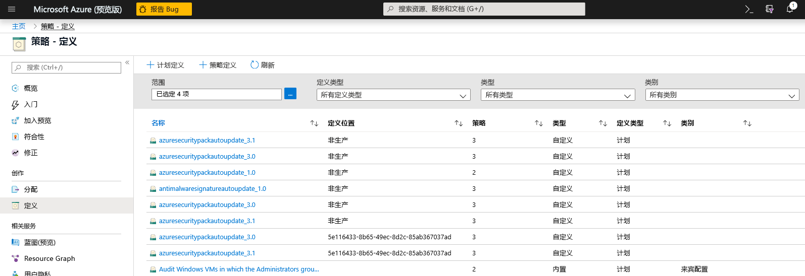
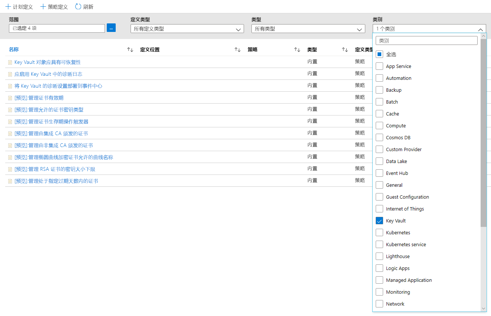
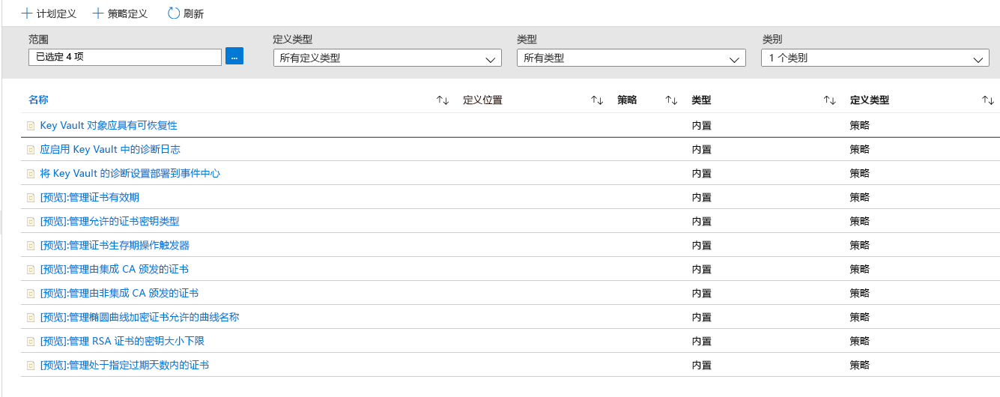
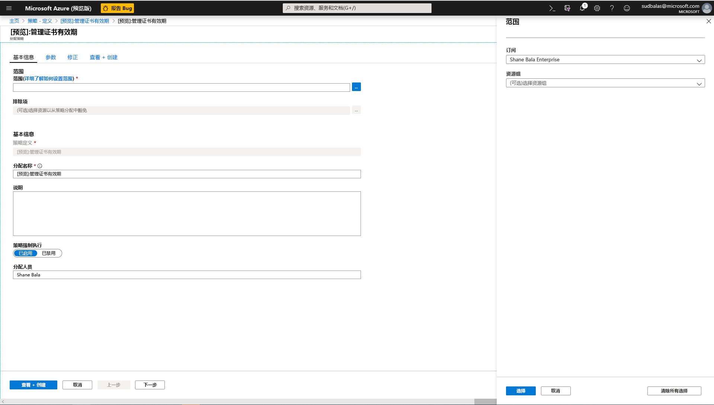
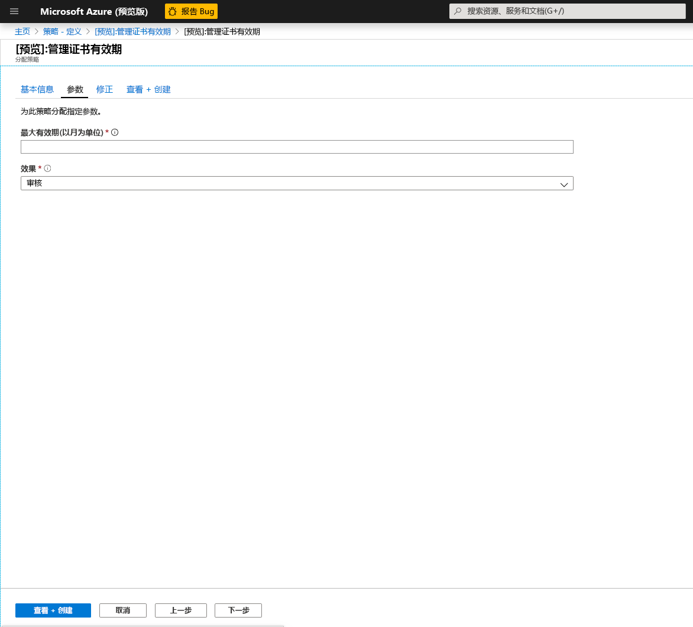
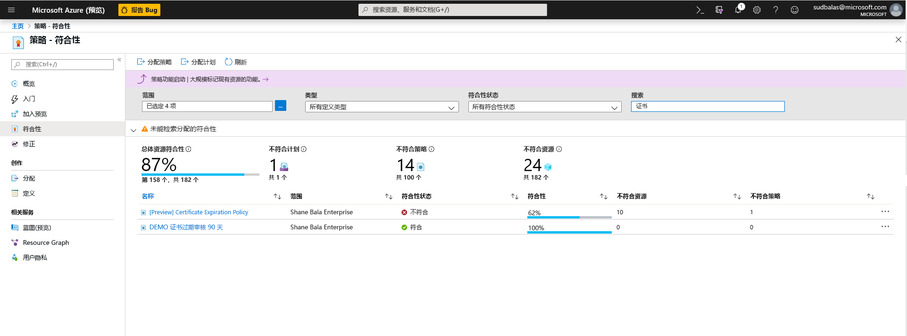
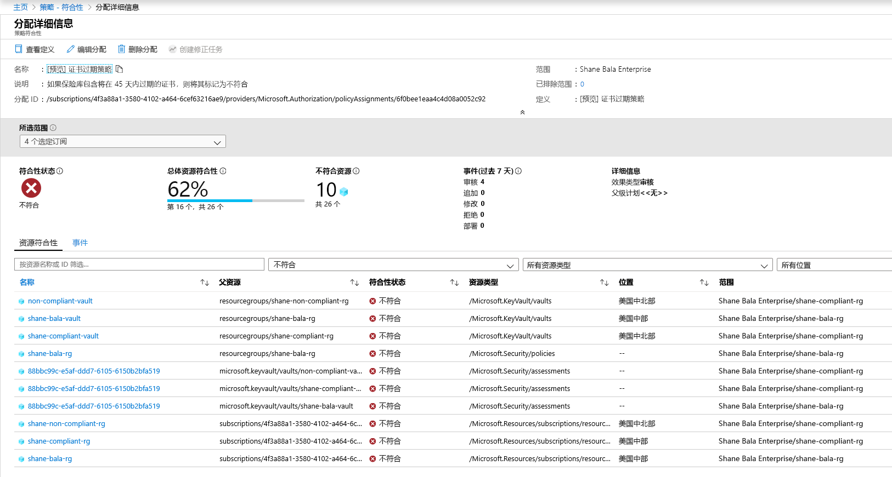
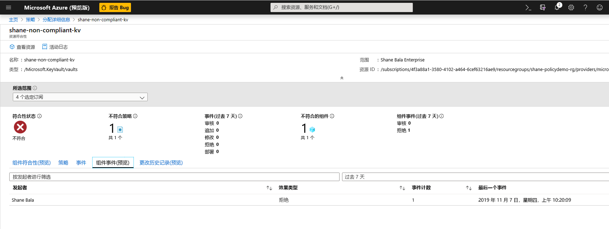

# 将 Azure Key Vault 与 Azure Policy 集成

[Azure Policy](../governance/policy/index.yml) 是一种管理工具，使用户能够大规模审核和管理其 Azure 环境。 Azure Policy 提供将护栏放置在 Azure 资源上的功能，以确保它们符合分配的策略规则。 它允许用户对其 Azure 环境执行审核、实时强制和修正。 策略执行的审核结果将可供符合性仪表板中的用户使用，在该仪表板中，他们将能够查看合规和不合规的资源和组件的明细。  有关详细信息，请参阅 [Azure Policy 服务概述](../governance/policy/overview.md)。

使用方案示例：

- 你想通过在公司的 Key Vault 中实现最小密钥大小和最大证书有效期的要求来提高你公司的安全态势，但是你不知道哪些团队合规而哪些不合规。 
- 当前没有解决方案可在组织中执行审核，或者你通过要求组织内各个团队报告其符合性来对环境进行手动审核。 你正在寻找一种方法来自动执行此任务，实时执行审核，并保证审核的准确性。
- 你需要强制实施公司安全策略，并阻止个人创建自签名证书，但你不能通过自动方式来阻止其创建。 
- 你希望放宽对测试团队的一些要求，但想要对生产环境保持严格控制。 你需要一种简单的自动化方式来分隔你的资源的强制实施。 
- 你需要确保在发生实时站点问题时可以回滚新策略的强制实施。 需要一键式解决方案才能关闭策略的强制实施。 
- 你依赖于第三方解决方案来审核你的环境，并且希望使用 Microsoft 内部产品/服务。 

## 策略影响和指南的类型

**审核**：当策略的影响设置为“审核”时，策略不会对环境造成任何中断性变更。 它只会通过在策略合规性仪表板中将组件（例如在指定范围内不符合策略定义的证书）标记为不合规，提醒你注意这些组件。 如果未选择任何策略影响，则“审核”为默认值。 

**拒绝**：当策略的效果设置为“拒绝”时，策略将阻止创建新组件（如证书），并阻止不符合策略定义的现有组件的新版本。 Key Vault 中现有的不合规资源不受影响。 “审核”功能将继续运行。

## 可用的“内置”策略定义

Key Vault 已创建一组策略，你可以将其分配给常见方案来管理证书。 这些策略是“内置的”，这意味着不需要你编写任何自定义 JSON 来启用它们，它们在 Azure 门户中可供给你分配。 你仍可以自定义某些参数以满足你组织的需求。 

八个预览版策略如下所示。

### 管理证书有效期（预览版）

此策略可用于管理 Key Vault 中存储的证书的最长有效期。 最好的安全做法是限制证书的最长有效期。 如果证书的私钥在未检测的情况下被泄露，则使用短期证书将最大限度地缩短持续伤害的时间，并减少证书对于攻击者的价值。 

### 管理允许的证书密钥类型（预览版）
此策略允许你限制可位于 Key Vault 中的证书类型。 你可以使用此策略来确保证书私钥为 RSA、ECC 或支持 HSM。 你可以从以下列表中选择允许使用的证书类型。
- RSA
- RSA - HSM
- ECC 
- ECC - HSM 

### 管理证书生存期操作触发器（预览版）

此策略可用于管理为证书指定的生存期操作，这些证书要么处于有效期的特定天数内，要么已达到其使用寿命的一定百分比。 

### 管理由集成 CA 颁发的证书（预览版）

如果你使用 Key Vault 集成证书颁发机构（Digicert 或 GlobalSign），并且希望用户使用其中一个提供程序，则可以使用此策略审核或强制执行你的选择。 此策略还可用于审核或拒绝在 Key Vault 中创建自签名证书。 

### 管理由集成 CA 颁发的证书（预览版）

如果你使用的是内部证书颁发机构或未与 Key Vault 集成的证书颁发机构，并且你希望用户从你提供的列表中使用证书颁发机构，则可以使用此策略按颁发者名称创建允许的证书颁发机构列表。 此策略还可用于审核或拒绝在 Key Vault 中创建自签名证书。 

### 管理椭圆曲线加密证书允许的曲线名称（预览版）
如果使用椭圆曲线加密（简称为 ECC）证书，则可以从以下列表自定义允许的曲线名称列表。 默认选项允许所有以下曲线名称。 
- P-256
- P-256K
- P-384
- P-521

### 管理 RSA 证书的最小密钥大小（预览版）
如果使用 RSA 证书，则可以选择证书必须具有的最小密钥大小。 你可以从以下列表中选择一个选项。 
- 2048 位
- 3072 位
- 4096 位

### 管理处于指定过期天数内的证书（预览版）
如果未充分监视的证书未在过期前旋转，则服务可能会发生中断。 此策略对于确保监视 Key Vault 中存储的证书非常重要。 建议使用不同的到期阈值（例如 180、90、60 和 30 天阈值）多次应用此策略。 此策略可用于监视和会审你的组织中的证书过期。 

## 示例方案

你管理多个团队使用的包含 100 个证书的 Key Vault，你想要确保 Key Vault 中所有证书有效期都不超过两年。

1. 你分配[管理证书有效期](#manage-certificate-validity-period-preview)策略，指定证书的最长有效期为 24 个月，并将策略的影响设置为“审核”。 
1. 你查看 [Azure 门户上的相容性报告](#view-compliance-results)，发现 20 个证书不合规且有效期超过两年，而剩余的证书符合要求。 
1. 你与这些证书的所有者联系，传达证书的有效期不能超过两年的新安全要求。 某些团队做出了响应，续订了 15 个最长有效期为两年或更短的证书。 其他团队不做出响应，你的 Key Vault 中仍有 5 个不合规的证书。
1. 你将分配的策略的影响改为“拒绝”。 5 个不合规证书未被吊销，且继续工作。 但是，续订的有效期不能用长于两年。 

## 通过 Azure 门户启用和管理 Key Vault 策略

### 选择策略定义

1. 登录到 Azure 门户。 
1. 在搜索栏中搜索“策略”，然后选择“策略”  。

    

1. 在“策略”窗口中，选择“定义”  。

    

1. 在“类别筛选器”中，取消选择“全选”  ，然后选择“Key Vault”  。 

    

1. 现在，你应该能够查看适用于 Azure Key Vault 公共预览版的所有策略。 确保你已阅读并理解上述策略指南部分，并选择要分配给某个范围的策略。  

    

### 将策略分配到范围 

1. 选择要应用的策略，在此示例中，显示“管理证书有效期”策略  。 单击左上角的“分配”按钮。

    
  
1. 选择要应用策略的订阅。 你可以选择将范围限制为一个订阅中的单个资源组。 如果要将策略应用于整个订阅并排除某些资源组，还可以配置排除列表。 如果希望产生策略的影响（审核或拒绝），则将策略强制实施选择器设置为“启用”；如果希望关闭影响（审核或拒绝），则将策略强制实施选择器设置为“禁用”。   。 

    

1. 单击屏幕顶部的“参数”选项卡，以指定所需的最长有效期（以月为单位）。 按照以上部分中的指导，选择“审核”或“拒绝”作为策略的影响   。 选择“查看 + 创建”按钮。 

    

### 查看合规性结果

1. 返回到“策略”边栏选项卡，然后选择“合规性”选项卡。单击要查看其合规结果的策略分配。

    

1. 从此页中，可以按合规或不合规的保管库筛选结果。 可在此处查看策略分配范围内不合规的 Key Vault 的列表。 如果保管库中的任何组件（证书）不合规，则将保管库视为不合规。 可以选择单独的保管库来查看各个不合规组件（证书）。 

    

1. 查看保管库中不合规的组件的名称

    

1. 如果需要检查是否拒绝用户在 Key Vault 中创建资源，你可以单击“组件事件(预览版)”  选项卡，以查看已拒绝的证书操作的摘要以及请求的请求者和时间戳。 

    

## 功能限制

分配具有“拒绝”影响的策略可能需要多达 30 分钟（平均情况）和 1 小时（最坏情况），才能开始拒绝创建不合规的资源。 保管库中现有组件的策略评估可能需要长达 1 小时（平均情况）和 2 小时（最坏情况），才能在门户 UI 中查看合规性结果。 如果合规性结果显示为“未启动”，则可能是由于以下原因：
- 尚未完成策略评估。 在最坏情况下，初始评估延迟可能长达 2 小时。 
- 策略分配的范围中没有 Key Vault。
- 策略分配的范围中没有带证书的 Key Vault。 

## 后续步骤

- 了解有关 [Azure Policy 服务](../governance/policy/overview.md)的详细信息
- 请参阅 Key Vault 示例：[Key Vault 内置策略定义](../governance/policy/samples/built-in-policies.md#key-vault)